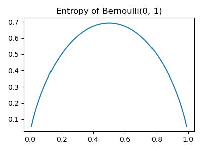

#  Decision Trees


make prediction by recursively splitting on different attributes according to a tree structure

__Internal nodes__: test attributes  
__Branching__: attribute values  
__Leaf__: output (predictions)  

__NOTE__ 
 - can have repeated attributes, but not the same attribute values
 - can be imaged as splitting the space into rectangular subspaces

## Classification and Regression
Each path from root to a leaf defines a region $R_m$ of input space, let $\{(x^{(m_1)}, t^{(m_1)}), ..., (x^{(m_k)}, t^{(m_k)})\}$ be the training examples that fall into $R_m$

__Classification Tree__ set leaf value $y^m$ be the __most common__ value in $\{t^{(m_1)}, ..., t^{(m_k)}\}$, hence __discrete__ output

__Regression Tree__ set leaf value $y^m$ be the __mean__ value in $\{t^{(m_1)}, ..., t^{(m_k)}\}$, hence __continuous__ output

## Learning (Constructing) Decision Trees
Note that learning the simplest decision tree which correctly classifies training set is NPC

### General Idea
__Greedy heuristic__ start with empty and complete training set by split on the "best" attribute and recurse on subpartitions

### Accuracy (Loss) based
Let loss $L:=$ misclassification rate, say region $R\rightarrow R_1, R_2$ based on loss $L(R)$ and the accuracy gain is $L(R) - \frac{\|R_1\|L(R_1) + \|R_2\|L(R_2)}{\|R_1\| + \|R_2\|}$

__Problem__ sometimes loss in misclassfication rate will have reduced __uncertainty__ significantly. 

### Uncertainty based
Low uncertainty: all examples in leaf have same class  
High uncertainty: each class has same amount of examples in leaf

__Idea__ use counts at leaves to define probability distributions, and use information theory to measure uncertainty

## Entropy
measure of expected "surprise", a.k.a. how uncertain are we of the value of a draw from this distribution  

$$H(\vec X) = -E_{X \sim p}[\log_2 p(X)] = -\sum_{\vec x\in X} p(\vec x)\log_2 p(\vec x)$$

Average over information content of each observation  
Unit = __bits__ (based on the base of log)  
A fair coin flip has 1 bit of entropy, i.e.  

$$H(X) = -\frac{1}{2}\log_2 \frac{1}{2} - -\frac{1}{2}\log_2 \frac{1}{2} = -\log_2 \frac{1}{2} = 1$$


???quote "Source code"

    ```python 
    --8<-- "csc311/scripts/decision_trees.py"
    ```
    

<figure markdown>
  {width="480"}
</figure> 
    


### High Entropy
Variable has uniform-ish distribution  
Flat histogram  
Values sampled from it are less predicatable

### Low Entropy
Variable has peaks and valleys  
Histogram with low and highs  
Values sampled from it are more predicatable

### Example
Let X = {Raining, Not raining}, Y = {Cloudy, Not cloudy}  

| | C | NC |
|---|---|---|
|R | 24 | 1|
|NR| 25 | 50|

### entropy of a joint distribution

\begin{align*}
H(X,Y) &= - \sum_{\vec x\in X}\sum_{y\in Y}p(x,y)\log_2 p(x,y)\\
&= -\frac{24}{100}\log_2\frac{24}{100} -\frac{1}{100}\log_2\frac{1}{100}-\frac{25}{100}\log_2\frac{25}{100} -\frac{50}{100}\log_2\frac{50}{100}\\
&\approx 1.56 bits
\end{align*}

### conditional entropy
Given it is raining, what is the entropy of cloudiness

\begin{align*}
H(Y\mid X = R) &= -\sum_{y\in Y} p(y\mid R)\log_2 p(y\mid R) \\
&= -\frac{24}{25}\log_2\frac{24}{25} -\frac{1}{25}\log_2\frac{1}{25} \\
&\approx 0.24 bits
\end{align*}

### expected conditional entropy

\begin{align}
H(Y\mid X) &= E_{X\sim p(x)[H(Y\mid X)]} \\
&= \sum_{x\in X}p(x)H(Y\mid X= x) \\
&= - \sum_{x\in X}\sum_{y\in Y}p(x,y)\log_2 p(y\mid x)\\
&= -E_{(X,Y)\sim p(x,y)}[\log_2 p(Y\mid X)]
\end{align}

What is the entropy of cloudiness, given whether it is raining

\begin{align*}
H(Y\mid X) = \sum_{x\in X}p(x)H(Y\mid X=x) \\
&= \frac{1}{4}H(Y\mid R) + \frac{3}{4} + H(Y\mid NR)\\
&\approx 0.75 bits
\end{align*}

### Properties 
for the discrete case

 - $H\geq 0$
 - $H(X,Y)= H(X\mid Y) + H(Y) = H(Y\mid X) + H(X)$  
 - $X,Y$ indep. $\Rightarrow H(Y\mid X) = H(Y)$  
 - $H(Y\mid Y) = 0$  
 - $H(Y\mid X)\leq H(Y)$

## Information Gain
In $Y$ due to $X$ (or __mutual information__ of $Y$ and $X$)is defined as 

$$IG(Y\mid X) = H(Y) - H(Y\mid X)$$

Since $H(Y\mid X )\leq H(Y), IG\geq 0$  
$X$ is __completely uninformative__ about $Y\Rightarrow IG(Y\mid X)= 0$  
$X$ is __completely informative__ about $Y\Rightarrow IG(Y\mid X) = H(Y)$

Then, foe each decision, we gain some $X$, so that we can calculate $IG$

## Algorithm
Start with empty decision tree and complete training set  
Split on the most informative attribute (most $IG$), partitioning dataset  
Recurse on subpartitions  
Possible termination condition: end if all examples in current subpartition share the same class

## What makes a "Good" tree
__Small Tree__ can't handle important but possibly subtle distinctions in data  
__Big tree__ bad computational efficiency, over-fitting, human interpretability 

__Occam's Razor__ find the simplest hypothesis that fits the observations

## Expressiveness
- Discrete input & output case: can express any function of input attributes  
- Continuous input & output: can approximate any function arbitrarily closely

There's a consistent decision tree for any training set with one path to leaf for each example, while won't generalize to new examples

## Miscellany

### Problems
 - exponentially less data at lower levels  
 - Too big tree => overfit
 - Greedy don't necessarily yield the global optimum 
 - Mistakes at top-level propagate down tree

For continuous attributes, must be split based on thresholds, which is more computational intensive in choosing more parameters

With regression, use MSE as splits instead of IG

## Decision Tree vs. kNN

Advantages of Decision Tree 

 - Good with discrete attributes
 - Easily deals with missing values
 - Robust to scale of inputs
 - Test time is fast
 - More interpretable
 
Advantages of kNN 

- Able to handle attributes/feature with interactions in complex ways
- Can incorporate interesting distance measures
