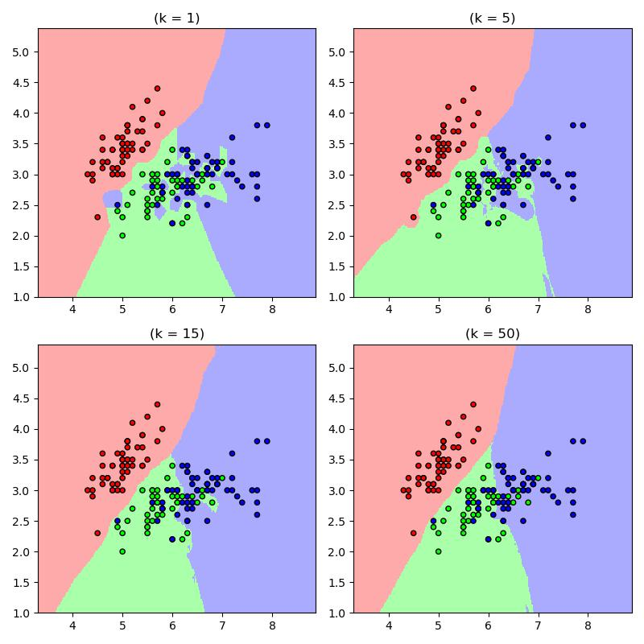

# k-Nearest Neighbors

## Supervised learning
Given a __training set__ consisting of __inputs__ and corresponding __labels__. 

### Input vectors
To handle different types of data, we need to represent the input as __input vector__ in $\mathbb R^d$,  
i.e. __Representation__ mapping to another space that's easy to manipulate

The training set consists of a collection of pairs of an input vector $\vec x \in \mathbb R^d$ and its corresponding __target (label)__ $t$ where $t$ can be.  
__Regression__ $t\in\mathbb R$  
__Classification__ $t\in \{1,2,...,C\}$  
__More structured object__  

The training set is denoted as $\{(\vec x^{(i)}, t^{(i)})| i\in\ \{1,2,...,N\}\}$

## k-Nearest Neighbors
Given a novel input $\vec x$ to be classified, to find the nearest input vector to $\vec x$ in the training set and copy its label.  

__nearest__ for example, this can be formalized by the Euclidean distance $\|\vec x^{(a)} - \vec x^{(b)}\|_2$

__Decision boundary__ the boundary between regions of input space assigned to different categories

### 1NN
Find example $(\vec x^*, t^*)$ (from the stored training set) closest to $\vec x$. i.e. 

$$\vec x^* = arg\min_{\vec x^{(i)}\in T} d(\vec x^{(i)}, \vec x)$$

Then output $t^*$

Note that $d$ can be directly computed from the square, since we only want the argmin


### Problem
it is sensitive to noise of mis-labeled data

### kNN
To smooth the noise effect, we can having $k$ nearest neighbors to vote

Find $k$ example $\{\vec x^{(i)}, t^{(i)}\}$ closest to the test instance $\vec x$, then classification output is majority class 

$$y = arg\max_{t^{(z)}}\sum_{r=1}^k \mathbb I(t^{(z)}, t^{(r)})$$


???quote "Source code"

    ```python 
    --8<-- "csc311/scripts/knn.py"
    ```
    
<figure markdown>
  {width="720"}
</figure> 

## Pitfalls

### Tradeoffs with k
__Small k__ is good at capturing fine-grained patterns  
May __overfit__, i.e. be sensitive to random idiosyncrasies in the training data

__Large k__ makes stable predictions by averaging over lots of examples  
May __underfit__, i.e. fail to capture important regularities

__Rule of thumb__ $k < \sqrt n$, where $n$ is the number of training examples

### Training set, test set, and validation set

To generalize the algorithm to data haven't been seen before, we can measure the generalization error using a __test set__. 

Note that one test set can only be used to "__test__" the final error rate, it cannot be used to improve the algorithm, otherwise it will be the same as a training set, hence meaninglessly cheating. 

$k$ is an example of a __hyperparameter__, i.e. not fit as part of the learning algorithm itself. So to get the "better" $k$, we can use a __validation set__.

|training set | validation set | test set |
| --- | --- | --- |
| train with k1 | err = 7.3| |
| train with k2 | err = 1.1| we can test on this|
| train with k3 | err = 10.5 | |

### The Curse of Dimensionality 
Low-D visualizations are misleading, in high dimensions, "most" points are far apart. If we want the nearest neighbor to be closer than $\epsilon$ (i.e. including the non-categorized option), then since each single ball centered at $\vec x$ have $V(B_\epsilon(\vec x)) = O(\epsilon^d)$ and the total volume of $[0,1]^d$ is 1. Therefore, $O(\epsilon^{-d})$ balls are needed to cover the volume. 

In high dimensions, "most" points are approximately the same distance. However, at many times, data points are not uniformly distributed in the space, we may have low __intrinsic dimension__ i.e. lies on or near a low-dimensional manifold. So nearest neighbors sometimes still works in high dimensions. 

For example, considering the digit identification case, each image of number is given as $64\times 64$px image, while the corners will never have ink, hence it is not uniformly distributed and we can reduce the dimensionality. 

### Normalization
The units of each dimension are often arbitrary, i.e. kNN can be sensitive to the ranges of different features. 

Fix: normalize each dimension with $N(0, 1)$ i.e. for each dimension, compute $\mu_j, \sigma_j$, then $\tilde x_j = \frac{x_j - \mu_j}{\sigma_j}$

### Computation cost
training time: 0  
test time __per query__ (naive algorithm):  
Calculate D-dimensional Euclidean distance with $N$ data points $\in O(ND)$   
Sort the distance $\in O(N\log N)$

Also, have to store all the dataset in the memory, for high dimension datasets that will be even more huge. 

## Conclusion
Simple algorithm that does not have "learning"  
Can control the complexity by varying k  
Curse of dimensionality
