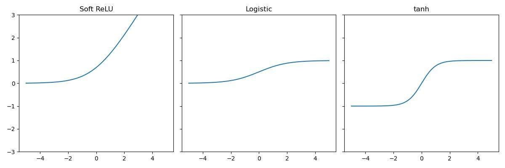

# Neural Networks


## Inspiration and Introduction

__Unit__ simulates a model neuron by 

$$y = \phi(\vec w^T \vec x + b)$$

$$\text{output} = \text{Activation function}(\text{weights}^T\cdot \text{inputs}) + \text{bias}$$

The, by throwing together lots of processing unit, we can form a neural net. 

### Structure
A NN have 3 types of layers: input, hidden layer(s), output

## Feed-forward neural network 
A directed acyclic graph of connected neurons, starts from input layer, and ends with output layer.  
Each layer is consisted of many units.  

__Recurrent neural networks__ allows cycles

### Multilayer Perceptrons
A multiplayer network consisting of fully connected layers. 

 - Each hideen layer $i$ connects $N_{i-1}$ input units to $N_i$ output units. 
 - __Fully connected layer__ in the simplest case, all input units are connected to all output units.
 - Note that the inputs and outputs for a layer are distinct from the inputs and outputs to the network.

### Activation Functions
- identity $y =z$
- Rectified Linear Unit (ReLU) $y = \max(0,z)$
- Soft ReLU $y = \log(1 + e^z)$
- Hard Threshold $y = \mathbb I(z > 0)$
- Logistic $y = (1+e^{-z})^{-1}$
- Hyperbolic Tangent (tanh) $y = \frac{e^z - e^{-z}}{e^z + e^{-z}}$


???quote "Source code"

    ```python 
    --8<-- "csc311/scripts/neural_nets.py"
    ```
    
<figure markdown>
  {width="720"}
  <figurecaption>Examples of activation functions</figurecaption>
</figure> 


Consider the layers,   

\begin{align*}
h^{(1)} &= f^{(1)}(x) = \phi(X W^{(1)} + b^{(1)}) &\text{base}\\
h^{(i)} &= f^{(i)}(x) = \phi(h^{(i-1)} W^{(i)} + b^{(i)}) &\text{induction}\\
y &= f^{(L)}(h^{(L-1)}) &\text{ending}
\end{align*}

Therefore, we can consider the network as a composition of functions 

$$y = f^{(L)}\circ ...\circ f^{(1)}(X)$$

Therefore, neural nets provide modularity: we can implement each layer's computations as a black box. 

For the last layer, if the task is regression, then the last activation function is identity function; if the task is binary classification, then is sigmoid function

### Neural Network vs. Linear regression
Suppose a layer's activation was the identity, so is equivalent to an affine transformation of the input, then we call it a __linear layer__

Consider a sequence of linear layer, it is equivalent to a single linear layer, i.e. a linear regression

$$y = XW^{(h)}\circ...\circ W^{(1)} \equiv X\tilde W, W^{(i)}\in\text{affine}$$

#### Universality
However, multilayer feed-forward neural nets with nonlinear activation function are [__universal function approximators__](https://en.wikipedia.org/wiki/Universal_approximation_theorem), they can approximate any function arbitrarily well. 

#### Problems 
this theorem does not tell how large the network well be  
we need to find appropriate weights  
will eventually lead to overfit, since it will fit the training set perfectly 

## Back-propagation
Given a NN model (with number of layers, activation function for each layer). We then have the __weight space__ being one coordinate for each weight/bias of the network, in all the layers. Then, we have to compute the gradient of the cost $\partial \mathcal J / \partial \vec w$, a.k.a. $\partial \mathcal L / \partial \vec w$

Consider the NN 

$$y = f^{(L)}...f^{(1)}(X), f^{(i)} = \phi^{(i)}(h^{(i-1)}W^{(i)} + b)$$

$$\mathcal L(\vec w,b)=\frac{(y-t)^2}{2}$$

By chain rule

$$\frac{\partial \mathcal L}{\partial w^{(1)}} = \frac{\partial \mathcal L}{\partial y}\frac{\partial y}{\partial f^{(i)}}\frac{\partial f^{(i)}}{\partial f^{(i-1)}}...\frac{\partial f^{(1)}}{\partial h^{(1)}}\frac{\partial h^{(1)}}{\partial w^{(1)}}$$

### Univariate Example

$$z=wx+b, y = \sigma(z), \mathcal L = \frac{(y-t)^2}{2}$$

```mermaid
flowchart LR
    w --> z
    x --> z
    b --> z
    z --> y
    t --> L
    y --> L
```

Denote $\bar y := \frac{\partial L}{\partial y}$, or the __error signal__. This emphasizes that the error signals are just values out program is computing, rather than a mathematical operation. 
Then, 

\begin{align*}
\bar y &=\partial_y\mathcal L  = y - t\\
\bar z &= \bar y \partial_z\sigma(z)\\
\bar w &= \bar z x\\
\bar b &= \bar z
\end{align*}

### Multivariate Perceptron example

```mermaid
flowchart LR
    W1 --> z
    x --> z
    b1 --> z
    z --> h
    W2 --> y
    h --> y
    b2 --> y
    t --> L
    y --> L
```


__Forward pass__

\begin{align*}
\vec z &= XW^{(1)} + b^{(1)}
&z_i&=\sum_{j}w_{ij}^{(1)}x_j + b_i^{(1)}\\
\vec h &= \sigma(z)
&h_i&=\sigma(z_i)\\
\vec y &= hW^{(2)} + b^{(2)}
&y_k &= \sum_{i}w_{ki}^{(2)}h_i + b_k^{(2)}\\
\mathcal L &= \frac{\|\vec t - \vec y\|^2}{2}
&\mathcal L &= \frac{1}{2}\sum_k (y_k-t_k)^2
\end{align*}

__Backward pass__

\begin{align*}
\bar{\mathcal L} &= 1&...\\
\bar{y} &= \bar{\mathcal L}(\vec y -\vec t)
&\bar{y_k} &= \bar{\mathcal L}(y_k - t_k)\\
\bar{W^{(2)}} &= h^T\bar y
&\bar{w_{ki}^{(2)}}&=\bar y_k h_i\\
\bar{b^{(2)}} &= \bar y 
&\bar{b_k^{(2)}}&=\bar y_k\\
\bar h &= \bar y (W^{(2)})^T
&\bar h_i&= \sum_k \bar y_k w_{ki}^{(2)}\\
\bar z &= \bar h \cdot \partial_z\sigma(z)
&\bar z_i&=\bar h_i d_{z_i}\sigma(z_i)\\
\bar{W^{(1)}} &= x^T\bar z&...\\
\bar{b^{(1)}} &= \bar z&...
\end{align*}

### Computational Cost
Forward: one add-multiply operation per weight  
Backward: two add-multiply operations per weight $\bar w, \bar h$

Therefore, let the number of layers be $L$, number of units for the $l$th layer be $m_l$, then the computation time $\in O(\sum_{l=1}^{L-1} m_im_{l+1})$, since each unit is fully connected with the next layer, and takes the weights as the number of units in its layer. 

## Overfitting Preventions

### Reduce size of the weights
Adding regularizations onto each regression

Prevents unnecessary weights  
Helps in improving generalization  
Makes a smoother model in which the conditioning is good 

### Early Stopping
Starts with small weights and let it grow until the performance on the validation set starts getting worse

Because when the weights are very small, every hidden unit is in its linear range, so a net with a large layer of hidden units is linear, and it has no more capacity than a linear net in which the inputs are directly connected to the outputs. 

While when the weights grow, the hidden units starts to use their non-linear ranges so the capacity grows.
