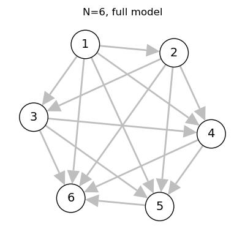
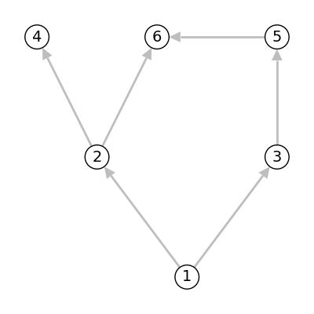
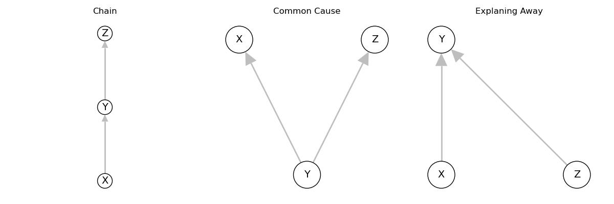
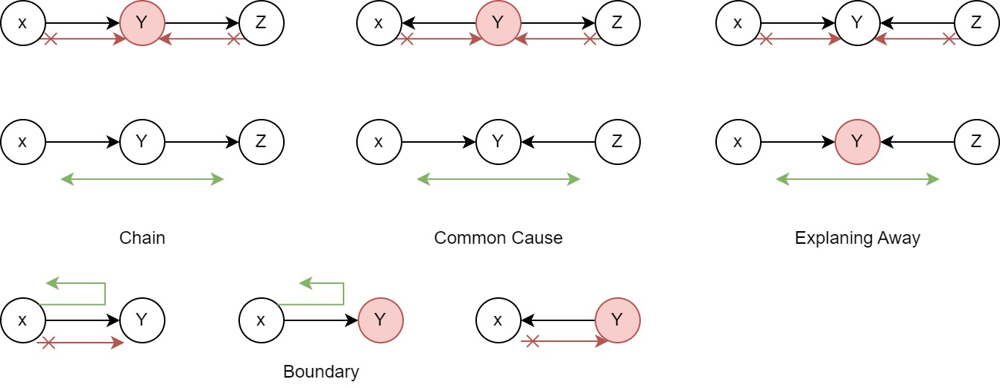

# Joint distributions with Graphical models


## Conditional Distributions
For the joint dsitribution of $N$ r.v. By chain rule of probability, (prove by induction, using the definition of conditional probability)

\begin{align*}
p(x_1, x_2, ...,x_N) &= p(x_1)p(x_2|x_1)p(x_3|x_2, x_1)...p(x_N|x_{N-1}, ..., x_1) \\
&= \prod_{i=1}^N p(x_i\mid x_1,..., x_{i-1})
\end{align*}

Note that the equation holds for any orderings. But this decomposition doesn't reduce #params. 

### Conditional Independence

Two random variables $A, B$ are conditionally independent given $C$, denoted as $X_A\perp X_B\mid X_C$ IFF 

$$p(X_A, X_B|X_C) = p(X_A|X_C)p(X_B|X_C)$$

Note that equivalently, 

$$P(X_A|X_B, X_C) = p(X_A|X_C), P(X_B|X_A, X_C) = p(X_B|X_C)$$

## DAG Models
We can represent the random variables and their independence relationships using a dag $G = (V, E)$ where $V$ represents the random variables, and $E$ represent dependence, then

$$p(X_1,...,X_N) = \prod_{i=1}^N p(x_i\mid \text{parents}(x_i))$$

Note that a dag is a tree and has a topological order, in which we can always find node(s) with no parent. Thus, chain rule of probability still holds, and the dag describes the conditional independence along variables.

For example, If we allow all possible conditional dependencies, that corresponds to a fully-connected DAG

​<figure markdown>
{width="480"}
</figure>


And for the graph given below, we have


$$p(x_1, x_2, x_3, x_4, x_5, x_6)=p(x_1)p(x_2|x_1)p(x_3|x_1)p(x_4|x_2)p(x_5|x_3)p(x_6|x_2, x_5)$$

​<figure markdown>
{width="480"}
</figure>


## Directed Separation 

__D-separation__, or directed-separation is a notion of connectedness in DAGs in which two (sets of) variables may or may not be connected conditioned on a third (set of) variable(s). 

D-connection implies conditional dependence and d-separation implies conditional independence.

Given a graph, we have that $X_A\perp X_B|X_C$ if every variable in $A$ is d-separated from every variable in $B$ conditioned on all the varaibles in $C$. 

For a dag, we only need to consider 3 cases as the following 

​<figure markdown>
{width="720"}
</figure>


### Common Patterns
__Claim 1__. __Chain__ implies that $X\perp Z | Y$.  
_proof_. The dag gives that

$$p(x,y,z) = p(x)p(y|x)p(z|y)$$

$$p(z|x,y) = \frac{p(x,y,z)}{p(x,y)} = \frac{ p(x)p(y|x)p(z|y)}{p(x)p(y|x)} = p(z|y)$$

__Claim 2__. __Common cause__ implies that $X\perp Z|Y$  
_proof_. The dag gives that

$$p(x,y,z) = p(y)p(x|y)p(z|y)$$

$$p(x, z|y) = \frac{p(x,y,z)}{p(y)} = \frac{ p(y)p(x|y)p(z|y)}{p(y)} = p(x|y)p(z|y)$$

__Claim 3__. __Explaining Away__ implies that $X\not\perp Z|Y$  

$$p(x,y,z) = p(x)p(z)p(y|x,z)$$

$$p(z|x, y) = \frac{p(x)p(z)p(y|x,z)}{p(x)p(y|x)} = \frac{ p(z)p(y|x,z)}{p(y|x)} \neq p(z|y)$$

### Bayes Ball

With the three patterns defined above, we have the algorithm to determine whether $X\perp Y|Z$ in an arbitray graph model using the rules defined below. 

​<figure markdown>
{width="720"}
</figure>

First, we shade all $Z$ variables, and then we follow the rules to see whether a path exists between $X,Y$. If exists, then they are dependent. However, implementing such path finding algorithm is complex. An easier implementation arises from the defined rules, as follows. 

```python title="dseparation(G, X, Z)"
# G is the dag, 
# X is a list of vertices as source variables, 
# Z is a list of vertices as the observations
reduce G to only include variables in X and its ancestors
for v in G.V:
    if v has more than 2 parents:
        add undirect edges to each pair of parent vertices
    make all directed edges undirected 
    remove all Z vertices and edges attached to them
    the connected vertices are independent of each other
```


???quote "Source code"

    ```python 
    --8<-- "csc412/scripts/dag.py"
    ```

