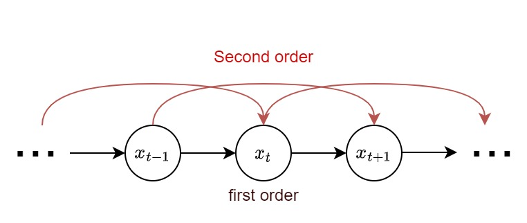
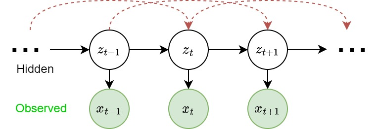

# Hidden Markov Models

A __sequential data__ is a sequence of random states $x_{1:T}$ where $x_{i}$'s aren't i.i.d., but depends on (in most cases, previous) states in the sequence. 

Examples of sequential data includes time-series (stock prices, videos) or any ordered sequence (gene sequences, texts). 

Of course, this definition gives almost no simplifications over the intractable nature of the joint factorization. Therefore, we need stronger assumptions. 

## Stationary Markov Chain

​<figure markdown>
{width="480"}
</figure>

For a  __k-order Markov chain__, we assume that for each state $x_t$, it only depends on the previous $k$ states, which means 

$$\forall t \in \{1,\cdots,T\}. p(x_t|x_{1:t-1}) = p(x_t| x_{t-k:t-1})$$

so that the joint distribution becomes

$$p(x_{1:T}) = \prod_{t=1}^{T} p(x_t| x_{t-k:t-1})$$

for example, we are interested in first order Markov chains, where each state only depends on its previous state. 

$$p(x_t|x_{1:t-1}) = p(x_t| x_{t-1}), p(x_{1:T}) = \prod_{t=1}^{T} p(x_t| x_{t-1})$$

As an example, we want to forecast the weather tomorrow, if I only look at today's weather, then it's a first-order markov chain. If today and yesterday, then it's second order. 

### Stationary Assumption

Further make the stationary assumption, if the distribution generating the data does not change through time, then it is a __stationary/homogenous Markov chain__. For first order MC, this means that 

$$\forall t, k. p(x_t|x_{t-1}) = p(x_{t+k}|x_{t-1+k})$$

### Parameterizations

Assume for stationary model, and the hidden r.v. $z$ is discrete, we need to parameterize
1. __Initial distribution__ $\pi(i) = p(z_1 = i)$. The probability of the first hidden variable being in state $i$.Obviously we need something to start with. 
2. __Transition distribution__ $T(i,j) = p(x_{t+1}=j|x_t=i)$, the probability of moving from state $i$ to state $j$. 

Consider a discrete MC with $K$ states. At each time $x_t$, it falls onto $i\in\{1,...,K\}=:\mathcal S$. Thus, to parameterize the distribution over $X$, we need to parameterize $K-1$ states since the last states is implicit $p(x=K|\cdots)=1-\sum_{i=1}^{K-1} p(x=i|\cdots)$.  
Then, with the stationary assumption, for a m-order MC, we need to assign the probability

$$p(x_t = j| x_{t-1} =i_1, x_{t-2}=i_2,...,x_{t-m} = i_m)$$

for each $j,i_1,...,i_m\in \mathcal S$.

Thus, we have $(K-1)K^m$ parameters.

### Chapman-Kolmogorov Equations
For first-order MC, consider the transition distribution $p(x_t = j| x_{t-1} =i)$, which gives the probability (real number) from state $i$ to state $j$. Therefore, define the __transition matrix__  

$$A: K\times K. A_{ij} = p(x_t = j| x_{t-1} =i)$$

Now, suppose that we want to estimate $x_{t+2}$ with observed $x_t$ ($x_{t+1}$ is unobserved). 

\begin{align*}
p(x_{t+2}=j|x_t = i) &= \sum_{k=1}^{K}  p(x_{t+1}=k|x_t=i) p(x_{t+2}=j|x_{t+1} = k)\\
&= \sum_{k=1}^{K}A_{ik}A_{kj}\\
&= A^2_{ij}
\end{align*}

__Claim (CKE)__ Define $A_{ij}(n):= p(x_{t+n}=j|x_t=i)$, then $A(n) = A(1)^n$.  
_proof_. directly perform induction using the above discovery.

## Hidden Markov Models

In some cases, the observed states of a random variable is not the sequence itself, but a consequence of some hidden states. HMMs hide the temporal dependence by keeping it in the unobserved state. For each observation $x_t$, we associate a corresponding unobserved hidden/latent variable $z_t$.

​<figure markdown>
   {width="480"}
</figure>

The joint distribution of the model is 

$$p(x_1:T, z_1:T) = \prod_{1}^T p(z_t|z_{t-1}) p(x_t|z_t)$$

Unlike simple Markov chains, the observations are not limited by a Markov assumption of any order. I.e. $x_t$ isn't neceessarily independent of any other observation, no matter how many other observations we make.

### Parameterization

In addition to the initial distribution and transition distribution, we need an additional __Emission probability__ 

$$\epsilon_i(x) = p(x|z_t = i)$$ 

the probability of an observed r.v. $x$ given the state of hidden varaible that "emitted" it. 

Note that with the stationary assumption, we need $k$ emission probability functions $\epsilon_i(x)$ for $i = 1,2,...,k$. 

### Forward-backward Algorithm

Given observations $x_{1:T}$, we are interested in estimate the latent sequence $z_1:T$. That's to compute 

$$a_t(j):= p(z_t = j|x_{1:T})$$

 for each $t$. Assuming that the HMM is fully parameterized with initial $\pi(z_1)$, transition matrix $p(z_t|z_{t-1})$, and emission $\epsilon(x_t|z_t)$. 

Then, we divide the latent sequence into 3 parts

__Filtering__ $p(z_t|x_{1:T})$ posterior over current hidden state.  
__Prediction__ $p(z_{t+k}|x_{1:T})$ posterior over future hidden state.    
__Prediction__ $p(z_{t-k}|x_{1:T})$ posterior over past hidden state.   

Note that 

\begin{align*}
p(z_t|x_{1:T}) &\propto p(z_t, x_{1:T})\\
&= p(z_t, x_{1:t})p(x_{t+1:T}|z_t, x_{1:t})\\
&= p(z_t, x_{1:t})p(x_{t+1:T}|z_t) &{x_{t+1:T}\perp x_{1:t}|z}\\
&\propto \alpha_t\cdot\beta_t
\end{align*}

#### Forward Recursion 
Now consider the forward recursion, we have

\begin{align*}
a_t(j) &= p(z_t=j, x_{1:t})\\ 
&= \sum_{i}p(z_{t-1}=i, z_t=j, x_{1:t})\\
&= \sum_{i}\big[p(x_t|z_{t-1}=i, z_t = j, x_{1:t-1}) \\
&\quad\qquad p(z_t=j|z_{t-1}=i, x_{1:t-1})\\
&\quad\qquad p(z_{t-1}=i, x_{1:t-1})\big]\\
&= p(x_t|z_t=j) \sum_i p(z_t=j|z_{t-1}=i)a_{t-1}(i)\\
&=  A_{ij} \sum_i \epsilon_t(j)a_{t-1}(i)
\end{align*} 

where $A_{ij} = p(z_t=j|z_{t-1}=i)$ is the translation matrix, $\epsilon_t(j) = p(x_t|z_t=j)=$ is the emission. Thus, we can write it into matrix form 

$$a_t \propto \epsilon_t \otimes A^\top a_{t-1}$$

where $a_t: K\times 1 = [a_t(1), a_t(2), ..., a_t(K)]^\top, \epsilon_t = [\epsilon_t(1), \epsilon_t(2), ..., \epsilon_t(K)]^\top, A:K\times K, A_{ij} = p(x_t = j| x_{t-1} =i)$ and $\otimes$ denotes element-wise multiplication. 

#### Backward Recursion

Similarly, we have backward recursion

\begin{align*}
\beta_t(i) &= p(x_{t+1:T}|z_t = i)\\
&= \sum_j p(z_{t+1}=j, x_{t+1:T}|z_t = i)\\
&= \sum_j p(x_{t+2:T}|z_{t+1}=j, z_t=i, x_{t+1})\\
&\qquad\quad p(x_{t+1}|z_{t+1}=j, z_t = i)\\
&\qquad\quad p(z_{t+1}=j|z_t=i)\\
&= \sum_j \beta_{t+1}(j) p(x_{t+1}|z_{t+1}=j) p(z_{t+1}=j|z_t=i)\\
&= \sum_j \beta_{t+1}(j) \epsilon_{t+1}(j) A_{ij}
\end{align*}

and similarly the matrix form 

$$\beta_t = A\cdot (\epsilon_{t+1}\otimes\beta_{t+1})$$
