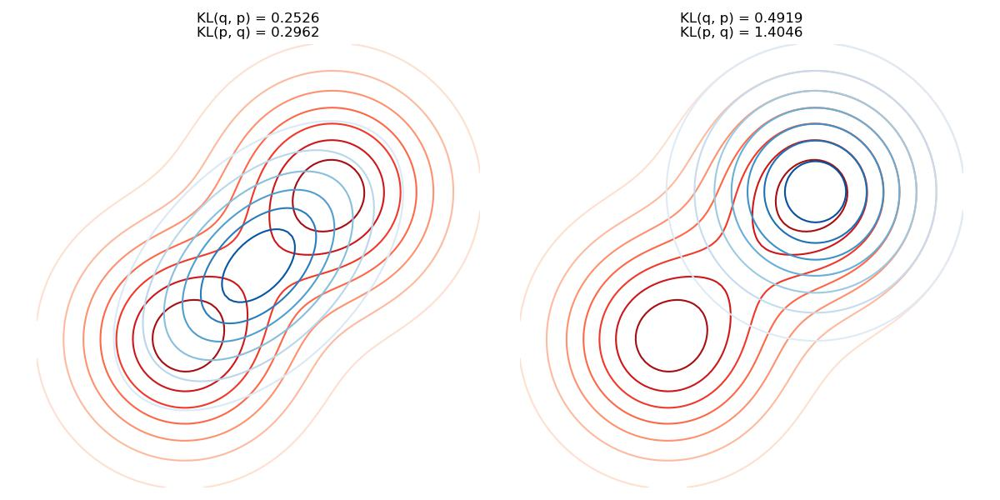

# Variational Inference

Consider the probabilistic model $p(X,Z)$ where $x_{1:T}$ are observations and $z_{1:N}$ are unobserved latent variables. 

The conditional distribution we are interested in, or the __posterior inference__ is

$$\text{posterior} := p_\theta(z|x) = \frac{p(x|z)p(z)}{p(x)} = \frac{p(x|z)p(z)}{\int p(x,z)
dz} =: \frac{\text{likelihood} \cdot \text{prior}}{\text{marginal}}$$

At suggested by the integral, this computation is intractable. Thus, we need to estimate the posterior using approximate inference. Thus, we need 

- some function family $q_\phi(z)$ with parameter $\phi$. 
  - For example, the normal distribution family, where $\phi = (\vec \mu, \Sigma)$
- some distance measurement between $q_\phi, p_\theta$. 
- optimization on the distance to get the best $\phi$. 

## Kullback-Leibler Divergence (KL Divergence)

Given the joint distribution $p(X) = \frac{1}{Z}\tilde p(X)$, we find an approximation function $q_\phi(X)$ from a class of distribution functions, where $\phi$ is the parameter. Then, adjust $\phi$ so that $p\sim q$. That is 

$$\bar E_{x\sim p}[(f(x))] \approx \bar E_{x\sim q}[(f(x))]$$

Define the KL divergence be 

$$D_{KL}(q\parallel p) = E_{x\sim q}\log(\frac{q(x)}{p(x)}) = \sum_{\hat x} q(\hat x)\log\frac{q(\hat x)}{p(\hat x)}$$

### Properies
__Claim 1__ $\forall p, q$ be discrete density functions, $D_{KL}(q\parallel p) \geq 0$; and $D_{KL}(q\parallel p) = 0$ IFF $q=p$.

_proof_. Consider $\sum_{\hat x} q(\hat x)\log\frac{q(\hat x)}{p(\hat x)}$ where $p,q$ are density functions, since we only evaluate on the data samples, it is discrete. Consider $\hat x$ where $q(\hat x) > 0$ and denote each of such $q(\hat x), p(\hat x)$ as $q_i, p_i$ for simpler notation, then

\begin{align*}
\sum_i q_i\log\frac{q_i}{p_i} &= \sum_i q_i(-\log\frac{p_i}{q_i})\\
&\geq -\sum_i q_i (\frac{p_i}{q_i}-1) &\forall x > 0, \log x\leq x-1\\
&=\sum_i q_i - \sum_i p_i\\
&=1-\sum_i p_i\\
&\geq 0
\end{align*}

For equality, we use the fact that $\log 1 = 0$ for all $\hat x$ s.t. $p(\hat x) > 0$, and in the other case we have $p(\hat x) = 0 \implies q(\hat x) = 0$. 

__Claim 2__ Generally, $D_{KL}(q\parallel p) \neq D_{KL}(p\parallel q)$. 

_proof_. Quite obvious, since log function is non-linear. 

## Information Projection vs. Moment Projection
Since $D_{KL}(q\parallel p) \neq D_{KL}(p\parallel q)$, we have two different measurement. where 

__Information Projection__ optimizes on $D_{KL}(q\parallel p)$  
__Moment Projection__ optimizes on $D_{KL}(p\parallel q)$  

First note that when $p\approx q$, $\log(q/p) \approx \log(p/q) \approx \log 1 = 0$ thus both projection have small values. However, consider the shape of $\log(a/b)$, when the denominator is small, it will apply a much larger penalty. Thus, the choice of projection depends on the desired properties of wanted $q$. 


```python title="KL divergence"
--8<-- "csc412/scripts/kl_divergence.py:kl"
```

???quote "Source code"

    ```python 
    --8<-- "csc412/scripts/kl_divergence.py"
    ```
    
<figure markdown>
  {width="960"}
</figure> 

## Evidence Lower Bound (ELBO)

Now, consider the optimization problem

$$q^* = \argmin_{\theta\in\Theta} D_{KL}(q_\theta \parallel p)$$

Note that 

\begin{align*}
D_{KL}(q_\theta \parallel p) &= E_{z\sim q_\theta} \log(\frac{q_\theta(z|x)}{p(z|x)})\\
&=  E_{z\sim q_\theta} \log(\frac{q_\theta(z|x) p(x)}{p(z,x)})\\
&=  E_{z\sim q_\theta} \log(\frac{q_\theta(z|x)}{p(z,x)}) + E_{z\sim q_\theta} p(x)
\end{align*}

Since $x$ is observed, $E_{z\sim q_\theta} p(x)$ is fixed and independent of $\theta$. 

Thus, define the objective function s.t. minimizing $D_{KL}(q_\theta \parallel p)$ is the same as maximizing  

$$\mathcal L(\phi; x) := -E_{z\sim q_\theta} \log(\frac{q_\theta(z|x)}{p(z,x)})$$

Call $\mathcal L(\phi)$ __ELBO__ and note that $-\mathcal L(\phi) + \log p(x) = D_{KL} \geq 0\implies \mathcal L(\phi)\leq \log p(x)$.

### Reparameterization Trick
Now consider 

$$\mathcal L(\phi; x) := -E_{z\sim q_\theta} \log(\frac{q_\theta(z|x)}{p(z,x)}) = E_{z\sim q_\theta} (\log p(x,z)-\log q_\theta(z))$$ 

and we are optimizing the function by 

$$\nabla_\phi \mathcal L = \nabla_\phi E_{z\sim q_\theta} (\log p(x,z)-\log q_\theta(z))$$

However, this causes a problem that the expection $E_{z\sim q_\theta}$ depends on $q_\theta$, thus we cannot put $\nabla_\theta$ into the expectation. 

Thus, we need to reparameterize the expectation distribution, so that expectation does not depend on $\phi$. The idea is that we use another random variable $\epsilon$ from a fixed distribution $p(\epsilon)$, eg. $\text{Unif}(0,1)$ or $N(0,1)$. Then, take some translation function $T(\epsilon, \phi)$ s.t. $z =T(\epsilon, \phi) \sim q_\theta(z)$. 
Thus, we reparameterized the expectation as

\begin{align*}
\nabla_\phi \mathcal L &= \nabla_\phi E_{z\sim q_\theta} (\log p(x,z)-\log q_\theta(z))\\
&= \nabla_\phi E_{\epsilon\sim p(\epsilon)} (\log p(x,T(\epsilon, \phi))-\log q_\theta(T(\epsilon, \phi)))\\
&=  E_{\epsilon\sim p(\epsilon)} \nabla_\phi(\log p(x,T(\epsilon, \phi))-\log q_\theta(T(\epsilon, \phi)))
\end{align*}

### Stochasitc Variational Infernce
Look at $\nabla_\phi \mathcal L = E_{\epsilon\sim p(\epsilon)} \nabla_\phi(\log p(x,T(\epsilon, \phi))-\log q_\theta(T(\epsilon, \phi)))$, it is very similar to the gradient descent problem in neural networks. Thus, similar to SGD, we can do SVI which, at each optimization step, takes a mini-batch to estimate the sample expectation as 

$$\hat E_{\epsilon\sim p(\epsilon)} \nabla_\phi (\cdots) \approx m^{-1}\sum_{i=1}^m \nabla_\theta \log(\cdots)$$
