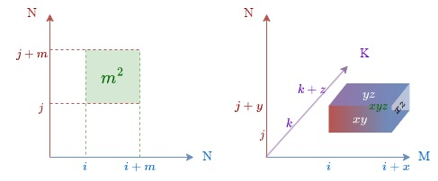

# Communication Optimal Matmul

Communication is equivalent to moving data, which is often the most expensive operation. The goal is to find the minimal communication required for nested loops accessing arrays. 

## General communication lower bound

Informally, we can prove that regular grid problems has a lower bound of communications, and more importantly, we can always attain the lower bound by constructing an optimal tiling. 

## N-body problems

For an N-body problem, we have a dense array of particles (as `struct`) containing position and force. What we want is to compute the updated positions for each particle under the influence of all other particles. Which means

```c
for (int i = 0; i < N; i++) {
    for (int j = 0; j < N; j++) {
        /* update points[i] from points[j] */
    }
}
```

If we know that our cache can fit at most $M$ points, we can do at most $(M/2)^2 = M^2 / 4$ loop iterations. We have $N^2$ iterations, which means we need to fill the cache at least $n^2 / (M^2 / 4) = 4n^2/M^2$ times. Each time when we fill the cache, we need $M$ reads/writes so that the total communication is $4n^2 / M^2 \times M = 4n^2/M$. Therefore, the lower bound for communication is $\Omega(n^2/M)$. 

We can achieve this lower bound in practice by 

```c
for (int i = 0; i < N; i += M / 2) {
    for (int j = 0; j < N; j += M / 2) {
        for (int ii = 0; ii < M / 2; ii++ ) {
            for (int jj = 0; jj < M / 2; jj++) {
                /* update points[i + ii] from points[j + jj] */
            }
        }
    }
}
```

## Matrix multiplication



We know that tiled / blocked matrix multiplication is an optimized way for `matmul` for a similar reason as the N-body problem.

For $C_{M\times N} = A_{M\times K}\cdot B_{K\times N}$, we have $M\times N\times K$ computations as 

```c
for (int i = 0; i < M; i++) {
    for (int j = 0; j < N; j++) {
        for (int k = 0; k < K; k++) {
            C[i, j] += A[i, k] + B[k, j];
        }
    }
}
```

Suppose that the cache can fit `C[i:i+x, j:j+y]`, `A[i:i+x, k:k+z]`, `B[k:k+z, j+j+y]` so that we can do $xyz$ operations, which is 

$$xyz = \sqrt{xy\cdot xz \cdot zy} = \sqrt{area(C) area(A) area(B)}$$

Thus, the problem is equivalent to maximize the box volume under the constraint of total surface area $2M$. We know that the volume is maximized when the box is a cube with side length $\sqrt{\frac{M}{3}}$. Therefore, each cache can do $(\frac{M}{3})^{3/2}$ operations, and the lower bound for communication is 

$$M \times N^3 / (\frac{M}{3})^{3/2} \in \Omega(N^3 / M^{1/2})$$

For parallel computers, if both the work and data are perfectly balanced, then each processor should get $N^3 / P$ operations and $3N^2 / P$ data. Therefore the lower bound is 

$$(3N^2 / P) \times (N^3 / P) / (3N^2 / P)^{3/2} = \Omega(N^2 / P^{1/2})$$

## Convolutions

For a 2D convolution (omitting stride), the input is a $(B, H, W, C_{in})$ image, it is convolve with $(S, R, C_{in}, C_{out})$ kernel to produce $(B, H, W, C_{out})$ output. We will use lower letter for entry index, and the computation is defined by a 7 nested loop, note that the loop variables are inter-changeable.

```matlab
for cout = 1:C_out     % output channel
 for h = 1:H           % image height
  for w = 1:W          % image width
   for s = 1:S         % kernel height
    for r = 1:R        % kernel width
     for cin = 1:C_in  % input channel
      for b = 1:B      % batch
        out[b, h, w, cout] += in[b, h+s, w+r, cin] * f[s, r, cin, cout]
```

For 1D case, suppose the image is size $(H, C_{in})$ and filter is size $(S, C_{in}, C_{out})$ this can be implemented as a moving window. For each input channel, construct the image matrix of dimension $H \times F$ (omitting padding) where the ith row is $x_i, x_{i+1}, \cdots, x_{i+S}$. The filter matrix is $F \times C_{out}$, and we can do matmul on them. 

For 2D CNN, the case is very similar, we first convert 2D image to a matrix where each row is $S\times R$ size, and we flatten 2D filter into 1D. Therefore, the 2D convolution is reduced to 1D. 