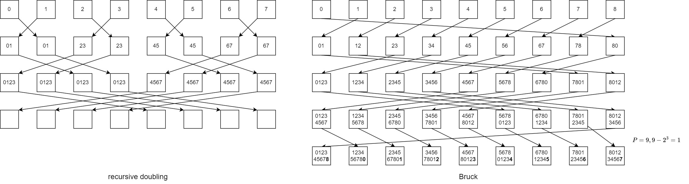

# Advanced MPI 
[Basics of MPI](../csc367/mpi.md) and [MPI communication APIs](../csc367/mpi_comm.md)

## Latency and bandwidth model

For each communication of length $n$, is time cost is roughly 

$$t = a + n\beta$$

where $t$ is the time, $a$ is the latency and $\beta$ is the reciprocal of bandwidth. In practice, $\alpha >> \beta >> \text{FLOP}$, which means we want one large communication rather than many small ones. In addition, we need to perform at much arithmetic operations as possible before a communication to happen. 

## MPI Collectives Cost

Consider $P$ procs and $n$ words of data, assume that $n\geq P$. Let $\alpha$ be the latency, $\beta$ be the reciprocal bandwidth, $\gamma$ be the speed for reduction operations. The per-proc communication cost of efficiently implemented collective operations are 

| collective | description | cost |
| --- | --- | --- |
|`scatter`   | `root` scatters $n$ words, each proc receives $n/P$ words | $\lg P \alpha + n \beta$ | 
|`gather` | each proc sends $n/P$ words to `root` | $\lg P \alpha + n \beta$ |
|`allgather`| each proc sends $n/P$ words, gathered by all procs | $\lg P\alpha + n\beta$ | 
|`broadcast` | `root` broadcast $n$ words to all proc | $2\lg P\alpha + 2n\beta$ | 
|`all_to_all` | each proc sends different $n/P$ words to every other proc | $\lg P\alpha + \frac{n}{2}\lg P\beta$|
|`reduce-scatter`| reduction on $n$ words from each proc, and then scatter the result on all procs| $\lg P\alpha + n\beta + n\gamma$ |
| `reduce` | reduction on $n$ words from each proc, result returned on root | $2\lg P\alpha + 2n\beta + n\gamma$ |
|`allreduce`| reduction on $n$ words from each proc, and then returned the result on all procs | $2\lg P\alpha + 2n\beta + n\gamma$ |


## Implementations for Collectives

Using `AllGather` as an example, other collective are implemented in a similar manner. 

### Ring Algorithm
At time $0$, send original data to right; at time $t$, send the data received at time $t-1$ to right, and receive new data from left.   
Optimal in bandwidth ($\frac{n(p-1)}{P}$ data), high latency ($\alpha(P-1)$). Total time 

$$t_{ring} = \alpha(P-1) + \beta \frac{n(P-1)}{P}$$

### Recursive doubling algorithm 
At time t, proc $i$ exchanges (send/receive) all its current data with process proc $i+2^t$. Data exchanged at time $t$ will be $2^{\lg P - 1}\frac{n}{p}$. However, for non-power-of-two nodes, it's trickier to implement. Total time

$$T_{recur} = \alpha \lg P + \beta \frac{n(P-1)}{P}$$

<figure markdown>
  {width="1080"}
</figure>


### Bruck algorithm
An extension of recursive doubling. At time t, proc $i$ receives all current data from $i+2^t \mod P$ and sends all of its current data to $i-2^t \mod P$. After $\lfloor \lg P\rfloor$ steps, send the top $P - 2^{\lg P}$ entries and do a local shift to get data in correct order. Total time

$$t_{Bruck} = \alpha \lceil \lg(P) \rceil + \beta \frac{n(P-1)}{P}$$

## Hybrid Programming
Note that MPI describes parallelism between procs (separate memory address spaces), if procs are referring to physical cores, the core can also have multiple threads. Therefore, a __hybrid programming model__ provides two levels of parallelism. 

In general, all threads share all MPI objects (world, communicators, requests). MPI provides $r$ levels of thread safety

- `MPI_THREAD_SINGLE` only one thread exists in the application (multithread is not allowed)
    - no threads in the system
- `MPI_THREAD_FUNNELED` multithreaded, but only main thread (who makes `MPI_Init`) makes MPI calls 
    - MPI calls are outside `omp parallel` or inside `omp master`
- `MPI_THREAD_SERIALIZED` multithreaded, but only one thread at a time makes MPI calls
    - MPI calls inside `critical`
- `MPI_THREAD_MULTIPLE` any thread can make MPI calls at any time, with some restrictions
    - MPI calls any time (with restrictions)

Any MPI application that hybrids with thread, should initialize with `MPI_Init-thread`. 

### Restrictions for `MPI_THREAD_MULTIPLE`
Ordering: When multiple threads make MPI calls concurrently, the outcome will be as if the calls executed sequentially in some (any) order. 

Use has to ensure that collectives on the same communicator, window, or file handle are correctly ordered among threads. For example, cannot call a `Bcast` on one thread and `reduce` on another on the same communicator. The user needs to handle race conditions post conflicting MPI calls. 

MPI's blocking will only impact the calling thread, instead of all threads. 

## One-sided communication

To decouple data movement with process synchronizations. Each proc exposes a part of its memory to public, the memory segment works as a "shared" memory and all other processes can read and write to this memory. 

### Window creation
In MPI, this public memory space is called a window. Once the memory is allocated locally, make an explicit MPI call to declare a memory region by 

```cpp
/* Each process specifies a window of existing memory that it exposes to RMA 
   accesses by the processes in the group of comm. 
   The window consists of size bytes, starting at address base.
*/ 
int MPI_Win_create(void *base, MPI_Aint size, int disp_unit, MPI_Info info, 
                  MPI_Comm comm, MPI_Win *win);

/* On each process, it allocates memory of at least size bytes, 
   outputs a pointer baseptr to it, 
   the rest is just the same as Win_create
*/
int MPI_Win_allocate(MPI_Aint size, int disp_unit, MPI_Info info,
                     MPI_Comm comm, void *baseptr, MPI_Win * win);

/* Creates a window object, but no memory attached yet. 
   dynamically add/remove buffers to/from the window later
   using attach/detach
*/
int MPI_Win_create_dynamic(MPI_Info info, MPI_Comm comm, MPI_Win * win);

/*
multiple processes on the same node will share the same buffer space
*/
int MPI_Win_allocate_shared(MPI_Aint size, int disp_unit, MPI_Info info, MPI_Comm comm,
                             void *baseptr, MPI_Win *win);


/*
free the window
*/
MPI_Win_free(MPI_Win *win);
```

Examples for `allocate` and `create_dynamic`

```cpp
int main(int argc, char ** argv) {
    int *a; 
    MPI_Win win;
    MPI_Init(&argc, &argv);
    // collectively create remote accessible memory in a window
    MPI_Win_allocate(1000*sizeof(int), sizeof(int), MPI_INFO_NULL,
    MPI_COMM_WORLD, &a, &win);
    // Array ‘a’ is now accessible from all processes in MPI_COMM_WORLD
    MPI_Win_free(&win);
    MPI_Finalize(); 
    return 0;
}

int main(int argc, char ** argv) {
    int *a; 
    MPI_Win win;
    MPI_Init(&argc, &argv);
    MPI_Win_create_dynamic(MPI_INFO_NULL, MPI_COMM_WORLD, &win);
    // create private memory
    a = (int *) malloc(1000 * sizeof(int));
    // use private memory like you normally would
    a[0] = 1; a[1] = 2;
    // locally declare memory as remotely accessible
    MPI_Win_attach(win, a, 1000*sizeof(int));
    // Array 'a' is now accessible from all processes
    // undeclare remotely accessible memory
    MPI_Win_detach(win, a); 
    free(a);
    MPI_Win_free(&win);
    MPI_Finalize(); 
    return 0;
}
```

### Data movement

Data movement is similar to RESTful 

```cpp
int MPI_Put(
    const void *origin_addr, int origin_count, MPI_Datatype origin_datatype, 
    int target_rank, 
    MPI_Aint target_disp, int target_count, MPI_Datatype target_datatype, 
    MPI_Win win);

int MPI_Get(
    void *origin_addr, int origin_count, MPI_Datatype origin_datatype, 
    int target_rank, 
    MPI_Aint target_disp, int target_count, MPI_Datatype target_datatype, 
    MPI_Win win);

/* Accumulate data into the target process from reduction op */
int MPI_Accumulate(
    const void *origin_addr, int origin_count, MPI_Datatype origin_datatype, 
    int target_rank, 
    MPI_Aint target_disp, int target_count, MPI_Datatype target_datatype, 
    MPI_Op op, MPI_Win win);
```

### Orderings

__There is no guaranteed ordering for `put/get` operations. The results of concurrent `put` to the same location is UNDEFINED, the result of `get` while concurrently `put/accumulate` is UNDEFINED__. 

Note that concurrent accumulation to the same location are defined according to the order in which they occurred. 