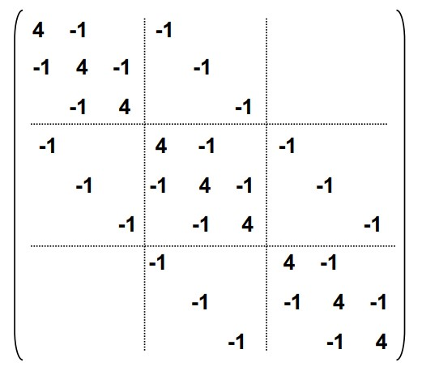
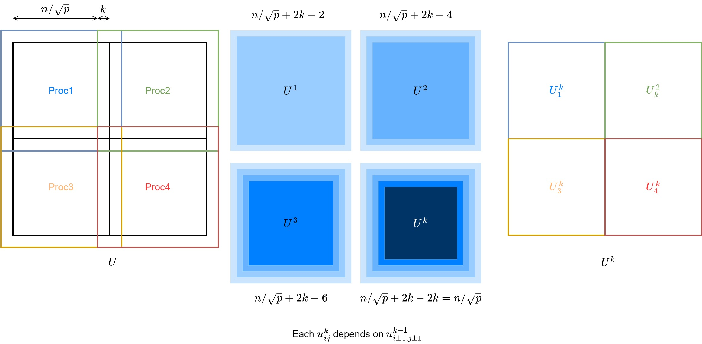

# Structured Grid for Poisson's Equations

Consider the Poisson's equation, which arises in many physics applications $\nabla^2 \Phi = \sigma$.

As a concrete example, given a unit length bar of uniform material, at time 0, the temperature at one side is $0$ and the other side is 1. Let $u(x,t):[0,1]\times[0,1]\rightarrow [0,1]$ be the temperature at position $x$ at time $t$. We know that heat travels from $x-h$ to $x+h$ at rate 

$$\frac{\partial}{\partial t} u(x,t) = \frac{C}{h^2}(u(x-h,t) - u(x,t) - (u(x,t) - u(x+h, t)))$$

As $h\rightarrow 0$, we have the heat equation as a Poisson's equation 

$$\frac{\partial}{\partial t} u(x,t) = C \frac{\partial^2}{\partial x^2}u(x,t)$$


## Table for different methods
Time and space complexity for $2D (3D)$ Poisson equations with $N = n^2(n^3)$ grid cells.

| algorithm | serial time | space complexity | idealized parallel time | #procs required |
| --- | --- | --- | --- | --- |
| Dense LU | $N^3$ | $N^2$ | $N$ | $N^2$ |
| Band LU | $N^2(N^{7/3})$ | $N^{3/2}(N^{5/2})$ | $N$ | $N(N^{4/3})$ |
| Jacobi | $N^2(N^{5/3})$ | $N$ | $N$ | $N(N^{2/3})$ |
| Conj. Gradients | $N^{3/2}(N^{4/3})$ | $N$ | $N^{1/2}\log N (N^{1/3}\log N)$ | $N$ | 
| R/B SOR |  $N^{3/2}(N^{4/3})$ | $N$ | $N^{1/2} (N^{1/3})$ | $N$ | 
| Multigrid | $N$ | $N$ | $\log^2 N$ | $N$ |
| lower bound | $N$ | $N$ | $\log N$ | |

## Stencils (Discretization)
We can discretize the equation onto a $M\times N$ regular grid with step size $\Delta x = 1/M, \Delta t = 1/N$. At each grid location, we have measured the temperature at position $i/M$ at time $j/N$ as $\mathbf u_{ij} = u(i/M, j/N)$.

Using implicit Euler we can approximate time derivative $\partial_t u(x,t) = \frac{u(x,t+\Delta t) - u(x,t)}{\Delta t}$ so that we have the heat equation estimated as 

\begin{align*}
\frac{u(x,t+\Delta t) - u(x,t)}{\Delta t} &= \frac{C}{(\Delta x)^2}(u(x-\Delta x, t+\Delta t) - 2u(x, t+\Delta t) + u(x+\Delta x, t+\Delta t))\\
u(x, t) &= u(x, t+\Delta t) - \frac{C\Delta t}{(\Delta x)^2}(u(x-\Delta x, t+\Delta t) - 2u(x, t+\Delta t) + u(x+\Delta x, t+\Delta t))\\
\mathbf u_{i,j} &= \mathbf u_{i,j+1} - z(\mathbf u_{i-1,j+1} - 2\mathbf u_{i,j+1} + \mathbf u_{i+1,j+1})
\end{align*}

we note that $z = \frac{C\Delta t}{(\Delta x)^2}$ is constant, and we can represent the equations as a sparse matrix vector multiplication

$$(I + zL)\cdot \mathbf u_{:, i+1} = \mathbf u_{:i}$$

where $I$ is the identity matrix, $L$ is a $N\times N$ sparse matrix, where $L_{ii} = 2, L_{i-1,i} = L_{i+1, i} = -1$ and the rest entries are all $0$. 

By Trapezoidal rule, another formulization will yield better numerical properties

$$(I + \frac{z}{2}L)\cdot \mathbf u_{:, i+1} = (I - \frac{z}{2}L)\mathbf u_{:i}$$

This results in the stencil for 1D Poisson's equation. 


For 2D (for example, heat transfer one a sheet of metal), the story is similar, the matrix $L$ is still a nearly diagonal matrix. 

<figure markdown>
  {width="480"}
</figure>


Therefore, we need to solve a system of equations. The most naïve method is to use dense LU, but we can observe that $L$ has special structure (almost diagonal with structured off-diagonal entries), thus we can solve it via a specialized band LU. 

## Iterative Methods (Relaxation)
Even band LU requires to store the $n\times n$ matrix and requires large memory. Iterative methods starts with some initial guess at the solution, and more step by step towards the solution. 

### Jacobi's Method

Note that the equation can be written as 

\begin{align*}
\sigma(i\Delta x, j\Delta t)\Delta x\Delta t &\approx \mathbf u_{i+1, j} + \mathbf u_{i-1, j} + \mathbf u_{i, j+1} + \mathbf u_{i, j-1} - 4\mathbf u_{i, j}\\
\mathbf u_{i, j}&\approx \frac{1}{4}(\mathbf u_{i+1, j} + \mathbf u_{i-1, j} + \mathbf u_{i, j+1} + \mathbf u_{i, j-1} - \sigma(i\Delta x, j\Delta t)\Delta x\Delta t)
\end{align*}

we pre-compute and rewrite $\mathbf b_{ij} := -\sigma(i\Delta x, j\Delta t)\Delta x\Delta t$ as a grid and derive the Jacobi's method. 

```py title="Jacobi's method"
def step(U, B):
    max_error = 0
    U_new = empty_like(U) 
    for i in range(n):
        for j in range(n):
            U_new[i, j] = (
                U[i+1, j] + U[i-1, j] + U[i, j+1] + U[i, j-1] + B[i, j]
            ) / 4.
            error = abs(U_new[i, j] - U[i, j])
            max_error = max(max_error, error)
    return U_new, max_error

# B = precompute matrix with all 
# sigma values on the grid
U = initial_guess
boundary_conditions(U)
U, max_error = step(U, B)
while max_error > error_tolerance:
    U, max_error = step(U, B)
```

Parallelizing Jacobi's method is very straight forward. For each step, each entries of $U$ only requires the 4 neighboring entries. Therefore, the matrices $U, B$ can be evenly divided onto $p$ procs. At each step, the proc updates its partition of $U$, and communicate (`sendrecv`) the boundary ($n/\sqrt{p}$) to each neighboring procs. 

We can further optimize the communication by doing some extra computations per-proc. The halo area has side length $1$, if we expand it to $k$, then we can do $k$ steps before one communication with $kn/\sqrt{p}$ data.


<figure markdown>
  {width="1080"}
</figure>


### Red-black Gauss-Seidel

Note that Jacobi's method can be also async, meaning that we can do the value updates in-place. This will give better convergence speed than Jacobi's, since the values are closer to the true value. 

```py title="Gauss-Seidel"
def step(U, B):
    max_error = 0
    U_new = empty_like(U) 
    for i in range(n):
        for j in range(n):
            old_value = U[i, j]
            U[i, j] = (
                U[i+1, j] + U[i-1, j] + U[i, j+1] + U[i, j-1] + B[i, j]
            ) / 4.
            error = abs(U[i, j] - old_value)
            max_error = max(max_error, error)
    return max_error
```

However, Gauss-Seidel is not parallelizable. Since each $\mathbf u_{i,j}$ will depend on $\mathbf u_{i-1,j}, \mathbf u_{i,j-1}$. Therefore, we could take something in the middle. For each step, we do Jacobi's in a red-black manner. 

```py title="Red-black GS"
def step(U, B):
    max_error = 0
    U_new = empty_like(U) 
    # red step
    for i in range(0, n, 2):
        for j in range(0, n, 2):
            old_value = U[i, j]
            U[i, j] = (U[i+1, j] + U[i-1, j] + U[i, j+1] + U[i, j-1] + B[i, j]) / 4.
            error = abs(U[i, j] - old_value)
            max_error = max(max_error, error)

    # black step
    for i in range(1, n, 2):
        for j in range(1, n, 2):
            old_value = U[i, j]
            U[i, j] = (U[i+1, j] + U[i-1, j] + U[i, j+1] + U[i, j-1] + B[i, j]) / 4.
            error = abs(U[i, j] - old_value)
            max_error = max(max_error, error)
    
    return max_error
```

R/B GS converges twice as fast as Jacobi. For higher dimensions and general graphs, if the graph stencils is 2 colorable, then we can use R/B GS. 

The parallelization is exactly the same as Jacobi's. 

### Successive overrelaxation (SOR)
Note that for each step, we are updating $\mathbf u_{i,j}$ through its finite difference, or an estimated gradient. Therefore, if we write the update step as 

$$\mathbf u_{i,j}^{k+1} = \mathbf u_{i,j}^k + c^k_{i,j}$$

We could take more aggressive steps if $c$ is a good direction to move. Therefore, we can take some $w>1$ and move further at each step as 

$$\mathbf u_{i,j}^{k+1} = \mathbf u_{i,j}^k + w c^k_{i,j}$$

## Conjugate Gradient

[More notes on deriving CG](../apm462/conjugate.md)

For system of equations $Ax = b$, if $A$ is ==symmetric and positive definite==, then we can solve for $x$ using conjugate gradient. 

The algorithm and possible parallelization is 

```py title="Conjugate gradient"
def step(rem, old_rho):
    rho = dot(rem, rem) # dot
    if old_rho is None:
        p = rem
    else:
        p = rem + (rho / old_rho) @ p # saxpy
    q = A @ p # SpMV or stenceil
    alpha = rho / dot(p, q) # dot
    x += alpha * p # saxpy
    r -= alpha * q # saxpy
    return rho

x = initial_guess(n)
rem = b - A @ x
old_rho = None
while rho > tolerance:
    old_rho = step(rem, old_rho)
```

If $A$ is a stencil, then this question can be reorganized to use matrix powers kernel to avoid communication. 

## Multigrid
Instead of solve a fixed size grid, adapting a coarse to fine approach. Starts with a coarse grid and updates till some error tolerance, then use it as a starting guess for a finer grid. Moreover, we can have multiple levels and solve the problem recursively. 

Let $A^i$ be the problem at level $i$. For example, if we have a 2D grid, we can have $A^1$ be $2\times 2$, $A^2$ be $4\times 4$, and the actual estimation wanted is $A:=A^k$ be $2^k \times 2^k$. Let $\mathbf b^i$ be the known values at level $i$ and $\mathbf x^i$ be the estimated solution at level $i$. 

In addition, define the following operator

- Restriction `restrict` $R^i$ s.t. $\mathbf b^{i-1} = R^i(\mathbf b^i)$. Restricts known values at level $i-1$ from $i$ so that the problem won't diverge. 
- Interpolation `lerp` $lerp^i$ s.t. $\mathbf x^i = lerp^i(\mathbf x_*^{i-1})$. Interpolate solutions of $x$ at level $i-1$ to make initial guesses at level $i$ (often average of nearest neighbors). 
- Solution `solve` $S^i$ s.t. $\mathbf x_*^i = S^i(\mathbf b_i, \mathbf x_i)$ to be the solution of $A\mathbf b= \mathbf x$ at level $i$, $S$ can be Jacobi, SOR, or any method mentioned above.

Therefore, the overall algorithm is defined as 

```py title="multigrid V-Cycle"
def MGV(b, x, level):
    x = solve(b, x)
    if level == 1:
        return x # the coarsest level
    r = A @ x - b # error on current level
    b_res = restrict(r) # restricted error at level - 1
    d = lerp(MGV(b_res, 0, level - 1)) # solve Ad = r recursively
    x -= d # correction on grid solution
    x = solve(b, x) # refine again
    return x
```

Suppose that at each level, the grid half its side length, then the total computation is a geometric series

$$\sum_{i=1}^k O(2^i\times 2^i) = O(4^k) = O(N)$$

Paralleling multigrid is eventually similar to other method. At each level, divide the grid into squares for each proc, synchronization and communication is required at each level among neighbors. Note that when the dimension of procs is larger than the dimension of grid, then some procs have to be idle. Therefore, we don't have to go as coarse as level 1. 