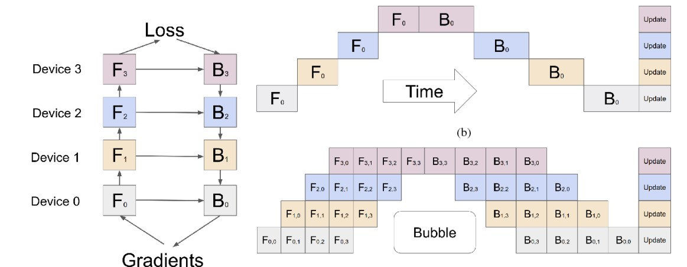
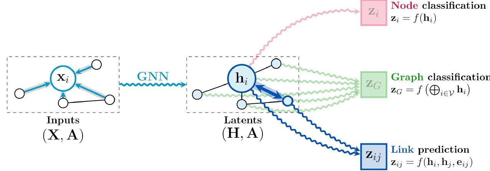

# Parallel Machine Learning

## Multi-GPU Stochastic Gradient Descent

For mini-batch SGD, the weights are updated as 

$$W^{t+1} \leftarrow W^t - \alpha \frac{1}{B}\sum_{i=k+1}^{k+b}\nabla_W f_i(W^t, x)$$

where $\alpha$ is the learning rate and $B$ is the mini-batch size.

### Batch parallelism
For batch parallelism, distribute input samples (training data) to different processors, and each processor get a replica of model weights. There are several ways to update the weights.

- Using a parameter server (master process), all other processes will do one iteration, send the gradient to the server, wait to receive the new weights. 
    - The fetching and updating of gradients can be either synchronously (wait for all processes finish one iteration, and have all gradients processed by the parameter server) or asynchronously (the parameter server sends partially updated weights whenever receives weights update).
    - Synchronous updates suffers heavily from communication and synchronization.
    - Asynchronous updates is not-reproducible and might hurt convergence. 
- Synchronous method, but use `all-reduce` routine over the network to update gradients. Can avoid communication bottleneck on the parameter server. 
- Asynchronous method, peer-to-peer gossiping, or send and receive gradients to all other processes. The communication overhead will be higher but the convergence performance is better. 


In either model, we need to replicated $W$ onto each process at each iteration, thus the communication overhead for each iteration is 

$$T_{comm} = 2 \alpha \log(P) + \beta \frac{P-1}{P}|W_i|$$

Since data is not communicated among processors, the overhead is independent of the batch size. However, if we have more servers, the batch size will be smaller due to the small data partition, and the per-processor utilization goes down significantly. 
 
### Model parallelism

Consider the data dependency graph of a neural network. The forward pass is often a sequence of matrix multiplication and per-entry activation functions. Therefore, it's possible to distribute the matrix multiplications and corresponding activations to different processors, and then gather at the output $Y$ and enable back-propagation (essentially more matmuls) partitioned on different processors. 

However, model parallelism is hard, since the many dimensions and new per-layer operators. Many models requires manually define the distribution methods. 

### Domain parallel for CNN
For CNN, note that the convolution is performed on each pixel, the bottleneck is on the activations ($H\times W\times \times C_{out}$) instead of the filter weights ($F\times F\times C_{in}\times C_{out}, F<<H/W$). Therefore, we can partition images into smaller patches over $(H, W)$ and distribute over different devices. Note that this is beneficial for for early layers since $H,W$ gets smaller after pooling. 

Assuming that each device gets a square patch and the boundary if of the size of $F//2$, then for each layer we need to broadcast the weights (filters) and send/recv the halo boundary to 2D neighboring device. 

\begin{align*}
T_{input} &= \sum_{i=0}^L \alpha + \beta B W^i_{in} C_{in}^i F^i/2\\
T_{activation} &= \sum_{i=0}^L \alpha + \beta B W^i_{out} C_{out}^i F^i/2\\
T_{weights} &= \alpha\log(P) + \beta \frac{P-1}{P}|F^iF^i|
\end{align*}

### Pipeline Parallelism

<figure markdown>
  {width="1080"}
</figure>


Divides input mini-batch into smaller micro-batches, different GPUs work different micro-batches simultaneously. Gradients are sync at the end. 

__Pipeline bubbles__ start of the forward propagation on a minibatch, requires the backprop of the previous minibatch to complete. 


## Support Vector Machine
A linear support vector machine aims to find a linear separator to classify data, such that the separation bandwidth is maximized. 

$$\arg\max_{\mathbf w, b} \frac{1}{\|w\|}\:s.t.\: \forall i \in\mathcal D. \mathbf y_i(\mathbf w^T \mathbf x_i + b)\geq 1$$

For non-linear separators, we transform all input $x$ into features $\phi(x)$ and find a linear separator in the feature space. In practice, the feature space will have higher dimension than the input space (otherwise we can find a linear separator in the input space directly).

Therefore, a full SVM  takes a feature dataset (after applying $\phi$ to  each of the input) of size $N\times D$, where $N$ is the number of data points, and $D$ is the feature dimension. For each pair of the data point $\mathbf x, \mathbf y$, compute the similarity w.r.t. the current $w, b$, the resulting similarity matrix (kernel matrix) is $N\times N$ where $ij$th entry is the similarity between $x_i, x_j$. 

### Kernel Methods
Replace the dot-product similarity with an arbitrary similarity (symmetric, positive semi-definite) kernel $K(x,y): \mathcal X \times \mathcal X \rightarrow \mathbb R$. For example, the __Gaussian kernel__ $K(\mathbf x, \mathbf y) = \exp(\|-\gamma \| \mathbf x -\mathbf y\|^2)$.

Another full example that to compute a 2D circular decision boundary.   
Define the feature transformation as $\phi(x,y) = (x^2, y^2, \sqrt{2} x y)$ and the kernel function $K(\mathbf x_1, \mathbf x_2) = (\mathbf x_1\cdot\mathbf x_2)^2$. The magic is that 

$$K(\phi(x_1,y_1), \phi(x_2, y_2)) = x_1^2y_1^2 + x_2^2 y_2^2 + 2\sqrt{2}x_1x_2y_1y_2 = (x_1y_1 + x_2y_2)^2$$

### Sequential minimal optimization

Note that at each step of optimization, naïve SVM generates $O(N^2)$ kernel matrix in $O(DN^2)$ time. SMO avoids computing the large kernel matrix all at once by taking only two rows of the kernel matrix at each iteration. For binary classification task, SMO can be expressed in dual form as 

\begin{align*}
\arg\max_{\Alpha} &\sum_{i=1}^N a_i - \frac{1}{2} \sum_{i=1}^N\sum_{j=1}^N a_ia_j y_iy_j K(\mathbf x_i, \mathbf x_j)\\
s.t. & \forall a_i \in A. 0 \leq a_i \leq C. \sum_{i=1}^N a_iy_i = 0
\end{align*}

where $C$ is the a defined hyperparameter, $y_i$ is the label of $\mathbf x_i$, and $a$'s are the Lagrange multipliers. 

The algorithm select some pair $a_i, a_j$ (with heuristics) and update the total cost by only re-computing the $i,j$ rows. 

### Possible parallelism
- Cascade SVM: evenly partition the data and create SVM for each data partition, then for each layer, remove the non-support vectors in a tree structure.
- Divide-and-Conquer SVM: partition the data by k-means, and for each layer, all data are used to train the layer-wise SVM (instead of removing SV). 
- Cluster partition SVM: partition the data by k-means, then instead of training a tree of SVM, just train k SVs and choose the best one on the test dataset.  

# Parallel Graph based Machine Learning

## Clustering
Given a set of data, clustering aims to exploit compactness (data points that are close to each other) or connectivity (data points that falls into the same underlying kernel). 

A clustering can be understood as a graph partition problem. The vertices are data points and the edge between each pair of data points, weighted by the similarity. Then, given the aimed number of clusters $k$, we want to find a normalized minimum cut to divide the graph into $k$ disconnected components, where each partition has balanced number of vertices (data points) and the total similarity is maximized. 

### Spectral Clustering
The idea is to do the partition recursively. Partition the data into two sets of similar size by finding the minimum cut (cut s.t. the total weights/similarity on the edges is minimized), and then recursively partition each set until enough clusters are identified. 

First, represent the graph using the adjacency matrix. Let $D$ be the __degree matrix__ where $D$ is a diagonal matrix with $d_{ii} = deg(\mathbf v_i)$. Let $W$ be the __adjacency weight matrix__ where $w_{ij} =$ the weight/similarity of edge $(v_i, v_j)$. Then, the __unnormalized graph Laplacian__ is $L = D-W$ and two forms of normalized graph Laplacians

$$L_{sym} = D^{-1/2} L D^{-1/2} = I - D^{-1/2}WD^{-1/2}$$

$$L_{rw} = D^{-1}L = I - D^{-1}W$$

Then, the spectral clustering algorithm is defined as 

```py title="spectral clustering"
D, W = construct_graph(data)
L_sym = normalized_graph_laplacian(D, W)
vals, vecs = eig(L_sym) # eigen decomposition
U = vecs[-k:] # k smallest eigen vectors
U = normalize(U, axis=0) # row-wise normalization
# regard each row of U as a data point and run k-means
k_means(U, axis=0)
```

Note that the penalization is possible for almost all steps :graph construction by parallelizing the similarity computation, sparse matrix vector (SpMV) for $L_sym$, eigen decomposition, and normalization. 

### Markov Cluster (MCL)
For a graph based clustering problem, we make the assumption that the total weights for any pair of vertices within the same cluster will be greater than vertices in two different clusters. Given such assumptions, perform a random walk on the graph (probability by edge weights) will be more likely to remain within a cluster. Therefore, the algorithm computes the probability of random walks through the graph, and remove lower probability terms. 

For each step, compute

1. __expansion__ compute the higher length random walk by squaring the edge weight matrix, remove random walks with lower probability.
2. __inflation__ elementwise powers to boost the probabilities so that walks inside clusters gets strong weights.

Possible prallelism involves a sparse matrix squaring (SpGEMM) and pruning all entries belong a threshold (can do it inplace, along with SpGEMM). 


## Dimension Reduction

For a dataset of $N\times D$, dimension reduction aims to find a smaller feature set $N\times K$ where $K << D$ while the information loss is minimized. 

### Principal Component Analysis
PCA is the most classical algorithm for dimension reduction, and it is equivalent to a singular value decomposition ([proof of equivalence](./cs311/../../csc311/pca.md#equivalence-of-the-criteria)). 

### Non-negative matrix factorization (NMF)

NMF aims to solve the optimization problem

$$\arg\min_{W\geq 0, H\geq 0} \frac{1}{2}\|A - WH\|_F$$

where $A \in\mathbb R^{m\times n}, W\in\mathbb R^{m\times k} , H \in \mathbb R^{k\times n}$ are all non-negative, $k << m, n$. For this class of problem, one common framework is the alternating iterative method, at each step, fixing one matrix and optimize the energy by updating the other matrix. 

The possible parallelism is the large-scale matrix multiplications. Also, depends on the application, $A$ is often much larger than $W,H$ and also sparse (correlation matrix, count matrix, etc.). Therefore, avoiding communications on $A$.  

## Graph Neural Networks

For GNN, a graph $(V, E)$ where each node $v$ describes a data point and edge/adjacency $e$ describes its inter-data relationships. Taking one node $v$ and its adjacent relationship (edges) $e_0, e_1, ..., e_{deg(v)}$, we encode the data into its latent representation $\mathbf h$ (often a vector embedding) via a GNN. Then, we are interested in various results by integrating the latent code only, latent code convolving with all adjacency information, and querying inter-nodes relationship given two latent nodes and their connectivity. 

<figure markdown>
  {width="1080"}
</figure>


One special case for GNN is CNN, if we consider each pixel as a node, and add edges to all neighboring pixels with distance smaller than half kernel size, and each edge is weighted by the kernel weights. 

In general, a graph is represented by a sparse matrix (adjacency matrix) or tensor ($|V| \times |V| \times |C|$), and the operations are very similar to CNN, instead of doing 2D convolutions, we are doing graph convolutions, which is a more unstructured convolution with larger radius. 

The challenges for parallelism includes the partitioning of sparse matrices and the distribution of data (since conventionally we represents a sparse matrix as `(row, col, value)` or pointer-chasing). Also, GNN often consumes larger amount of memory, and hence distributed learning (multiple GPU support) is often required. 