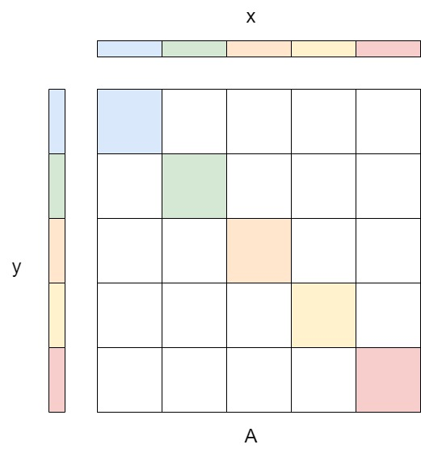

# Sparse Matrices

## Representations of Sparse Matrices

A sparse matrix is a matrix where $\geq 90%$ entries are 0. Consider a $M\times N$ sparse matrix with $n$ non-zero entries. If we store and do operations on sparse matrices just like a dense matrix, we will waste lots of space and computational time. For example, a diagonal matrix and diagonal matrix vector multiplication takes $O(N)$ instead of $O(N^2)$. 

The main goal for sparse matrix representations is to store the non-zeros in a dense format. For any arbitrary sparse matrix, the simplest idea is to store it as __coordinate (COO)__ as a dense array `(row, col, value)` or a hash table `(row, col) -> value`, which takes $3n$ space and it's easy to build and modify. 

### Compressed sparse row/column (CSR/CSC)

Taking one step further, if we have multiple entries in the same row, we could simply store it as `row -> [(col_1, value_1), (col_2, value_2), ..., (col_i, value_i)]`. Therefore, we store two arrays, An index array and an adjacency array. The $i$th entry of the index array is a pointer or index to the starting point of all non-zero entries in row $i$; the adjacency array is a dense array of all `(col, value)` tuples ==ordered from top left to the bottom right of the matrix==. The total space is $M+2n$. CSC is same idea, but indexing columns instead of rows. 

```c
// dense matrix
12,  0, 26,  0,
 0,  0, 19, 14,
26, 19,  0,  0,
 0, 14,  0,  7

// COO
(0, 0, 12), (0, 2, 26),
(1, 2, 19), (1, 3, 14),
(2, 0, 26), (2, 1, 19),
(3, 1, 14), (3, 3,  7)

// CSR
0, 2, 2, 3, 5
(0, 12), (2, 26), (2, 19), (3, 14), (0, 26), (1, 19), (1, 14), (3, 7)
```

In general, sparse matrices are stored in CSR since linear algebra on CSR is easier to implement. 

## Sparse matrix vector multiplication (SpMV)
For SpMV, we simply iterate through row's indexing array, and then for each non-zero entry in the row. 

```c
/*  M * N sparse matrix A with n non-zeros stored as
    int ptr[M + 1]  row pointers
    int ind[n]      column index array
    int val[n]      value array
*/
for (int i = 0; i < M; i++) {
    for (int j = A.ptr[i]; j < A.ptr[i+1]; j++) {
        y[i] += A.val[j] * x[A.ind[j]];
    }
}
```

One problem with sparse matrix is the pointer chasing problem, where `ind, val` is dense, but we need to access `x[ind[j]]`, which is not contiguous, and such pointer chasing takes multiple CPU cycles. 

### Parallel SpMV
For the loop, it's easier to see that SpMV can be parallelized by partitioning the rows. Of course, such partitioning would have workload imbalance since the nonzero entries in each row is different. 

Another way is to think SpMV as a segmented suffix scan problem. For each row, we scan for mapped `x` and finally gather them together.

```py
"""
    x = [1, 2, 1, 2, 1, 2, 1]
    A.ptr = [0, 2, 5, 7, 9]
    A.ind = [
        1, 2, 
        0, 3, 4, 
        1, 2, 
        5, 6, 
        0, 1, 4
    ]
    A.val = [
        1, 1, 
        1, 2, 2, 
        2, 1, 
        2, 2, 
        1, 3, 1
    ]
"""

flag = zeros(len(A.val)) + ones[A.ptr]
# [1, 0, 1, 0, 0, 1, 0, 1, 0, 1, 0, 0]

prod = val * x[ind]
# [
#   2, 1, 
#   1, 4, 2,
#   4, 1,
#   4, 2,
#   1, 6, 1
# ]

# start reduction at each flag and ends at the next
y = scan(prod, segment=flag, op=sum)
# [3, 7, 5, 6, 8]
```

For diagonal banded matrix multiplication, the matrix can be represented as a $M\times d$ matrix where $d$ is the number of entries per row, and a `column_offset` array to record the offset from the diagonal. 


```py title="banded matrix multiplication"
"""
A = [
    11, 12,  0,  0,  0,  0,  0,
    21, 22, 23,  0,  0,  0,  0,
     0, 32, 33, 34,  0,  0,  0,
     0,  0, 43, 44, 45,  0,  0,
     0,  0,  0, 54, 55, 56,  0,
     0,  0,  0,  0, 65, 66, 67,
     0,  0,  0,  0,  0, 76, 77,
]

val = [
    12, 23, 34, 45, 56, 67,  0,
    11, 22, 33, 44, 55, 66, 77,
     0, 21, 32, 43, 54, 65, 76
]

col_offset = [-1, 0, 1]
"""

for k in range(d):
    # parallel on rows
    for i in range(M):
        col = i + col_offset[k]
        if col >= 0 and col < n:
            y[i] += val[k][col] * x[col]
```

### Tuning
The main problem with SpMV is load imbalance and pointer chasing, if we know the general distribution of the sparse matrix, we can plan for the partitioning and register blocking

### Reordering
The most ideal structure for parallelized SpMV is block diagonal. In this case, we can partition $y=Ax$ into $p$ processors and we requires no communication except for a final `gather`. 



Of course, this is only a very small class of sparse matrix. However, we can reorder the rows or columns to get close to such format. Then, we can use it for computation and permute things back using a permutation matrix. 

### Register blocking

If we know that most entries of the sparse matrix are clustered in small blocks, then instead of storing each nonzero entry with `ind`, storing a $r\times c$ block as a dense matrix indexed by the top-left coordinate. Although we have some zeros in this case, we can use vector instructions to quickly fetch data. Note that $r\times c$ and ways to partition the matrix is up for tuning.

Register blocking with various size: we can have $r,c$ stored in the top-left coordinate so that each block has its own size. 