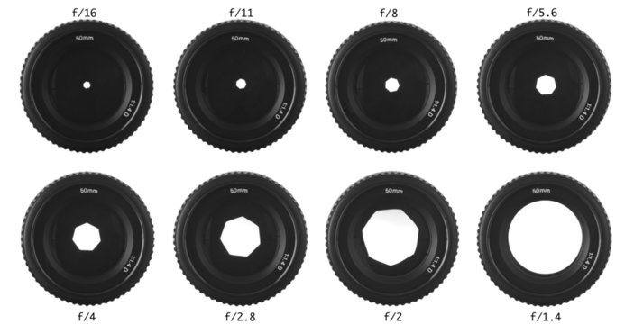
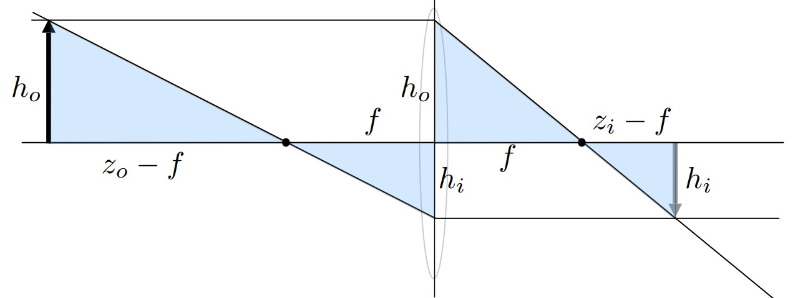

# Cameras

## Field of views (FOV)

Consider a camera
- $h$ be its __sensor size__, conventionally $h$ is the height of the sensor and the aspect ratio of the sensor is $3:2$. 
- $f$ be its __focal length__, physically speaking, focal length is the distance between lens and the focus. For photography, focal length often refers to the distance between the lens and the sensor when the object is in focus. 
- $\text{FOV} = 2 \tan^{-1}(\frac{h}{2f})$ field of view is the degree (conventionally vertical degree) of the viewing angles. 

<figure markdown>
  {width="1080"}
</figure>

Conventionally, most manufactures refers FOV as the diagonal FOV by a full-frame sensor (also called 35mm sensor, but the actual size is $36\times 24$mm). For example, $17$mm focal length wide angle lens is $2\tan^{-1}(\frac{\sqrt{36^2+24^2}}{2\times 17}) \approx 104\degree$.

## Exposure

__Exposure__ is the amount of photons received by each sensor pixel during a given duration. amplified by a coefficient. In general it can be expressed as an integral over area and time. Therefore, the exposure can be controlled by 

- __Aperture__ lens f-stop, open/close the physical aperture to control the area of lens that receive light
- __Shutter speed__ the duration that the sensor pixels are integrating light
- __ISO (Gain)__ change the system amplification. 

### ISO (Gain)

Abstracting the lens reflections, the sensor value can be thought as the number of photos hit on the pixel area, modelled by a Poisson process. Therefore, fewer examples multiplied by a constant will give a more noisy estimation (variance) of the true model, with the mean being unbiased. 

ISO is just a constant multiplied onto each sensor pixel value, hence it is linear. 

### F-stop (Aperture)

<figure markdown>
  {width="720"}
  <figurecaption>Apetures defined as f-stop</figcaption>
</figure>

The __f-number/f-stop__ of a lens is defined as $f/d$ where $f$ is the focal length and $d$ is the diameter of the aperture. One __stop__ doubles the exposure. 

==Note that f-stop $x$ is often written as f/x where $x = f/d$.==

Of course, all aperture can fully close, so that a len's F-Number is the maximum aperture (focal length / max diameter). For example, a 50mm F/1.4 lens has $50/1.4\approx 36$mm diameter. 

### Shutter
A shutter can be physical, which is a machine curtain to block light, or electronic shutter, which the sensor read-out data and "ends" exposure and reset to start exposure by fills with photoelectrons. 

__Motion blur__ with longer exposure time, the motion in the scene will be integrated over time with changing positions. Therefore, given the same motion, longer exposure time will have more motion blur. 

__Rolling shutter effect__ the sensor pixels are not read-out at the same time. In practice, it's a sequential pipeline. The exposure time for each pixel is the same, but starting and ending time is different (each pixel starts with $s_i$ and ends with $e_i+\Delta t$ with $\Delta_t$ is the exposure time, independent of pixels). The difference between the first and last pixel can take $1/30$ sec. The resulting picture will have sheared objects. 

### Gauss Ray Diagram

<figure markdown>
  {width="720"}
  <figurecaption>Gauss Ray Diagram</figcaption>
</figure>

By similar triangles we have equations 

$$\frac{h_o}{z_o - f} = \frac{h_i}{f}\quad \frac{h_o}{f} = \frac{h_i}{z_i - f}$$

rearranges to 

$$\frac{h_o}{h_i} = \frac{z_o - f}{f} = \frac{f}{z_i - f}$$

Which gives the Newtonian Thin Lens Equation

$$\frac{z_o - f}{f} = \frac{f}{z_i - f}\implies (z_o - f)(z_i - f) = f^2$$

Expand LHS and rearrange into Gaussian Thin Lens Equation

\begin{align*}
z_oz_i -(z_o + z_i)f + f^2 &= f^2\\
\frac{1}{f} &= \frac{z_o + z_i}{z_oz_i} \\
\frac{1}{f} &= \frac{1}{z_o} + \frac{1}{z_i} \\
\end{align*}

and __magnification__ $m = \frac{h_i}{h_o} = \frac{z_i}{z_o}$

### Defocus Blur (Circle of Confusion)
Let $A$ be the diameter of the aperture and $C$ be the diameter circle of confusion. $z_s$ be the sensor plane and $z_i$ be the image's focus. Then 

$$\frac{C}{A} = \frac{|z_s - z_i|}{z_i}$$

Note that the camera can changes its focal point at $z_c$ by changing the $z_s$, using the Gauss' thin lens equation as $z_s = (f^{-1} - z_c^{-1})^{-1}$, and given an object that's $z_o$ away, its image is at $z_i = (f^{-1} - z_o^{-1})^{-1}$.

Also, note that the $C = A\frac{|z_s - z_i|}{z_i}$ is proportional to the aperture diameter and we know that $A = \frac{f}{\text{F-number}}$ so that $C$ is inverse proportional to F-number. 

### Depth of Field
DOF is where the circle of confusion is smaller than the sensor's pixel size. Suppose that the camera's object focus is $z_S$ and image focus in $d_S$ (done by adjusting the distance between lens and sensor). Then, we need to find far and near s.t. $C_F = A\frac{d_F - d_S}{d_F}, C_N = A\frac{d_N - d_S}{d_N}$ is below the wanted threshold $C_0$. Using Gauss' Len equation to change $d$'s to $z$'s, we have that 

$$\frac{(f^{-1}-d_F^{-1})^{-1} - (f^{-1} - d_S^{-1})^{-1}}{f^{-1} - d_F^{-1}} = \frac{C_0}{A}$$

rearrange the equation and get 

$$z_F = \frac{z_S f^2}{f^2 - \frac{C_0f}{A}(z_s - f)}, z_N =  \frac{z_S f^2}{f^2 + \frac{C_0f}{A}(z_s - f)}$$

Then note that F-number $N = f/A$ so that 

$$z_F = \frac{z_S f^2}{f^2 - C_0N(z_s - f)}, z_N =  \frac{z_S f^2}{f^2 + C_0 N(z_s - f)}$$

Therefore, the larger aperture (smaller f-number) gives small depth of field
### Depth of Field vs Motion Blur
- Depth of field is impacted by the aperture (F-number), large aperture (small f-number) gives small depth of field. 
- Motion blur is impacted by the shutter speed, longer shutter time gives more motion blur. 
- The same amount of light can be controlled by aperture, shutter time, ISO. Higher ISO will create random noise, which is not desired. Therefore, we need to tradeoff in between motion blur and defocus blur. 

### Ray Tracing with defocus blur

The idea is to put a "thin lens" in front of the camera's image plane so that the viewing rays are refracted. 

1. For pixel $\mathbf x$ on the image plane, randomly select $\mathbf x'$ on the lens plane
2. trace the ray pass through conjugate point $\mathbf x''$ on the focus plane and estimate radiance by multiple samples. 