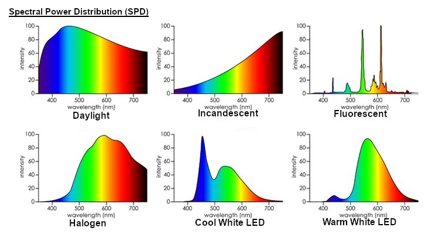
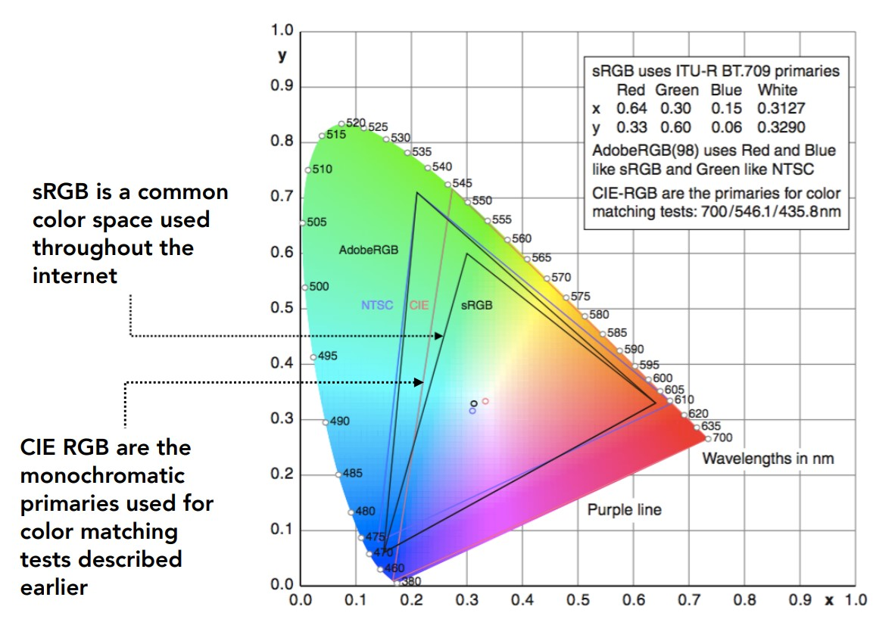

# Color Sciences

## Spectral Power Distribution (SPD)

SPD describes the amount of light present at each wavelength, often measured in radiometric units (energy per unit area) divided by wavelength unit, for example watt / nanometer. For a real-world scene, we often use "relative units" scaled to max wavelength. The final color can be seen as the integrating SPD over the wavelength. The relative SPD can be expressed as a function 

$$s:\mathbb{R}\rightarrow[0, 1]. s(\lambda) = p$$

<figure markdown>
  {width="720"}
  <figcaption>Examples of SPD</figcaption>
</figure>


Note that SPD are linear, i.e. for two light sources $s_1, s_2$, the resulted SPD  $s(\lambda) = s_1(\lambda) + s_2(\lambda)$

## Light Detector

Consider a simple light detector model:

- light as photons (particles), and SPD $n(\lambda)$ describes the number of photons at different wavelength. 
- detector is a surface that record the number of photon hits, but the detector does not know the what wavelength each photon has. The output is just the total number hits over the unit area. However, the detector has different detection efficiency (probability of detecting photons at specific wavelength), which the efficiency $[0,1]$ is described as a probability function $p(\lambda)$, or sensitivity $r(\lambda)$. 
  
The total number hits $X_N$ is observed, or by changing the unit from number hits to measured signal $X$, over SPD and detector sensitivity

$$X_N = \int n(\lambda)p(\lambda)d\lambda\text{, or } X = \int s(\lambda) r(\lambda)d\lambda$$

Given the integral, we can easily discretize it by measuring $s$, $r$ at $n$ points $\lambda_1, \lambda_2,\cdots,\lambda_n$ as $\mathbf s = (s_1 := s(\lambda_1), s_2,\cdots, s_n), \mathbf r = (r_1 := r(\lambda_1), r_2,\cdots, r_n)$ and the estimated $X = \mathbf s\cdot\mathbf r$. 


## Human Color Perception
Human has 3 types of cones (light detector), we call it $S,M,L$ (short, medium, long) and each of them has a distinctive sensitivity function $r_S, r_M, r_L$. Therefore, each cone cell will give a response (understood as a scalar) dependent on its type. The final precepted light is understood as a 3D vector

$$\begin{bmatrix}S\\M\\L\end{bmatrix}=\int \mathbf r(\lambda)s(\lambda)d\lambda=\begin{bmatrix}r_{S,1}&r_{S,2}&\cdots&r_{S,n}\\r_{M,1}&r_{M,2}&\cdots&r_{M,n}\\r_{L,1}&r_{L,2}&\cdots&r_{L,n}\end{bmatrix}\begin{bmatrix}s_1\\s_2\\\vdots\\s_n\end{bmatrix}$$

## Metamers and Displays
Note that we are mapping from spectrum ($\infty$-dim) to cone responses (3-dim). Obviously such mapping cannot be 1-to-1, hence __metameters__ are spectra that project to the same response (which means the save color to human). 

Therefore, we only need a 3-dim light emitter to match all the possible responses, call them $s_R, s_G, s_B$ and for each real spectrum $s(\lambda)$, we output its matched display spectrum 

$$s(\lambda)\approx s_{\text{display}}(\lambda) =Rs_R(\lambda) + Gs_G(\lambda) + Bs_B(\lambda)$$ 

Given that $s_R, s_G, s_B$ are fixed dependent on the display material, we can describe color as $(R,G,B)$. 

### Color reproduction
We aim to reproduce the perception of real spectrum $[S, M, L]_{\text{real}}$ by the perception of displayed spectrum $[S, M, L]_{\text{disp}}$, i.e. 

\begin{align*}
\begin{bmatrix}\mathbf r_S\\\mathbf r_M\\\mathbf r_L\end{bmatrix}\mathbf s &=
\begin{bmatrix}\mathbf r_S\\\mathbf r_M\\\mathbf r_L\end{bmatrix}
\begin{bmatrix}\mathbf s_R&\mathbf s_G&\mathbf s_B\end{bmatrix}
\begin{bmatrix} R\\ G\\ B\end{bmatrix}\\
\begin{bmatrix} R\\ G\\ B\end{bmatrix} &=
(\begin{bmatrix}\mathbf r_S\\\mathbf r_M\\\mathbf r_L\end{bmatrix}\mathbf s)^{-1}
\begin{bmatrix}\mathbf r_S\\\mathbf r_M\\\mathbf r_L\end{bmatrix}
\begin{bmatrix}\mathbf s_R&\mathbf s_G&\mathbf s_B\end{bmatrix}\\
RGB &= (M_{SML}M_{RGB})^{-1}M_{SML}\mathbf s
\end{align*}

The __color matching functions__ $(M_{SML}M_{RGB})^{-1}M_{SML}$ is a $3\times N$ fixed w.r.t. display material and human perception. Therefore, for each measured spectrum $\mathbf s$, we need to evaluate $RGB$. If any of $R,G,B$ is negative, then the display can't physically reproduce the desired color. 

## LMS Response

Note that SPDs are additive, which means that if we can color match two light spectrum with $RGB_1, RGB_2$, then we can match their sum $RGB_1 + RGB_2$, since all of them are positive. Therefore, if we can color match for since response for each wavelength ($c$ at a specific wavelength, and $0$ elsewhere $SPD(\lambda) = c\mathbb I(\lambda = \lambda_0)$), then we can color match any spectrum by a linear combination of infinitely many response values. 

Taking the inverse, we have human color perception $(S,M,L)$ at each wavelength. In other words, the "spectral locus" of human cone cells' response to monochromatic light (light with energy in a single wavelength). The spectral locus, which is a subspace in 3D SML space, represents all possible responses.

```plotly
{"file_path": "cs284/assets/spec_locus.json"}
```

### Chromaticity Diagram
We can map the LMS response to 2D by perspective projection looking diagonally down at origin from $(1,1,1)$, the result is the Chromaticity diagram. One of the mapping (CIE 1931 xy) is defined as 

$$\begin{bmatrix}X\\Y\\Z\end{bmatrix}=
\begin{bmatrix}1.19121&-1.1121&0.2019\\0.3709&0.6291&0\\0&0&1\end{bmatrix}
\begin{bmatrix}L\\M\\S\end{bmatrix}, 
\begin{bmatrix}x\\y\end{bmatrix} = \frac{1}{|X| + |Y|+|Z|}\begin{bmatrix}X\\Y\end{bmatrix}$$

The resulted projection is a 2D color gamut, 

<figure markdown>
  {width="720"}
  <figcaption>Color gamut</figcaption>
</figure>


## Color Spaces

We know that color is represented in 3D space, but there are many different coordinate systems to represent the same color space. The common one is RGB. However, RGB is device dependent, the same RGB value can look differently on different displays. 

### Standard RGB (sRGB)

Like other industries, the simplest way it to setup a particular standard for RGB. Color devices will simulate the particular RGB standard by calibration. 

Historically, one "Standard" color space is __CIE XYZ__. It's designed s.t. XYZ spans all observable color, the matching functions are $>0$, and $Y$ corresponds to luminance. Note that the actual standard is imaginary because it can only be realized with primaries that are negative at some wavelengths. 

The __luminance__ is defined by 

$$Y =\int \Phi(\lambda)V(\lambda)d\lambda$$

where $V$ is the visual luminous efficiency, which measures how bright a light at a given wavelength is perceived by a human. $\Phi$ is th incoming radiance. 


### Hue-Saturation-Value (HSV)

The perceptual dimension of color

| | Hue | Saturation | Value (lightness) | 
| --- | --- | --- | --- |
|description | "kind" of color, regardless of attributes | colorfulness | overall amount of light |
|colorimetric meaning | dominant wavelength | purity | luminance |
|artist's meaning | pigment color | fraction of paint from the colored tube | tints / shades |
