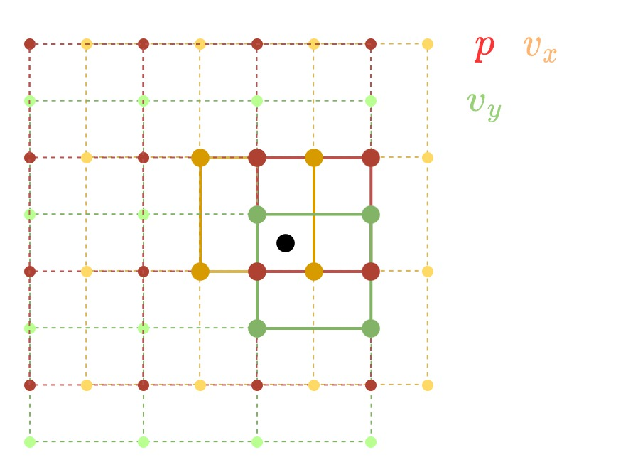

# Fluid Simulation

Generally, there are two approaches for fluid simulation: 

1. Grid approach: discretize the 3D field as a grid and save quantities on voxels, the fluids will move through grid and updates quantities accordingly. Easy to scale, but hard to track the surface.
2. Particle approach: each particle represents a blob of volume and stores quantities. The fluid behavior is achieved through inter-particle forces.  Hard to scale, but easy to track surface. 

## Grid based Fluid Simulation

For simplicity, assume a 2D simulation, and 3D simulation behaves exactly the same. 

For grid-based simulation, we store __velocity, pressure, density__ on a regular grid. Note that pressure and density are scalar fields $p: \mathbb R^2 \rightarrow \mathbb R$ while velocity is 3D fluid $\mathbf v: \mathbb R^2\rightarrow\mathbb R^2, \mathbf v(x,y) = (u,v)$. 

### Staggered Grid

Intuitively, we can store all quantities on discretized grid locations, and linearly interpolate the values at any location (lerp from $2^D$ points), i.e. 

\begin{align*}
p(x,y) &= lerp(p_{i,j}, p_{i+1,j}, p_{i,j+1}, p_{i+1,j+1})\\
\mathbf v(x,y) &= lerp(\mathbf v_{i,j}, \mathbf v_{i+1,j}, \mathbf v_{i,j+1}, \mathbf v_{i+1,j+1})\\
\end{align*}

where $i = \lfloor x / dx \rfloor, j = \lfloor y / dy \rfloor$. However, to prevent unstable checkerboard, we use a staggered grid instead. The pressure grid is unchanged, while the velocity is staggered by half, which means that 

\begin{align*}
i_p &= \lfloor x / dx \rfloor, j_p = \lfloor y / dy \rfloor\\
i_{u} &= \lfloor x / dx + 0.5\rfloor, j_{u} = \lfloor y / dy \rfloor\\
i_{v} &= \lfloor x / dx \rfloor, j_{v}= \lfloor y / dy + 0.5\rfloor
\end{align*}

### Vector Field
Define several operators on the vector field. 

- __gradient__ for some scalar field $p$, $\nabla p = (\partial_x p, \partial_y p)$ is the direction of greatest change in $p$
- __divergence__ for some field $\mathbf v:(x,y)\rightarrow(u,v)$, $\nabla \cdot \mathbf v = \partial_x u + \partial_y v$ is the net flow of the region near $(x,y)$.
- __curl__ $\nabla\times \mathbf v = \partial_xv - \partial_yu$ is the circulation around $(x,y)$.
- __Laplacian__ $\nabla^2 p= \nabla\cdot\nabla p= \frac{\partial^2p}{\partial x^2} + \frac{\partial^2p}{\partial y^2}$ is the difference from the neighborhood average.
- __directional derivative__ $\nabla_{\mathbf v} \mathbf v = \mathbf v \cdot \nabla \mathbf v$ measures how a quantity changes as point of observation moves

### Navier-Stokes Equations

The change in fluid velocity is described as 

$$\frac{\partial\mathbf v}{\partial t} = -\nabla_{\mathbf v}\mathbf v - \frac{\nabla p}{\rho} + \frac{\nu}{\rho}\nabla^2 \mathbf u + \frac{\mathbf f}{\rho}$$

- $\nabla_{\mathbf v}\mathbf v$ is the __advection__
- $\frac{\nabla p}{\rho}$ is __pressure__, $\rho$ is density
- $\frac{\nu}{\rho}\nabla^2 \mathbf u$ is __viscosity__, $\nu$ is the viscosity coefficient
- $\frac{\mathbf f}{\rho}$ is the __external forces__ on the field

This leads to a forward solver

$$d\mathbf v = dt(-\nabla_{\mathbf v}\mathbf v - \frac{\nabla p}{\rho} + \frac{\nu}{\rho}\nabla^2 \mathbf u + \frac{\mathbf f}{\rho})$$

where we update pressure $p$ from density $rho$, then update velocities by N-SE, and update densities from $\dot{\rho} \propto -(\nabla_{\mathbf v}\rho + \nabla\cdot (\rho\mathbf v))$. 

However, iteratively solving the equation (explicit method) will quickly go unstable because pressure waves move fast.  

## Stable Fluids

Stable Fluids [@stam1999stable] is an early work that provide a more stable solver for N-SE by making the incompressible assumption. 

### Incompressible Fluids

We add an additional assumption that the fluid has constant density / volume, which implies that the divergence of flow velocity is $0$, i.e. $\nabla\cdot \mathbf v = 0$. Then we separate the problem by taking out advection $d\mathbf v_a = -dt\nabla_{\mathbf v}\mathbf v$ and pressure projection $d\mathbf v_p = - dt\frac{\nabla p}{\rho}$. Then, the equation becomes

$$d\mathbf v = d\mathbf v_a + d\mathbf v_p +dt( \frac{\nu}{\rho}\nabla^2 \mathbf u + \frac{\mathbf f}{\rho})$$

We separate problem term $\mathbf v^*$, the unprojected and unadvected velocities, from the rest

$$\mathbf v^* = \mathbf v^t + dt(\frac{\nu}{\rho}\nabla^2 \mathbf u + \frac{\mathbf f}{\rho})$$

The incompressible fluid assumption gives that 

\begin{align*}
\nabla\cdot\mathbf v &= 0\\
\nabla \cdot(\mathbf v^* + d\mathbf v_p) &= 0\\
\nabla\cdot \mathbf v^* + \nabla\cdot(-dt \frac{\nabla p}{\rho}) &= 0\\
\nabla\cdot\mathbf v^* &= dt \nabla\cdot\frac{\nabla p}{\rho}\\
\nabla\cdot\mathbf v^* &= \frac{dt}{\rho}\nabla^2 p
\end{align*}

we can now solve $p$ and unproject pressure back to as $\mathbf v^+ = \mathbf v^* - \frac{dt}{\rho}\nabla^2 p$. 

Finally, we can update advection simply by track backward each velocity $\mathbf v_{i,j}$ for $dt$, interpolate the values and copy to new location. 

