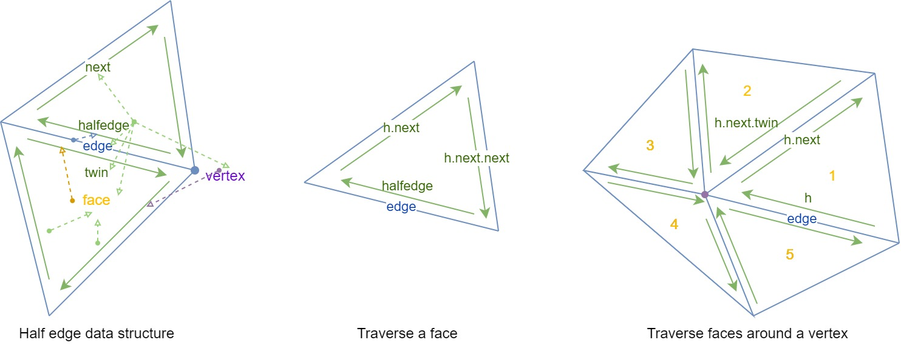

# Mesh Representations

In general, a mesh is set of oriented triangles. Then, note that for each vertex, it can be shared among many triangles (degree $\geq 1$). Leading to a graph-like representation $(V, F)$ where $V = \{v_0, v_1, ..., v_n\}$ is the set of all vertices and $F = \{(a_0, b_0, c_0), (a_1, b_1, c_1), ...\}$ is the set of triangles or faces, represented by the index of the point.  


## Topology

In general, $V$ represents the __geometry__, or the position in the space.  $T$ represents the __topology__, including connectivity, orientation, etc. 

### 2D Manifold
A 2D __manifold__ is a surface that when cut with a small sphere always yields a disk. If a mesh is a manifold, then

- Each edge connects exactly two faces
- Each edge connects exactly two vertices
- Euler's polyhedron formula holds: $|F| - |E| + |V| = 2$

In general, a 2D manifold can be locally expanded to a 2D sheet. 

### Orientation

In convention, the __orientation__ of the face is represented by the order of vertex indexes. A face is oriented outward if the vertices are counterclockwise listed. The object has __consistent__ orientations is every pair of faces that share the same edge has the same orientation. A mesh is __non-orientable__ if it is equivalent to a Mobius ring (note that it's consistent but not orientable). 


## Triangle-neighbor 

We are interested in meshes with good topological properties, or manifolds in general. To support for traversing in a topological order (for manifold) and finding neighbors, we need additional cache.  


```c
struct T {
    V *vertices[3]; // 3 vertices
    T *neighbors[3]; // 3 triangles that share edge (v0, v2), (v1, v0), (v2, v1)
};

struct V {
    VectorXD position; // 2D or 3D location of the vertex
    T *t; // any one of the triangle that v belongs
}

// find next triangle c.c.w. around vertex v 
// from triangle t
T *tccwvt(V *v, T *t) {
    if (v == t->v[0]) return t->neighbors[0];
    if (v == t->v[1]) return t->neighbors[1];
    if (v == t->v[2]) return t->neighbors[2];
}

// traverse over all triangles around vertex v
void *tccwv(V *v) {
    T *t = v->t;
    do {
        /* operations on t*/
        t = t->neighbors[0];
    } while (t != v->t);
}
```

## Half Edge

A more popular data structure is half edge, where the key idea is to use two half-edges act as the glue between mesh elements. 

```c
struct H {
    H *twin; // the opposite halfedge that share the same edge
    H *next; // the next halfedge within the face
    V *vertex; // the starting vertex of the half edge
    E *edge; // the edge that is shared between this and twin
    F *face; // the triangle face that this belongs to
}

struct V {
    VectorXd position;
    H *h; // any one of the halfedge that starts from this vertex
}

struct E {
    H *h; // any one of the halfedge that corresponds to this edge
}

struct F {
    H *h; // any one of the halfedge that is in this face
}
```

### Traversal

Note that the half edge is the orientation of the triangle face, and we can traverse all edges / vertices around the face.

```c title="travese all edges or vertices in a face"
H *entry_h = ... // vertex->h, face->h, edge->h, or any given ;
H *curr_h = entry_h->next;
do {
    /* do things on curr_h, curr_h->edge, curr_h->vertex */
    curr_h = curr_h->next;
} while (curr_h != entry_h);
```

Note that any sphere around a manifold will cover a disk, which means if we traverse the faces around the vertex, we should be able to come back to the original face. For half-edge, this is achieved by following the half edges until we come back.

```c title="travese all faces around a vertex"
H *h = v->h;
do {
    /* do thing on h->face or 
       traverse in the face 
    */
    h = h->next->twin;
} while (h != v->h);
```



### Local operations
Some local operations that we'd like to support:

- `flip`: for two adjacent faces $abc$ and $bad$, make them to $acd$ and $cdb$.
- `split`: split two adjacent faces into 4 faces by breaking one edge
- `collapse`: remove one edge, make the two vertices into a new vertex and connect to all previous edges

Note that half edge is implemented as arrays of struct pointers. Thus, the local operations are just a bunch of pointer re-assignment. 


## Loop Subdivision

Subdivision aims to smooth the mesh by adding more vertices and faces, and update vertices via local average. 

Loop subdivision is an approximation (old vertices will move) and make $C^2$ smooth faces. The method works by taking the midpoint of each edge, and then use the new midpoint vertices to divide each triangle into 4 triangles. Finally, update the positions of vertices using its adjacent vertices. The implementation is the following

```cpp title="Loop subdivision"
Vector3D old_vertex_position(V *v) {
    H *h = v->h;
    int degree = 0;
    Vector3D position_new(0, 0, 0);
    do {
        position_new += h->next->vertex->position;
        h = h->next->twin;
        degree++;
    } while (h != v->h);
    double u = (degree == 3) ? 3. / 16. : 3. / (8. * degree);
    return u * position_new + (1. - degree * u) * v->position;
}

Vector3D new_vertex_position(E *e) {
    return
        0.375 * e->h->vertex->position + 
        0.375 * e->h->twin->vertex->position + 
        0.125 * e->h->next->next->vertex->position + 
        0.125 * e->h->twin->next->next->vertex->position; 
}
void loop_subdivision(Mesh m) {
    Mesh old_m = m.copy(); // make a deep copy for reference 

    // update the existing vertices positions 
    for (int i = 0; i < old_m.vertices.size(); i++) {
        m.vertices[i]->position = old_vertex_position(old_m.vertices[i]);
    }
    // create new vertices and compute their positions
    for (int i = 0; i < old_m.edges.size(); i++) {
        V *v = new V();
        v->position = new_vertex_position(old_m.edges[i]);
        v->isNew = true;
        m.vertices.push_back(v);
    }

    // split each edge
    for (int i = 0; i < old_m.edges.size(); i++) {
        // split will add newly created edges to the end of m.edges
        split(m.edges[i], m);
    }

    // flip edges that connect one old vertex and one new vertex
    for (int i = old_m.edges.size(); i < m.edges.size(); i++) {
        E *e = m.edges[i];
        // one endpoint is new and the other is old
        if (e->h->vertex->isNew != e->h->twin->vertex->isNew)
            flip(e);
    }
}
```

### Semi-regular meshes

A mesh is __regular__ if $\forall v\in V. degree(v) = 6$. Loop subdivision creates semi-regular meshes, which means only a few extraordinary points (where degree is not 6). 

Note that if a triangular mesh is topologically equivalent to sphere (a manifold without any boundary), then it will not be regular. 

## Cutmull-Clark Subdivision

Cutmull Clark subdivision is a popular subdivision algorithm for general meshes (triangular, quad, or even a mix). 

First, consider a regular quad mesh, where the topology is equivalent to a structured grid (each vertex has exactly degree of 4 unless a boundary). The idea is very simple, breaking each grid into 4 grid. In order to do so, we need 

- For each face, add a face point as the center of the face, i.e. the average of the 4 vertices 

$$\mathbf x_f = \frac{1}{4}(\mathbf x_1 +\mathbf x_2 + \mathbf x_3+\mathbf x_4)$$

- For each edge, add an edge point as the average of two endpoints and two face points from the faces associated with the edge 

$$\mathbf x_e = \frac{1}{4}(\mathbf x_1 + \mathbf x_1 + \mathbf x_{f1} + \mathbf x_{f2})$$

- For each existing point, update its position with its 4 face points, 4 mid points (the average of two endpoints of an edge), and its own position

$$\mathbf x' = \frac{1}{16}(\mathbf x_{f1} + \mathbf x_{f2}+\mathbf x_{f3} + \mathbf x_{f4} + 2(\mathbf x_{m1} + \mathbf x_{m2} + \mathbf x_{m3} + \mathbf x_{m4}) + 4\mathbf x)$$

For non-regular meshes (not necessarily quad), the process is similar

- Each face point is the average of surrounding vertices
  
$$\mathbf x_f = \frac{1}{n}\sum_{i=1}^n \mathbf x_i$$

- Each edge point is the average of two endpoints and two face points from the faces associated with the edge (exactly the same as before)

- Each existing point by a weighted average of adjacent face points, midpoints, and vertices. 

$$\mathbf x' = \frac{1}{n}(\bar{\mathbf x_f} + 2\bar{\mathbf x_m} + (n-3) \mathbf x)$$

where $n$ is degree of vertex $\mathbf x$, $\bar{\mathbf x_f}, \bar{\mathbf x_m}$ is the average of face points and midpoints. 

## Mesh Simplification

Want to simplify the mesh but make the geometry/surface suffers a minimal change. Locally, we wan collapse one edge to simplify a model. Note that each edge collapse reduce a constant number of edges, vertices, and faces. However, the error caused by removing different edges are very different. 

The idea is that we want to collapse the edge s.t. the distance from the actual surface to the mesh has the minimal change, and we repeat this greedily. Then, what is the distance? When we remove one edge, the change is made locally, thus we only need to measure the distance changes as sum of (squared)distances from the new vertex to planes containing the impacted triangles. 

Note that the squared distance for a plane $\mathbf n =(n_x, n_y, n_z), \mathbf p = (p_x, p_y, p_z)$ to vertex $\mathbf v = (v_x, v_y, v_z)$ is 

\begin{align*}
d(\mathbf v) &= (\mathbf n \cdot \mathbf p - \mathbf n \cdot \mathbf v)^T (\mathbf n \cdot \mathbf p - \mathbf n \cdot \mathbf v) \\
&=  \mathbf p^T \cdot \mathbf n^T \cdot \mathbf n \cdot \mathbf p - 2\mathbf v^T \cdot \mathbf n^T \cdot \mathbf n \cdot \mathbf p + \mathbf v^T \cdot \mathbf n^T \cdot \mathbf n \cdot \mathbf v\\
&= \mathbf p^T \mathbf N \mathbf p - 2\mathbf v^T \mathbf N \mathbf p + \mathbf v^T \mathbf N \mathbf v\\
&= \tilde{\mathbf v}^T Q \tilde{\mathbf v}\\
\end{align*}

where $\tilde{\mathbf v} = (v_x, v_y, v_z, 1)$ is the homogeneous form of $\mathbf p$ and $Q$ is the __quadratic error matrix__

$$d = -\mathbf n \cdot \mathbf p, Q = \begin{bmatrix}
n_x^2&n_xn_y&n_xn_z&n_x d\\
n_yn_x&n_y^2&n_yn_z&n_y d\\
n_zn_x&n_zn_y&n_z^2&n_z d\\
n_x d &n_y d &n_z d & d^2
\end{bmatrix}$$

Note that $Q$ only depends on the plane, i.e. per-triangle, and the sum of squared distance is 

$$\sum d_i(\mathbf v) = \sum_i \tilde{\mathbf v}^T Q_i \tilde{\mathbf v} = \tilde{\mathbf v}^T \sum_i Q_i \tilde{\mathbf v}$$

Finally, the algorithm as

```cpp title="Quadric cost mesh simplification"
void mesh_simplify(Mesh m, int target) {
    for (F& face: m.faces) {
        face.Q = compute_cost(face);
    }
    for (V &vertex: m.vertices) {
        vertex.Q = 0;
        for (F f: vertex.get_neighbor_faces())
            vertex.Q += f.Q;
    }
    for (E &edge: m.edges) {
        edge.Q = edge.endpoint[0].Q + edge.endpoint[1].Q;
    }

    while (m.faces.size() > target) {
        /* try to collapse each edge and find its cost */
        /* apply the collapse on the minimum cost edge */
        /* update vertex Q, and then edge Q */
    }

}
```

## Mesh regularization

To measure the regularity of a mesh, one simple metric is that all faces have roughly the same shape. Another way of thinking is that each vertex has 6 degrees (for triangles) or 4 degrees (for quads). In this case, all triangles are close to equilateral triangles (since each angle is close to $360/6 =60$ degrees) and quads are close to rectangles ($360/4 = 90$ degrees). 

One way for improving regularity is to flip edges s.t. total deviation from degree 6 get smaller. 