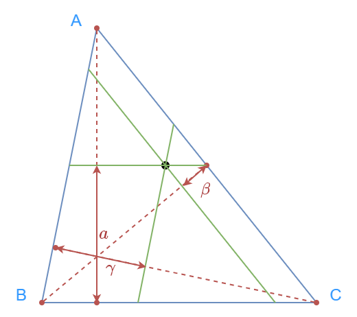
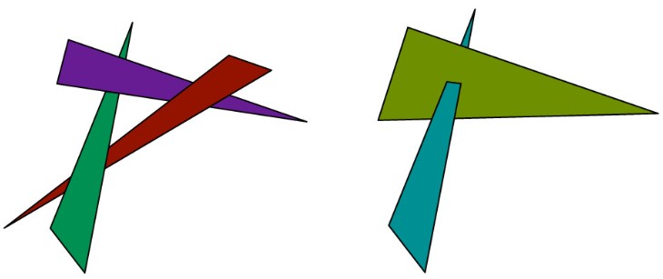

# Texture Mapping

## Barycentric Coordinates

Barycentric coordinate defines a linear interpolation over a triangle. Given corners $A, B, C$, the barycentric coordinates $(a, \beta, \gamma)$ defines any point within the triangle as 

$$aA + \beta B + \gamma C = (x,y), a,\beta,\gamma > 0, a + \beta + \gamma = 1$$

Geometrically, $\alpha, \beta, \gamma$ is the proportional projective distance of $(x, y)$ to the corners $A, B, C$. 

<figure markdown>
  {width="480"}
</figure>


Consider the orthogonal project from $P = (x, y)$ to line $\overline{AB}$, the distance of the projection is given by 

$$d_{AB}(P) = \frac{(A-B)\times (P - B)}{\|B-A\|} = \frac{|(x_B - x_A)(y_A - y) - (x_A - x)(y_B - y_A)|}{\sqrt{(x_A - x_B)^2 + (y_A - y_B)^2}}$$

Then, note that this projected normal lines on the projection normal from $C$ to $\overline{AB}$, and the proportional distance is 

$$\gamma = \frac{d_{AB}(P)}{d_{AB}(C)} = \frac{(x_B - x_A)(y_A - y) - (x_A - x)(y_B - y_A)}{(x_B - x_A)(y_A - y_C) - (x_A - x_C)(y_B - y_A)}$$

Similarly we can obtain $\alpha, \beta$, and note that if we already know 2 coefs, we can get the third from $a+\beta+\gamma=1$. 

Note that we can re-write the equation into homogeneous coordinates as 

$$\begin{pmatrix}x\\y\\1\end{pmatrix} = \begin{bmatrix}
x_A&x_B&x_C\\y_A&y_B&y_C\\1&1&1
\end{bmatrix}\begin{pmatrix}\alpha\\\beta\\\gamma\end{pmatrix} = M_{t}\begin{pmatrix}\alpha\\\beta\\\gamma\end{pmatrix}$$

where $x, y$ is the coordinates in the texture space. At the same time, the same point in the triangle exists in the screen space and we have that $[u, v, 1]^T = M_{s}[\alpha, \beta, \gamma]^T$. Therefore, we have 

$$\begin{bmatrix}u\\v\\1\end{bmatrix} = M_s M_t^{-1} \begin{bmatrix}x\\y\\1\end{bmatrix}$$

$M_s M_t^{-1}$ is the transformation from texture space to the screen space. 


## Texture Mapping

Note that texture is an image, when transfer from the screen space $(x, y)$ to the texture space $(u,v)$, $(u,v)$ doesn't necessarily fall into the pixel coordinate. Instead, consider the texture as a continuous function and we are sampling from it. 

The problem of texture mapping is that the perspective transformation brings depth distortion. Considering the vanishing line effect, one pixel away in the screen can be multiple pixels in the texture. Which means the sampling rate of the texture can be much higher than the screen's sampling rate

$$\Psi(x, y) = (u, v), \Psi(x+1, y) = (u + \partial_x u, v + \partial_x v), \Psi(x, y+1) = (u + \partial_y u, v + \partial_y v)$$

### Texture magnification
When the texture sampling rate is lower than screen, we need to interpolate $(u,v)$ from neighboring pixels. This is the same as image resizing. The most commonly used is bilinear, i.e. a linear weighted average of the closest 4 pixels. It can be done in 3 1D linear interpolations. Let $u_0 = \lfloor u \rfloor, v_0 =  \lfloor v \rfloor, u_1 =  \lceil u \rceil, v_1 = \lceil v \rceil, s = u - u_0, t = v - v_0$. Then we have 

\begin{align*}
a_0 &= (1-s)I(u_0, v_0) + sI(u_1, v_0)\\
a_1 &= (1-s)I(u_0, v_1) + sI(u_1, v_1)\\
I(u,v) &\approx (1-t)a_0 + ta_1
\end{align*}

``` glsl title="binear interpolation"
vec3 mix2(float u, float v, Texture tex)
{

  float u0 = floor(u); float u1 = ceil(u);
  float v0 = floor(v); float v1 = ceil(v);
  float s = u - u0;
  float t = v - v0;
  // mix(a, b, c) = (1 - a) * b + a * c
  return mix(t,
    mix(s, tex(u0, v0), tex(u1, v0)),
    mix(s, tex(u0, v1), tex(u1, v1)),
  );
}
```


### Mipmap Texture minification
From sampling theory we know that per-blurring is a good antialiasing strategy. However, the texture sampling rate varies within the same screen space due to perspective views. Therefore, we need different sampling rate for textures mapped to different places. 

Mipmap's idea is to store different levels of filtered images, and we determine which level to use by a given UV rate. For each level, we downsample the texture to $H/2, W/2$. Therefore, the total memory requirements is at most $\sum_0^\infty \frac{1}{4^i} = 4/3$. 

To compute which level of mipmap to use at $(u,v)$, note that we have 

$$\Psi(x, y) = (u, v), \Psi(x+1, y) = (u + \partial_x u, v + \partial_x v), \Psi(x, y+1) = (u + \partial_y u, v + \partial_y v)$$

Basically, we can estimate the footprint by estimating the Jacobian and compute the level $D$ 

\begin{align*}
\partial_x u &= u(x+1, y) - u(x, y), \partial_y u = u(x, y+1) - u(x, y)\\
\partial_x v &= v(x+1, y) - v(x, y), \partial_y v = v(x, y+1) - v(x, y)\\
L &= \max(\|\partial_xu + \partial_xv\|, \|\partial_yu + \partial_yv\|)\\
D &= \log_2 L
\end{align*}

Then, we can use bilinear interpolation to sample from level $\text{round(D)}$, or average from level $\lfloor D\rfloor, \lceil D\rceil$ (Trilinear).


## Visibility

When we move from 2D to 3D, one issue to consider is the visibility, or depth. In the simplest case, we can sort each object (triangles essentially) from far to near, and then paint from back to front and at each time overwrite the frame buffer (__painter's algorithm__). The problem is that object-based depth order does not always exist. 


<figure markdown>
  {width="720"}
  <figcaption>Examples of painter's algorithm</figcaption>
</figure>


### Z-buffer

Store current minimum $z$-value for each sample position in an additional buffer (__z-buffer__), which is often a float/double array. 

```py title="z-buffer"
for tri in triangles:
  for x, y, z in tri.samples():
    if z < zbuffer[x, y]:
      framebuffer[x, y] = tri.color(x, y, z)
      zbuffer[x, y] = z
```

The running time for z-buffer based rasterization is linear to the number of triangles, and we can accelerate it by hierarchical data structure. Also, it can be well paralleled over samples. 

### Alpha-buffer for transparency
Z-buffer cannot well handle transparency because alpha-blending requires correct ordering. 

$$aC_{\text{front}} + (1-a)C_{\text{back}} \neq (1-a)C_{\text{front}} + aC_{\text{back}}$$

One solution is to draw things in two passes, i.e. draw opaque things using z-buffer first, and then color the partially transparent objects. Another solution is to use $\alpha$-buffer instead of z-buffer, i.e. a linked list of RGB-z-$\alpha$ at each pixel, and finally draw everything from front to end (stops at the first opaque pixel).
