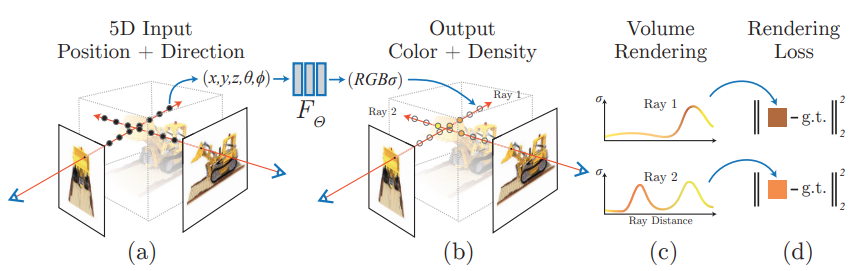
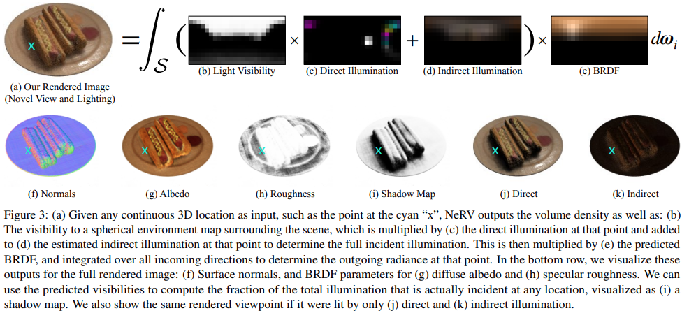
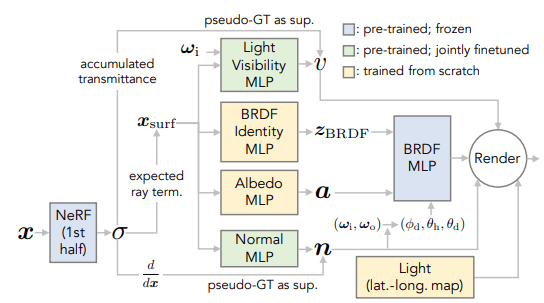

# Neural Radiance Fields

## Plenoptic Function
Consider some function to describe the set of all things that we can ever see (i.e. all the necessary inputs that will impact the seen color). The parameters are 

- $\theta, \phi$ the viewing directions
- $x_v, y_v, z_v$ the eye position
- $\lambda$ wavelength
- $t$ time

The estimation of the function is the image based rendering / novel view synthesis problem. One classical approach for modeling plenoptic function is Lightfield (1996), which take pictures from many views. The problems are 3D consistency and also assume that the ray shouting out from a pixel is never occluded. Thus only the plenoptic surface.

## NeRF
[NeRF: Representing Scenes as Neural Radiance Fields for View Synthesis](https://arxiv.org/abs/2003.08934)  
github: https://github.com/bmild/nerf  
website: https://www.matthewtancik.com/nerf

<figure markdown>
  {width="1080"}
</figure>

### NeRF Scene Representation
The representation can be seen as a funciton 

$$F_\Theta(\mathbf x, \mathbf d) \rightarrow (\mathbf c,\sigma)$$

 - __Input__ the 3D location $\mathbf x = (x, y, z)$ and 2D viewing direction $(\theta, \phi)$. In practice, we express the direction using $\mathbf d$, as a 3D Cartesian unit vector. 
 - __Output__  the color $\mathbf c =(R,G,B)$ and volume density $\sigma$. To help understand, the output can be imagined as `RGBA` value of a point $\mathbf x$ of a semi-transparent object, viewed from angle $\mathbf d$.

### MLP Architecture
 $\Theta$ is the set of parameters for MLP. The arch of the MLP is very simple: 8 fully connected layers to process $\mathbf x$ and outputs $\sigma$ and a $256$-dim feature vector, and then concat with $\mathbf d$, to through another fully-connected layer to produce $\mathbf c$. In this case, the volume density $\sigma$ open depends on position, and is not dependent on viewing angles. 

### Volume Rendering with Radiance Fields
For classical volume rendering, given a ray $\mathbf r(t) = \mathbf e + t\mathbf d$, the color of a ray is seen as an accumulation of colors near $t_n$ and far $t_f$ bounds, i.e. an integral 

$$C(\mathbf r) = \int_{t_n}^{t_f} T(t)\sigma(\mathbf r(t)) \mathbf c(\mathbf r(t), \mathbf d)dt, T(t) = \exp(-\int_{t_n}^t \sigma(\mathbf r(s))ds)$$

To compute this integral, numerically estimate it using quadrature. However, if we only estimate the value using discretized voxel grids (as previous approaches), the representation's resolution is limited, because the network won't learn our points. To account for the continuity, uniformally sampling each point from a evenly-spaced partition of $[t_n, t_f]$, i.e. 

$$t_i \sim \text{Unif}(t_n + \frac{i-1}{N}(t_f-t_n), t_n + \frac{i}{N}(t_f-t_n))$$

Then by Gaussian quadrature, we have the estimation

$$\hat{C}(\mathbf r) = \sum_{i=1}^N T_i (1 - e^{-\sigma_i (t_{i+1} - t_i)})\mathbf c_i, T_i = \exp(\sum_{j=0}^i -\sigma_i(t_{i+1}-t_i))$$

### High Frequency Encoding

> This is consistent with recent work by Rahaman et al., which shows that deep networks are biased towards learning lower frequency functions. They additionally show that mapping the inputs to a higher
dimensional space using high frequency functions before passing them to the
network enables better fitting of data that contains high frequency variation. 

Instead of directly inputting $(\mathbf x, \mathbf d)$, apply the encoding function 

$$\gamma: \mathbb R\rightarrow \mathbb R^{2L}, \gamma(p) = (\sin(2^0\pi p), \cos(2^0\pi p), ..., \sin(2^{L-1}\pi p), \cos(2^{L-1}\pi p))$$

Specifically, for $\mathbf x$, choose $L = 10$, for $\mathbf d$, choose $L=4$

### Hierarchical Volume Sampling
In the volume rendering function, we don't bother to sample many points on free space and occulated regions (low $\sigma$). Since the inaccuracy in those regions won't have much impact on the final color. Therefore, we can take an hierarchical approach. First, coarsely partition the ray into $N_c$ pieces, and compute the coarse color

$$\hat{C}_c(\mathbf r) = \sum_{i=1}^{N_c} w_i \mathbf c_i, w_i = T_i(1-\exp(-\sigma_i(t_{i+1}-t_i)))$$

Then, using the weights $w_i$'s, we can get a piecewise-constant PDF by normalizing $w_i$'s, and sample finer positions $N_f$ from the distribution using inverse tranform sampling, and compute $\hat C_f$ from the fine partition. 

In this way, we won't a very fine partition grid, but achieve similar results by focusing on important regions. 

### Implementation details

The input training data will be a set of images and their camera poses (from intrinsic parameters), and scene bounds. 

Assuming the camera models are perspective models, we can sample viewing rays for each image (and their respective camera models). For training, we have the sampled rays $\mathbf r$ abd ground truth color $C(\mathbf r)$, and the loss is defined as 

$$\mathcal L = \sum_{\mathbf r\in \mathbb R}\big(\|\hat C_c(\mathbf r) - C(\mathbf r)\|_2^2 + \|\hat C_f(\mathbf r) - C(\mathbf r)\|_2^2\big)$$

For inference (rendering), given the viewing pose and image plane, we need to cast rays for each pixel, do coarse and then fine partitions, samplings, and coloring, and finally collect the color of the pixel. 

With the density $\sigma$, we can also reconstruct meshes using marching cude algorithm. 

## Components of NeRF

A NeRF can be seen as 3 parts. 
- Volumetric rendering equations
- Fields (Embedders): how to represent the 3D space
- Sampling function: how to sample points along the ray. 

### Encodings

Intuitively, MLPs are differentiable and "over-smooths" high frequency features. Images typically have high frequency details and are not differentiable in local patches (edges). The idea is to transform the features into another space so that it can learn faster and preserves high frequency details. Existing approaches includes

- [Fourier features, positional encoding](https://bmild.github.io/fourfeat/index.html) The positional encoding used in original NeRF, also useful for other 2D/3D regression tasks. 
- [Hash encoding, instant-ngp](https://nvlabs.github.io/instant-ngp/) A multi-res hash encoding. An image is "continuous" in non-edge spaces. If we hash the image pixels, then the image becomes continuous in the neighboring spaces. The hash value will be learned by an MLP at the same time. Also, "multi-res" means that we store the features at different resolution and do trilinear interpolations when retrieve them. This provides faster training and inference. 
- [Spherical harmonics](https://alexyu.net/plenoctrees/) RGB is not continuous, but SH coefficients are. The MLP can predict SH coefficients instead RGB. Also, we benefits from SH as the function is analytic, simple to compute, and simplify the learning. 

### Fields Compression

In NeRF, the field is parameterized by a large MLP, which is expensive for inference. However, the space is not filled by object volume in most cases. Indeed, many space are often empty. The idea is to shrink the 3D space by different representations of fields. 

- Sparse voxel grid, works such as [NSVF](https://lingjie0206.github.io/papers/NSVF/) and [Plenoxels](https://alexyu.net/plenoxels/). The idea is to construct voxel grid on the space, the grid is "sparse" because we can skip empty voxels. 
- Lower rank representations such as [TensorRF](https://apchenstu.github.io/TensoRF/). Decompose the 4D tensor volume into lower-rank matrices and vectors. 
- A dictionary, or multi-res hash grid. [instant-ngp](https://nvlabs.github.io/instant-ngp/). Hashing with the hash key learned by the neural network. Multi-res allows to store features in different frequency. 

### Sampling

The considerations for sampling are 

 - __Aliasing__ Do we have enough samplings in some space, do we "skip" the important surfaces. 
 - __Speed__ Do we have redundant samplings in the empty space

In the original NeRF, the idea is to do coarse-to-fine sampling. Starting with uniform sampling, and then do another fine sampling by importance (via volume density $\sigma$). The problem is that it requires a very large number of point, hence very slow inference. 

Following up works start to use different field representations so that empty space are skipped (sparse voxels, occupancy grid checking in instant-ngp). 

Surface-based methods predict surface and only sample near the surfaces. 

For aliasing, [MipNeRF](https://jonbarron.info/mipnerf360/) samples from a cone instead of the original ray. Note that the sampling function is the same in MipNeRF, the idea is to use a integrated positional encoding so that features further away will have different sampling rate (mip as of mipmap). 

[MipNeRF-360](https://arxiv.org/pdf/2111.12077.pdf) further uses a proposal network (a tiny MLP) to learn (distilled model) the weights $w_i$. 

## Neural Sparse Voxel Fields
[Neural Sparse Voxel Fields](https://arxiv.org/pdf/2007.11571.pdf)  
github: https://github.com/facebookresearch/NSVF  
website: https://lingjie0206.github.io/papers/NSVF/

The largest limitation for NeRF is that NeRF is not efficient. According to the author of NSVF
 > Although NeRF performs
importance sampling along the ray, due to allocating fixed computational budget for every ray, it
cannot exploit this opportunity to improve rendering speed.

The main idea behind NSVF is to using bounding volume hierachy and sparse voxel octree to model a scene in sparse hierarchical structure for acceleration. 

### Voxel-bounded Implicit Fields
For a scene, assume that the scene are contained within a set of sparse voxels $\mathcal V = \{V_1,...,V_K\}$.  
For each point $\mathbf x$ and its viewing direction $\mathbf d$, we first find $i$ where $\mathbf x\in V_i$, then 

$$F_\Theta(\mathbf x, \mathbf d) = F_{\theta}^i (g_i(\mathbf x), \mathbf d)$$ 

where each $g_i$ is defined as  

$$g_i(\mathbf x) = \zeta\circ \chi \circ \tilde g_i\circ p (\mathbf x)$$

 - $p(\mathbf x) = (v_1, v_2, ..., v_8)$ find the 8 vertices of $V_i$
 - $g_i$ are feature vectors stored at each vertex. 
 - $\chi$ is the triniliear interpolation to interpolate $\mathbf x$
 - $\zeta$ is the post-processing function, hence we use positional encoding as of NeRF.
 
And each $F^i_\theta$ is a MLP with shared parameters $\theta$

### Volume Rendering
Assuming that we have obtained the voxels, do ray-voxel intersections using AABB tree and then for each ray
 - if the ray hits some voxel, sample point only from the voxels by rejection sampling and accumalate color by volume rendering equation $\hat{C}(\mathbf r) = \sum_{i=1}^N T_i (1 - e^{-\sigma_i (t_{i+1} - t_i)})\mathbf c_i$
 where $\mathbf c_i$ is obtained from Voxel-bounded Implicit Fields
- if the ray does not hit, then add an additional transparency term $\alpha(\mathbf r) = \exp{\sum_{i=1}^N -\sigma_i (t_{i+1}-t_i)}$ abd learnable RGB bg color $\mathbf c_{bg} \in\mathbb R^3$, and the color of non-hit is $\alpha\mathbf c_{bg}$

### Learning
The loss function is defined as of NeRF, plus an additional transparency loss 

$$\mathcal L = \mathcal L_{\mathbf c} + \lambda \Omega(\alpha(\mathbf r))$$

where $\Omega$ is the beta-distribution regularization. 

For the voxel, initialize the bounding box that roughly encloses the scene, and then during the training, periodically prune $V_i$ if 

$$\min(\exp(-\sigma(\mathbf x_j))) > \gamma, \mathbf x_j \in V_i$$ 

where $\mathbf x_j$ is uniformaly sampled in $V_i$ ($16^3$ samples in the paper), and $\gamma$ is a threshold ($0.5$ in the paper). 

After certain steps of training, reduce the ray-marching step size (partition length) and voxel side-length (by half in the paper). The voxel representations on the newly created vertices will be tri-linear interpolation. 

## NeRV: Neural Reflectance and Visibility Fields for Relighting and View Synthesis

Page (https://pratulsrinivasan.github.io/nerv/)  
paper(https://pratulsrinivasan.github.io/nerv/)

<figure markdown>
  {width="1080"}
</figure>

### Light Model

In the original NeRF model, we only consider the radiance, or the light emitted at $x$ from direction $d$, denote it as $L_e(\mathbf x, \mathbf d_0)$. In NeRV, we replace this term with the standard reflectance light $L_r(\mathbf x, \mathbf d_0)$, which considers the light from all directions

$$L_r(\mathbf x, \mathbf d_0) = \int_S L_i(\mathbf x, \mathbf d_i) R(\mathbf x, \mathbf d_i, \mathbf d_0)d\mathbf d_i$$

where $L_i$ is the incoming radiance and $R$ is the refleactance or transforming term. Practically, $L_i$ is implemented as direction and indirect (one bounce) illunimnations and $R$ is implemented using standard microfacet BRDF. 

### Nerual Reflectance Fields for R
The idea is to use two networks,  
A shape MLP function $\text{MLP}_s: \mathbf x\rightarrow \sigma$ to capture the surface, and then $\nabla_\mathbf x \text{MLP}_s$ will be the normal of the surface. Optionally, we can fine tune the normals with another MLP.     
A reflactance MLP function $\text{MLP}_r:\mathbf x \rightarrow (\mathbf a, \gamma)$ to be albedo color and roughness, which are the parameters to microfacet BRDF. 

### Light Transport for L

$L_i = L_e + L_r$ can be decomposed into the direct (light directly from environment) and indirect (ilght reflected from other surfaces/objects and the shadow). 

For direct light, we consider 

$$L_e(\mathbf x, \mathbf d_i) = V(\mathbf x, \mathbf d_i) E(\mathbf x, -\mathbf d_i)$$

where $V$ is the light visibility, which is approximated by a MLP (similar to $\sigma$ term in the original NeRF). and $E$ is the environment light map, which is an spherical (hemi-spherical) light map. 

For indirect light, due to computation limit, we only consider the first bounce, and encode it as the indirect light map and shadow map. 

### Limitations

Lots of parameters to be estimated by MLPs, much more intensive MLP computations and very expensive integrals (discretized to the light maps, a good approximation need at least 128 direction). 

Microfacet BRDF has very limited expressive power. Also, the approximation is not very good. The object loses plenty of the fidelity. 

### NeRFactor
NeRFactor: Neural Factorization of Shape and Reflectance Under an Unknown Illumination  
Page (https://xiuming.info/projects/nerfactor/)  
Paper (https://arxiv.org/pdf/2106.01970.pdf)

The idea and light modelling is similar to NeRV. but NeRFactor provides a more feasible training and evaluating pipeline. Also, replace the Microfacet BRDF with a data-driven MERL-BRDF model, adding much better expressive power. 

<figure markdown>
  {width="720"}
</figure>

Change plenoptic function from viewing centered to object centered (object emits light instead of eye receiving light) and simplify the problem to 5D (remove wavelength and time). Intuitively, a NeRF can be discretized as a 3D grid, and at each grid location, we have a sphere of colors.  

Relations with some other works

 - MVS: multi-view stereo aims to recover the surface mesh based on physics based rendering, hence struggle on thin, amorphous, and shiny objects. 
 - analysis by synthesis: [A Theory of Shape by Space Carving (2000) by Kutulakos](https://www.cs.toronto.edu/~kyros/pubs/00.ijcv.carve.pdf) use calibrated images to "carve" the volume and form the final shape. However, the non-differentiable and handmade way are limited. 
