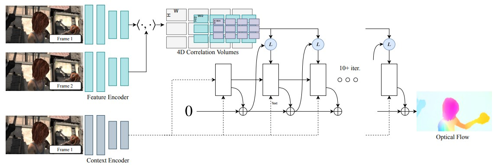

# Supervised Correspondence 

Given a pair of image $I_1, I_2$, optical flow is a dense displacement map $\mathbf f$ from $I_1$ to $I_2$ over time $\Delta t$. For each pixel $(u_1, v_1)$ in image 1 and its corresponding pixel $(u_2, v_2)$ in image 2. We have $I_1((u_1, v_1) + \mathbf f(u_1, v_1)) = I_2(u_2, v_2)$. Optical flow provides a strong perceptual cue for motion. 

Consider the optical flow map as a 2D field. We can treat it as an energy optimization problem. On one side, we have possible correspondence across two images, found by the similarities in their features. On the other side, the flow should be a continuous field on the pixel locations.  

## Direct supervision 
Early learned-based attempts ([FlowNet series](https://arxiv.org/abs/1504.06852)) uses CNN to predict the optical flow, the input is a pair of images and the supervision is the GT optical flow. FlowNet introduces the correlation between two patches centered at $\mathbf x_1$ in image 1 and centered at $\mathbf x_2$ in image 2 as 

$$corr(\mathbf x_1, \mathbf x_2) = \sum_{\mathbf d\in [-k, k] \times [-k, k]} \mathbf g_1(\mathbf x_1 + \mathbf d) \cdot  \mathbf g_2(\mathbf x_2 + \mathbf d)$$

where $k$ is the half patch size and $\mathbf g$ is the feature extractor. If we compute correlation for all pair of pixels in image 1 and image 2, then the computation and backprop is intractable. Thus, the correlation is only computed for pixels that is within the a search radius $D$.   

Later works often adapting an iterative refinement using coarse-to-fine pyramids ([PWC-Net series](https://arxiv.org/abs/1809.05571)) to speedup and improve search radius. 

The issue with all existing approach is that the direct supervision is not effective, or hard for the network to learn. Another issue for optical flow prediction works is the data. Only synthetic data can have 100% accurate GT labels. This causes issue for synthetic to real generalization. 

## Recurrent All-pairs Field Transformation (RAFT)

[RAFT: Recurrent All-Pairs Field Transforms for Optical Flow](https://arxiv.org/pdf/2003.12039.pdf)

The input for RAFT is a pair of image, the output is optical flow from image 1 to image 2. 

RAFT combines all previous successes, and uses an iterative update strategy, and becomes the "end paper" for optical flow problems. 

### Feature Extraction

The first step is to extract image features $\mathbf g_\theta$ from $I_1$ and $I_2$ using CNN, which is similar to other networks. In addition, RAFT use a context network $h$ that only extract features from $I_1$, $\mathbf h_\theta$ has the same architecture as $\mathbf g_\theta$

### 4D Correlation Volumes

The correlation is a $H\times W\times H\times W$ 4D volume that describes the correlation for each pixel feature $\mathbf g_1(u, v)$ in image 1 and each $\mathbf g_2(u,v)$ in image 2. In addition, RAFT adapts the coarse-to-fine pyramids approach, and average pooling the last two dimensions of correlation volume so that there are 4 4D correlation volumes. 

$$corr_0: HWHW, corr_1: HW\frac{H}{2}\frac{W}{2}, corr_2: HW\frac{H}{4}\frac{W}{4}, corr_3: HW\frac{H}{8}\frac{W}{8}$$

The first two dimension (image 1) preserves high res information, and pyramid (image 2) allows for a large search radius. 

This correlation volume will only be constructed once at the beginning. During the training, we query between the pixel in image 1 and all pixels in image 2 that is within a search radius to the estimated correspondence. Also, we query all the pyramids so that the search radius is larger. Because the correlation volume is not constructed during the run, it's efficient enough.

### :star: Iterative Updates :star:
The core idea behind RAFT is the iterative updates. Instead of directly predicting the flow, RAFT estimates a sequence of flow $\{\mathbf f_1, ..., \mathbf f_M\}$ from $\mathbf f_0 = \mathbf 0$. For each iteration, the network predicts an update direction $\Delta \mathbf f$ so that $\mathbf f_{k+1} = \Delta f + \mathbf f_k$. The supervision is added to the full sequence of predictions with exponentially increasing weights. 

$$\mathcal L = \sum_{i=1}^N \gamma^{N-i}\| \mathbf f_{gt} - \mathbf{f}_i\|_1$$

### Generalizations
In general, RAFT transfers well from synthetic datasets to real-world. 

- The feature extractor is pre-trained on all other image tasks. Also the correlation lookup table is independent of the underlying RGB texture (already found by other existing works). 
- Output the residual instead of predicting the final flow. Decompose one movement to multiple steps, so that the learning task is easier. 
- "Learning to update", or similar to optimization algorithms, take small steps to approach the target. 

## DROID-SLAM

[DROID-SLAM: Deep Visual SLAM for Monocular, Stereo, and RGB-D Cameras](https://arxiv.org/pdf/2108.10869.pdf)

Input a sequence of images, for each image $I_t$ outputs camera pose $P_t$ and disparity/depth $d_t$. Applying the similar idea from optical flow to SLAM tasks. 

For SLAM tasks, we need to maintain a frame-graph where vertices are images $I_1, I_2, ...$ and edges $(i,j)$ means that $I_i$ and $I_j$ have overlapping. For $I_i$, we need to lookup the correlation for all images that $I_i$ is connected with.

The iterative updates happen on poses and depth, note that for camera poses, the rotation is through matrix exponentials (standard way for differentialize SE3). 

The training is based on GT camera poses and GT depth maps. The supervision includes a pose loss 

$$\mathcal L_{pose} = \sum_{k=1}^N\sum_i \|\log_{SE3}(P_{GT}^{-1} P_{i, k})\|_2$$

and a correspondence loss similar to RAFT, which we induces optical flow from poses and depth. 