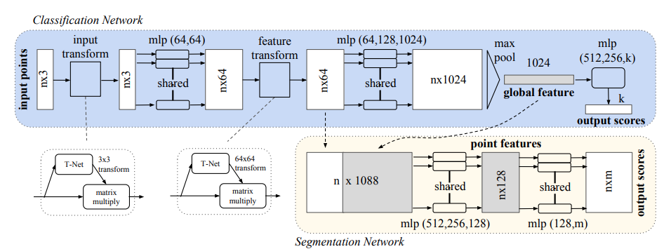
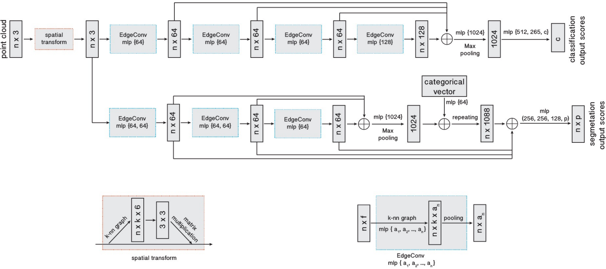

# Deep Learning for 3D Point Clouds


[PointNet: Deep Learning on Point Sets for 3D Classification and Segmentation[Qi, Su, Mo, et al 2017]](https://arxiv.org/pdf/1612.00593.pdf)  
github (author): https://github.com/charlesq34/pointnet  
github (pytorch implementation): https://github.com/fxia22/pointnet.pytorch



## Point cloud
A point cloud is a set of 3D points $P = \{P_i:i=1, ..., n\}$, where each $P_i = (x_i, y_i, z_i)$ and sometimes extra feature channels like color, normal, etc. The point cloud can often obtained from LIDAR or other 3D scannings. Compare to other object representations (volumetric), it's simple and "raw". 

### Properties of Point Sets
- __Unordered (Permutation Invariance)__ The order of the set should not change the target output.  
- __Interaction among points__ it is a "cloud", which means the points should not be isolated, and neighboring points should form a meaning subset. 
- __Invariance under transformation__ A point cloud is a geometric object, the learned representation of the point set should be invariant to certain transformations, for example, rigid transformation over the whole point cloud should not change the output. 

## PointNet


### Permutation Invariance: Symmetry Functions
A function is symmetric if the permutation of the input does not change the output. For example, $+, *, \max$. This is important for solving the undered property. 

The idea is to approximate some general function $f$ defined on a point set by applying a symmetric function on transformed points in the set:

\begin{align*}
f(\{p_1,...,p_n\})&\approx g(h(p_1),...h(x_n))\\
f&:2^{\mathbb R^N}\rightarrow \mathbb R, \\
h&:\mathbb R^N\rightarrow \mathbb R^K, \\
g&: (\mathbb R^k)^n\rightarrow \mathbb R \text{ symmetric}
\end{align*}

By experiment, $h$ is approximated by a network and $g$ by a composition of a single variable function and a max pooling function.

### Transformation Invariance: Joint Alignment Network

The paper uses [Spatial Transformer Networks[Jaderberg, Simonyan, Zisserman 2015]](https://arxiv.org/pdf/1506.02025.pdf) (T-net in PointNet paper). Compare to the original STN, which works on 2D images through sampling and interpolation, T-net predicts an affine transformation matrix, and we can use such matrix to transform point cloud coordinates.

T-net is also extended to the alignment of feature space. However, feature space has higher dimensions (64 in paper), hence hard to optimize, we need to add a regularization term to trianing loss. 

$$L_{reg} = \|I - AA^T\|_F^2$$

The T-net architecture is described in the paper's supplementary
> The first transformation network is a mini-PointNet that takes raw point cloud as input and regresses to a 3 × 3
matrix. It’s composed of a shared MLP(64, 128, 1024)
network (with layer output sizes 64, 128, 1024) on each
point, a max pooling across points and two fully connected
layers with output sizes 512, 256. The output matrix is
initialized as an identity matrix. All layers, except the last
one, include ReLU and batch normalization. The second
transformation network has the same architecture as the first
one except that the output is a 64 × 64 matrix. The matrix
is also initialized as an identity. A regularization loss (with
weight 0.001) is added to the softmax classification loss to
make the matrix close to orthogonal.  


```python
import torch
import torch.nn as nn
import torch.nn.functional as F

class TNet(nn.Module):
    
    def __init__(self, input_dim, output_dim):
        super(TNet, self).__init__()
        self.output_dim = output_dim

        self.conv_1 = nn.Conv1d(input_dim, 64, 1)
        self.conv_2 = nn.Conv1d(64, 128, 1)
        self.conv_3 = nn.Conv1d(128, 1024, 1)

        self.bn_1 = nn.BatchNorm1d(64)
        self.bn_2 = nn.BatchNorm1d(128)
        self.bn_3 = nn.BatchNorm1d(1024)
        self.bn_4 = nn.BatchNorm1d(512)
        self.bn_5 = nn.BatchNorm1d(256)

        self.fc_1 = nn.Linear(1024, 512)
        self.fc_2 = nn.Linear(512, 256)
        self.fc_3 = nn.Linear(256, self.output_dim*self.output_dim)
        
    def forward(self, x: torch.Tensor):
        n = x.shape[1]
        x = x.transpose(2,1)
        
        x = F.relu(self.bn_1(self.conv_1(x)))
        x = F.relu(self.bn_2(self.conv_2(x)))
        x = F.relu(self.bn_3(self.conv_3(x)))

        x = nn.MaxPool1d(n)(x)
        x = x.view(-1, 1024)

        x = F.relu(self.bn_4(self.fc_1(x)))
        x = F.relu(self.bn_5(self.fc_2(x)))
        x = self.fc_3(x)

        I = torch.eye(self.output_dim)
        if torch.cuda.is_available():
            I = I.cuda()
        return x.view(-1, self.output_dim, self.output_dim) + I
```


```python
class FeatureExtractor(nn.Module):
    def __init__(self, input_dim, local=False):
        super(FeatureExtractor, self).__init__()
        self.local = local
        self.input_transform = TNet(input_dim=input_dim, output_dim=input_dim)
        self.feature_transform = TNet(input_dim=64, output_dim=64)

        self.conv_1 = nn.Conv1d(input_dim, 64, 1)
        self.conv_2 = nn.Conv1d(64, 64, 1)
        self.conv_3 = nn.Conv1d(64, 64, 1)
        self.conv_4 = nn.Conv1d(64, 128, 1)
        self.conv_5 = nn.Conv1d(128, 1024, 1)

        self.bn_1 = nn.BatchNorm1d(64)
        self.bn_2 = nn.BatchNorm1d(64)
        self.bn_3 = nn.BatchNorm1d(64)
        self.bn_4 = nn.BatchNorm1d(128)
        self.bn_5 = nn.BatchNorm1d(1024)

    def forward(self, x):
        n = x.shape[1]
        input_transform = self.input_transform(x)
        x = torch.bmm(x, input_transform)
        x = x.transpose(2, 1)
        x = F.relu(self.bn_1(self.conv_1(x)))
        x = F.relu(self.bn_2(self.conv_2(x)))
        x = x.transpose(2, 1)
        
        feature_transform = self.feature_transform(x)
        x = torch.bmm(x, feature_transform)
        local_point_features = x

        x = x.transpose(2, 1)
        x = F.relu(self.bn_3(self.conv_3(x)))
        x = F.relu(self.bn_4(self.conv_4(x)))
        x = F.relu(self.bn_5(self.conv_5(x)))
        x = nn.MaxPool1d(n)(x)
        x = x.view(-1, 1024)

        if self.local:
            x = x.view(-1, 1024, 1).repeat(1, 1, n)
            return torch.cat([x.transpose(2, 1), local_point_features], 2), feature_transform
        else:
            return x, feature_transform
```


```python
class PointNet_Classification(nn.Module):
    def __init__(self, num_classes, point_dim=3, dropout=.3):
        super(PointNet_Classification, self).__init__()
        self.feature_extract = FeatureExtractor(input_dim=point_dim, local=False)
        self.fc_1 = nn.Linear(1024, 512)
        self.fc_2 = nn.Linear(512, 256)
        self.fc_3 = nn.Linear(256, num_classes)

        self.bn_1 = nn.BatchNorm1d(512)
        self.bn_2 = nn.BatchNorm1d(256)

        self.dropout_1 = nn.Dropout(dropout)
        
    def forward(self, x):
        x, feature_transform = self.feature_extract(x)

        x = F.relu(self.bn_1(self.fc_1(x)))
        x = F.relu(self.bn_2(self.fc_2(x)))
        x = self.dropout_1(x)

        return F.log_softmax(self.fc_3(x), dim=1), feature_transform
    
class PointNet_Segmentation(nn.Module):
    
    def __init__(self, num_classes, point_dim=3):
        super(PointNet_Segmentation, self).__init__()
        
        self.feature_extract = FeatureExtractor(input_dim=point_dim, local=True)

        self.conv_1 = nn.Conv1d(1088, 512, 1)
        self.conv_2 = nn.Conv1d(512, 256, 1)
        self.conv_3 = nn.Conv1d(256, 128, 1)
        self.conv_4 = nn.Conv1d(128, num_classes, 1)

        self.bn_1 = nn.BatchNorm1d(512)
        self.bn_2 = nn.BatchNorm1d(256)
        self.bn_3 = nn.BatchNorm1d(128)

    def forward(self, x):
        x, feature_transform = self.feature_extract(x)

        x = x.transpose(2, 1)
        x = F.relu(self.bn_1(self.conv_1(x)))
        x = F.relu(self.bn_2(self.conv_2(x)))
        x = F.relu(self.bn_3(self.conv_3(x)))

        x = self.conv_4(x)
        x = x.transpose(2, 1)

        return F.log_softmax(x, dim=-1), feature_transform
```


```python
# num_classes = 5
model_cls = PointNet_Classification(5).cuda()
model_seg = PointNet_Segmentation(5).cuda()
# input: x: B * n * c
x = torch.rand(10, 60, 3).cuda()
# output: y: B * num_classes, A: B * 64 * 64
class_result, A_class = model_cls(x)
# output: y: B * n * num_classes, A: B * 64 * 64
seg_result, A_seg = model_seg(x)
```

## DGCNN
[Dynamic Graph CNN for Learning on Point Clouds](https://arxiv.org/pdf/1801.07829.pdf)  
github (author): https://github.com/WangYueFt/dgcnn



PointNet-like models treat points independently to maintain permutation invariance (Conv1D parallel on each point). However, such operations cannot capture local geometric structure. 

DGCNN follows the point net approach and uses point cloud input. On top of PointNet systems, it designs a new EdgeConv module. EdgeConv helps to capture local geometric features while maintain permutation invariance. 

### EdgeConv

The networks should input a point cloud $P = \{p_1,...,p_n\}$ of $n$ points, where each point $p_i\in\mathbb R^c$, typically $c=3$ representing the xyz coordinates. As in the pointnet system, each subsequenct layer computes some point-wise features in different dimensions, i.e. For , each layer $h_i$ accepts point embeds in some feature dimension $X_{i-1} = \{\mathbf x_{i-1,1},...,\mathbf x_{i-1,n}\} \subseteq \mathbb R^{c_{i-1}}$ and outputs in some new feature dimension $X_{i} = \{\mathbf x_{i,1},...,\mathbf x_{i,n}\} \subseteq \mathbb R^{c_{i}}$.

#### Edge Features
To capture local point structure, the simplest case is to construct a directed kNN graph $G = (V, E)$ so that each point can get some geometric information from its local neighbors. In order to get information from the point itself, the graph will include self-loop $(\mathbf x_i, \mathbf x_i)\in E$. On such graph $G$, we define __edge feature__ $\mathbf{e}_{ij} = h_\Theta(\mathbf x_i, \mathbf x_j)$ where $h_\Theta: \mathbb R^{c_0}\times \mathbb R^{c_0}\rightarrow \mathbb R^{c_1}$ is a nonlinear function with learnable parameters $\Theta$. 

Then, we need to aggregate such edge features to each point $\mathbf x_i$ in order to pass to next layer. Therefore, we have the EdgeConv module as 

$$\mathbf x_{i} = \mathbf ?_{j:(i,j)\in E} h_\Theta(\mathbf x_i, \mathbf x_j)$$

Note that this operation is similar to standard 2D convolution for images. For a $3\times 3$ 2D conv filter, it aggregates information from itself and 8 neighboring pixel points, i.e. a 9 near neighoring graph. 

#### Choices of functions

Note that if we choose $h_\Theta(\mathbf x_i, \mathbf x_j) = h_\Theta(\mathbf x_i)$, the graph actually constructs 1NN graph, and is exactly what PointNet did. 

Some of choices including Gaussian kernel convolution following the [PCNN: [Atzmon, Maron, & Lipman, 2018]](https://arxiv.org/pdf/1803.10091.pdf)

$$x_{im} = \sum_j h_\theta(x_j)g(d_{x_i. x_j})$$

Another choice is to only consider local information, i.e. $h_\Theta(\mathbf x_j - \mathbf x_i)$, while it loses global structure as for each point $h(\mathbf x_i, \mathbf x_i) = h(0)$ and loses global structure. 

Therefore, the paper proposes EdgeConv as 

$$h_\Theta (\mathbf x_i, \mathbf x_j) = \tilde{h_\theta}(\mathbf x_i, \mathbf x_j - \mathbf x_i)$$

more specifically, 

$$e_{ij_m} = \text{ReLU}(\theta_m \cdot (\mathbf x_j - \mathbf x_i) + \phi_m \mathbf x_i)$$

Finally, we need to aggregate them together, i.e. the choice of $\mathbf ?$, the paper uses channel-wise $\max$, i.e. 

$$\mathbf x_{im} = \max_{j:(i,j)\in E} e_{ij_m}$$

#### Properties of Point Cloud
In EdgeConv, $\max$ used in kNN and aggregration is a symmetric operation, and the module is permutation invariant. 

The operation is partially translation invariant, as the $\mathbf x_j - \mathbf x_i$ part is invariant to translation. 

For the $\mathbf x_i$ part, we can use a similar T-net structure in PointNet.  
(_Problems here since the author's TF implementation is not the same as mentioned in the paper [issue](https://github.com/WangYueFt/dgcnn/issues/16) , and the module is missing in pytorch implementation [issue](https://github.com/WangYueFt/dgcnn/issues/32)_)

### Dynamic Graph Update
Note that the kNN is applied on each feature space from each layer. As quoted by the authors, 
> Our experiments suggest that it is beneficial to recompute the graph
using nearest neighbors in the feature space produced by each layer.
This is a crucial distinction of our method from graph CNNs working
on a fixed input graph. Such a dynamic graph update is the reason
for the name of our architecture, the Dynamic Graph CNN (DGCNN).
With dynamic graph updates, the receptive field is as large as the
diameter of the point cloud, while being sparse.


```python
"""
The EdgeConv operation as implemented by the author
https://github.com/WangYueFt/dgcnn/blob/master/pytorch/model.py
"""

def knn(x, k):
    inner = -2*torch.matmul(x.transpose(2, 1), x)
    xx = torch.sum(x**2, dim=1, keepdim=True)
    pairwise_distance = -xx - inner - xx.transpose(2, 1)
 
    idx = pairwise_distance.topk(k=k, dim=-1)[1]   # (batch_size, num_points, k)
    return idx


def get_graph_feature(x, k=20, idx=None):
    batch_size = x.size(0)
    num_points = x.size(2)
    x = x.view(batch_size, -1, num_points)
    if idx is None:
        idx = knn(x, k=k)   # (batch_size, num_points, k)
    device = torch.device('cuda')

    idx_base = torch.arange(0, batch_size, device=device).view(-1, 1, 1)*num_points

    idx = idx + idx_base

    idx = idx.view(-1)
 
    _, num_dims, _ = x.size()

    x = x.transpose(2, 1).contiguous()   # (batch_size, num_points, num_dims)  -> (batch_size*num_points, num_dims) #   batch_size * num_points * k + range(0, batch_size*num_points)
    feature = x.view(batch_size*num_points, -1)[idx, :]
    feature = feature.view(batch_size, num_points, k, num_dims) 
    x = x.view(batch_size, num_points, 1, num_dims).repeat(1, 1, k, 1)
    
    feature = torch.cat((feature-x, x), dim=3).permute(0, 3, 1, 2).contiguous()
  
    return feature
```
