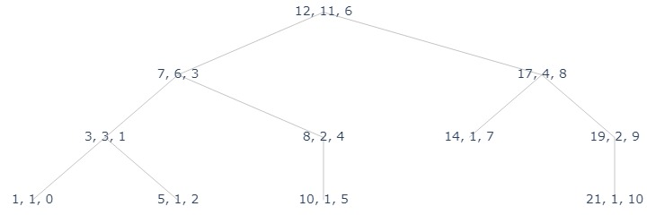

# [+] Augmented BST (AVL Tree)

Consider  our implementation of AVL tree, the height of a node is 

$$x.\text{height} = \max(x\text{.left.height}, x\text{.right.height}) + 1$$

Such property depends only on the property of the child nodes and takes constant time to accumulate. Thus, when insert or delete one node, we only need to make a bottom-up updates from the leaf to root. Taking at most $O(h)\in O(\log n)$ time. 

## Ordered Set with `rank`

### ADT: Ordered Set
Suppose that we want our set to supports finding the $k$th largest (or smallest) element, a.k.a. a ordered set.
Thus, we need to support the additional operations.

- `rank(A, x)`: return the rank of $x\in A$ where $rank = r$ IFF there are exactly $r-1$ elements of $A$ that is smaller than $x$. 
- `select(k)`: return the key of node $x$ where $rank(A, x) = k$. 

### `rank` and `size`
Think about BST's property, for each node `x`, we have that `x` is larger than all of its left subtree and its right subtree. Then, 

```py title="rank(x)" linenums="1"
if x is None:
     return 0
if x.parent is None:
    return size(x.left) + 1
if x is left child of x.parent:
    return rank(x.parent) - size(x.right) - 1
else:
    return rank(x.parent) + size(x.left) + 1
```

If we know the size of each node, we can retrieve `rank` is $O(h)$ time. 

Thus we can augment the AVL tree with field `size`, where 

$$size(\emptyset) = 0, size(x) = size(x\text{.left}) + size(\text{x.right}) + 1$$

Similar to height, it takes constant time and only depends on its child nodes. Thus, when we modify the data structure, we can upadte `size` in $O(h)$ time. 

### `select`
Then, we apply the same idea for select, 

```py title="select(node, k)" linenums="1"
left_size = node.left.size
if k == left_size + 1:
    return node
elif k < left_size + 1:
    return select(node.left, k)
else:
    return select(node.right, k - left_size)
```

for some node $x$, it is larger than its left subtree, thus at least larger than $size(x.\text{left})$. Then, if the wanted node is in the right subtree, we know it is at least the size of the left subtree plus the node. 


```python
from assets.AVL import *
from assets.plot_trees import plot_tree, construct_tree_nodes

def compute_size(node):
    if node is None:
        return 0
    node.size = compute_size(node.l) + compute_size(node.r) + 1
    return node.size

def rank(node):
    if node is None:
        return 0
    get_size = lambda node: 0 if node is None else node.size
    if node.parent is None:
        return get_size(node.l)
    if node.parent.l is node:
        return rank(node.parent) - get_size(node.r) - 1
    else:
        return rank(node.parent) + get_size(node.l) + 1
    
def select(node, k):
    left_size = node.l.size + 1 if node.l is not None else 1
    if left_size == k:
        return node.k
    elif left_size > k:
        return select(node.l, k)
    else:
        return select(node.r, k - left_size) 
```


```python
# a demonstration of BST
arr = [12, 3, 17, 1, 7, 14, 19, 5, 8, 10, 21]
root = AVL_insert(None, arr[0])
for x in arr[1:]:
    new_node = AVL_insert(root, x)
    
compute_size(root)

label_fn = lambda node: f"{node.k}, {node.size}, {rank(node)}"

plot_tree(
    construct_tree_nodes(root, label_fn, ['l', 'r']),
    "assets/avl_app_1.jpg"
)
# key, size, rank
```



```python
print([select(root, i) for i in range(1, len(arr) + 1)])
#>> [1, 3, 5, 7, 8, 10, 12, 14, 17, 19, 21]
```
