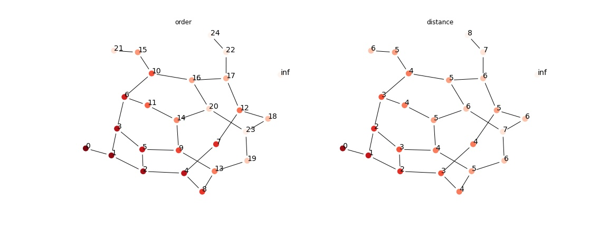

# Graphs: Breadth-first Search

## Graphs and Abstract Data Type
Mathmatically, a graph $G = (V, E)$ is a collection of vertices $v\in V$ and edges $(v_i, v_j) \in E$. If a graph is __undirected__, then $(v_i, v_j) = (v_j, v_i)$, if __directed__, then $(v_i, v_j) \neq (v_j, v_i)$. 

Two vertices $(v_i, v_j)$ are __neighbors__, or __adjacent__ if exists $(v_i, v_j) \in E$. 

The abstract data type for (undirected) graph is defined as 
- Object: A list of vertices $V$ and their associated values.
- Operations:
  - `vertices(G)` return a list of all vertices
  - `isadjacent(G, u, v)` given two vertices $u,v$, return whether they are adjacent.

### Implementation
Consider a graph of $G$ with $n = |V|, m = |E|$. 

Although we can store $V$ and $E$ as two lists, but this is obviously not efficient for `isadjacent`, which will take $O(m)$ time. In the case of an almost fully connected graph of $n$ vertices, $T(n, m) \in O(n^2)$.

Also, we have to store all vertices, thus `vertices`, regardless of implementation, is at least $\Omega(n)$

#### Adjacency Lists
- Object: for each vertice $u$, we store all vertices that is $u$'s neighbor as a list. 
- `isadjacent(G, u, v)` search for `v` in `u.neighbor`

The space complexity is $n + 2m$ since for each edge we store it twice in both vertices' neighbors. 

The time complexity for `isadjacent` is $\Omega(\min(m,n))$ since a vertex can have at most $\min(m,n-1)$ neighbors. However, if the vertices have some orderness, we can reduce the time complexity by sorting. (But takes longer to construct the adjacency lists). 

#### Adjacency Matrix
- Object: A $n\times n$ matrix of booleans, `E[i][j] = 1` if there's an edge between them, otherwise $0$. 
- `isadjacent(G, i, j)` return `G.E[i][j]`

The space complexity is $n^2$. The time complexity is $O(1)$. 


### Path and Distance
A __path__ between $u, w$ is a sequence of edges $p = ((u = v_0, v_1), (v_1, v_2), ..., (v_{k-1}, v_k = w))$ where $v_i$'s are distinct. Let the collection of all paths between $u, v$ be $\mathcal P(u,v)$.   
The __length__ is the number of edges $|P|$, which in this case is $k$.  
The __distance__ is defined as minimum number of edges among all paths between $u,v$ if exists such path, otherwise $\infty$. 

$$\delta(u, v) =\begin{cases}\min\{|P|: p\in \mathcal P(u,v)\}&\mathcal P(u,v)\neq \emptyset\\ 
0&u=v\\\infty&\mathcal P(u,v)= \emptyset\end{cases}$$

A graph is __connected__ if $\forall u, v\in V$, $\exists P(u,v)$. Otherwise __unconnected__. 


### Degree 
Define __degree__ to be the number of neighbours for some $v$, denote it as $d_v$. 

In adjacency list, `len(v.neighbors)`; in adjacency matrix, `sum(E[v])`. 

__Lemma 1 (handshake lemma)__ $\sum_v d_v = 2|E|$  
_proof_. each edge $(u,v)$ is counted twice on $u$ and $v$. 


```python
import igraph as ig
# create a example graph, and add one unreachable point
g = ig.Graph.Famous('Walther'); g.add_vertex()
layout = g.layout();
```

## Breadth-first Search

In many applications, we need to traverse a graph (of states, relationships, etc.) from a starting vertex to search for some targeted vertices, or obtain some graph properties (for example, [search for AI states](../csc384/usearch.md)). 

__BFS__ searches, from a starting vertex $s$, by visiting all of its neighbors, and then neighbors of neighbors. More formally, it searches all vertices with distance $1$ to $s$ first, and then $2, 3, 4,...$.

```python title="BFS(G, s)" linenums="1"
q = new Queue()
v.queued = False for v in G.V
q.enqueue(s)
s.queued = True
s.d = 0
while queue is not empty:
    v = q.dequeue()
    examine v
    for u in v.neighbors:
        if not u.queued:
            q.enqueue(u)
            u.queued = True
            u.d = v.d + 1
```

### Time Complexity
Note that from `queued` proerpty, we know that each $v$ will be enqueued at most once, and each edge from the enqueued is examined once. Thus, the total time complexity is in $O(n+m)$.

### Shortest Path
Note that we have defined $\delta(u,v)$ be the minimum number of edges among all possible paths between $u,v$. Thus, one of the functionality of `BFS` (and moreover [Dijkstra's for shortest path of all vertices pairs](../csc373/greedy_algorithm.md)) is to find the shortest path between starting vertex $s$ to any vertex. In order to do so, we only need to add a new field `parent`, which initially set as `None`, and update it when we enqueue the vertex (similar to how we update distance). 

Then, we have to show some properties with the shorted path, and then we can show that the found path from BFS is actually the shortest path. 

__Lemma 2__ For $G=(V,E)$, let $s\in V$ be some arbitrary vertex. Then, for any edge $(u,v)\in E$, $\delta(s,v) \leq \delta(s,u)+1$   
_proof_. Denote the path between $s, u$ as $P(s,u)$ and assume that it is a shortest path. If $(u,v) \in P(s,u)$, then since path does not have cycle, then $P(s,u) = P(s, v) , (v, u)$, thus $\delta(s, v) \leq \delta(s, u) - 1$. If $(u,v) \not\in P(s,u)$, then there at least exists $P(s, v) = P(s, u), (u, v)$, thus $\delta(s, v) \leq \delta(s, u) + 1$.

__Lemma 3__ Upon the termination of `BFS(G, s)` given the source vertex $s\in V$, we have that $\forall v\in V. v.d \geq \delta(s, v)$.   
_proof_. We will prove the loop invariant on each `enqueue` operation, since each `enqueue` follows a distance update.   
First note that we start with $s.d = 0 = \delta(s, s)$.  
Then, consider the distance updates, $v.d = u.d + 1$, by induction hypothesis we know that  $u.d \geq \delta(s, u)$. Also, since $v$ is a neighbor of $u$, from lemma 2, $\delta(s, v) \leq \delta(s, u) + 1$. Thus

$$v.d = u.d + 1 \geq \delta(s,u)+ 1\geq \delta(s,v)$$

For the unvisited vertices, we have that $v.d = \infty \geq \delta(s,v)$

### Correctedness

__Lemma 4__ For any time in the execution of `BFS(G, s)`, the queue $q = (v_0, v_1, ..., v_r)$ always holds for that 

$$v_r.d \leq v_1.d+1, v_i.d \leq v_{i+1}.d$$

_proof_. We will prove the loop invariance on each `enqueue` operation.  
At first, $q = (s)$ obviously holds for the claim.  
Then, consider each `enqueue` in the `while` loop in `line 11`, consider the state of queue before the `dequeue` in `line 7` to be $(v_0, v_1, ..., v_r)$ and the claimed property holds. After the `dequeue`, we have the queue become $(v_1, ..., v_r)$, then consider each `enqueue` on `line 11`, for each enqueued vertex $u$, from induction hypothesis, we have that that $u.d = v_0.d + 1 \geq v_r.d$ and $u.d = v_0.d + 1 \leq v_1.d + 1$. 

__Corollary 5__ For vertices $v_i, v_j \in V$, if $v_i$ is enqueued before $v_j$, then $v_i.d \leq v_j.d$.  
_proof_. Trivial from lemma 4. 

__Claim 6 (BFS Correctedness)__ Let $G=(V,E)$ be a undirected, connected graph, and `BFS(G, s)` runs from $s\in V$. Then, during the execution, 
1. Upon termination $v.d = \delta(s, v)$. 
2. BFS discovers all vertex $v\in V$ reachable from $s$


_proof_. We will prove 1. using contradiction on minimum. First assume that some vertex $v$ be the vertex with minimum $\delta(s,v)$ s.t. $v.d \neq \delta(s, v)$. By lemma 3 and this assumption we have that $v.d > \delta (s,v)$ and $v$ is reachable from $s$. Let $u$ be the vertex immediately preceeding $v$ on a shortest path from $s$ to $v$ so that $\delta(s,v) = \delta(s,u)+1$. Because $\delta(s,u) < \delta(s,v)$, we must have that $u.d = \delta(s,u)$. Now, 

$$v.d > \delta(s,v) = \delta(s.u) + 1 = u.d + 1$$

However, consider BFS algorithm. At the time we `dequeue` $u$, there are 3 possible states for $v$. 
- `v.queued = FALSE` and is not in queue yet, then we `enqueue(v)`, resulting $v.d = u.d + 1$.
- `v.queued = FALSE` and is in queue, then by lemma 4 we have that $v.d \leq u.d + 1$.
- `v.queued = TRUE`, then by corollary 5, we have that $v.d \leq u.d$.
In all cases, we have the contradiction. 

By 1. We have 2. Otherwise $v.d = \infty > \delta(s, v)$


```python
from assets.graph_search import traversal_order, BFS, plot_graph
traversal_order(BFS, g, 0)
plot_graph(g, ['order', 'distance'], layout, "assets/bfs_1.jpg")
```



    

