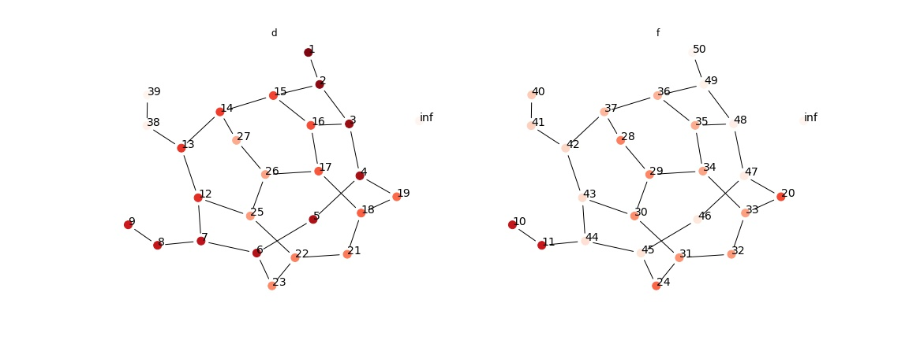
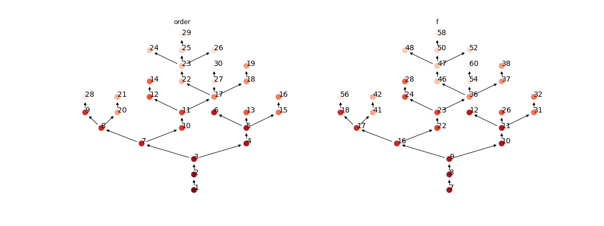

# Graphs: Depth-first Search

## Depth-First Search
Consider a undirected graph $G=(V,E)$ with $|V|=n, |E|=m$

The strategy for DFS is to go as "deeper" as possible. Similar to BFS, we start with all vertices being undiscovered; then we "discover" it when we first encounter it from some vertex's neighborhood; finally, we finish processing a vertex when we finish processing all of its neighbors. Thus, this suggested a recursive algorithm. 

We also use a timestamp to record the time when a vertex is discovered as `v.d`, and when it is finished as `v.f`. We will explore its uses later in DFS properties. 

```py title="DFS(G)" linenums="1"
for u in G.V:
    u.state = undiscovered
time = 0
for u in G.V:
    if u.state == undiscovered:
        DFS_visit(G, u)
```

```py title="DFS_visit(G, u)" linenums="1"
time += 1
u.d = time
u.state = discovered
for v in u.neighbors:
    if v.state == undiscovered:
        DFS_visit(G, v)
u.state = FINISHED
time += 1
u.f = time
```

__Lemma 1__ After the execution of `DFS`, for $v\in V$, $1 \leq v.d < v.f \leq 2n$.  
_proof_. The bound $[1, 2n]$ is trivial. Since timestamp only increment when we discover and finish one vertex. Thus, there are at most $n$ vertices to visit, and we visit each vertex exactly once. Also, note that time cannot decrease, and by `DFS_visit line 8`, we must have $v.d < v.f$. 

### Time Complexity
Note that `DFS_visit` is called on each `undiscovered` vertex exactly once, and in each `DFS_visit`, we loop through all of its neighbors once. Thus, the time complexity is $O(n+m)$

### Depth First Trees and Depth First Forests
Consider the DFS algorithm, for each recursive call on `DFS_visit` on `line 4-6`. we add an edge $(u,v)$. Thus, we have a new graph $G'=(V,E')$. Note that on each search path, we won't go further if the point is already discovered. Therefore, the graph is acyclic, thus it is a forest consisting one or more trees. Calling $G'$ __depth first forest_; and the trees within $G' = \{T_1,..., T_k\}$ be the __depth first trees__. 

### Parenthsis Theorem
__Theorem 1__ For any two vertices $u,v$ we have one of the following conditions
- $[u.d, u.f] \cap [v.d, v.f] = \emptyset$, and they are not a descendant of each other in $G'$. 
- $[u.d, u.f] \subset [v.d, v.f]$, and $u$ is a descendant of $v$ in some depth fisrt tree $T_i$.

_proof_.  WLOG we assume that $u.d < v.d$, then by lemma 1, we have two cases.    
$v.d < u.f$, so $v$ was discovered while $u$ haven't finished, which implies that $v$ is a descendant of $u$. Moreover, $v$ must finishes earlier than $u$, otherwise the call stacks won't return.  
$u.f < v.d$, then the intervals are disjoint, and $u$ must finish exploration before discovering $v$, thus they are not a descendant of each other. 

__Corollary 2__ If $v$ is $u$'s proper descendant, then $u.d < v.d < v.f <u.f$

### White Path Theorem

__Theorem 3__ In a depth first forest $G'$, $v$ is a descendant of $u$ IFF at the time $u.d$ that the search discovers $u$, there is a path from $u$ to $v$ consisting entirely of undiscoverted vertices.

_proof_. $\Rightarrow$. If $v=u$, then the path contains only $u$, and it's undiscoverted. Overwise, by corollary 2, $u.d < v.d$ so that $v$ is undiscovered yet. 

$\Leftarrow$, consider any path between $u, v$ formed by undiscovered vertices, and $v$ does not become a descendant in $G'$ yet. WLOG assume that every vertex other than $v$ along the path becomes a descendant of $u$. Let $w$ be the predecessor of $v$ in the path so that #w$ is a descendant of $u$. By corollary 2m $w.f \leq u.f$. Because $v$ must be discovered after $u$ is discoverted but before $w$ finishes, we have that $u.d < v.d < w.f \leq u.f$, while $v.f \leq w.f$. Thus, $[v.d, v.f] \subset [u.d, u.f]$, it is a desendant of $u$. 


```python
import igraph as ig
# create a example graph, and add one unreachable point
g = ig.Graph.Famous('Walther'); g.add_vertex()
layout = g.layout();

from assets.graph_search import traversal_order, DFS, plot_graph, topological_sort
traversal_order(DFS, g, 0)
plot_graph(g, ['d', 'f'], layout, "assets/dfs_1.jpg")
```

<figure markdown>
  {width="1080"}
</figure>


## [+] Topological Sort

Note that both BFS and DFS works the same on directed graph (only need to modify `neighbors` to all outwards edges). 

Now, consider a directed acyclic graph (dag), a __topological sort__ of a dag is a linear ordering of all vertices s.t. if $G$ contains an edge $(u,v)$, then $u$ appears before $v$ in the ordering. 

Then, note that DFS iterates through all vertices exactly once, and we have the algorithm for togological sort

```py title="topological_sort(G)" linenums="1"
# precondition: G is a dag
L = linked_list()
call DFS(G)
for each vertex is finishes, prepend it into L
return L
```
Obviously, `topological_sort` runs in $\Theta(V+E)$ as `DFS` does. 

### Correctedness

__Lemma 4__ A directed graph $G$ is acyclic IFF `DFS(G)` yields no back edges.   
_proof_. $\Leftarrow$ Suppose DFS has a back edge. Then $v$ is an ancestor of $u$ in $G'$. Thus, $G$ contains a path from $v$ to $u$, and we have a cycle $u\rightsquigarrow v \rightarrow u$. 
$\Rightarrow$ suppose $G$ contians a cycle $C$. Let $v$ be the first vertex to be discovered in $c$, and $(u,v)$ be the preceding edge in $c$. At time $v.d$, the vertices of $c$ from a path of undiscovered vertices from $v$ to $u$. By claim 3, $u$ is a descendant of $v$ in $G'$. Thus, $(u,v)$ is a back edge.

__Theorem 5__ `topological_sort(G)` produces a topological sort given a dag $G$.  

_proof_. Note that the order of vertices in $L$ is determined by $v.f$. Thus, we only need to show that for any pair of $u,v\in V, u\neq v$, if $(u,v)\in E$, then $v.f < u.f$. 

Consider any edge $(u,v)$ explored by DFS. When this edge is explored, $v$ cannot be discovered but not finished, since then it will produce a back edge, contradicting lemma 4. Therefore, $v$ is either undiscovered or already finished. If $v$ is white, then it becomes a descendant of $u$ and $v.f < u.f$. If $v$ is finished, so that $v.f$ has already been set. But we are still iterating through $u$'s neighbor. Thus, $v.f < u.f$. 


```python
import igraph as ig
# create a example graph, and add one unreachable point
g = ig.Graph.Tree_Game(30, directed=True); 
layout = g.layout("tree");

from assets.graph_search import traversal_order, DFS, plot_graph, topological_sort
topological_sort(g)
plot_graph(g, ['order', 'f'], layout, "assets/dfs_2.jpg")
```

<figure markdown>
  {width="1080"}
</figure>


## Circle Detection

A corollary of lemma 4 is that during DFS, if we find a back edge, then it contains a cycle. Note that this proof also applies to undirected graph, if we think of each undirected edge as two directed edge. 

Thus, we have the modified `DFS_visit` for detecting cycle that contains $u$.

```py title="DFS_visit_undirected(G, u)" linenums="1"
    # ...
    for v in u.neighbors:
        if v.state == undiscovered:
            u.parent = v
            DFS_visit(G, v)
        # u is discovered before so there is a path 
        # between u, v, now this if check gives 
        # that the edge (u, v) is not discovered
        # thus closes the cycle
        elif u != v.parent: 
            raise CYCLE
    # ...
```

```py title="DFS_visit_directed(G, u)" linenums="1"
    # ...
    for v in u.neighbors:
        if v.state == undiscovered:
            u.parent = v
            DFS_visit(G, v)
        # if u is discovered but not finished
        # meaning that there is a path from v 
        # to u, now the path is closed by a new
        # (v, u) edge
        elif u.state == discovered: 
            raise CYCLE
    # ...
```

## [+] Stongly Connected Components

Given a graph $G = (V,E)$, the __strongly connected component__ (SCC) of $G$ is a maximal set of vertices $C\subseteq V$ s.t. $\forall u,v \in C. \exists u\rightsquigarrow v, v\rightsquigarrow u$. Note that each vertex itself is a connected component, as it is reachable to itself. 

Note that if we have two SCCs $C_1, C_2$, and there exists edges from some vertices in $C_1$ to $C_2$, and $C_2$ to $C_1$, then the SCCs merged into a larger one. Thus, each graph has a unique SCC decomposition. 

Define the __transpose__ of some graph $G=(V, E)$ as $G^T = (V, E^T)$ where $E^T = \{(v,u): (u,v) \in E\}$, i.e. reverse all edge directions. Note that this is a transpose because if we represent $G$ using a adjacency matrix, then $G^T$ is the transpose of the adjacency matrix. Note that $G$ and $G^T$ have exactly the same SCC.

Then, the algorithm is as following

```py title="DFS(G)" linenums="1"
for u in G.V:
    u.state = undiscovered
    time = 0
    for u in G.V:
        if u.state == undiscovered:
            DFS_visit(G, u)
```

```c title="SCC(G)" linenumes="1"
DFS(G) to compute u.f for each vertex
compute G.T be the transpose
DFS(G.T) but line 4 uses decreasing u.f order
output vertices of each tree formed by DFS(G.T)
```

### Time Complexity
DFS runs in $O(n+m)$, transpose a graph takes $O(n+m)$ time (reverse all edges in adjacency list). The final output of vertices takes at most $O(n)$ time (When we return from all `DFS_visit` stacks in `DFS`, we have already found one completed tree). Thus the total time is still in $O(n+m)$.

### Correctedness
Some extra notes: Consider `SCC line 3`, the decreasing $u.f$ order is actually the topological sorted order.

All the $u.d$ and $u.f$ mentioned here will be referring to `SCC line 1`. Actually, for `SCC line 3` we can omit the timestamps since it is not necessary. 

__Lemma 6__ If $C,C'$ are two distinct SCC in directed graph $G$. Then, if exists some path from $x\in C$ to $x'\in C'$, then we cannot have path from $y\in C$ to $y'\in C'$.   
_proof_. As what our observation. 


Then, for $U\subseteq V$, define $d(U) = \min\{u.d: u\in U\}, f(U) = \min\{u.f: u\in U\}$. 

__Lemma 7__ Let $C,C'$ be distinct SCC in $G$. If $\exists (u,v)\in E, u\in C, v\in C'$, then $f(C) > f(C')$.  
_proof_. Consider two cases:   
If vertices in $C$ is discovered earlier than $C'$, then $d(C) < d(C')$. Take $x\in C. x.d = d(C)$ be the first dicovered vertex. Then at time $x.d$, all vertices in $C, C'$ are undiscovered. By SCC definition, for any vertex $w\in C'$, exists a white path $x\rightsquigarrow u\rightarrow v\rightsquigarrow w$. By white-path theorem, all vertices in $C$ and $C'$ become descendant of $x$ in $G'$. Thus $x.f = f(C) > w.f \geq f(C')$.

If $d(C') < d(C)$, then by lemma 6 we cannot have a path from vertices $C'$ to vertices in $C$. Thus, all vertices in $C$ is undiscovered until all vertices in $C'$ finishes. Resulting $f(C) > f(C')$. 

__Corollary 8__ Let $C,C'$ be distinct SCC in $G$. If $\exists (u,v)\in E^T, u\in C, v\in C'$, then $f(C) < f(C')$.  
_proof_. exactly the opposite of lemma 7.

__Theorem 9 (Correctedness of SCC)__ SCC correctly produce the SCC of $G$.  

_proof_. We will argue by induction on the number of depth-frst trees found in the DFS of $G^T$, that the first $k$ trees produced by `DFS(G.T)` is a SCC. 

For $k = 0$, then exists no vertices, vacuously true. 

For $k > 0$, assume the first $k$ DFT is SCC. Let the root of the $(k+1)$'th tree be $u$, and let $C$ be the SCC that $u$ belongs. By the topological order we have that $u.f = f(C) > f(C')$ for any SCC $C'\neq C$ and has yet to be visited. At time $u.d$, all vertices in $C$ is not discovered, thus by white-path theorem, $\forall v\in C$ are in the depth-first tree rooted at $u$. Moreover, the vertices in first $k$ SCC must been finished. Thus, no vertex in any SCC other than $C$ will be descendant of $u$ during `DFS(G.T)`. 
 

### Component Graph

From the observation above, we know that if there are edges incoming and outcoming between two SCCs, then they can be merged into one SCC. Thus, we define a __component graph__ $G^{C} = (V^C, E^C)$ for graph $G$ with SCCs $C_1,...,C_k$. We define $V^C = \{v_1,...,v_k\}$ w.r.t. to each SCC, and exists $(v_i, v_j) \in E^C$ if $(x\in C_i, y\in C_j) \in E$, a.k.a. exists an edge from $C_i$ to $C_j$. 

__Claim 10__ $((G^T)^C)^T = G^C$.  
_proof_. Note that $((G^T)^C)^T = (V^C, ((E^T)^C)^T)$. Consider $(E^T)^C$, $\forall (v_i, v_j) \in E^C. (x\in C_i, y\in C_j) \in E$, thus $(y\in C_j, x\in C_i) \in E^T, (v_j, v_i) \in (E^T)^C, (v_i, v_j) \in ((E^T)^C)^T$

__Corollay 11__ `DFS(G.T)` visits $G^C$ in topologically sorted order.  
_proof_. Consider the topological orderness of vertices of $G$, and since $((G^T)^C)^T = G^C$.
