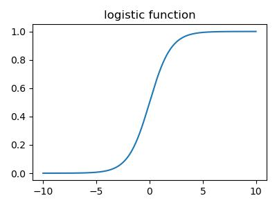
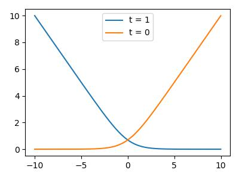

# Classification Optimization


## Binary Linear Classification

Let the target $t \in \{0,1\}$ be the __binary classification__, using a linear function model $z = \vec w^T \vec x$ with threshold $I(z \geq 0)$  
where $\vec x$ is the training data with one more dummy variable $1$ so that the threshold is always $0$

### Geometric Picture
Given input $t = \text{NOT } x, x\in\{0,1\}$

#### Input space
the weights (hypothesis) can be represented by half-spaces 

$$H_+ = \{\vec x\mid \vec w^T \vec x \geq 0\}, H_- = \{\vec x\mid \vec w^T \vec x < 0\}$$

The boundary is the __decision boundary__ $\{\vec x\mid \vec w^T \vec x = 0\}$

If the training example can be perfectly separated by a linear decision rule, we say the data is __linearly separable__

#### weight space
each training example $\vec x$ specifies a half space $\vec w$ must lie in to be correctly classified: $w^Tx >0$ if $t = 1$
The region satisfying all the constraints is the __feasible region__. The problem is __feasible__ is the region $\neq \emptyset$, otw __infeasible__

Note that if training set is separable, we can solve $\vec w$ using linear programming

### Loss Function

#### 0-1 Loss
Define the 0-1 Loss be 

$$\mathcal L_{0-1}(y,t) = \mathbb I(y\neq t)$$

Then, the cost is 

$$\mathcal J = \frac{1}{N}\sum^N \mathbb I(y^{(i)}\neq t^{(i)})$$

However, such loss is hard to optimize (NP-hard considering integer programming)

Note that $\partial_{w_j} \mathcal L_{0-1} = 0$ almost everywhere (since $\mathcal L$ is a step function w.r.t $z$)

#### Surrogate loss function
If we treat the model as a linear regression model, then 

$$\mathcal L_{SE}(y,t) = \frac{(y-t)^2}{2}$$

However, the loss function will give large loss if the prediction is correct with high confidence. 

#### Logistic Activation Function
Using logistic function $\sigma(z) = (1+e^{-z})^{-1}$ to transform $z = \vec w^T\vec x + b$. 

$$\mathcal L_{SE}(y,t) = \frac{\sigma(\vec w^T \vec x + b) - t}{2}$$

A linear model with a logistic nonlinearity is known as __log-linear__  
In this way, $\sigma$ is called an __activation function__

However, for $z\rightarrow \pm\infty, \sigma(z)\approx 0$
If the prediction is really wrong, you should be far from a critical point

<figure markdown>
  {width="480"}
</figure>    


#### Cross-entropy loss (log loss)
More loss if the prediction is "more" confident about "wrong" answers and not punishing the correct one even not confident

$$\mathcal L_{CE}(y,t) = -t\log(y) - (1-t)\log(1-y)$$

where $t\in\{0,1\}$

### Logistic Regression
$z = \vec w^T \vec x+b$  
$y = \sigma(z) = (1+\exp(-z))^{-1}$  
$\mathcal L_{CE}(y,t) = -t\log(y) - (1-t)\log(1-y)$

<figure markdown>
  {width="480"}
</figure> 


### Gradient Descent
Initialize the weights to something reasonable and repeated adjust them in the direction of __steepest descent__

$$\vec w \leftarrow \vec w - \alpha \partial_{\vec w} J$$

$\alpha \in (0, 1]$ is the learning rate (step size)  
When $J$ converges, $\partial_{\vec w} J = 0$ at the critical point

#### Under L<sup>2</sup> Regularization
The gradient descent update to minimize the regularized cost $\mathcal J + \lambda \mathcal R$ results in weight decay

$$\vec w\leftarrow \vec w - \alpha\partial_{\vec w}(\mathcal J+\lambda \mathcal R) = (1-\alpha\lambda)\vec w - \alpha \partial_{\vec w} \mathcal J$$

### Learning rate
In gradient descent, the learning rate $\alpha$ is a hyper parameter. (TUT3)

### Training Curves
To diagnose optimization problems, plot the training cost as a function of iteration.

However, it's very hard to tell whether an optimizer has converged. 

### Example: Gradient of logistic loss

\begin{align*}
\frac{\partial\mathcal L_{CE}}{\partial w_j} &= \partial_y \mathcal L_{CE}\cdot \partial_zy \cdot \partial_{wj}z \\
&= (\frac{-t}{y} + \frac{1-t}{1-y})\cdot y(1-y)\cdot x_j\\
&= (y-t)x_j\\
w_j &\rightarrow w_j - \frac{\alpha}{N} \sum^N(y^{(i)} - t^{(i)})x_j^{(i)}
\end{align*}

## Multiclass Classification (Softmax Regression)

### One-hot vector/ one-of-K encoding Target
Targets from a discrete set $\{1,...,K\}$  
For convenience, let $t\in\mathbb R^K, t_i= \mathbb I(i=k)$ where $k$ is the classification. 

### Linear predictions
$D$ input, $K$ output, hence we need a weight matrix $W$  

$$\vec{z}_{K\times 1} = W_{K\times D}\vec{x}_{D\times 1} + \vec{b}_{K\times 1}$$

Otherwise $Z= Wx^*$ where $x^*$ is $x$ padded a column of $1$'s.


### Softmax Function Activation
A generalization of the logistic function

$$y_k = softmax(z_1,...,z_K)_k = \frac{e^{z_k}}{\sum_{k'} e^zk'}$$

The input $z_k$ are the logits

#### Properties
- Outputs are positive and sum to $1, (\sum_k y_k = 1)$ so that can be interpreted as probabilities
- If one of $z_k$ is much larger, than $softmax(z)_k \approx 1$

### Cross Entropy Loss
Use cross-entropy as the loss function, as from logistic regression 

$$\mathcal L_{CE}(\vec y, \vec t) = -\sum_{k=1}^K t_k \log y_k = -\vec t^T \log(\vec y)$$

Log is applied element-wise

### Gradient descent
Updates can be derived for each row of $W$

$$\frac{\partial L}{\partial w_k} = \frac{\partial L}{\partial z_k}\frac{\partial z_k}{\partial w_k} = (y_k - t_k)\cdot \vec x$$

$$w_k \leftarrow w_k - \alpha N^{-1} \sum^N (y^{(i)}_k - t^{(i)}_k)\vec x^{(i)}$$

???quote "Source code"

    ```python
    --8<-- "csc311/scripts/classification.py"
    ```