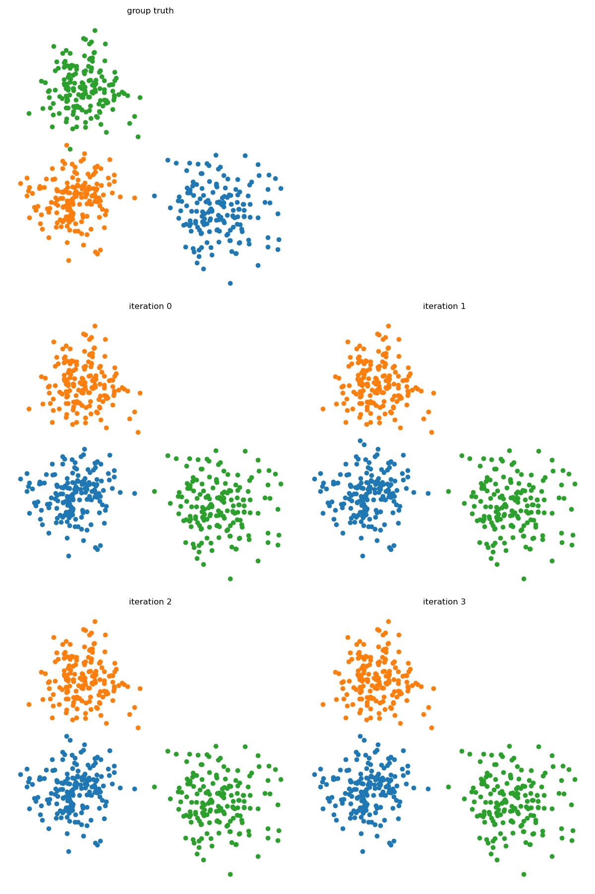
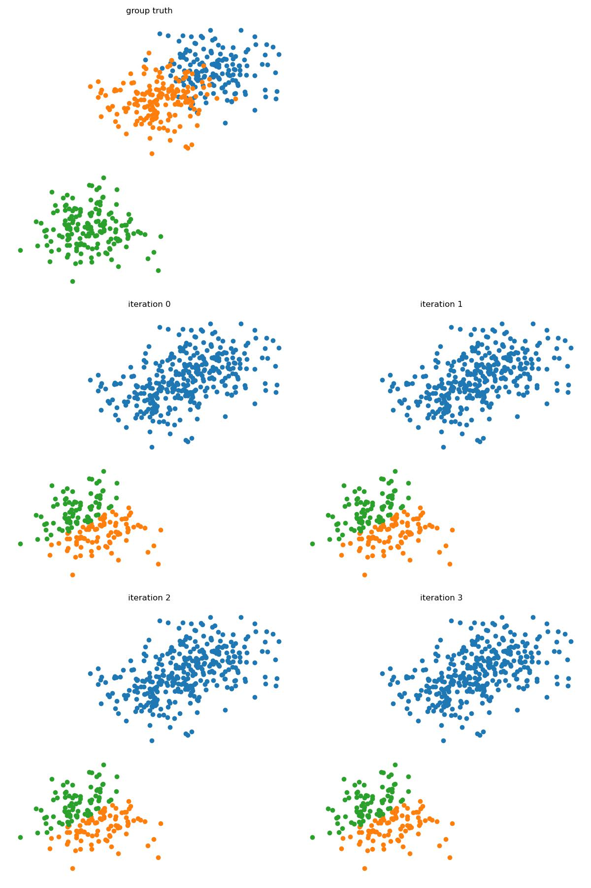

# k-Means and EM Algorithm


## Clustering Problem
Grouping data points into clusters, __without observed labels__. 

Samples within a cluster are similar to each other, and samples in different clusters are dissimilar. Such data forms a __multimodal__ distribution, as having multiple modes. 


## K-Means
Given data points $x^{(1)},...,x^{(N)}\in \mathbb R^D$, want to find cluster centers $\{m_k\}^K\in\mathbb R^D$ and assignments $\{r^{(n)}\}^N\in \mathbb R^K$ being 1-K encoding.  
 
The objective is to minimize the cost as the squared sum distance of data points to their assigned centers, i.e. 

$$\min_{\{m_k\},\{r^{(n)}\}}J(\{m_k\},\{r^{(n)}\}) = \min \sum^N\sum^K r^{(n)}\|m_k - x^{(n)}\|^2$$

Because $r$ works as an encoding, i.e. integer optimization problem, optimize both $r,m$ will be NP-hard. 

However, if we fix $m$, finding optimal assignments $r$ is easy, i.e. 

$$\min_{\{r^{(n)}\}}\sum^K r_k^{(n)}\|m_k-x^{(n)}\|^2\Rightarrow r_k = \mathbb I(k=\arg\min_k\|x^{(n)}-m_j\|^2)$$

If we fix $r$, then we can minimize by taking gradient and set to 0 

\begin{align*}
\partial_{m_l}\sum^N\sum^K r_k^{(n)}\|m_k - x^{(n)}\|^2 &= 0\\
2\sum^Nr_l^{(n)}(m_l - x^{(n)}) &= 0\\
m_l &= \frac{\sum^N r_l^{(n)}x^{(n)}}{\sum^Nr_l^{(n)}}
\end{align*}

Therefore, it is possible to do __alternating minimization__, i.e. minimize $J$ w.r.t. $m, k$ individually .

### Alternating Minimization Algorithm
- Initialize with random cluster centers
- For each iterative step
    - Assignment step: assign data point to closest cluster by nearest neighbor
    - Refitting step: move each cluster center to the mean of the data assigned to it.


```python linenums="1"
--8<-- "csc311/scripts/kmeans.py:kmeans"
```

<figure markdown>
  {width="720"}
</figure> 
    
### Convergence 
Note that $J$ is lower bounded by 0 as a squared distance.  
Also, consider each assignment step, as $m$ fixed, for each $x^{(n)}$, $r_k^{(n)}$ guarantees $x^{(n)}-m_k$ is minimum.  
Consider each minimization step, as $r$ fixed, for each $\sum r_k( x^{(n)} - E(x^{(n)}))^2$ is minimized. 

Therefore, by monotone convergence theorem, this will converge.

However, this will not guarantee the global minimum. 

<figure markdown>
  {width="720"}
</figure> 

## Soft k-Means

Instead of making 0-1, we can make soft assignment, which we assign the clusters by responsibility (probability). 

### Algorithm
- Initialize $m$ random
- Iterative step
    - Assignment

    $$r_k^{(n)} = \frac{\exp(-\beta\|m_k-x^{(n)}\|^2)}{\sum_j\exp (-\beta \|m_j-x^{(n)}\|^2)} = softmax(-\beta\{\|m_k-x^{(n)}\|^2\}^K)$$

    - Refitting

    $$m_k = \frac{\sum_n r_k^{(n)}x^{(n)}}{\sum_n r_k^{(n)}}$$
   
Note that 

\begin{align*}
\lim_{\beta\rightarrow \infty}r_k^{(n)}&= \lim_{\beta\rightarrow\infty}\frac{\exp(-\beta\|m_k-x^{(n)}\|^2)}{\sum_j\exp (-\beta \|m_j-x^{(n)}\|^2)}\\
&= \lim_{\beta\rightarrow\infty}\frac{\exp(-\beta\|m_k-x^{(n)}\|^2)}{\exp(-\beta\|m_k-x^{(n)}\|^2) + \sum_{j\neq k}\exp (-\beta \|m_j-x^{(n)}\|^2)}\\
&= \lim_{\beta \rightarrow \infty}\frac{1}{1+\sum_{j\neq k}\exp \bigg(-\beta (\|m_j-x^{(n)}\|^2 - \|m_k-x^{(n)}\|^2)\bigg)}&(*)\\
&= \mathbb I(k=\arg\min_k\|m_k-x^{(n)}\|^2)
\end{align*}

$(*)$ when $k$ is the argmin, then $d:=\|m_j-x^{(n)}\|^2 - \|m_k-x^{(n)}\|^2 > 0, -\beta d\rightarrow -\infty, \exp(-\beta d)\rightarrow 0$.  
Otherwise, exists some $d<0, \exp(-\beta d) \rightarrow \infty, \lim r^{(n)}_k = 0$

However, this raises questions about how to set $\beta$, and how to cluster unequal weight and width. 

#### Termination condition
We can test whether we can terminate the k-Mean's iterative steps by checking whether the assignment change. 

## Generative Model
Consider the generative model for $\mathcal D$:  
Assume data point $x$ is generated as
 - choose a cluster $z$ from $\pi = [\pi_1,...,\pi_K]^T, p(z=k)=\pi_k$
 - Given $z$, sample $x$ from $N(x|\mu_z, I)$

$$p(z=k)=\pi_k, p(x|z=k)=N(x|\mu_k, I)$$
 
Then the joint distribution $p(z,x) = p(z)p(x|z)$ with parameters $\{\pi_k, \mu_k\}^K$,   marginal probability of $x, p(x)=\sum_zp(z,x)$  
the probability $x$ came from kth cluster is $p(z=k|x) = \frac{p(x|z=k)p(z=l)}{p(x)}$

### Gaussian Mixture Model (GMM)
Using MLE approach, since we can't see the cluster assignments $z$, we only see $x$, i.e. the pbjective is 

\begin{align*}
p(\mathcal D) \Rightarrow \log(p(\mathcal D)) &= \sum^N \log(p(x^{(n)})) \\
&= \sum^N\sum^K p (z=k)p(x^{(n)}|z=k)\\
&= \sum^N\sum^K \pi_k N(x|\mu_k, I)
\end{align*}

Such distribution is an example of __Gaussian Mixture Model (GMM)__ and $\pi_k$ are the __mixing coefficients__. 

In general, each Gaussian will have different covariance, i.e. $N(x|\mu_k, \sigma_k)$. 

Note that $\log(p(\mathcal D)) = \sum^N\log \bigg(\sum^K \pi_k N(x^{(n)}| \mu_k, I)\bigg)$

Similar to k-Means, if we knew $z^{(n)}$, i.e. assignment, then the log likelihood is similar to a classification question, i.e. 

$$\log p(\mathcal D_{complete}) = \sum^N \log p(z^{(n)}, x^{(n)}) = \sum^N\sum^K \mathbb I(z^{(n)} = k)\bigg[\log(N(x^{(n)}|\mu_k, I) + \log\pi_k)\bigg]$$

The maximization results in 

$$\hat\mu_k = \frac{\sum^N \mathbb I(z^{(n)}=k)x^{(n)}}{\sum^N \mathbb I(z^{(n)}=k)} = \text{class mean}$$

$$\hat\pi_k = N^{-1}\sum^N \mathbb I(z^{(n)}=k) = \text{class proportions}$$

Then, we replace assignment since $E(z^{(n)}) = p(z=k|x)$ where $p(z=k|x)$ is computed from Bayes rule

\begin{align*}
p(z=k|x) &= \frac{p(z=k)p(x|z=k)}{p(x)}\\
&= \frac{p(z=k)p(x|z=k)}{\sum^K p(z=j)p(x|z=j)}\\
&= \frac{\pi_k N(x|\mu_k, I)}{\sum^K_j \pi_jN(x|\mu_k, I)}
\end{align*}

Therefore, let $r_k^{(n)} := p(z^{(n)}=k|x^{(n)})$ replace $\mathbb I(z^{(n)}=k)$, and 

$$\log p(\mathcal D_{complete}) = \sum^N \log p(z^{(n)}, x^{(n)}) = \sum^N\sum^K  r_k^{(n)}\bigg[\log(N(x^{(n)}|\mu_k, I) + \log\pi_k)\bigg]$$

The maximization results in 

$$\hat\mu_k = \frac{\sum^N r_k^{(n)} x^{(n)}}{\sum^N r_k^{(n)}} = \text{class mean}$$

$$\hat\pi_k = N^{-1}\sum^N r_k^{(n)} = \text{class proportions}$$

## Expectation Maximization Algorithm
- __E-step__ compute the posterior probabilities $r_k^{(n)} = p(z^{(n)}=k|x^{(n)})$ given our current model
- __M-step__ update $\mu, \pi$

### Possible Problems 
 - Singularities: arbitrarily large likelihood when a Gaussian explains a single point with variance shrinking to zero
 - Non-convex


???quote "Source code"

    ```python
    --8<-- "csc311/scripts/kmeans.py"
    ```