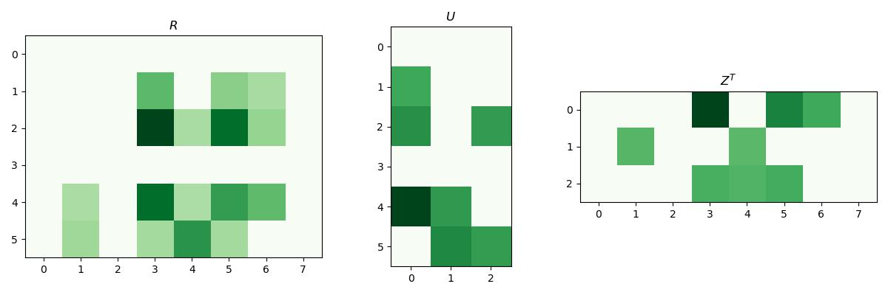

# Matrix Factorization

## PCA as a matrix factorization

Given PCA reconstruction 

$$x^{(i)}\approx Uz^{(i)}$$

Write all the observations into matrix form, 

$$\underset{X\in \mathbb R^{N\times D}}{\begin{bmatrix}[x^{(1)}]^T \\ \vdots \\ [x^{(N)}]^T
\end{bmatrix}}\approx 
\underset{Z\in\mathbb R^{N\times K}}{\begin{bmatrix}[z^{(1)}]^T \\ \vdots \\ [z^{(N)}]^T 
\end{bmatrix}}U^T$$

Using __Frobenius norm__ $\|Y\|_F^2 = \|Y^T\|^2_F = \sum_{i,j}y_{ij}^2 = \sum_i \|y^{(i)}\|^2$, define the squared error being $\|X-ZU^T\|_F^2$


### Singular Value Decomposition
Given $X$, the SVD is $X = QSU^T$ where   
$Q\in\mathbb R^{N\times D}$ with orthonormal columns, i.e. $Q^TQ = I_D$.   
$S\in\mathbb R^{D\times D}$ is the diagonal matrix  
$U\in\mathbb R^{D\times D}$ is the orthonormal matrix, $U^T = U^{-1}$

#### Properties of covariance matrices
Construct two positive semi-definite matrices $XX^T (N\times N)$ and $X^TX(D\times D)$  
$XX^T = QSU^T(QSU^T)^T = QSU^TUSQ^T = QSISQ^T = QS^2Q^T$ is an eigendecomposition of $XX^T$, similarly $X^TX = US^2U^T$  
Assuming $N\geq D$, then $XX^T,X^TX$ will share $D$ eigenvalues and the remaining $N-D$ eigenvalues will be $0$ 

Therefore, consider $\hat\Sigma$, 

\begin{align*}
\hat\Sigma &= N^{-1}X^TX \\
&= N^{-1}USQ^TQSU^T\\
&= U(S^2/N)U^T
\end{align*}

the eigenvalues $\lambda_i$ are related to the singular values $\lambda_i = s_i^2 / N$, the SVD gives $U$ which is equivalent to the learned basis of PCA. 

## Recommender Systems (Matrix Completion)
Compare to a PCA problem, where all the observations are known. Recommender systems are often sparse matrices with many unknown, i.e. Matrix completion problem. 

Consider the movie rating problem, which given users, movies, and user rates on some pf the movies. Want to predict the ratings of the movies that the user haven't watched. 

### Alternating Least Squares
Let the representation of user $n$ in the $K-$dimensional space be $\vec u_n$ and the representation of movie $m$ be $z_m$. Assume the rating user $n$ gives to movie $m$ is given by $R_{nm}\approx u_n^T z_m$, then this gives 

$$R = \underset{U}{\begin{bmatrix}u_1^T\\\vdots\\u_N^T\end{bmatrix}}\underset{Z^T}{\begin{bmatrix}z_1&...&z_M\end{bmatrix}}$$


???quote "Source code"

    ```python
    --8<-- "csc311/scripts/matrix_factorization.py"
    ```

<figure markdown>
  {width="720"}
</figure> 

    


To enforce $R\approx UZ^T$, i.e. $\min_{U,Z} \sum _{i,j}(R_{ij} - u_i^Tz_j)^2$, while most $R_{ij}$ are unknown, so we can only minimize the observed parts, i.e. 

$$\min_{U,Z} \sum_{(n,m)\in \mathcal O} (R_{nm}- u_n^Tz_m)^2\|, \mathcal O := \{(n,m), R_{nm}\text{ is observed}\}$$

However, such objective is non-convex and generally NP-hard to solve, so we have to use alternating approach, i.e. optimize $U,Z$ individually and alternatively. 

The generally algorithm follows that 

- initialize $U,Z$ randomly
- repeat until convergence 
    - for $n = 1..N$
    
    $$u_n = (\sum_mz_mz_m^T)^{-1}\sum_m R_{nm}z_m$$
    
    - for $m = 1..M$  

    $$z_m = (\sum_n u_n u_n^T)^{-1}\sum_n R_{nm}u_n$$

where $(n,m)\in \mathcal O$. 

With such algorithm, we can do gradient descent  
Full gradient descent is $\begin{bmatrix}U\\Z\end{bmatrix} \leftarrow \begin{bmatrix}U\\Z\end{bmatrix} - \alpha \nabla f(U,Z)$.  

For large dataset, we can use stochastic gradient descent 

$$\begin{bmatrix}u_n\\z_m\end{bmatrix} \leftarrow \begin{bmatrix}u_n\\z_m\end{bmatrix} - \alpha \begin{bmatrix}(R_{nm}-u_n^Tz_m)z_m\\(R_{nm}-u^T_nz_m)u_n\end{bmatrix}$$

So we can change the updating step to 

- randomly select a pair $(n,m)\in\mathcal O$ among observed elements of $R$. 
- $u_n \leftarrow u_n - \alpha (R_{nm} - u_n^T z_m)z_m$
- $z_m \leftarrow z_m - \alpha (R_{nm} - u_n^Tz_m)u_n$

## K-Means as a matrix factorization
Stack assignment vectors $r_i$ into $N\times K$ matrix R, and the cluster means $m_k$ into a matrix $K\times D$ matrix $M$. Then, the reconstruction with its cluster is given by $RM$. 

Taking one step further, feature dimensions can be redundant and some feature dimensions cluster together. 

__Co-clustering__ clusters both the rows and columns of a data matrix, giving a block structure. We can represent this as the indicator matrix for rows, times the matrix of means for each block, times the indicator matrix for columns. 

### Sparse Coding
This algorithm works on small image patches, which we reshape into vectors.  
Suppose we have a dictionary of __basis functions__ $\{a_k\}_{k=1}^K$ which can be combined to model each patch.   
Each patch is approximated as a linear combination of a small number of basis functions 

$$x = \sum^K s_k a_k = As$$

This is an overcomplete representation, in that typically $K>D$ for sparse coding problems, the requirement that $s$ is sparse makes things interesting.  

We'd like choose $s$ to accurately reconstruct the image $x\approx As$ but encourage sparsity in $s$.  
What cost function should we use?  
Inference in the sparse coding model: 

$$\min_s \|x-As\|^2 + \beta \|s\|_1$$

Here, $\beta$ is a hyper-parameter that trades off reconstruction error v. sparsity.   
There are efficient algorithms for minimizing this cost function.

### Learning the dictionary
We can learn a dictionary by optimizing both $A$ and $\{s_i\}_{i=1}^N$ to trade off reconstruction error and sparsity 

$$\min_{\{s_i\}, A} \sum_{i=1}^N \|x^{(i)}- As_i\|^2 + \beta\|s_i\|_1$$

subject to $\|a_k\|^2 \leq 1, \forall k$.  
Reconstruction term can be written in matrix form as $\|X-AS\|_F^2$ where $S$ combines the $s_i$ as columns.   
Can fit using an alternating minimization scheme over $A$ and $S$ just like $K$-means, $EM$, low-rank matrix completion, etc. 

The sparse components are oriented edges, similar to what a neural networks learn.  
But the learned dictionary is much more diverse than the first-layer neural net representations. Tiles the space of location, frequency, and orientation in an efficient way.  
