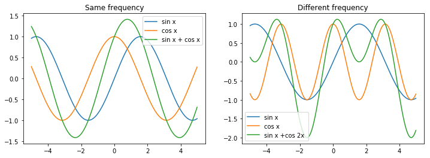
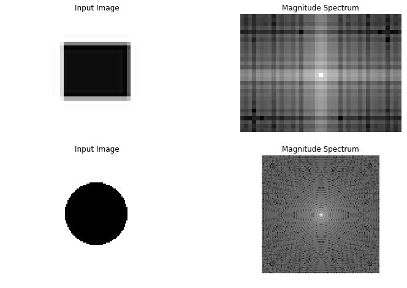
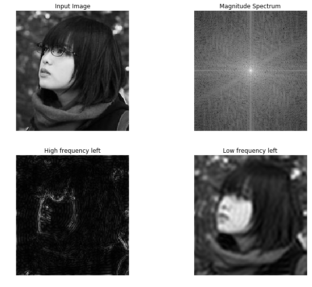

# Fourier Transformation and Convolution Theorem


```python
import numpy as np
import matplotlib.pyplot as plt
import cv2
```

## Fourier Transformation

### sin

$$y(x) = A\sin(wx+\phi)$$

$A$ amplitude   
$w$ angular frequency  
$\phi$ phase

### Fourier Transform
Given function $f:\mathbb R\rightarrow \mathbb R$ in the spatial domain, the function in the frequency domain $F$ is 

$$F(w) = \int_{-\infty}^\infty f(x)e^{-iwx}$$

Often is defined instead with spatial

$$F(f) = \int_{-\infty}^\infty f(x)e^{-i2\pi x} dx$$

The inverse Fourier transform is

$$f(x) = \int_{-\infty}^\infty F(w)e^{iwx}dw$$

Then, 

$$e^{iwx} = \cos wx + i\sin wx$$

The cos/sin pair can encode the __phase__ of the sin

$$u\cos wx + v\sin wx = A\sin(wx + \phi), A = \pm \sqrt{v^2 + u^2}, \phi = \arctan \frac u v$$


```python
plt.figure(figsize=(12, 4))
plt.subplot(121)
x = np.arange(-5, 5, 0.01)
sin_ = np.sin(x)
cos_ = np.cos(x)
plt.plot(x, sin_, label="sin x")
plt.plot(x, cos_, label="cos x")
plt.plot(x, sin_ + cos_, label="sin x + cos x")
plt.title("Same frequency")
plt.legend();
plt.subplot(122)
sin_ = np.sin(x)
cos_ = np.cos(2 * x)
plt.plot(x, sin_, label="sin x")
plt.plot(x, cos_, label="cos x")
plt.plot(x, sin_ + cos_, label="sin x +cos 2x ")
plt.title("Different frequency")
plt.legend();
```


    

    


```python
img = cv2.imread('../../CSC420 Intro to Image Understanding/assets/blue-square.png', cv2.IMREAD_GRAYSCALE)
f = np.fft.fft2(img)
fshift = np.fft.fftshift(f)
magnitude_spectrum = 20 * np.log(np.abs(fshift))
plt.figure(figsize=(12, 12))
plt.subplot(321),
plt.imshow(img, cmap = 'gray')
plt.title('Input Image'), plt.axis("off")
plt.subplot(322),
plt.imshow(magnitude_spectrum, cmap = 'gray')
plt.title('Magnitude Spectrum')
plt.axis("off")

img = cv2.imread('../../CSC420 Intro to Image Understanding/assets/circle.png', cv2.IMREAD_GRAYSCALE)
f = np.fft.fft2(img)
fshift = np.fft.fftshift(f)
magnitude_spectrum = 20 * np.log(np.abs(fshift))
plt.subplot(323),
plt.imshow(img, cmap = 'gray')
plt.title('Input Image'), plt.axis("off")
plt.subplot(324),
plt.imshow(magnitude_spectrum, cmap = 'gray')
plt.title('Magnitude Spectrum')
plt.axis("off");
```


    

    


If we remove the center information within the Fourier components, then we left only edges; if we remove the high frequency components, then we left only the low frequency components, i.e. blurred. 


```python
plt.figure(figsize=(12, 10))
img = cv2.imread('../../CSC420 Intro to Image Understanding/assets/yurina.jpg', cv2.IMREAD_GRAYSCALE)
f = np.fft.fft2(img)
fshift = np.fft.fftshift(f)
magnitude_spectrum = 20 * np.log(np.abs(fshift))
plt.subplot(221),
plt.imshow(img, cmap = 'gray')
plt.title('Input Image'), plt.axis("off")
plt.subplot(222),
plt.imshow(magnitude_spectrum, cmap = 'gray')
plt.title('Magnitude Spectrum')
plt.axis("off")

f_high = fshift.copy()
f_high[w//2 - 20: w//2 + 20, h//2 - 20: h//2 + 20] = 0
f_ishift_high = np.fft.ifftshift(f_high)
img_back_high = np.fft.ifft2(f_ishift_high)
plt.subplot(223)
plt.imshow(np.abs(img_back_high), cmap = 'gray')
plt.title('High frequency left')
plt.axis("off");

f_low = np.zeros((w, h)).astype(np.complex128)
f_low[w//2 - 20: w//2 + 20, 
      h//2 - 20: h//2 + 20] = fshift[w//2 - 20: w//2 + 20, 
                                      h//2 - 20: h//2 + 20]
f_ishift_low = np.fft.ifftshift(f_low)
img_back_low = np.fft.ifft2(f_ishift_low)
plt.subplot(224)
plt.imshow(np.abs(img_back_low), cmap = 'gray')
plt.title('Low frequency left')
plt.axis("off");
```


    

    


## Convolution Theorem
Let $\mathcal F(f)$ represents the Fourier transform of $f$ if $\mathcal F(f) = F$, then $\mathcal F^{-1}(F) = f$

$\mathcal F (f*g) = \mathcal F(f)\mathcal F(g)$ and $f*g = \mathcal F^{-1}(\mathcal F(f)\mathcal F(g))$  
Fourier Theorem of convolution in the spatial domain is the same as multiplication in the frequency domain. 

$\mathcal F(f\cdot g) = \mathcal F(f)*\mathcal F(g)$ and $f\cdot g = \mathcal F^{-1}(\mathcal F(f) * \mathcal F(g))$  
Fourier Theorem of multiplication in the spatial domain is the same as convolution in the frequency domain. 

### Image Sampling

Note that images are discrete sampling of points, instead of the continuous 2D function of intensities. 

Therefore, an image can be seen as a multiplication of sampling points $S$ and image $B$. Where $S$ is all $0$ with sampling points being $1$.

### Aliasing
Given sampling of an $2\pi\times 2\pi$ image, with $2N\times 2M$ samples. Then, the distance between two axis-adjacent sampling points is $\pi/N, \pi/M$. 

Consider its Fourier Transform domain  

$$\mathcal F(S) = \sum_{k=-N}^N\sum_{l=-M}^M\int_{-\pi}^\pi\int_{-\pi}^\pi \delta(x-\frac{\pi k}{N})\delta(y-\frac{\pi l}{m})e^{-i(xn+ym)}dxdy$$

Sampling distance in spatial domain is inversely proportional to Fourier domain. 

#### Region of support
When region of support of $\mathcal F(B)$ does not overlap with adjacent copies it is possible to reconstruct $B$ from $\mathcal F^{-1}(\mathcal F(B\cdot S))$, if overlap occurs, its impossible to reconstruct, and aliasing occurs
