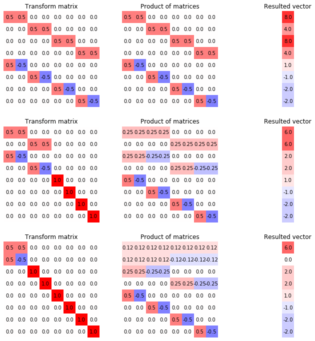
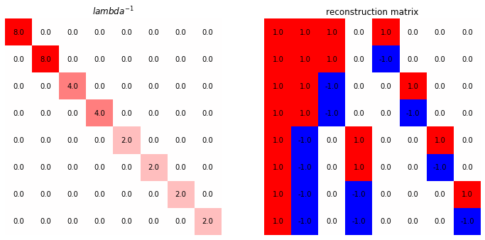
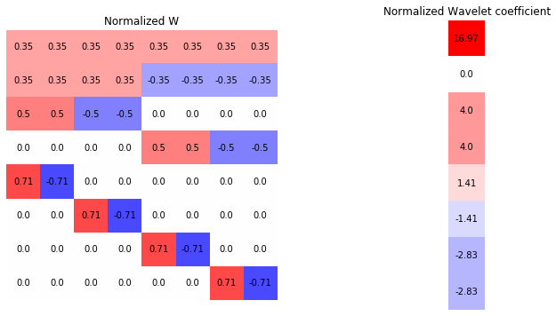

# Wavelet Transform


```python
import math
import numpy as np
import matplotlib.pyplot as plt
```

## Properties of Transformation
- Minimal
- Multiple scales represented simultaneously 
- Invertible, linear

## 1D Haar Wavelet Transform
Given an array $I_n$ of $2^n$ elements, then $I_{n-1}$ ve two arrays. Average $I_{n-1}$ be the average of every two elements, 

$$I_i^j = \frac{1}{2}(I_{2i}^{j+1} + I_{2i+1}^{j+1})$$

Detail Coef $D_{n-1}$ be the differnce of first pixel from the average. 

$$D_i^j = I_{2i}^{j+1} - \frac{1}{2}(I_{2i}^{j+1} + I_{2i+1}^{j+1}) = \frac{1}{2}(I_{2i}^{j+1} - I_{2i+1}^{j+1})$$


```python
I = [9., 7., 3., 5., 6., 10., 2., 6.]
def wavelet_recursive(I):
    I_2, D_2 = [], []
    for i in range(0, len(I) - 1, 2):
        I_2.append((I[i] + I[i+1]) / 2)
        D_2.append((I[i] - I[i+1]) / 2)
    return I_2, D_2
print("I{}:".format(int(math.log2(len(I)))), I)
print()
while len(I) >= 2:
    I, D = wavelet_recursive(I)
    print("I{}:".format(int(math.log2(len(I)))), I)
    print("D{}:".format(int(math.log2(len(D)))), D)
    print()
```

    I3: [9.0, 7.0, 3.0, 5.0, 6.0, 10.0, 2.0, 6.0]
    
    I2: [8.0, 4.0, 8.0, 4.0]
    D2: [1.0, -1.0, -2.0, -2.0]
    
    I1: [6.0, 6.0]
    D1: [2.0, 2.0]
    
    I0: [6.0]
    D0: [0.0]
    
    

Now, consider the vector representation of $I$, i.e. $2^n\times 1$ vector. Note that if we have all the $D_i$'s and $I_0$, we can reconstruct the original image. 
For example, $I_1 = (I_0 - D_0, I_0 + D_0)$. Also, notice that $|I_0| + |D_0| + |D_1| + |D_2| = 1 + 1 + 2 + 4 +... = 1 + 2^n - 1 = 2^n$, so that if we represent the wavelet transformed image as one vector 

$$\bigg[[I_0]^T, [D_0]^T, [D_1]^T,..., [D_{N-1}]^T \bigg]^T$$

Also, notice that for any input image $I_{N}$, we can obtain $I_{N-1}, D_{N-1}$ as 

$$I_{N-1} = \underset{2^{N-1}\times 2^N}{\frac{1}{2}\begin{bmatrix}
1&1&0&0&...&0&0\\
0&0&1&1&...&0&0\\
\vdots&\vdots&\vdots&\vdots&\ddots&\vdots&\vdots\\
0&0&0&0&...&1&1
\end{bmatrix}}I_N$$

$$D_{N-1} = \underset{2^{N-1}\times 2^N}{\frac{1}{2}\begin{bmatrix}
1&-1&0&0&...&0&0\\
0&0&1&-1&...&0&0\\
\vdots&\vdots&\vdots&\vdots&\ddots&\vdots&\vdots\\
0&0&0&0&...&1&-1
\end{bmatrix}}I_N$$

We can then concat them vertically so that compute $[[I_{N-1}]^T, [D_{N-1}]^T]^T$, and we can recursively work on the top vector and keep going. 


```python
def imshow_labelled(m, ax, title="", r=1):
    ax.imshow(m, cmap="bwr", vmin = -r, vmax = r)
    for (j,ii),label in np.ndenumerate(np.round(m, 2)):
        ax.text(ii,j,label,ha='center',va='center', color="black")
    ax.set_title(title)
    ax.set_axis_off()

image = np.array([[9., 7., 3., 5., 6., 10., 2., 6.]]).T
I = image.copy()
matrices = []
number_m = int(math.log2(I.shape[0]))
fig, axs = plt.subplots(number_m, 3, figsize=(12, 12))
haar_wave_matrix = np.identity(I.shape[0])
for steps in range(number_m, 0, -1):
    m = np.zeros((len(I), len(I)))
    d = 2**(steps - 1)
    for i in range(d):
        m[i, 2*i:2*i+2] = 1/2 
        m[d + i, 2*i] = 1/2 
        m[d + i, 2*i + 1] = -1/2
        m[d*2:, d*2:] = np.identity(2 ** number_m - d * 2)
    haar_wave_matrix = m @ haar_wave_matrix
    I = m @ I
    imshow_labelled(m, axs[number_m - steps][0], "Transform matrix", 1)
    imshow_labelled(haar_wave_matrix, axs[number_m - steps][1], "Product of matrices", 1)
    imshow_labelled(I, axs[number_m - steps][2], "Resulted vector", 10)
```


    

    


## Reconstruction of wavelet transform
Consider the shape of each row in the wavelet transform matrix, note that the product of two distinct row will always be 0, and the same row will be the square sum of the entries. 

Further notice that the sum is $2^n(2^{-n}2^{-n}) = 2^{-n}$, which is just the first none zero entry on wavelet transform matrix.  
So that we have a diagonal matrix, let 

$$\Lambda := WW^T$$

so that let $\mathcal I$ be the transformed vector, $I$ be the original image

$$\mathcal I = WW^T(WW^T)^{-1}\mathcal I = WW^T\Lambda^{-1}\mathcal I = WI$$

We need $\Lambda$ instead of directly finding inverse of $W$ because finding inverse for diagonal matrix is just inverse each diagonal values.
we now have the reconstruction matrix being 

$$W^T\Lambda^{-1}$$


```python
fig, axs = plt.subplots(1, 2, figsize=(12, 6))
lbd = haar_wave_matrix @ haar_wave_matrix.T
lbd_inv = np.linalg.inv(lbd)
imshow_labelled(lbd_inv, axs[0], r"${lambda}^{-1}$", 8)
recons = haar_wave_matrix.T @ lbd_inv
imshow_labelled(recons, axs[1], "reconstruction matrix", 1)
```


    

    


If we consider $W$ as a basis of $\mathbb R^{2^N}$, so that the transformed image is a decomposition of the basis image decomposed from the original image. 

We can further use a normalized wavelet transformation by 

$$\tilde W = \Lambda^{1/2}W$$

where the square root is element wise on the diagonal, so that $\tilde W I$ is a set of wavelet coefficient $c_0^0, d_0^0, ...$ that express $I$ as a linear combination of the basis. 


```python
fig, axs = plt.subplots(1, 2, figsize=(12, 6))
haar_wave_matrix_normalized = lbd_inv ** 0.5 @ haar_wave_matrix
imshow_labelled(haar_wave_matrix_normalized, axs[0], "Normalized W")
wavelet_coef_normalized = haar_wave_matrix_normalized @ image 
imshow_labelled(wavelet_coef_normalized, axs[1], "Normalized Wavelet coefficient", 10)
```


    

    


Note that we did a change of basis that is optimal to the reconstruction error, just as PCA. We can sort the coefficients by absolute value and zero-out the coefficients other than some $k2^N$ coefficient, $0<k<1$.
