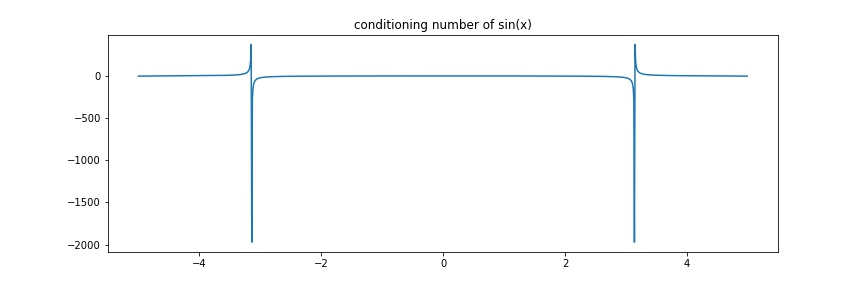
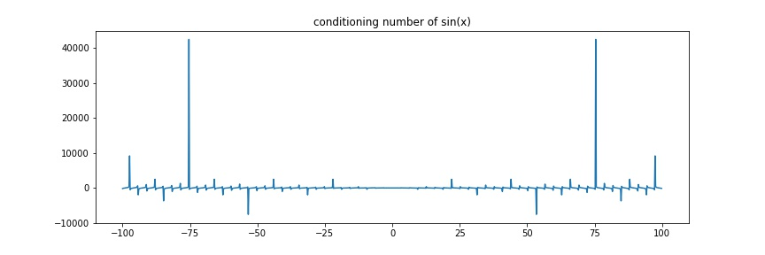

# Approxmation Errors and Conditioning, Stability


```python
import matplotlib.pyplot as plt
import numpy as np
```

Let $A:=$ approximation, $T:=$ true value

## Absolute error and relative error

__Absolute error__ $A-T$  
__Relative error__ $\frac{A-T}{T}$, let $A-T = \delta$, then $A = T(1+\delta)$ avoids the issue with $A = 0$

__Connect Digits__ $A:= 5.46729 \times 10^{-12}, T:= 5.46417\times 10^{-12}$  
Then, $\delta_{absolute}= A-T = 0.000312 \times 10^{-12}$  
$\delta_{relative} = 0.000312 / 5.46417 = 3.12/5.46417 \times 10^{-3}$  
Let $p$ be the first non-agreed digit, then the magnitude relative error will be around $10^{-p\pm 1}$.

__0.99... = 1__ However, consider $A= 1.00596\times 10^{-10}, T = 0.99452 \times 10^{-10}$, the relative error is much smaller than the magnitude approximation. 
Therefore, we say that $0.999...$ agrees with $1.000...$, hence $A,T$ agrees on 2 sig digits. 

## Data error and computational error

__Data error__ let $\hat x:=$ input value, $x$ be actual value, error = $\hat x - x$, for example
 - we cannot represent $A$ as a terminating floating number $(3.14\sim \pi)$
 - measurement error 
 
__Computational error__ let $f$ be the actual mapping, $\hat f$ be the approximation function, errors of the computation is $\hat f(x) - f(x)$, for example
 - often $\cos$ is calculated by its Taylor series, while Taylor series is a infinite sum, and we can only compute by finite approximation. 

### Truncation error and rounding error (subclasses of computational error)
__Truncation error__ The difference between the true result $f$ and the result that would be produced by a given (finite approximation) algorithm using exact arithmetic $\hat f$. 

__rounding error__ The difference between the result produced by a given algorithm using exact arithmetic, and the result produced by the same algorithm using a finite-precision, rounded arithmetic. 

__Example__ To approximate $f'(x)$ with known $f$  
By definition $f'(x) = \lim_{h\rightarrow 0} \frac{f(x+h) - f(x)}{h}$, hence, choose a small but not necessarily 0 value $h$, we can approximate $f'(x)$ for all $x$.   
Assuming $f$ is smooth, then 

\begin{align*}
&\quad \frac{f(x+h)-f(x)}{h}\\
&= \frac{1}{h}(\sum_{k=0} f^{(k)}(x)\frac{h^{k}}{k!} -f(x))&\text{Taylor expansion around }x \\ 
&= \frac{1}{h}(f(x)+f'(x)h + f''(c)h^2/2 - f(x)) &\text{Remainder theorem}, c\in[x, x+h]\\
&= f'(x) + \frac{f''(c)h}{2}
\end{align*}

Therefore, the truncation error will be $\frac{f''(c)h}{2}$, by IVT, such error is bounded since $f$ is continuous.

Then, let $FL$ be the mapping to the floating representation result, assume 

\begin{align*}
FL(f(x)) &= f(x) + \epsilon_0 \\
FL(f(x+h)) &= f(x+h) + \epsilon_h \\
FL(f'(x)) &= f'(x) + \hat\epsilon\\
\Rightarrow FL\bigg(\frac{f(x+h) - f(x)}{h} -f'(x)\bigg)&= \frac{f(x+h) + \epsilon_h - (f(x) + \epsilon_0)}{h} -(f'(x) + \hat\epsilon) \\
&= \frac{f''(c)h}{2} + \frac{\epsilon_h - \epsilon_0}{h}+ \hat\epsilon \\
\text{Total Error}&=\text{Truncation Error + Rounding Error}
\end{align*}


Note that $\epsilon_h$ is less influenced by $h$ when $h$ is small, then we can looks $\epsilon_h -\epsilon_0 =:\epsilon$ as a constant.  
Then, let $E(h)$ be the total error, $E'(h) = f''(c)/2 - \frac{\epsilon}{h^2}\Rightarrow argmin(E(h))=\sqrt{\epsilon_h/M}$

__Claim__ $\lim_{h\rightarrow 0} FL(f(x+h)) - FL(f(x)) = 0$

Notice that when $h$ is particularly smaller than the machine's precision, i.e. $x>>h$, then $x + h$ will be exactly $x$. 

Therefore, for very small $h$, $FL\bigg(\frac{f(x+h) - f(x)}{h} -f'(x)\bigg) = FL(-f'(x))$

## Forward Error and backward error

Let $y = f(x)$ be the true result, $\hat y = COMP(f(x))$ be the computational result, where $COMP$ is all the possible errors caused in the computation. Then, __forward error__ is $\hat y - y$.  
Take $\hat x$ such that with the true computation, $\hat y = f(\hat x)$, then __backward error__ is $\hat x - x$


## Conditioning of Problems

Let $\hat x \in (x-\delta, x+\delta)$, i.e. any $\hat x$ within the neighborhood of some $x$.  
Consider the relative forward error, assume $f$ is differentiable around $x$

\begin{align*}
\frac{\hat y - y}{y} &:= \frac{f(\hat x) - f(x)}{f(x)} \\
&= \frac{f'(c)}{f(x)}(\hat x - x) &\text{MVT, }c\in [x, \hat x]\\
&= \frac{xf'(c)}{f(x)}\frac{\hat x - x}{x} \\
&\approx \frac{xf'(x)}{f(x)}\frac{\hat x - x}{x} &c \text{ is quiet near } x \\
&= \text{conditioning number} \times \text{relative backward error}
\end{align*}


The problem is __well conditioned__ if $\forall x$, condition number is small; is __ill conditioned__ if $\exists x$, condition number is large

__Connection to Approximation error__ $y = f(x) \Rightarrow \hat y = f(\hat x)$, $\hat x - x$ will have different conditioning with $\frac{\hat x- x}{x}$, often we measuring the relative errors

__Example__ $f(x):= \sqrt x, x\geq 0$  
$\forall x \geq 0. c\approx\frac{xf'(x)}{f(x)} = \frac{x}{2\sqrt x\sqrt x} = 1/2\Rightarrow$ very well-conditioned

__Example__ $f(x)=e^x$  

$c\approx \frac{xe^x}{e^x} =x\Rightarrow$ less and less well-conditioned when $x$ gets big. However, $e^x$ will overflows or underflows if $|x|$ is large, even before it gets ill-conditioned. 

__Example__ $f(x)=\sin(x)$  

$c\approx \frac{x\cos(x)}{\sin(x)} = x\cot(x)\Rightarrow$ ill-conditioned near $k\pi, k\neq 0$ or $|x|$ is big and $\cos(x)\neq 0$


```python
t = np.arange(-5., 5., 0.01)
plt.figure(figsize=(12, 4))
plt.plot(t, t * np.cos(t) / np.sin(t))
plt.title("conditioning number of sin(x)")
plt.savefig("assets/approx_error_1.jpg")
```

<figure markdown>
  {width="720"}
</figure> 

```python
t = np.arange(-100., 100., 0.2)
plt.figure(figsize=(12, 4))
plt.plot(t, t * np.cos(t) / np.sin(t))
plt.title("conditioning number of sin(x)")
plt.savefig("assets/approx_error_2.jpg")
```

<figure markdown>
  {width="720"}
</figure> 

## Stability of Algorithms
An algorithm is stable if small change to the input results in small change in the output

### stable ≠ good
Consider $\hat f(x) := 0\: vs. f(x):= \sin(x)$, it is very stable, while it does not accomplish a good approximation as wanted. 
