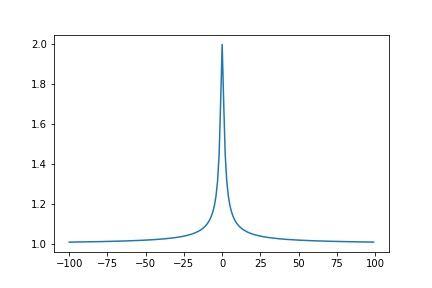
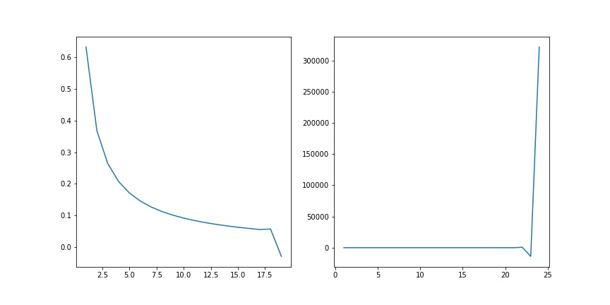

# Computer Arithmetic Examples


```python
import numpy as np
import matplotlib.pyplot as plt
import math
```

## Example 1

Is $y=\sqrt{1+x^2} - 1=:f(x)$ well-conditioned?  

\begin{align*}
C.N &= \frac{xf'(x)}{f(x)}\\
&= \frac{x(x(1+x^2)^{-1/2}}{(1+x^2)^{1/2}-1}\\
&= \frac{x(x(1+x^2)^{-1/2}}{(1+x^2)^{1/2}-1} \frac{\sqrt{1+x^2}+1}{\sqrt{1+x^2}+1}\\
&= \frac{x^2\sqrt{1+x^2}+1}{\sqrt{1+x^2}(1+x^2-1)}\\
&= \frac{\sqrt{1+x^2} + 1}{\sqrt{1+x^2}}\\
C.N. &\in [1,2]
\end{align*}


```python
a = np.arange(-100, 100, 1)
b = ((a ** 2 + 1) ** 0.5 + 1) / ((a ** 2 + 1) ** 0.5)
plt.plot(a, b)
plt.savefig("assets/arithmetic_examples_1.jpg")
```
    

    


Does $fl(\sqrt{1+x^2}-1)$ always give an accurate result

When $x$ is small enough so that $fl(\sqrt{1+x^2}) = 1$, then $\hat y = 0, y \neq 0\Rightarrow \frac{\hat y - y}{y}=\infty$  
$fl(\sqrt{1+x^2})=1\Rightarrow x^2 < \frac{\epsilon}{2}\Rightarrow |x|\leq \sqrt{\epsilon/2}$  

When $|x|\leq \sqrt{\epsilon/2}, x\neq 0$, this operation gives an inaccurate result, and for moderately small $x$ this is still not so accurate

Can we change $\sqrt{1+x^2}-1$ to a mathematically equivalent that has a much smaller f.p. error. 

$$(*)=\sqrt{1+x^2}-1\frac{\sqrt{1+x^2}+1}{\sqrt{1+x^2}+1}= \frac{x^2}{\sqrt{1+x^2}+1}$$

__lemma 1__ $\sqrt{1+\delta} = 1+\hat \delta, |\hat\delta| < \epsilon/2$  
__lemma 2__ $(1+\delta)^{-1} = 1+\hat\delta, |\hat\delta| < \frac{1.01\epsilon}{2}$

__Claim__ accuracy   

\begin{align*}
fl\bigg(\frac{x^2}{\sqrt{1+x^2}+1}\bigg) &= (1+\delta_5)\bigg(\frac{x^2(1+\delta_1)}{(\sqrt{(1+x^2(1+\delta_1))(1+\delta_2)}(1+\delta_3)+1)(1+\delta_4)}\bigg)\\
&= \frac{(1+\delta_5)x^2(1+\delta_1)}{[\sqrt{(1+x^2)(1+\hat\delta_1)(1+\delta_2)}(1+\delta_3)+1](1+\delta_4)}\\
&= \frac{(1+\delta_5)x^2(1+\delta_1)}{[\sqrt{(1+x^2)}\sqrt{(1+\hat\delta_1)}\sqrt{(1+\delta_2)}(1+\delta_3)+1](1+\delta_4)}\\
&= \frac{(1+\delta_5)x^2(1+\delta_1)}{[\sqrt{(1+x^2)}(1+\hat\delta_1)(1+\hat\delta_2)(1+\delta_3)+1](1+\delta_4)}\\
&= \frac{(1+\delta_5)x^2(1+\delta_1)}{[\sqrt{(1+x^2)}(1+\tilde\delta_1)(1+\tilde\delta_2)(1+\delta_3)+1](1+\delta_4)}\\
&= \frac{x^2}{\sqrt{(1+x^2)}+1}\frac{(1+\delta_1)(1+\delta_5)}{(1+\delta_1^*)(1+\delta_2^*)(1+\delta_3^*)(1+\delta_4)}\\
&= \frac{x^2}{\sqrt{(1+x^2)}+1}(1+\delta_1)(1+\delta_5)(1+\delta_1^{**})(1+\delta_2^{**})(1+\delta_3^{**})(1+\delta_4^{**})
\end{align*}

Note that $\delta^{**} \leq 1.01\epsilon/2$, let the product of all $(1+\delta)$'s, i.e. $1 + \tilde\delta \leq \frac{7(1.01)\epsilon}{2}$


$2.56248\times 10^4, 2.56125\times 10^4$ agrees to 3 sig-dig (to say agree to n sig dit, the exponent must match)
$relative. error = \frac{2.56248 - 2.56125}{2.56125} = \frac{.00123}{2.56125}=1.23/2.56125\times 10^{-3}$
$p$ sig-dig agree $\Rightarrow 10^{-p\pm 1}$ relateive error

## Example 2
Let $x = 1\times 10^{-13}, y = 1 + x - 1, z = 4 + x - 4$  
$r_y = (y-x)/x, r_z = (z-x)/x$ will have large relative errors


```python
x = 1.000000000000000000000e-13
y = 1 + x - 1
z = 4 + x - 4
ry = (y - x )/x
rz = (z - x)/x
print("y =", y)
#>> y = 9.992007221626409e-14
print("z =", z)
#>> z = 1.0036416142611415e-13
print("ry =", ry)
#>> ry = -0.000799277837359144
print("rz =", rz)
#>> rz = 0.003641614261141482
```

    
    

Consider a system of $\beta=10, p = 5$  

$$x = 1.0000 \times 10^{-3}, y = 1 + x - 1 = 1.0010 - 1 = 0.001 = 1.0000\times 10^{-3}$$

will have no error at all 

However, if $\beta = 2$  

\begin{align*}
fl_2(1+x) &= &1.0000000 \times 2^0 \\
& &+ 0.00..0b_1b_2...b_k...b_{53}\times 2^0 \\
&= 1.0...0b_1b_2...b_k... b_{53} \times 2^0 \\
&\rightarrow 1.0...0b_1b_2...b_k\\
fl_2(1+x - 1) &= 1.0...0b_1b_2...b_k - 1.0000\times 2^0\\
&= 0.0...0b_1b_2...b_k \times 2^0\\
&= b_1.b_2...b_k00...0\times 2^{-n}\\
\text{Note } x &= b_1.b_2b_3...b_kb_{k+1}...b_{53}\times 2^{-n}
\end{align*}

We lost the last cut of numbers, and its about 3 significant digits

## Example 3

Consider the integral $I_n = \int_0^1 x^n e^{x-1}dx$, $n\in \mathbb N$
Note tat $x^n e^{x-1} > 0, \forall x \in (0, 1), I_n > 0$  
Also, $x^ne^{x-1} > x^{n+1}e^{x-1}$ therefore this is a positive monotonic decreasing sequence.

Also, note that 

$$\begin{cases}I_0 = [e^{x-1}]^1_0 = 1/e\\
I_n = [x^ne^{x-1}]^1_0 - n\int_0^1 x^{n-1}e^{x-1}dx = 1-nI_{n-1}\end{cases}$$

Therefore we can calculate this recursively


```python
l = [1 - 1/math.e]
for n in range(1, 24):
    l.append(1 - n * l[-1])
fig, axs = plt.subplots(1, 2, figsize=(12, 6))
axs[0].plot(range(1, 20), l[:19])
axs[1].plot(range(1, 25), l);
fig.savefig("assets/arithmetic_examples_2.jpg")
```
    


    
\begin{align*}
\tilde I_0 &= I_0 + \epsilon_0, |\epsilon_0| \approx 10^{-16}\\
\tilde I_1 &= 1 - 1 \tilde I_0 = 1 - (I_0 + \epsilon_0) = I_1 - \epsilon_0
 \\
 \tilde I_2 &= 1 - 2(I_1 - \epsilon_0) = 1 - 2I_1 + 2\epsilon_0 = I_2 + 2\epsilon_0\\
 &...\\
 \tilde I_n &= I_n + n! \epsilon_0
\end{align*}

```python
print("n = 10 =>", 1e-16 * math.factorial(10))
#>> n = 10 => 3.6288e-10

print("n = 18 =>", 1e-16 * math.factorial(18))
#>> n = 18 => 0.6402373705728
```

    
    
    

Consider 

$$I_n = 1-nI_{n-1}\equiv I_{n-1} = \frac{1 - I_n}{n}$$

$$\tilde I_{n-1} = \frac{1}{N}(1 - \tilde I_N) = \frac{1 - I_N}{n} - \frac{\epsilon_N}{N}$$  

Note that 

$$\tilde I_{n-k} = I_{N-k} + (-1)^n \frac{\epsilon_N}{N! / (N-k+1)!}$$

Also, note that $e^{-1} \leq e^{x-1}\leq e^0 = 1$   

$$\frac{e^{-1}}{n+1}=e^{-1}\int_0^1 x^n dx\leq \int_0^1 x^ne^{x-1}dx \leq \int_0^1 x^ndx = (n+1)^{-1}$$

So that 

$$\int_0^1 x^n e^{n-1}dx \approx \frac{1}{2}\frac{1 - e^{-1}}{n+1}$$

$$|I_n - A|\leq \frac{1}{2}(\frac{1 - e^{-1}}{n+1}) = \frac{1}{n+1}\frac{1-e^{-1}}{2}$$
