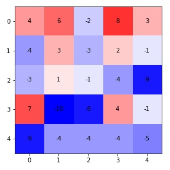
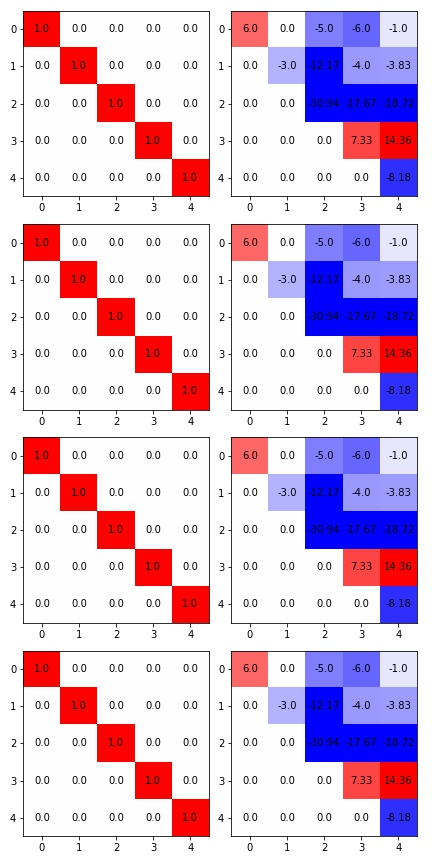

# LU Decomposition


```python
import numpy as np
import matplotlib.pyplot as plt
import seaborn as sn
```

Note that 

$$Ax = b \Rightarrow M_{n-1}...M_2M_1Ax = M_{n-1}...M_2M_1b = \hat b$$ 

$M_i$ are $n\times n$ matrices, 

Let $U = M_{n-1}...M_1A$ where $U$ is upper triangular. Then $Ux = \hat b \Leftrightarrow Ax = b$ and since $U$ is triangular, it's very easy to solve $Ux = \hat b$ (bottom up). Note that $U$ must have all its diagonal being non-zero. 

Note that for each row, it takes $1$ division and $n$ multiplications and $n$ additions. There's a total of 

$$n\cdot \text{DIV} + \sum^n (i - 1)(\text{ADD} + \text{MULT}) = n\cdot \text{DIV} + \frac{n(n-1)}{2}(\text{ADD}+\text{MULT})$$

## Gaussian Elimination
Denote the entries of all matrices in such

$$A = \begin{bmatrix}a_{11}&...&a_{1n}\\...&...&...\\a_{n1}&...&a_{nn}\end{bmatrix}$$


Consider $M_1$ so that $M_1A$ have the first column be $(a_{11}, 0, ..., 0)^T$. Let the diagonal of $M_1$ be all $1$, and the first column be $m_{i1}=-\frac{a_{i1}}{a_{11}}, i = 1, 2,..,n$ (note that $m_{11}=a_{11}/a_{11}=1$).

$$M_1 = I - \vec m_1\vec e_1^T, \vec m_1 = (0, \frac{a_{21}}{a_{11}}, ..., \frac{a_{n1}}{a_{11}})$$

Then, for $M_2$, $M_2A$ have the first two columns be $(a_{12}, a_{22}, 0, ..., 0)^T$. Let $M_2$ be the identity with the second column be $m_{i1}=-\frac{\hat a_{i2}}{a_{22}}, i = 2, 3,...,n$

$$M_2 = I - \vec m_2\vec e_2^T, \vec m_2 = (0, 0, \frac{a_{32}}{a_{22}}, ..., \frac{a_{n2}}{a_{22}})$$

Therefore, we are recursively doing Gaussian elimination, and each time, we reduced one column and shrink the dimension by one. 


```python
D = 5
M = []
A = np.random.randint(-10, 10, (D, D))
fig, ax = plt.subplots(figsize=(4, 4))
ax.imshow(A,cmap="bwr", vmin=-10, vmax=10)
for (j,ii),label in np.ndenumerate(np.round(A, 2)):
    ax.text(ii,j,label,ha='center',va='center', color="black")
plt.tight_layout()
fig.savefig("assets/lu_decomposition_1.jpg")
```



```python
fig, axs = plt.subplots(D - 1, 2, figsize=(6, D*2.4))
for i in range(D - 1):
    m = np.identity(D)
    m[i+1:, i] -= A[i+1:, i] / A[i, i]
    A = m @ A
    axs[i][0].imshow(m, cmap="bwr", vmin=-1, vmax=1)
    for (j,ii),label in np.ndenumerate(np.round(m, 2)):
        axs[i][0].text(ii,j,label,ha='center',va='center', color="black")
    axs[i][1].imshow(A, cmap="bwr", vmin=-10, vmax=10)
    for (j,ii),label in np.ndenumerate(np.round(A, 2)):
        axs[i][1].text(ii,j,label,ha='center',va='center', color="black")
plt.tight_layout()
fig.savefig("assets/lu_decomposition_2.jpg")
```


    
### Total work
Division: $(n-1) + (n-2) + ... + 1 = \frac{n(n-1)}{2}$  
Multi and Add: $(n-1)^2 + (n-2)^2 + ... + 1 = \frac{n(2n-1)(n-1)}{6}$  
Total: $\frac{n^3}{3} + O(n^2)$

### Compute b hat

$$\hat b = M_{n-1}...M_{1}b$$

Note that matrix matrix multiplication $M_iM_j$ takes $O(n^3)$ operations while matrix vector multiplication $M_ib$ takes $O(n^2)$ operations.

Also, note that $M_1 = I - m_1e_1^T$, 

$$M_1b = b - (\vec m_1e_1^Tb) = b - \vec m_1(e_1^Tb) = b - \vec m_1b_1$$

Only takes $n-1$ additions and multiplications

Similarly, 

$$M_2M_1b = M_2\tilde b = \tilde b - m_2\tilde b_2$$

Takes $n-2$ additions and multiplications

The total steps are $\frac{n(n-1)}{2} = \frac{n^2}{2} + O(n)$ addition and multiplications

If we want to solve $Ax = b, Ay = c$, we can store $M_{n-1}...M_1A$ so that we only have to compute $\hat b, \hat c$ which takes much less time. (Since the most expensive work is to get $M_k$'s). 

### Properties of M's

Note that determinant of triangular matrices are the product of the diagonal See [Proof](https://proofwiki.org/wiki/Determinant_of_Triangular_Matrix)

Therefore, $M$ are non-singular with $det(M)=1$

__Theorem__ $M_1^{-1} = (I + m_1e_1^T)$

_proof_. 

\begin{align*}
MM_1^{-1} &= (I-m_1e_1^T)(I+m_1e_1^T) \\
&= I - Im_1e_1^T + Im_1e_1^T + (m_1e_1^T)(m_1e_1^T)\\
&= I - m_1(e_1^Tm_1)e_1^T\\
&= I - m_1\quad [1,0,...,0]\begin{bmatrix}0\\m_{21}\\...\\m_{n1}\end{bmatrix}\quad e_1^T\\
&= I - m_10e_1^T\\
&= I
\end{align*}

## LU Factorization

Want to find $L$ being lower triangular and $U$ upper triangular so that $A = LU$. 

By Gaussian elimination we already have $U$ so that we can have $A = M_1^{-1}...M_{n-1}^{-1}U$, so that $L = M_1^{-1}...M_{n-1}^{-1}$

By theorem above, we know $M_k = I-m_ke_k^T$

Note that $M_1^{-1}...M_{n-1}^{-1} = I + \sum_{i=1}^N m_ie_i^T$

If you have a LU factorization of $A$, then can easily solve $Ax=b\Rightarrow LUx = b \Rightarrow Ly = b$  
So that we can solve $Ly=b$ then $Ux=y$

### Runtime
Since $L$ is lower triangular. we'll solve top down, and takes a total of $\frac{n(n-1)}{2}$ addition and multiplication. 

### Computing Determinant
Consider $A_{kk}$ be $A_{k:n \times k:n}$ so that the classical way of solving determinant will be expanding the determinant along a row/column

$$\det(A) = \sum_{i=1}^n (-1)^{i-1}{a_{1i}} \det(A_{ii})$$

Let $t(n)$ be the number of multiplications to compute $A_{n\times n}$ then 
$f(n)=nf(n-1) +n \geq n!$

__Theorem__ $\det(AB) =\det(A)\det(B)$

So that $\det(A) = \det(L)\det(U) = 1 \times diag(U)$  
Remember that computing $U$ takes $\frac{n^3}{3} + O(n^2)$ times
