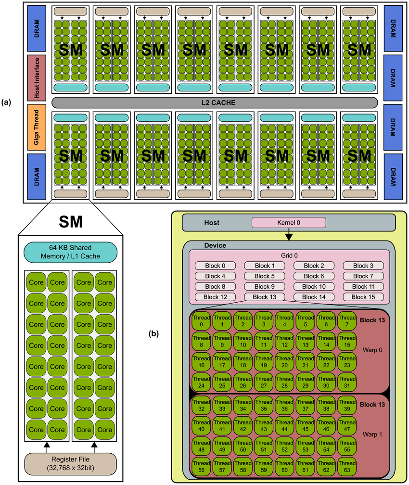

# CUDA Programming - Basics

## GPU Architecture (based on NVIDIA)

A GPU has a massive number of ALU (or other computation cores such as CUDA cores, Tensor cores, RT cores) and a few CU. 

Each core on GPU makes one thread, even though much slower than a CPU core. but GPU can have thousands of cores (3584 on RTX3060 vs. 8 on Ryzen5)

The GPU (device) is connected to the CPU (host) through PCIe bus, GPU has its own memory system, which have significantly larger bandwidth (~300GB/sec GDDR6 vs. ~25GB/sec DDR4 3200), but smaller (12GB on RTX3060).



### SM: Streaming Multiprocessor
The core of one GPU is further divided into SMs (28 SMs for RTX3060).  
SM is the basic unit for arithmetic operations. The architecture design helps to help latency and manages the high throughput. Each SM has

- 128 computing cores
- thousands of registers (or even more)
- cache system: 
    - shared memory: fast interchange within SM
    - constant cache: fast broadcast read-only constant memory
    - texture cache: cache designed specifically for texture files (remember GPU is originally designed for graphics)
    - L1 cache: cache for local to global memory
- Warp scheduler: quickly switch between thread contexts, and issue instructions to groups of threads (warps)
- FP32 cores, Int cores, or even Tensor cores and RT cores

## CUDA Basics

Download CUDA Toolkit, which includes the compiler `nvcc`, profiling tool `nvprof`, debugger `cuda-gdb`. and all libraries for arithmetic applications (cuBLAS, cuFFT, cuRAND, cuSOLVER, cuSPARSE, etc.)

### CUDA C (Typical) Program
1. allocate memory on CPU (host)
2. allocate memory on GPU (device)
3. copy data from host to device
4. launch kernels
5. wait/sync for all threads
6. copy data from device to host (not always necessary, eg. graphics output)

### Communicate between host and device
The program need to transform data between host and device, since they have different memory system. 

```c++
// allocate memory on the device, similar to how malloc is used
__host____device__
cudaError_t cudaMalloc(
    void** devPtr, 
    size_t size
);

// Copies data between host and device.
__host__ 
​cudaError_t cudaMemcpy(
    void* dst, 
    const void* src, 
    size_t count, 
    cudaMemcpyKind kind
);
// cudaMemcpyKind includes
cudaMemcpyHostToDevice; 
cudaMemcpyDeviceToHost;
cudaMemcpyDefault; // inferred from src and dst pointer
```

The most basic routine is similar to how we use heap memory.
```c++
int input_cpu[N];
int output_cpu[N];
// init variable for GPU
int32_t *input_gpu = NULL;
int32_t *output_gpu = NULL;
// allocate memory for GPU
cudaMalloc(&input_gpu, size_of(int32_t) * N);
cudaMalloc(&output, size_of(int32_t) * N);

// copy from host to device
cudaMemcpy(input_cpu, input_gpu, sizeof(int32_t) * N, cudaMemcpyHostToDevice);

/* ... do computations on kernel ... */

// copy from device to host
cudaMemcpy(output_gpu, output_cpu, sizeof(int32_t) * N, cudaMemcpyDeviceToHost);

// free the device memory to avoid mem leak
cudaFree(&input_gpu);
cudaFree(&output_gpu);
```

### Function scope and kernels
If a program runs on CPU (as normal program), its scope is on host, if on GPU, its scope is on device.

We use qualifier before the function signature to specify its scope

| qualifier                  | executed on | callable from | example                                   |
| -------------------------- | ----------- | ------------- | ----------------------------------------- |
| `__device__`               | device      | device        | `__device__ float add(float a, float b);` |
| `__global__`               | device      | host/device   | `__global__ void render();`               |
| `__host__` or no qualifier | host        | host          | `int main()`;                             |

For `__global__`, we call it a kernel, it is called by the CPU. 


### Grids, blocks, and threads

kernels are called with 
```c
kernel_name<<< n_blocks, n_threads[, shared_mem_size] >>>(args);
```
`n_blocks, n_threads` refers to a hierarchy of threads in software which mimics how thread processors are grouped on the GPU. A kernel is launched with a `grid` of `thread_blocks`. 

`thread` is the basic computation unit.   

`block` is a collection of threads, which can be organized in 1D, 2D, 3D. Threads in the block is scheduled in wraps, so `block` should have multiple of 32 threads.  

 - `block` will be assigned to a SM (when available, otherwise queued), and each SM can have multiple blocks' context. 
 - Since `block` resides in one SM, the threads in the same block can communicate via shared memory, while thread in different cannot.

`grid` (`<<<>>>` notation) is the collection of blocks, which can be organized in 1D, 2D, 3D. 

#### Starting a kernel given grid layout
```c++
/* for 1D, use integer type */
// starts a kernel with 32 threads per block, 
// 64 blocks per grid
// total of 64 * 32 = 2048 threads
kernel_name<<<64, 32>>>(args);

/* for 2D and 3D, use dim3 */
dim3 threadsPerBlock(16, 8); // 2D block with 16 * 8 = 128 threads
dim3 blocks(2, 2, 4); // 3D grid with 2 * 2 * 4 = 16 blocks
// total of 128 * 16 = 2048 threads

threadsPerBlock.x; // 16
threadsPerBlock.y; // 8
threadsPerBlock.z; // 1 since 2D
blocks.z // 4

// start the kernel with given grid layout
kernel_name<<<blocks, threadsPerBlock>>>(args);
```

#### Indexing a grid
Within kernels, we can use build-in notations to get the index 
```c++
dim3 threadIdx; // thread idx within its block
dim3 blockDim; // size of a block
dim3 blockIdx; // block Index in the grid
dim3 gridDim; // size of the grid, how many blocks

// whether starting with 1D, 2D, 3D
// they are all dim3, thus access with
threadIdx.x; 
threadIdx.y;
threadIdx.z;
```

### Divergent Warp
Note that GPU has much smaller CU, hence less emphasis on the control flow. The warp scheduler is used to hide memory access latency and control flow execution (`if/else` clauses). 

All threads in a warp (controlled by the warp scheduler on the hardware) will execute the same instruction. Therefore, consider the `if test-stmt then-stmt else-stmt` clauses, if all of the warp runs on the `then-stmt`, then it is __coherent execution__. Otherwise, it is called __divergent execution__. 

In the case of __divergent execution__, a warp will take 2x time steps. First run only the `then-stmt` threads by masking out `else-stmt` threads; and then run `else-stmt` masking out the `then-stmt` threads. 

### Basic Example
GPU implementation to fill an array with `range(N)`;
```c++
__global__ void fill_range(int32_t *arr, int32_t N) {
    int32_t i = blockIdx.x*blockDim.x + threadIdx.x;
    if (i < N) arr[i] = i;
}

int main() {
    int32_t *arr_gpu = NULL;
    cudaMalloc(&arr_gpu, N * sizeof(int32_t));
    
    fill_range<<<N / 128, 128>>>(arr_gpu, N);

    int arr[N];
    cudaMemcpy(arr_gpu, arr, N * sizeof(int32_t), cudaMemcpyDeviceToHost);
    cudaFree(&arr_gpu);
    return 0;
}
```

## Memory Types

| type | scope | access speed |  syntax | 
| --- | --- | --- | --- | 
| global | device and host | 1x | `[__global__] int32_t* arr;`|
| local | per thread | ~1x | within kernel, `int arr[N];` |
| shared | per block | ~10-100x | `__shared__ int arr[N];` |
| constant | device and host, read-only | >1x, more to consider | `__constant__ int32_t arr[N];`|
| texture | device and host, read-only | >1x | `texture<float, cudaTextureType2DLayered> tex;` |


### Local and Global Memory
Global memory are the largest memory on the device. It is allocated and managed by the host. Its memory addresses are accessible from both host and device (hence `__global__`). Global is allocated via `cudaMalloc` (and all `malloc`-like APIs). As in the [basic example](#basic-example), `arr_gpu` is in the global memory

Local memory are memory that statically allocated within a kernel. It is only visible per thread. The access to local memory is coalesced. As in the [basic example](#basic-example), `i` is in the global memory.

The latency and bandwidth for global and local memory are similar. An (not very accurate) analogy can be the stack memory and heap memory. 

### [Shared Memory](https://developer.nvidia.com/blog/using-shared-memory-cuda-cc/)
Shared memory can be thought as a controllable L1 cache. It is declared using `__shared__` keyword, allocated per block. The memory is "shared" per block. 

#### Bank Conflict
The shared memory, in order to minimize latency and maximize throughput, is organized in banks (equally sized memory modules). Each bank is 4 bytes. Thus, any memory ops of `N` addresses spanning `N` distinct memory banks can be served simultaneously.  

Thus, a __bank conflict__ happens when multiple threads request the same memory bank. The only exception is when all threads address the same shared memory address, resulting in a broadcast. 

For example, 
```c
int block_size = blockDim.x;
int tid = threadIdx.x;

__shared__ int32_t shmem[128];
/*  bank0   0 32 64 96
    bank1   1 33 65 97
    ...
    bank31 31 63 95 127
*/

// thread i access bank i + offset, no conflict
int32_t a = shmem[offset + tid];

// thread i access bank 2 * i + offset, 2x conflict
int32_t b = shmem[(offset + 2 * tid)];
```

Also note that per-bank is 32 bits (one `float` or `int`), thus if we use `short, double, long, struct` we must care about bank conflict. 
```c
__shared__ long shmem[64];
/*  bank0   0 16 32 48
    bank1   1 17 33 49
    ...
    bank31 15 31 47 63
*/
// 2x conflict, the same effect as of 2 * i + offset
long a = shmem[offset + tid];

__shared__ short shmem[256];
/*  bank0   0  64 128 192
    bank1   2  66 130 194
    ...
    bank31 62 126 190 255
*/
// 2x conflict, adjacent tids are in the same bank 
short a = shmem[offset + tid];
```

#### Synchronizations
Note that shared memory is shared within a block, whiles threads in one block won't necessarily run code simultaneously. Therefore, we need to sync the threads block-wise using 
```c
__syncthreads();
```

shared memory also introduces race conditions. Thus, CUDA supports several atomic ops. In the style of 
```c
// read a from address, compute a + b, stores in address, return a
Number atomicOp(Number *address, Number b);

int a = 2, b = 1, c;
c = atomicAdd(&a, b); 
printf("%d %d %d\n", a, b, c); // 3 1 2
```


### Constant Memory
Read-only small memory (~64KB). Since it is read only, it is broadcast to a half-warp, and is cached. 

### Texture Memory
It is designed for graphics purposes (for mapping 2D data (textures) onto 3D objects). While it can also be used in CUDA for general purposes. 

It is a special structured data. For example. 
```c
texture<float, cudaTextureType2DLayered> tex;
```

The usage and characteristic is similar to constant memory. However, since it is specially purposed, it can be useful when memory accesses have good spatial locality. 