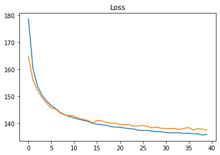
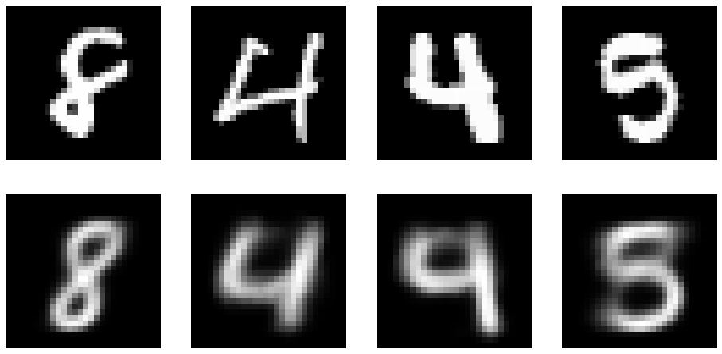

# Variational Autoencoders

[Dimension Reduction and Autoencoder Basics](../csc311/pca.md)

## Autoencoders

As a recap, an encoder-decoder is a fair of function (often non-linear functions implmented as neural networks). 

- Encoder $g: D\rightarrow F$
- Decoder $f: F\rightarrow D$
  
where $D$ is the  input space, $F$ is the feature vector, where $\dim(F)\ll \dim(D)$. 

The goal of an atuoencoder is that for any input 

$$\forall x \in D. \tilde x = f(g(x)) \approx x$$

Therefore, we could compress input data $x$ into a lower dimension features, for storage, comparisons, visualizations, etc. 

### Proximity Issue

Note that $f,g$ are non-linear, and decoder can not an inverse function of $f\neq g^{-1}$. Thus, small change in the input space does not corresponds to small change in the feature space. In fact, $f$ and $g$ can acts as some hashing functions that prevents proximity. 

In addition, if the data space has discontinuities, for example, several clusters with remote means and small variance. Then, if we sample from the "vacuum" in the input space, then the feature can be totally random. 

## Variational Autoencoders

VAEs solve proximity issue by introducing uncertainty. By adding noise, VAEs force the encoder to output more uniformly continuous results. The encoder outputs a distribution $q_\theta(z|x)$ instead of a deterministic feature vector. Normally, we will use Gaussian distribution for $q$, so that encoder outputs $(\mu, \sigma) = f(x)$, in practice $\Sigma$ is the diagonal matrix. 

The idea of VAE comes from variational inference. Let the feature vector be the laten variable, and input data be the observations, the autoencoder aims to recover the posterior $p(z|x)$ from likelihood and prior. And we use $q_\theta$ to approximate such $p$ due to computational limits. For optimization / training VAEs, we use ELBO as its loss. Thus, we have 

 - __Encoder__ $q_{\phi_i}(z|x_i) = \mathcal N(\mu_i, \sigma_i^2)$ where we store the mean $\mu_i$ and log std $\sigma_i$ for each input. 
 - __Decoder__ $f(z_i) = \tilde \theta$, typically a neural network that output parameters for a class of distribution. 

### Pipeline
For each given input $x_i$, we have the forward path as

1. The __encoder__ NN $g$ output $\phi_i = g(x_i)$.
2. Sample __latent vector__ $z_i \sim q_{\phi_i}(z|x_i)$.
3. The __decoder__ NN $f$ output $\theta = f(z_i)$.
4. Sample __decoded sample__ $\hat x_i = p_{\theta}(x|z)$

Consider the backward path, we have two ELBOs for $p_\theta$ and $q_\phi$ be the losses, note that ELBO loss requires the reparameterization tricks, similar to VI.

### Amortized VAE
Instead of doing VI from scratch for each $x_i$, we learn a function that can look at the dataset all together. Therefore, instead of learning separate parameters $\phi_i$ for each input, we learn a single global distribution $\phi$ that specifies the parameters of the recognition model, and $\phi$ is the parameter sets we want to store. 

The basic for AVAE pipeline is very similar to VAE, except that we now have a high-dimensional model. Thus, we sample from 

$$z_i \sim q_{\phi}(z|x_i) = \mathcal N(\mu_\phi(x_i), \Sigma_\phi(x_i))$$

### Implementation Example: MNIST
Using the classical MNIST example

- Input data: $28 * 28$ pixels of value $[0,1]$, representing grayscale.
- Likelihood function $p_\theta(x|z) = \text{Bernoulli}(\theta)$
- Approximate posterior $q_{\phi_i}(z|x_i) = \mathcal N(\mu_i, \sigma_i)$
- Loss be the ELBO loss + Reconstruction loss

```python
 --8<-- "csc412/scripts/vae.py:vae"
```
The training process

<figure markdown>
  {width="480"}
</figure> 


The reconstruction

<figure markdown>
  {width="720"}
</figure> 


Random samples from the hidden vector code

<figure markdown>
  {width="720"}
</figure> 


???quote "Source code"

    ```python 
    --8<-- "csc412/scripts/vae.py"
    ```
