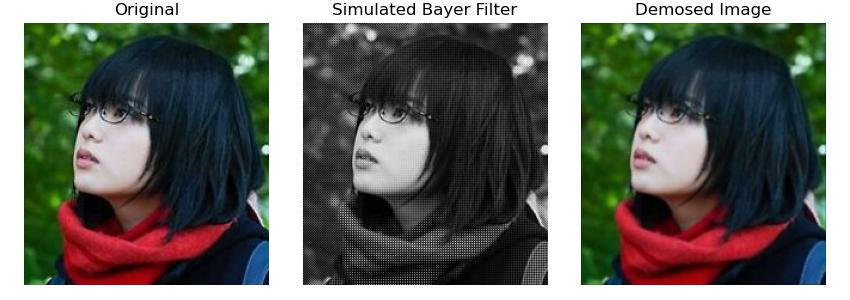
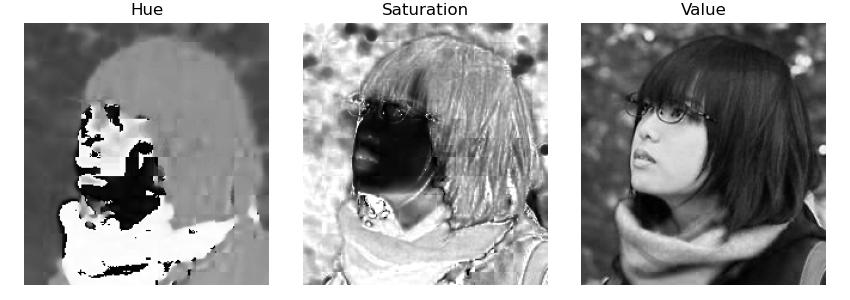
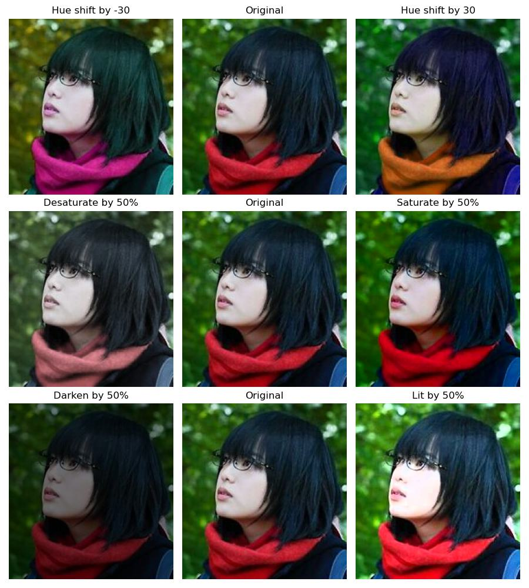

# Raster Image


## Image
Consider image as function

$$I(x, y): R\subset \mathbb R^2 \rightarrow V$$

where $R$ is the area (in most cases rectangle area) and $V$ is the set of possible pixel values.   
For example, for a grayscale image, $V= \mathbb R^+$, a.k.a. the brightness.  
For a idealized color image, with RGB values at each pixel, then $V=(\mathbb R^3)^+$

A raster iamge is then the sample of the continuous image. Each pixel is a sample and the rectangular domain of a $W\times H$ image is 

$$R = [-0.5, W-0.5]\times [-0.5, H-0.5]$$

## Pixels and subpixels
The raw color measurements made by modern digital cameras are typically stored with a single color channel per pixel. This information is stored as a seemingly 1-channel image, but with an understood convention for interpreting each pixel as the red, green or blue intensity value given some pattern. The most common is the Bayer pattern. In this assignment, we'll assume the top left pixel is green, its right neighbor is blue and neighbor below is red, and its kitty-corner neighbor is also green.


To demosaic an image, we would like to create a full rgb image without downsampling the image resolution. So for each pixel, we'll use the exact color sample when it's available and average available neighbors (in all 8 directions) to fill in missing colors. This simple linear interpolation-based method has some blurring artifacts and can be improved with more complex methods.

```python title="Simulate Bayer Filter"
--8<-- "csc418/scripts/raster_image.py:bayer"
```

```plotly
{"file_path": "csc418/assets/bayer.json"}
```


```python title="Demosaic"
--8<-- "csc418/scripts/raster_image.py:demosaic"
```

    

    


## Conversion between RGB and HSV

HSV stands for hue, saturation, and value. Is another way of representing an image. Which is to have a more closely align with the way human vision perceives color-making attributes. $H\in [0, 360]$ is a periodic measurement and $S\in [0, 1], V\in[0, 1]$

### RGB to HSV
Given RGB values in $[0, 1]^3$,  
First calculate the chroma range, 

$$C_{\min} = \min(R, G,B), C_{\max} = \max(R, G, B), \Delta = C_{\max} - C_{\min}$$


__Value__

$$V = C_{\max}$$

$V$ is the max of lightness among the RGB channels

__Hue__

$$H = \begin{cases}
0 &\Delta = 0\\
60 (\frac{G-B}\Delta) & C_{\max} = R\\
60(\frac{B-R}{\Delta} + 2) &C_{\max} = G\\
60(\frac{R-G}{\Delta} + 4) &C_{\max} = B
\end{cases}$$

Note that when $C_{\min} = C_{\max}\Leftrightarrow \Delta = 0$, this means the color is black/white.  

__Saturation__ 

$$S = \begin{cases}
0 &\Delta = 0\\
\Delta / C_{\max} &C_{\max} \neq 0
\end{cases}$$

### HSV to RGB
Given $H\in [0, 360), S, V \in [0,1]$ (Note that since $H$ is periodic, if $H\in \mathbb R$, just take mod of 360)  

\begin{align*}
C &= V\cdot S\\
X &= C(1-|(\frac{H}{60}\mod 2) - 1|)\\
m &= V - C\\
RGB_{raw} &= \begin{cases}
(C, X, 0) &H\in [0, 60)\\
(X, C, 0) &H\in [60, 120)\\
(0, C, X) &H\in [120, 180)\\
(0, X, C) &H\in [180, 240)\\
(X, 0, C) &H\in [240, 300)\\
(C, 0, X) &H\in [300, 360)\\
\end{cases}\\
RGB &= 255(RGB_{raw} + m)
\end{align*}


```python
--8<-- "csc418/scripts/raster_image.py:color"
```


    

    


With HSV images, we can easily tune the lightness, hue, and saturation


```python
--8<-- "csc418/scripts/raster_image.py:edit"
```

    

    


## Alpha Compositing

If we want
to composite a foreground color $c_f$ over background color $c_b$ , and the fraction of
the pixel covered by the foreground is $\alpha$, then we can use the formula 

$$c = ac_f + (1-a) c_b$$
