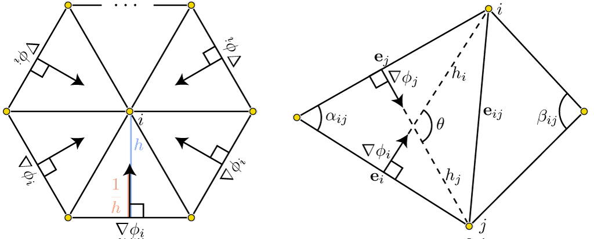
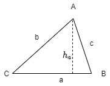

# Surface Smoothing

## Motivation

Given a scanned of a ball, due to the noise in scanning, the formed mesh may not be smooth, i.e. the transition in normal/tangent is not continuous. Therefore, we want to smooth it out. 

Mathematically, we have a data signal over a curved surface, the data signal may be 
 - __Data denoising__ a scalar field defined on a static surface, we want the function of the data signal on the surface to be smooth
 - __Surface fairing__ the geometric position of the surface itself, we want the underlying geometry of the domain to be smoothed.

## Formation of the System
### Flow-based Formation
We can think of the signal as undergoing a flow toward a smooth solution over some phony notion of "time", then we should have the PDE being set as the change in signal value $u$ over time proportional to the Laplacian of the signal 

$$\frac{\partial u}{\partial t} = \lambda \Delta u$$

where $u$ is the function of the signal, $\Delta$ is the Laplacian operator and $\lambda$ is the rate of smoothing. 

Given a noisy signal $f$, intuitively we can smooth by average values with its neighborings. If we average of the small ball of nearby points, then we can have smoothing function

$$u(x) = |B_\delta(x)|^{-1}\int_{B_\delta(x)}f(z)dz$$

If $\delta$ is small, then we will have to repeat the smoothing multiple times to see a global smoothing. Hence, we can write the current value $u^t$ flows toward smooth solution by small step $\Delta t$ in time

$$u^{t+\Delta t}(x) = |B_\delta(x)|^{-1}\int_{B_\delta(x)}u^t(z)dz$$

Subtracting current $u^t(x)$ from both sides and introducing a flow-speed parameter $\lambda$, we will have the flow equation describing the change in values as an integral of relative values

$$\frac{\partial u}{\partial t} = \lambda |B_\delta(x)|^{-1}\int_{B_\delta(x)}(u(z)-u(x))dz$$

For harmonic functions, $\Delta u =0$, this integral becomes zero in the limit as the $\delta\rightarrow 0$ via satisfaction of MVT. If follows for a non-harmonic $\Delta u\neq 0$, this integral is equal to the Laplacian of $u$, i.e.

$$\frac{\partial u}{\partial t} = \lim_{|B_\delta(x)|\rightarrow 0}\lambda |B_\delta(x)|^{-1}\int_{B_\delta(x)}(u(z)-u(x))dz = \lambda \Delta u$$

### Energy-based Formation
Alternatively, think of a single smoothing operation as the solution to an minimization problem. If $f$ is the noisy signal, then we want to find a signal $u$ that it simultaneously minimizes its difference with $f$ and minimizes its variation over the surface

$$\arg\min_u \frac12\int_S(f-u)^2 + \lambda \|\nabla u\|^2 dA$$

where $\lambda$ is the rate of smoothing. 

Note that $f$ is unknown and we are optimizing a function w.r.t. the integral involving itself and its second order derivative. Then, this is the calculus of variations problem. Then, applying Green's first identity, we can arrive the same conclusion that 

$$u^*(x) - f(x)= \lambda \Delta u^*(x), \forall x$$

### Implicit Smoothing Iteration
Let $u^0 = f$, we can compute a new smoothed function $u^{t+1}$ from the current solution $u^t$ by solving

$$u^t(x) = (id - \lambda \Delta) u^{t+1}(x), \forall x\in S$$

where $id$ is the identity operator.

## Discrete Laplacian
Note that we are doing graphics! So we will only need discrete approximations of id and Laplacian operators. Therefore, we need to produce some sparse Laplacian matrix $L\in\mathbb R^{n\times n}$ for a mesh of $n$ vertices. 

### Finite Element Derivation of the Discrete Laplacian
We want to approximate the Laplacian of a function $\Delta u$. First, consider $u$ as a piecewise-linear function represented by scalar values at each vertex, collected in $\mathbf u\in \mathbb R^n$. 

Any piecewise-linear function can be expressed as a sum of values at mesh vertices times corresponding piecewise-linear basis functions (hat functions, $\varphi_i$)

\begin{align*}
u(x) &= \sum^n u_i\varphi_i(x)\\
\varphi(x) &= \begin{cases}1&x=v_i\\\frac{A(x, v_j, v_k)}{A(v_i, v_j, v_k)}&x\in\text{triangle}(i,j,k)\\0&\text{otherwise}\end{cases}
\end{align*}

By plugging the definition into smoothness energy above, we have

\begin{align*}
\|\Delta u(x)\|^2 &= \|\nabla \big(\sum^n u_i\varphi_i(x)\big)\|^2\\
&= \big(\sum^n u_i\nabla \varphi_i(x)\big)\big(\sum^n u_i\nabla\varphi_i(x)\big)\\
&= \sum_i^n \sum_j^n \nabla\varphi_i\cdot\nabla\varphi_ju_iu_j
\end{align*}

Therefore, 

$$\int_S\|\nabla u(x)\|^2dA = \int_S\sum_i^n \sum_j^n \nabla\varphi_i\cdot\nabla\varphi_ju_iu_j = u^TLu$$

where 

$$L_{ij} = \int_S \nabla \varphi_i\nabla\varphi_j dA$$

By defining $\varphi_i$ as piecewise-linear hat functions, the values in the system matrix $L_{ij}$ is uniquely determined by the geometry of the underlying mesh, known as cotangent weights. 

First note that $\nabla\varphi_i$ are constant on each triangle, and only nonzero on triangles incident on node $i$, for such trianlge $T_\alpha$, $\nabla {\varphi_i}$ points perpendicularly from the opposite edge $e_i$ with inverse magnitude equal to the height $h$ of the triangle treating that opposite edge as base, 

$$\|\nabla \varphi_i\| = h^{-1} = \frac{\|e_i\|}{2A}$$

Now for neighboring nodes $i,j$ connected by edge $e_{ij}$. Then $\nabla \varphi_i$ points toward node $i$ perpendicular to $e_i$ the same for $\nabla \varphi_j$. Hence, call the angle formed between these two vectors $\theta$, then 

$$\nabla\varphi_i \cdot\nabla\varphi_j = \|\nabla\varphi_i\|\|\nabla\varphi_j\|\cos\theta = \frac{\|e_j\|}{2A}\frac{\|e_i\|}{2A}\cos\theta$$

call $a_ij = \pi-\theta$ the angle between $e_i$ and $e_j$, then 

$$\cos\theta = -\cos(\pi-\theta) = -\cos a_{ij}$$

Thereforem $\frac{\|e_j\|}{2A}\frac{\|e_i\|}{2A}\cos\theta = -\frac{\|e_j\|}{2A}\frac{\|e_i\|}{2A}\cos a_{ij}$, so that

$$\sin a_{ij} = \frac{h_j}{\|e_i\|} = \frac{h_i}{\|e_j\|}$$

Then, we can replace $\|e_i\| = \frac{h_j}{\sin a_{ij}}$, 

\begin{align*}
\nabla\varphi_i \cdot\nabla\varphi_j &= -\frac{\|e_j\|}{2A}\frac{\|e_i\|}{2A}\cos a_{ij}\\
&= -\frac{\|e_j\|}{2A}\frac{h_j}{2A}\frac{\cos a_{ij}}{\sin a_{ij}}\\
&= -\frac{\cot a_{ij}}{2A}
\end{align*}

Similarly, inside the other triangle $T_\beta$ incident on nodes $i,j$ with angle $\beta_{ij}$, we have 

$$\nabla\varphi_i \cdot\nabla\varphi_j = -\frac{\cot\beta_{ij}}{2B}$$

Then, go back to the integral over area, 

$$\int_S \nabla \varphi_i\cdot \nabla\varphi_jdA = [A\nabla \varphi_i\cdot \nabla\varphi_i]\mid_{T_a} + [B\nabla \varphi_i\cdot \nabla\varphi_i]\mid_{T_\beta} = -\frac12(\cot a_{ij} + \cot b_{ij})$$

### Mass Matrix
Treated as an operator, the Laplacian matrix $L$ compute the local integral of the Laplacian of $u$. In the energy based formulation this is not an issue. If we used a similar FEM derivation for the data term we should get another sparse matrix $M\in\mathbb R^{n\times n}$

$$\int_S(u-f)^2dA = \int_S \sum_i^n\sum_j^n \varphi_i\cdot\varphi_j (u_i-f_i)(u_j-f_j)dA = (u-f)^TM(u-f)$$

This matrix $M$ is often diagonalized or lumped into a diagonal matrix, even in the context of FEM. 

$$M_{ij} = \begin{cases}\frac{1}{3}\sum_t^m Area(t)\mathbb I(v_i\in T_t) &i=j\\0&\text{otherwise}\end{cases}$$

Replacing every thing with discrete case, we have 

$$u^t = (I - \lambda M^{-1}L)u^{t+1}$$

However, this equation is had to solve due to the singularity, multiply both sides by $M$ gives a better

$$Mu^t = (M-\lambda L)u^{t+1}$$

Now the system matrix $A=M+\lambda L$ is symmetric and using Cholesky factorization we can solve with it. 

### Laplace Operator is Intrinsic
Note that $\cot$ of a triangle only depends on the edge length, we do not need to know where vertices are actually positioned in space or even which dimension the mesh is living in. Also, applying transformations to a shape that does not change lengths, will have no effect on the Laplacian. 

### Cotangent as a function of only edge length
Given a triangle $abc$ as shown below,  

Note that $A = \frac12 ah_a$, where $h_a$ is the height perpendicular to $a$, hence $h_a = b\sin C$, so that 

$$\sin C = \frac{2A}{ab}$$

By Heron's formula 

$$A = \sqrt{s(s-a)(s-b)(s-c)}, s=\frac12(a+b+c)$$  

By law of cosines

$$\cos C = \frac{a^2+b^2-c^2}{2ab}$$

Therefore, 

\begin{align*}
\cot C &= \frac{\cos C}{\sin C}\\
&= \frac{\frac{a^2+b^2-c^2}{2ab}}{\frac{2\sqrt{s(s-a)(s-b)(s-c)}}{ab}}\\
&= \frac{a^2+b^2-c^2}{4\sqrt{s(s-a)(s-b)(s-c)}}
\end{align*}

## Solutions

### Data Denoising
Our geometry of the domain is not changing, we only change the scalar function living upon it. Therefore, build our discrete Laplacian $L$ and mass function $M$ and apply above formula with a chosen $\lambda$ parameter. 

### Geometric Smoothing
The geometry will change the Laplacian, hence also $L,M$ in the discrete setting. Therefore, if signal $u$ is replaced with the positions of points on the surface (say vertices $V$ in discrete case), then the smoothing iteration update rule is non-linear if we write as 

$$M^{t+1}V^T = (M^{t+1}-\lambda L^{t+1})V^{t+1}$$

However, assuming small changes in $V$ have a negligible effect on $L, M$ then we can discretize explicitly by having $L,M$ before the update

$$M^tV^T = (M^t-\lambda V^t)V^{t+1}$$
