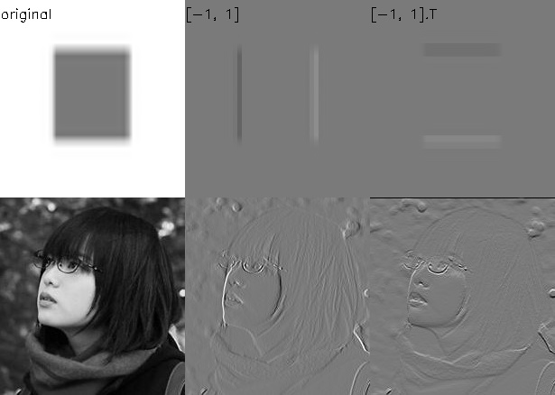
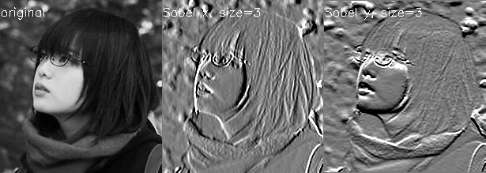
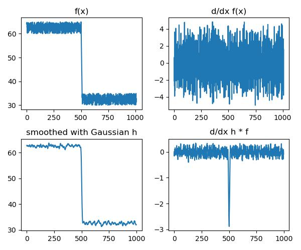
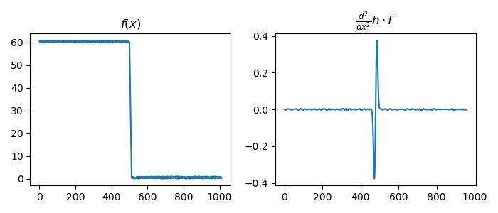

# Edge Detection

## How to find edges
An edge is a place of rapid change in image intensity function $\Rightarrow$ extrema of derivative

Since the image is discrete in pixels, take first-order forward discrete derivative (finite difference)

$$\frac{\partial f(x,y)}{\partial x} = \lim_{h \rightarrow 0}\frac{f(x+h, y) - f(x,y)}{g}\approx \frac{f(x+1, y) - f(x,y)}{1}$$



## Finite Difference Filters
Similarly, there are several common filters

__Prewitt__

$$M_x = \begin{bmatrix}
-1 & 0 & 1\\
-1 & 0 & 1\\
-1 & 0 & 1
\end{bmatrix}, M_y = \begin{bmatrix}
1 & 1 & 1\\
0 & 0 & 0\\
-1 & -1 &1
\end{bmatrix}$$

__Sobel__

$$M_x = \begin{bmatrix}
-1 & 0 & 1\\
-2 & 0 & 2\\
-1 & 0 & 1
\end{bmatrix}, M_y = \begin{bmatrix}
1 & 2 & 1\\
0 & 0 & 0\\
-1 & -2 & 1
\end{bmatrix}$$

__Roberts__

$$M_x = \begin{bmatrix}
0 & 1\\
-1 & 0
\end{bmatrix}, M_y = \begin{bmatrix}
1 & 0 \\
0 & -1
\end{bmatrix}$$



### Image Gradient
The gradient of an image is $\Delta f = [\partial_x f, \partial_y f]$  
The gradient points in the direction of most rapid change in intensity  
The __gradient direction__ (orientation of edge normal) is $\theta = \arctan(\partial_y f / \partial_x f)$
The __edge strength__ is given by the magnitude $\|\Delta f\| = \sqrt{\partial_xf^2 + \partial_yf^2}$

## Effect of Noise
Consider a noisy image $f$, where there are high frequency changes locally

    

    


Therefore, we need to first smooth the image with some filter $h$ and then looks for the peak in $\partial_x (h*f)$

__Differentiation property of convolution__ 

$$\partial_x (h*f) = \partial_x h * f = h * \partial_x f$$

(proof from Fourier Series property of convolution, omitted for complexity)  
Useful because we can save the operation only on our filter, which is often much smaller than the image  

## Canny Edge Detection
One of the best known classical edge detection algorithm

 - Filter image with derivative of Gaussian for horizontal and vertical direction.    
    
 - Find magnitude and orientation of gradient
    
 - Non-maximum suppression
    - purpose: to find "the largest" edge, so that the blurred, or small edges are removed. Overall, the edges will be thinner. 
    - Implementation: For each pixel $(x,y)$, along the direction of the gradient $\theta$, check whether the pixel has the largest magnitude among the neighboring pixels on the positive and negative directions. If yes, then keep it, otherwise, suppress it. 
    
 - Hysteresis thresholding
    - Purpose: since high threshold will wipe out too many edges while small threshold preserves too many unwanted small edges. Hysteresis thresholding will be able to connect stronger edges with thinner edges so that the edges are connected and show the true feature. 
    - Implementation: used two thresholds, high threshold and low threshold, to get two sets of resulted edges. Then, the final result will be the strong edges, plus all thin edges (from low threshold) that are connected between two strong edges (from high threshold).


    


### Laplacian of Gaussians

Using $\partial^2_x h * f$ as the filter, detecting edge by __zero-crossing__ of bottom graph



???quote "Source code"

    ```python 
    --8<-- "csc420/scripts/edge_detection.py"
    ```
    
