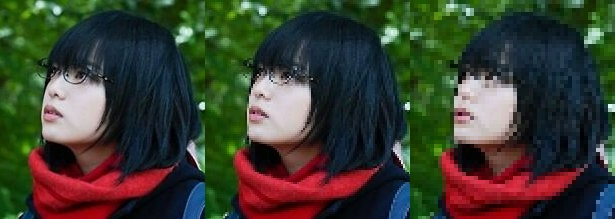
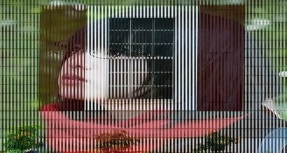
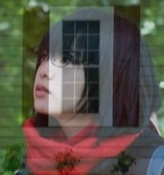

# Image Pyramids

## Image Downsampling

### Initial thought
To resize of image to $\frac{1}{n}$, resample the image by picking pixel per $n$ pixels
    


### Problem: Aliasing
Occurs when sampling rate is not high enough to capture the amount of detail in the image. 

Below is an extremum, which we lost half of the important information
    


### Nyquist rate 
To avoid such aliasing issue, one should sample at least $2\times \max{f}$, i.e. at least twice the highest frequency. 

```plotly
{"file_path": "csc420/assets/nyquist_cos.json"}
```

With twice the frequency, we can make sure the information is caught, while in other cases, it might not be true


### Gaussian pre-filtering

When downsampling, the original image has too high frequencies, results in information loss. The high frequencies are caused by shape edges, hence we can smooth the image to filter out high frequencies, with a low-pass filter



### Gaussian Pyramids
A sequence of images created with Gaussian blurring and downsampling is called a __Gaussian pyramid__ or mip map

## Image Up-Sampling

### Interpolation
Since an image is a discrete point-sampling of a continuous function, i.e. $F(x,y) = quantize\{f(x/d, y/d)\}$. If we could somehow reconstruct the original continuous function, we can generate the image with any resolution and scale. 

However, we are unable to obtain such $f$, but we can guess an approximation

### Nearest neighbor

$$f(x) = F(\arg\min\{d(x - x_i)\})$$

### Linear interpolation

Given $x \in [x_i, x_{i+1}], G(x) = \frac{x_{i+1}-x}{x_{i+1}-x_i}F(x_i) + \frac{x-x_{i+1}}{x_{i+1}-x_i}F(x_{i+1})$

### Via Convolution 1D
To upsampling a line $F= p_1, p_2, ..., p_n$,  
insert $n*0$s between $p_i, p_{i+1}$, make into $G = p_i. 0, 0, ..., 0, p_{i+1}$  
Take convolution filter $h = [0, 1/d, 2/d, ..., d/d, (d-1)/d, ... 0]$   
$h*G$ is desired 

Similar idea goes to 2D

### Bilinear interpolation
Given $Q_{00}=(x_0,y_0), Q_{01}=(x_0, y_1), Q_{10}=(x_1,y_0), Q_{11}=(x_1,y_1)$.  
Interpolate along $x$-axis

$$F(x,y_0)\approx \frac{x_1 - x}{x_1 - x_0}F(Q_{00}) +\frac{x - x_0}{x_1 - x_0}F(Q_{10})$$

$$F(x,y_1)\approx \frac{x_1 - x}{x_1 - x_0}F(Q_{01}) +\frac{x - x_0}{x_1 - x_0}F(Q_{11})$$

Then, interpolate along $y$-axis

$$F(x,y) \approx \frac{y_1 - x}{y_1 - y_0}F(x,y_0) +\frac{y - y_0}{y_1 - y_0}F(x,y_1)$$

\begin{align*}
 F(x,y)= &\frac{(x_1-x)(y_1-y)}{(x_1-x_0)(y_1-y_0)}F(Q_{00})\\
+ &\frac{(x-x_0)(y_1-y)}{(x_1-x_0)(y_1-y_0)}F(Q_{10})\\
+ &\frac{(x_1-x)(y-y_0)}{(x_1-x_0)(y_1-y_0)}F(Q_{01})\\
+&\frac{(x-x_0)(y-y_0)}{(x_1-x_0)(y_1-y_0)}F(Q_{11})
\end{align*}

Therefore, suppose $\|x_1-x_0\| = \|y_1-y_0\| = 1$, i.e. the 4 points form a unit square, and let $x-x_0 = d_x, y-y_0 = d_y$. 

$$F(x,y)=(1-d_x)(1-d_y)F(Q_{00})+d_x(1-d_y)F(Q_{10}) + (1-d_x)d_yF(Q_{01}) + d_xd_yF(Q_{11})$$

Which can be represented by the dot product of $\vec v^T \cdot \vec v$ where $v$ is the vector filter in 1-D case. 

???quote "Source code"

    ```python
    --8<-- "csc420/scripts/image_pyramids.py"
    ```