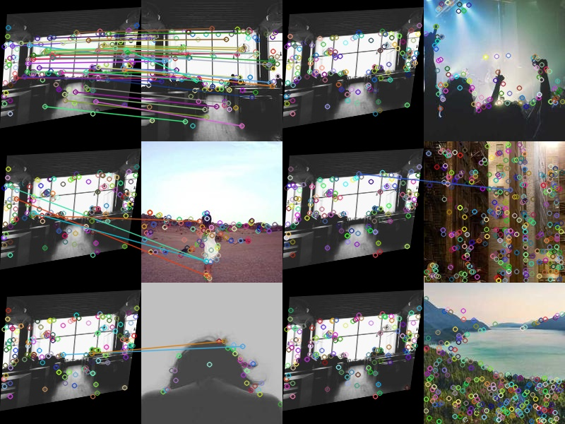

# Features Fast Retrival


For a image matching task, note that in the previous courses we extract local features (i.e. SIFT) on some interest points and performs a least-distance matching. However, consider a database of $N$ images, performing such matching takes at least $O(N)$ times. 


```python
--8<-- "csc420/scripts/indexing.py:dataset"
```
The first 20 examples of the dataset includes


​<figure markdown>
{width="720"}
</figure>

Consider a text documents, an efficient way of find all pages is to use an index, we can build a similar index on the images. 

For a database of images $\mathcal D = \{I_1,..., I_N\}$,  
each image $I_i$ has a set of $m_i$ interest points and their corresponding $D$-dim descriptors $(\mathcal P_i \subseteq \mathbb R^{2\times m_i}, \mathcal F_i \subseteq \mathbb R^{D\times m})$. In SIFT case, $D = 128$. 

## Visual Words
One natural way is to use the descriptors as our visual word, while we have $N\times m$ (assuming each image has $m$ descriptors) different vectors. In order to construct a dictionary of visual words, we perform some kinds of clustering algorithm on all the descriptors. One easy algorithm will be __k-means__ (see CSC311 notes for more details). The $k$ cluster centers will then be the dictionary and we assign each descriptor $f$ to one of the cluster centers $\{W_1, ..., W_k\}$ by $\arg\min_i\|f- W_i\|$.


```python
--8<-- "csc420/scripts/indexing.py:dict"
```

## Inverted File Index
Now, each image is assigned with a number of words. As a book index do, for each word $W_i$, we construct an inverted index $\{I\in\mathcal D\mid W_i\in I\}$


```python
--8<-- "csc420/scripts/indexing.py:invert"
```

## Bag of Words
Now we are retrieve the query image by checking all images in the database that have at least one visual word in common. However, this can still be too large. We need some measurement of similarity between query image and retrieved images. Then just match query to top $K$ most similar images. 

Then, to define "similarity", we consider the distribution of word occurrences within the images. However, if one word appears in many images and has a big count in each image, the similarity will be dominated by it. Therefore, for each image, we make an image description vector with __term frequency-inverse document frequency__

$$\mathbf t = [t_1, t_2,..., t_k], t_i = \frac{n_{id}}{n_d}\log(\frac{N}{n_i})$$

where $n_{id}$ is the number of occurrences of word $i$ in image $d$,  
$n_d$ is the number of words in image $d$ and  
$n_i$ is the number of occurrence of word $i$ in database,  
$N$ is the total number of images in the whole database

```python
--8<-- "csc420/scripts/indexing.py:tfidf"
```

Then, the similarity between two images $t_i, t_j$ is measure as 

$$sim(t_i, t_j) = \frac{t_i\cdot t_j}{\|t_i\|\|t_j\|}$$

```python
--8<-- "csc420/scripts/indexing.py:sim"
```

Then, we can choose top $K$ best ranked images and do spatial verification (RANSAC match transformation matrix). 

```python
--8<-- "csc420/scripts/indexing.py:main"
```

To verify the result we make some transformation on an arbitray image in the database and see if we can find it back


    
​<figure markdown>
{width="720"}
</figure>

## Vocabulary Tree

To further improve the speed, we can use a hierarchical clustering for the words. For example, we can do a kMeans clustering on all the vectors first, then for each cluster, we run kMeans on the vectors that belongs to the cluster, and we can recursively do so. When querying, we do the same thing, i.e. predict the clustering, then go to the next level kmeans.


???quote "Source code"

    ```python
    --8<-- "csc420/scripts/indexing.py"
    ```
    