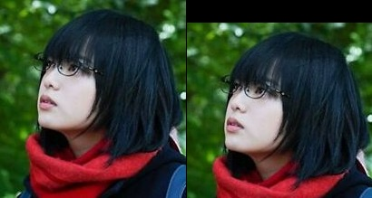
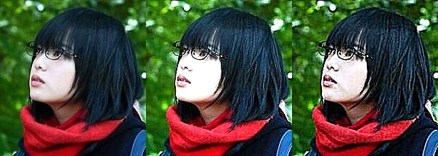
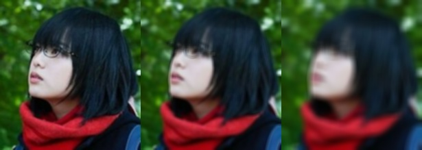
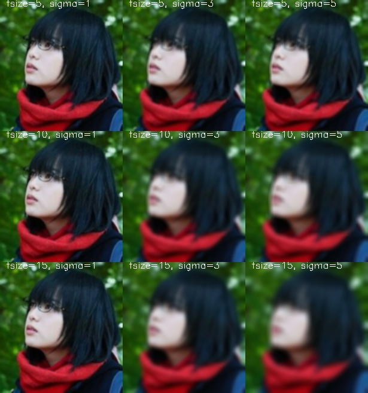
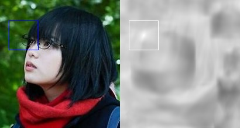
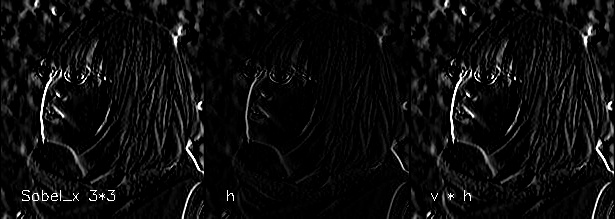

# Linear Filters

## Images

Denote a image (matrix of integer values) as $I$  
For gray-scale images, $I_{m\times n}$; where $I(i,j)$ is called intensity  
For color images, $I_{m\times n\times \{1,2,3\}}$, 3 for RGB values

Alternatively, think of a grayscale image as a mapping $I:\mathbb N^2 \rightarrow \{0,1,...,255\}$, i.e. position $(i,j)\rightarrow$ gray-scale, where 0 is black, 255 is white

__Example__
For image $I(i,j)$; $I(i,j)+50$ lighten the image, $I(i,-j)$ rotate the image horizontally


## Image filters
Modify the pixels in an image based on some function of a local neighborhood of each pixel  

Can be used to enhance (denoise), detect patterns (matching), extract information (texture, edges)


### Boundary Effects
Consider the boundary of the image, there are three modes: `full, same, valid`  

## Correlation
Given a image $I$, the filtered image is 

$$G(i,j) = \sum_{u=-k}^k \sum_{v=-k}^k F(u,v)\cdot I(i+u, j + v)$$

The entries of the weight __kernel__ of __mask__ $F(u,v)$ are often called the __filter coefficients__  
Denote this __correlation__ operator $F\otimes I$

OpenCV `cv2.filter2d`

We can also write correlation in a more compact form using vectors, i.e.

Let $\mathbf f = F$ be the kernel matrix, $\mathbf t_{ij} = T_{i,j}(I_{\{i-k, i+k\} \times \{j-k, j+k\}})$ be the matrix of the image centered at $(i,j)$ and of size $2k + 1$, then $G(i,j)=\mathbf f\cdot \mathbf t_{ij}$

And the full image 

$$\mathbf G_{m\times n} = 
\begin{bmatrix}
G(0,0) &G(0, 1)&\cdots &G(0, n) \\
G(1,0) &G(1, 1)&\cdots &G(1, n) \\
\vdots &\vdots&\ddots &\vdots \\
G(m,0) &G(m, 1)&\cdots &G(m, n) \\
\end{bmatrix}$$

## Example of Filter kernels

### Unchanged
$\begin{bmatrix}
0 &0 &0 \\
0 &1 &0 \\
0 &0 &0
\end{bmatrix}$

### shifting to the left by 1px

$\begin{bmatrix}
0 &0 &0 \\
0 &0 &1 \\
0 &0 &0
\end{bmatrix}$


```python
--8<-- "csc420/scripts/filters.py:shift"
```

​<figure markdown>
{width="720"}
</figure>

## Sharpening
$$M1 = \begin{bmatrix}
0 &0 &0 \\
0 &2 &0 \\
0 &0 &0
\end{bmatrix} - 
\frac{1}{9}
\begin{bmatrix}
1 &1 &1 \\
1 &1 &1 \\
1 &1 &1
\end{bmatrix}$$

To enhance the effect, using a larger center value

$$M2 = \begin{bmatrix}
0 &0 &0 \\
0 &5 &0 \\
0 &0 &0
\end{bmatrix} - 
\frac{4}{9}
\begin{bmatrix}
1 &1 &1 \\
1 &1 &1 \\
1 &1 &1
\end{bmatrix}$$

If we enlarge the matrix to 5

$$M3 = \vec 0_{5\times 5} + [5]_{center} - 
\frac{4}{25}
J_{5\times 5}$$

```python
--8<-- "csc420/scripts/filters.py:sharpen"
```

​<figure markdown>
{width="720"}
</figure>
    

## Smoothing

### Smoothing 1: Moving Averaging filter
Simplest thing is to replace each pixel by the __average__ of its neighbors, i.e. 
$F$ will be a $(2k+1)^{-2} J_{(2k+1)\times (2k+1)}$ matrix 

__Assumption__ neighboring pixels are similar, and noise is independent of pixels. 

For example, the following uses $\frac{1}{9}J_{3\times 3}$ and $\frac{1}{25}J_{5\times 5}$, note that the matrix should add up to one, hence the image is normalized. 


```python
--8<-- "csc420/scripts/filters.py:average"
```

​<figure markdown>
{width="720"}
</figure>
    


### Smoothing 2: Gaussian Filter
When we want nearest neighboring pixels to have the most influence on the output, which can removes high-frequency components from the image (low-pass filter).

For example, 

$$F = \frac{1}{16}
\begin{bmatrix}
1 &2 &1 \\
2 &4 &2 \\
1 &2 &1
\end{bmatrix}$$

The Gaussian kernel is an approximation of a 2d Gaussian function 

$$h_{\sigma}(u,v)=\frac{1}{2\pi \sigma^2}\exp(-\frac{u^2 + v^2}{\sigma^2})$$


```python
--8<-- "csc420/scripts/filters.py:gauss"
```

​<figure markdown>
{width="720"}
</figure>


A more general form of the Gaussian kernel is obtained by the multi-variante Gaussian distribution $\mathcal N(\mu, \Sigma)$, where 

$$P(\vec x) = \frac{1}{(2\pi)^{d/2} |\Sigma|^{1/2}} \exp(-\frac{(\vec x - \mu)^T \Sigma^{-1}(\vec x - \mu)}{2})$$

### Properties of Smoothing
- All values are positive
- The kernel sums up to 1 to prevent re-scaling of the image
- Remove high-frequency components (edges); low-pass filter

### Filtering image to find image crop (Normalized cross-correlation)
Let $\mathbf f$ be a image crop, $\mathbf t$ be the original image, then 

$$G(i,j) = \frac{\mathbf f^T \mathbf t_{ij}}{\|\mathbf f^T \|\|\mathbf t_{ij}\|}$$ 

is the "normalized score" $(0\sim 1)$, where $1$ indicates the matching

Consider the following image crop

```python
--8<-- "csc420/scripts/filters.py:match"
```

​<figure markdown>
{width="720"}
</figure>
    


## Convolution

A convolution $F*I$ is equivalent to flip $F$ along the diagonal and apply correlation. i.e. 

$$G(i,j) = \sum_{u=-k}^k\sum_{v={-k}}^k F(u,v)\cdot I(i-u, j-v)$$

Obviously, for a symmetric filter matrix, convolution and correlation will do the same

Convolution is the natural linear feature, and it is  

- commutative $f*g = g*f$, 
- associative $f*(g*h) = (f*g)*h$, 
- distributive $f*(g+h)=f*g + f*h$
- associative with scalar $\lambda (f*g)=(\lambda f)*g$
- The Fourier transform of two convolved images is the product of their individual Fourier transforms $\mathcal F(f*g) =\mathcal F(f)\cdot \mathcal F(g)$

## Separable Filters
A convolution filter is separable if it can be written as the outer product of two 1D filters. i.e. $F = vh^T$, then $F*I = v*(h*I)$ by associative property. 


__Example__ 

$$ k^{-2} J = k^{-1}[1 \:1 \:... \:1]^T k^{-1}[1 \:1 \:... \:1]$$

$$ \frac{1}{16}
\begin{bmatrix}
1 &2 &1 \\
2 &4 &2 \\
1 &2 &1
\end{bmatrix} 
= \frac{1}{4}
\begin{bmatrix}
1\\ 2\\ 1
\end{bmatrix}
\frac{1}{4}
\begin{bmatrix}
1&2&1
\end{bmatrix}$$

$$
\begin{bmatrix}
-1 &0 &1 \\
-2 &0 &2 \\
-1 &0 &1
\end{bmatrix} 
= 
\begin{bmatrix}
1\\ 2\\ 1
\end{bmatrix}
\begin{bmatrix}
-1&0&1
\end{bmatrix}$$


```python
--8<-- "csc420/scripts/filters.py:sep"
```

​<figure markdown>
{width="720"}
</figure>

### How to tell is separable
__Quickcheck__ it has rank 1 (otherwise it cannot be written as 2 1D array)

__Singular value decomposition (SVD)__ decompose by $F = \mathbf U \Sigma \mathbf V^T = \sum_i \sigma_i u_i v_i^T$
with $\Sigma = diag(\sigma_i)$ if only one singular value $\sigma_i$ is non-zero, then it is separable and $\sqrt{\sigma_1}\mathbf u, \sqrt{\sigma_1} \mathbf v_1^T$ are the 1D filters


???quote "Source code"

    ```python
    --8<-- "csc420/scripts/filters.py"
    ```