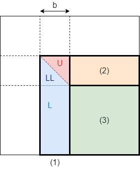

# Parallel Dense Linear Algebra

For dense linear algebra, we need to solve problems such as matrix-multiplication, solve $x$ for linear systems $Ax=b$, and the special forms of linear systems including eigen decomposition, singular value decomposition, and accelerated algorithms on special properties of matrices. 

For parallelization, since the communication cost is critical to the performance, we need to consider that how should we partition the data, and hence what's the data layout, topology of machine (which proc to send to / receive from), and scheduling of communication. 

## Matrix multiplications

For distributed dense linear algebra, the core consideration is still to minimize communication cost. From [Communication Optimal Matmul](./communication.md#matrix-multiplication) we found that the communication lower bound is $\Omega(N^2 / P^{1/2})$ and is attainable. 

Consider the `dgemm` problem $C = A\cdot B$, wlog assume $A,B,C$ are $n\times n$ where $n$ is divisible by the number of procs $p$. The computation is defined as

$$c_{ij} = a_{i:}b_{:j} = \sum_{k=1}^n a_{ik}b_{kj}$$

and a review from blocked matmul, we have that each block of 

$$C[i_1:i_2, j_1:j_2] = A[i_1:i_2, :] \cdot B[:, j_1:j_2]$$

### 1D Column Layout
Suppose that $A,B,C$ are all stored in dense column major such that $a_{ij} = A[i + j\times n]$. Each proc aims to compute $n/p$ columns, denote $C_{i,j} = C[\frac{ni}{p}:\frac{n(i+1)}{p}, \frac{nj}{p}:\frac{n(j+1)}{p}]$ be the $\frac{n}{p}\times\frac{n}{p}$ block, $C_{i,:} = [\frac{ni}{p}:\frac{n(i+1)}{p}, :]$ be the $\frac{n}{p}$ columns. Then proc $i$ will compute 

$$C_{:, i} = A_{:,:}\cdot B_{:,i} = \sum_{j=0}^{p-1} A_{:, j} \cdot B_{j,i}$$

Suppose that we cannot broadcast $A$, a ring-based algorithm will be 

```c title="1D Column major"
/*  A_mat: the full A matrix stored in rank 0
    n = matrix dimension, p = num procs
*/

// Scatter(src_ptr, size, dest_ptr, size);
// SendRecv(send_ptr, send_size, dest_rank, recv_ptr, recv_size, send_rank);
Scatter(C_mat, n * n, C, n * n / p); // C[:, rank]
Scatter(A_mat, n * n, A, n * n / p); // A[:, rank]
Scatter(B_mat, n * n, B, n * n / p); // B[:, rank]

dgemm(C, A, B); // Compute O(n * (n / p) * (n / p))
for (int i = 0; i < p; i++) {
    double *A_old = copy(A, n * n / p);
    // send A to next proc and receive A from previous proc
    SendRecv(A_old, n*n/p, (rank + 1) % p,
             A, n*n/p, (rank - 1) % p); // Communicate 2 * n^2 / p
    dgemm(C, A, B); // Compute O(n * (n / p) * (n / p))
    sync();
}
```

For the inner loop, the communication cost is $2(\alpha + \beta n^2 / p)$ and computation cost is $2n(n/p)^2 = 2n^3/p^2$. Therefore the total time is 

$$p(2(\alpha + \beta n^2 / p) + 2n^3/p^2) = 2n^3/p + 2p\alpha + 2\beta n^2$$

and efficiency is 

$$\frac{2n^3}{2n^3/p + 2p\alpha + 2\beta n^2} = \frac{1}{1+O(p/n)}$$

### SUMMA: Scalable Universal Matrix Multiply

A better implementation for lower communication cost is SUMMA. Instead of partition by the columns of $C$, each proc computes a square block $C_{i,j}$ of dimension $n/\sqrt{p}$ in a scalable way. However, we can broadcast the columns of $A$ and rows of $B$ to each proc $(i,j)$ all at once since the memory cannot hold such large matrices. 

Instead, let each proc store $A_{i,k}$ and $B_{k,j}$ and we have the algorithm

```c title="SUMMA"
/* Suppose that p can be perfectly squared
   rank is 2D tuple 
   A_old stores A[rank[0], rank[1]] block
   B_old stores B[rank[0], rank[1]] block
*/
for (int k = 0; k < sqrt(p); k++) {
    for (int i = 0; i < sqrt(p); i++) {
        if (rank == (i, k))
            // Bcast A_old to rank (i, *)
    }
    for (int j = 0; j < sqrt(p); j++) {
        if (rank == (k, j))
            // Bcast B_old to rank (*, j)
    }
    // recv the broadcasted content 
    Recv(A); 
    Recv(B); 
    dgemm(C, A, B);
}
```

By using broadcast, the communication time is reduced to $\log(p)$.

## Other optimizations

__2.5D matmul__ Note that up to now (1D and SUMMA), each proc only stores $3n^2/p$ words of data. However, when we have more procs, we also have more memory and cache (L1 cache was built per-proc). Thus, what if each proc stores more data so that the total amount of data is $3cn^2, c>1$. In this case, the communication lower bound should be smaller, since we don't need to exchange data that already redundant. 

__Strassen's matmul__ A $2\times 2$ matrix can be computed in 7 multiplications and 18 adds instead of 8 multiplications and 4 adds.

\begin{align*}
p_1 &= (a_{12} - a_{22})(b_{21}+b_{22})\\
p_2 &= (a_{11} + a_{22})(b_{11}+b_{22})\\
p_3 &= (a_{11} - a_{21})(b_{11}+b_{12})\\
p_4 &= (a_{11} + a_{12})b_{22}\\
p_5 &= a_{11} (b_{12} - b_{22})\\
p_6 &= a_{22} (b_{21} - b_{11})\\
p_7 &= (a_{21} + a_{22}) b_{11}\\
C   &= \begin{bmatrix}
p_1 + p_2 - p_4 + p_6 & p_4 + p_6\\
p6 + p_7 & p_2 - p_3 + p_5 - p_7
\end{bmatrix}
\end{align*}

## Gaussian Elimination
[GE and LU Decomposition](../csc336/lu_decomposition.md) and [Pivoting](../csc336/pivoting.md) in serial implementation. 

In general, a Gaussian elimination with partial pivoting (GEPP) as

```py title="GEPP"
pivots = []
for i in range(1, n - 1):
    k = argmax(abs(A[i:, i])) + i # kth row has the largest abs value at A[k,i]
    if abs(A[k, i]) == 0:
        raise ValueError("A is nearly singular")
    elif k != i:
        A[i, :], A[k, :] = A[k, :], A[i, :]
    A[i+1:, i] /= A[i, i]
    A[i+1:, i+1:] -= A[i+1:, i] * A[i, i+1:]
```

All the computations here uses vector-vector or matrix-vector operations, which can be vectorized through blocking. The idea is __delayed updates__ by saving updates to "trailing matrix" from several consecutive update and apply one mat-mat multiplication at once. 

```py title="Blocked GEPP"
for bs in range(1, n - 1, b):
    be = bs + b - 1
    pivots, L, U = GEPP(A[bs:, bs:be]) # 1 
    LL = identity(be - bs) + strict_lower_triangle(A[bs:be, bs:be])
    A[bs:be:, be+1:] = inv(LL) @ A[bs:be, be+1:] # 2
    A[be+1:, be+1:] -= A[be+1:, bs:be] @ A[bs:be:, be+1:] # 3
```

<figure markdown>
  {width="320"}
</figure>
