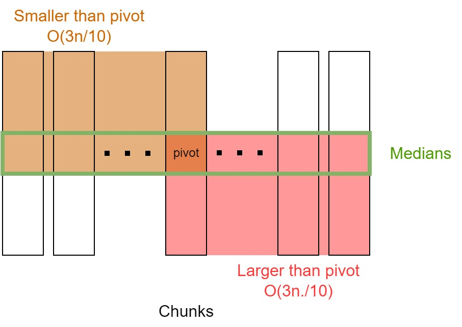
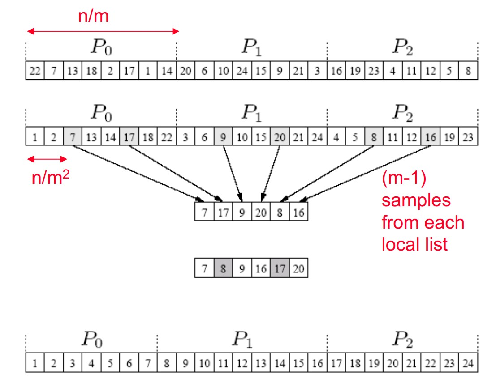

# Parallel Searching and Sorting

## Master Theorem for Recursions

A quick recap for the time complexity of recurrence algorithms. Let $T(n)$ be the time complexity of a problem of size $n$, $b$ be the number of sub problems in the recursive step, and $f(n)$ be the time for the non-recursive part. Then a recursive algorithm's running time can be expressed as 

$$T(n) = a T(n/b) + f(n)$$

Then, we have 

- $f(n) = O(n^{\log_b a - \epsilon}), \epsilon > 0 \implies T(n) \in \Theta(n^{\log_b a})$. 
- $f(n) = O(n^{\log_b a \lg^k n}), k \geq 0 \implies T(n) \in \Theta(n^{\log_b a} \lg^{k+1}n)$.
- $f(n) = O(n^{\log_b a + \epsilon}), \epsilon > 0 \implies T(n) \in \Theta(f(n))$ (with regularity condition).  

Example cases: binary divide and conquer problem such as merge sort, binary search is 

$$T(n) = 2T(n/2) + \Theta(n), f(n) = \Theta(n^{\log_2^2} \lg^0 n), T(n) = \Theta(n^{\log_2^2} \lg^1 n) = \Theta(n\lg n)$$

## K-th Largest Element

Task: find the kth largest element in a list of length $N$, often used for finding median or quartiles. An easy (and relatively efficient) algorithm is `quickselect`, basically similar to `quicksort`, pick a pivot and subdivide the problem to larger than and smaller than. Then, depends on the position of $k$, go to one of the subproblem. The average time is $O(n)$ and the worst case is $O(n^2)$, each time picked an extremum within the current array. 

### Median of the Medians
Based on `quickselect`, but guarantees worst case linear time. 

```py linenums="1"
--8<-- "cs267/scripts/median_of_medians.py:mom"
```


<figure markdown>
   {width="480"}
</figure>


Note that $O(7n/10)$ comes from excluding at least $O(3n/10)$ elements. Therefore, by Master's Theorem, the total time is

$$T(n) = T(n/5) + T(7n/10) + O(n) = T(\frac{9}{10}n) + O(n)\in O(n)$$


### Weighted MoM for Parallelism

Based on the algorithm, a simple idea is to let each processor compute a local median, gather and find the global median of medians, then discard elements and recurve. However, if the array is not evenly distributed, then the global median of medians is not held. Therefore, after each recursion stack, we need to redistribute arrays to make it even, which takes large amount of communication. 

Define the __weighted median of the medians__ by given $p$ distinct elements $m_1,...,m_p$ with corresponding positive weights $w_1,...,w_p$ s.t. $\sum_{i=1}^p w_i = 1$, the weighted median is the element $m_j$ s.t. $\sum_{i:m_i < m_j} w_i\leq 1/2 \land \sum_{i:m_i > m_j} w_i\leq 1/2$. 

```py linenums="1"
# distribute the global array to local proc
arr = scatter(arr_global)

def parallel_select(arr, k):
    median_l = select(arr, k)
    # exchange local medians
    medians_g = Allgather(median_l)

    # find the weighted median 
    wmm = weighted_median(medians_g)

    p_l = partition(arr, wmm)

    # total number of elements smaller than wmm
    p_g = Allreduce(p_l, SUM)

    if k == p:
        return wmm
    if k < p:
        # O(3n/4) recursive
        return parallel_select(arr[0:p_l], k)
    else:
        # O(3n/4) recursive
        return parallel_select(arr[p_l+1:], k - p_l - 1)
```

The recursive step is $O(3n/4)$ because the weighted median guarantees that we are discarding half of the elements that's smaller than respective local median, and by median of medians, that's $1/4$ in total. 


## Merge Sort for Shared Memory Model

```py
def P_mergesort(arr):
    n = len(arr)
    if n == 1:
        return arr
    arr_l = P_mergesort(arr[:n//2])
    arr_r = P_mergesort(arr[n//2:])
    return merge(arr_l, arr_r)
```
For merge sort, it's natural to parallelize over the recursive calls. Consider the spanned stack tree, the span (width) is $O(n)$ (the base case where each array has only 1 element), and the depth is $O(\lg n)$. Therefore, the ideal running time for parallelized merge sort should be $O(\lg n)$. However, we know that `merge` takes $O(n)$ time, thus we need to parallelize merge as well. 

```py
def P_merge(arr1, arr2):
    """ arr1 and arr2 are both sorted
    return sorted arr1 + arr2
    """
    if len(arr1) < len(arr2):
        arr1, arr2 = arr2, arr1
    if len(arr2) == 0:
        return arr1
    mid1 = len(arr1) // 2
    # binary search for the index s.t. 
    # arr2[:mid2] are smaller than arr1[mid]
    mid2 = bisect(arr2, arr1[mid1])
    return P_merge(arr1[:mid1], arr2[:mid2]) + \
           P_merge(arr1[mid1:], arr2[mid2:])
```

## Sorting for Distributed Memory Model

### Bucket Sort

Assume that we have the range of the data, then we can partition the range into $p$ intervals. Each interval will corresponds to one proc, or one "bucket" that holds all elements fall within the interval. Each processor runs through its local list and assigns each of its elements to the appropriate "bucket" (communication required). Then, each processor can sort its own bucket and finally gather all elements. 

The main issue with bucket sort is load imbalance, it's hard to pre-decide the interval partitions. 

### Sample Sort
Sample sort aims to solve the load imbalance issue with bucket sort. 
1. scatter the global array of size $n$ into $p$ procs, each with size $n/p$. 
2. Each proc sort the local array
3. Select $p-1$ evenly spaced samples from local array.
4. Gather the $p(p-1)$ samples, sort the pivots array, and select $p$ evenly spaced samples from the pivot list.
5. Use the $p$ samples as interval to define the buckets. 

<figure markdown>
  {width="720"}
</figure>


We can guarantee that each bucket has at most $2n/p$ elements. 