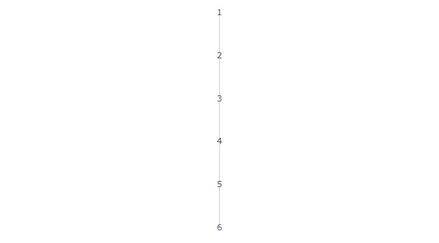
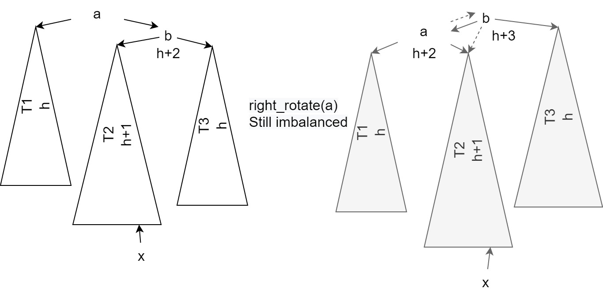
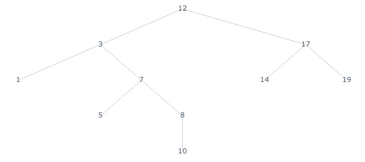
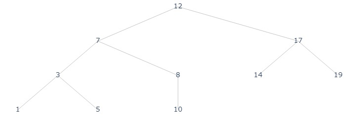
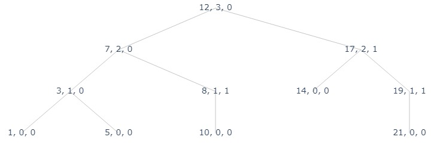
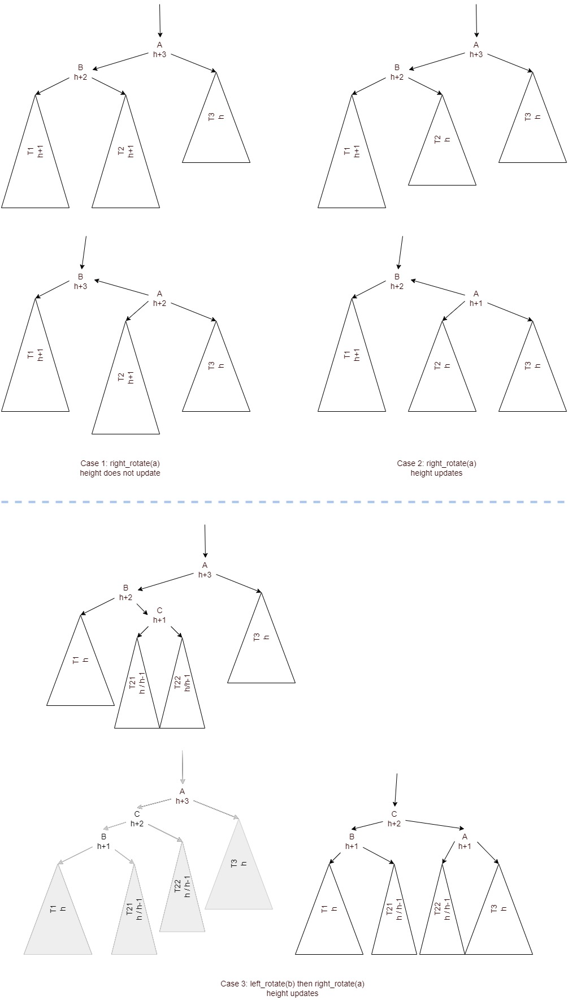

# Set: AVL Tree

## Abstract Data Type: Set
- Object: 
    - Set $S$ of keys (distinct integers)
- Operations:
    - `delete(x)` removes $x$ from the set.
    - `insert(x)` add `x` to $S$.
    - `search(x)` return if $x$ is in the set.

Note that a dictionary is just a set, instead of storing keys, dictionary stores key value pairs. 

## Binary Search Tree
Binary search tree is the most basic way to implement a set. However, in worst case, `delete, insert, search` all take $O(n)$ time. For example, inserting a sequence of increase numbers, the BST will become a chain. 

???quote "BST basic implementation"
    
    ```python title="BST.py"
    --8<-- "csc265/assets/BST.py"
    ```

```python
from assets.AVL import *
from assets.plot_trees import plot_tree, construct_tree_nodes
from IPython.display import Image
label_fn = lambda x: x.k
```


```python
# in worst case, it becomes a chain
arr = [1, 2, 3, 4, 5, 6]
root = BST_insert(None, arr[0])
for x in arr[1:]:
    BST_insert(root, x)
plot_tree(
    construct_tree_nodes(root, label_fn, ['l', 'r']),
    "./assets/avl_1.jpg"
)
```

<figure markdown>
  {width="720"}
</figure>


## AVL Tree
For AVL tree $T$, for node $u\in T$. Define $h(u)$ be the height of $u$, a.k.a. the shortest path from $u$ to a leaf.   
Define tree height $H(T) = h(\text{root}), H(\emptyset) = -1$  

Define __balance factor__ $BF(u) = H(T_{u,l}) - H(T_{u,r})$ where $T_{u,l}, T_{u,r}$ are the left subtree and right subtree of $u$. 

Finally, a __AVL Tree__ $T$ is a BST s.t. $\forall u\in T. BF(u) \in \{-1, 0, 1\}$.

### Properties

__Claim 1__ Let $f(h)$ be the smallest number of nodes in a AVL tree of height $h$. Then, $f(h) = f(h-1) + f(h-2) + 1$.  
_proof_. Left subtree + Right subtree + root, by balance factor constraint, the subtree height difference can be at most 1. 

__Claim 2__ Let $F$ be Fibonacci series function, $F_0 = 0, F_1 = 1, F_n = F_{n-1} + F_{n-2}$. Then $f(h) = F(h+3) - 1$. 

_proof_. 

$$\begin{align*}
f(0) &= F_3 - 1 = F_2 + F_1 - 1 = 1\\
f(1) &= F_4 - 1 = 3 - 1 = 2\\
f(h) &= f(h-1) + f(h-2) + 1 \\
&= F_{h+2} -1 + F_{h+1} -1 + 1 = F_{h+3} - 1
\end{align*}$$

__Claim 3__ $h \in O(\log n)$.  
_proof_. Let $n$ be the number of nodes, $h$ be the height

$$\begin{align*}
n &\geq f(h) \\
&= F_{h+3} - 1 \\
&= \frac{(1+\sqrt{5})^{h+3} - (1-\sqrt{5})^{h+3}}{2^{h+3}\sqrt 5 } - 1\\
&\geq \frac{1}{\sqrt 5}(\frac{1+\sqrt{5}}{2})^{h+3} - 2\\
\sqrt{5}(n+2)&\geq (\frac{1+\sqrt{5}}{2})^{h+3}\\
\log_{\frac{1+\sqrt{5}}{2}}\sqrt{5}(n+2) &\geq h+3\\
h &\leq \log_{\frac{1+\sqrt{5}}{2}}\sqrt{5}(n+2) -3\\
h&\in O(\log n)
\end{align*}$$

## `insert`

Consider the major properties of AVL tree. We want it to be a self-balanced BST. Therefore, after inserting an element as of regular BST, we want to make the tree balance.  

```py title="AVL_insert(root, x)"
    #precondition: root is the root of a AVL tree
    #postcondition: root is the root of a AVL tree containing x
 1  new_leaf = BST_insert(root, x)
 2  curr = new_leaf
 3  while curr is not root:
 4      BF = height(curr.right) - height(curr.left)
 5      if BF == 0:
 6          return
 7      elif BF == 2 or BF == -2:
 8          fix_imbalance(curr)
 9          return
10      update curr height
11      curr = curr.parent 
```

### Correctness

First note that by our definition of `height`, only $x$'s ancestors will need to update their height, and hence balance factor. 

Intuitively, there are 3 cases in the `while` loop

`BF = 0`: the newly added node makes the tree balanced. Thus, the lighter of the two subtrees add one node $x$. This means that the current node's height won't change, since its height is `max(height(curr.left), height(curr.right)) + 1`. Thus, current node's ancestors won't need to update their height. 

`BF = 1 or BF = -1`: AVL tree property is not violated, but the height need to be updated, hence we have to continue on looking up. 

`BF = 2 or BF = -2`: AVL tree property got violated, we need to fix the imbalance on the branch, while maintaining BST properties. Moreover, we can make the current node's balance factor 0 after `fix_imbalance`, thus we can stop the while loop. 

### Runtime 
`BST_insert` takes $O(h)$ time. Each iteration of the `while` loop, the depth of the `curr` reduces by 1. Thusm there are at most $h$ iterations. In each iteration, all branches take constant time. Thus, each `insert` is $\in O(h)$. Then, by AVL tree's self-balancing property claim 3, we have $\in O(\log n)$

### Rotation
`left_rotate` and `right_rotate` can modify the BST in $O(1)$ time, maintaining the BST property.

```py title="right_rotate(root)"
 1  r = root.right
 2  rl = r.left
 3  root.right = rl
 4  r.left = root
 5  root = r
```

```py title="left_rotate(root)"
 1  l = root.left
 2  lr = l.right
 3  root.left = lr
 4  l.right = root
 5  root = l
```

Given an imbalanced BST with $\pm 2$ BF on root, and $\pm 1, 0$ BF on other nodes. We want a new BST that is balanced. WLOG assume the right subtree is heavier. There are two cases

`right, right` case: right subtree of right subtree is heavier. This is easy since after one `right_rotate`, it is balanced. 

`right, left` case: if we do a right rotation, then it is still imbalanced. Thus, the idea is first left rotate the right subtree, so that the right subtree's right is heavier. Then, we go back to `right, right` case. 

<figure markdown>
  {width="720"}
</figure>


```python
# a demonstration of BST
arr = [12, 3, 17, 1, 7, 14, 19, 5, 8, 10]
root = BST_insert(None, arr[0])
for x in arr[1:]:
    new_node = BST_insert(root, x)
    BST_update_height(new_node)
plot_tree(
    construct_tree_nodes(root, label_fn, ['l', 'r']),
    "assets/avl_2.jpg"
)
```

<figure markdown>
  {width="720"}
</figure>


```python
right_rotate(root.l)
plot_tree(
    construct_tree_nodes(root, label_fn, ['l', 'r']),
    "assets/avl_3.jpg"
)
```

<figure markdown>
  {width="720"}
</figure>

```python
# a demonstration of BST
arr = [12, 3, 17, 1, 7, 14, 19, 5, 8, 10, 21]
root = AVL_insert(None, arr[0])
for x in arr[1:]:
    new_node = AVL_insert(root, x)
label_fn = lambda node: f"{node.k}, {get_height(node)}, {get_BF(node)}"
plot_tree(
    construct_tree_nodes(root, label_fn, ['l', 'r']),
    "assets/avl_4.jpg"
)
# key, height, BF
```

<figure markdown>
  {width="720"}
</figure>


## [+] `delete`

The idea is similar to `insert`, but need more considerations on the details. 

First, `BST_insert` will only delete leaf node (otherwise swap child node until the to be deleted node is a leaf). Thus, call the to be deleted lead node `x`, then we trace up from `x.parent` to `root` as `curr` and consider the cases

1. if `curr`'s old BF is $0$, then removal `x` will shorten one of is subtree, but `curr.height` won't change. Thus, if BF changes from $0\rightarrow \pm 1$, we are safe to stop. 
2. if `curr`'s old BF is $\pm 1$, then the new BF will either be $0$ or $\pm 2$. 
   1. In the case of $0$, `curr.height` will update and we still need to go up.
   2. In the case of $\pm 2$, we will rotate to fix imbalance. `fix_imbalance` will update height thus we need to go up.

The correctness and runtime justification is very similar to `insert`. 

### Fix Imbalance
Imbalance happens when we delete a node from the lighter subtree, and there are 3 cases to consider. As shown below

<figure markdown>
  {width="720"}
</figure>

