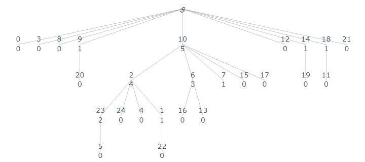

# Disjoint Set

## ADT: Disjoint Set
- Objects: a collection of __disjoint__ sets $\mathcal S = \{S_1,..., S_k\}$ where each set has a representative $x_i\in S_i$. 
- Operations:
    - `makeset(x)` If $x$ is not already in any sets of $\mathcal S$ (since disjoint), then create a new set of only $\{x\}$ with representative $x$. Otherwise return error. 
    - `findset(x)` given a pointer to the element, return the representative of the set containing $x$. 
    - `union(x, y)` union the sets that contain $x\in S_i, y\in S_j$, and choose any element within $S_i\cup S_j$ to be the new representative. Note that `x, y` can be in the same set, in which `union(x, y)` should do nothing. 
    - `link(x, y)` save as union, but with the precondition that `x, y` must be representatives of different sets. 

### Connected component
Connected components is a common problem in geometry processing. For graph $G = (V, E)$. A connected component is a subset of vertices $V' \subseteq V$ s.t. for any pair of vertices $v_1, v_2 \in V'$, there exists a path between them. Thus, a graph can have several connected components. 

With a disjoint set, we can let the vertices be the elements, then `union` two sets together if there is an edge. 

```py title="connected_components(G)" linenums="1"
for v in G.v:
    makeset(v)
for (u, v) in G.E:
    if findset(u) != findset(v):
    union(u, v)
```

```python
from assets.disjointset import DisjointSet
from random import randint, seed


seed(21)
NV = 25
E = set()
while len(E) < NV * 2 // 3:
    x, y = randint(0, NV - 1), randint(0, NV - 1)
    if x != y and (y, x) not in E :
        E.add((x, y))
E = list(E)
label_fn = lambda x: f"{x.value}<br>{x.rank}"

import igraph as ig
import matplotlib.pyplot as plt

fig, ax = plt.subplots()
g = ig.Graph()
g.add_vertices(NV)
g.add_edges(E)
ig.plot(g, target=ax)
ax.set_axis_off()
fig.savefig("assets/disjoint_set_1.jpg")
```

<figure markdown>
  {width="480"}
</figure>


### Link
Note that `union(x, y) = if findset(x) != findset(y): link(findset(x), findset(y))`. We use `link` to decompose the `union` operation so that the time analysis is directly related to the number of `link` and `findset`. 

__Claim 1__ Define $T(m, n), m \geq n$ be the worst case time executing any set of $m$ operations from `{makeset, findset, link}`, which $n$ of the operations are `makeset`, starting from $\mathcal S = \emptyset$.   
Then, there are at most $(n-1)$ `link`'s. 
_proof_. There are at most $n$ sets, and each link merges two sets into one, thus reduces the number of sets by $1$. 

## Naive Implementation: Set of Trees / Linked lists
- Objects: each set $S_i$ is stored as a trees, where the representative is the root of the tree. Then, we store all roots in a list. 
- Operation:
    - `makeset(x)` make a new tree containing $x$, and put into $\mathcal S$. Taking $O(1)$ time. 
    - `findset(x)` recursively traverse the parent until the root. Takeing $O(h)$ time where $h$ is the height of the tree. 
    - `link(x, y)` take one root and connected to another

Note that linked list is also a tree, and it's the simplest implementation of the disjoint set. However, the runtime for `findset` with linked list implementation will be $O(n)$. In worst case, $T(m,n) \in O(mn)$ which is far too large. 

Another implementation is to have 2 level trees, where all nodes except the root are children of the root. In this case, `findset(x)` takes $O(1)$ time, while `link(x, y)` need to reconnected all nodes in one set to another. Resulting $T(m,n) \in O(mn)$ time again. 

Therefore, we need to keep a good balance in between `findset` and `link`.


```python
ds = DisjointSet()
for v in range(NV):
    ds.makeset(v)
nodes = ds.nodes
for e in E:
    ds.union_naive(nodes[e[0]], nodes[e[1]])
ds.plot(label_fn, "assets/disjoint_set_2.jpg")
```
<figure markdown>
  {width="560"}
</figure>


## Heuristic 1: Weighted Union

We want to make sure the tree height is small, while keeping `link` in $O(1)$ time. Thus, the simplest idea is to attach the shorter tree to the root of the longer tree, thus the total height won't change. Thus, for each tree, we can store its height. 

```py title="makeset(x)" linenums="1"
x.height = 0
S.append(x)
```

```py title="link(x, y)" linenums="1"
if x.height > y.height:
    y.parent = x
elif x.height < y.height:
    x.parent = y
else:
    y.parent = x
    x.height += 1
```

### Time Analysis

__Claim 2__ After any operation on the disjoint set, for any element $x \in S_i \in \mathcal S$, $|S_i| \geq 2^{x.\text{height}}$. 

_proof_. Note that only `makeset` and `link` will modify $\mathcal S$. So that we will use induction on the operations. 

For `makeset`, the other sets won't change, and the newly added set is $\{x\}$ with height 0, and we have that $2 \geq 2^0$.

For `link(x, y)`, if their height is different, WLOG assume `x.height > y.height` so that $S_x$ is merged into $S_y$, and the size of the new set is $|S_x| + |S_y| \geq 2^{x.\text{height}} + 2^{y.\text{height}} \geq  2^{y.\text{height}}$

For `link(x, y)` with the same height, then the size of the new set is 

$$|S_x| + |S_y| \geq 2^{x.\text{height}} + 2^{y.\text{height}} = 2^{x.\text{height} + 1}$$

__Corollary 3__ For any $x\in S_x\in \mathcal S, x.\text{height} \leq \lfloor \lg n\rfloor$ 

_proof_. from Claim 2 we have

\begin{align*}
|S_x| &\geq  2^{x.\text{height} + 1}\\
n &\geq 2^{x.\text{height} + 1}\\
\lg n &\geq x.\text{height} + 1\\
\lfloor \lg n\rfloor &\geq x.\text{height}\\
\end{align*}


__Corollary 4__ $T(m,n) \in O(m\log n)$


```python
ds = DisjointSet()
for v in range(NV):
    ds.makeset(v)
nodes = ds.nodes
for e in E:
    ds.union_weighted(nodes[e[0]], nodes[e[1]])
ds.plot(label_fn, "assets/disjoint_set_4.jpg")
```
<figure markdown>
  {width="560"}
</figure>
    


## Heuristic 2: Path Compression

When we do `findset`, we have already put the effort in tracing the parent, we can, at the same time, update all nodes on the traced path directly point to the root. 

```py title="findset(x)"
if x.parent is None:
    return x
root = findset(x.parent)
x.parent = root
return root
```


```python
ds = DisjointSet()
for v in range(NV):
    ds.makeset(v)
nodes = ds.nodes
for e in E:
    ds.union_compression(nodes[e[0]], nodes[e[1]])
ds.plot(label_fn, "assets/disjoint_set_5.jpg")
```
    
<figure markdown>
  {width="560"}
</figure>

### [+] Time Analysis (log-star)

Define the __iterated logrithm__ $\log^*$ as 

$$\log_{b}^* n = \begin{cases}0 &n \in \{0, 1\}\\1+\log^*(\log n) &n>1\end{cases}$$

and its inverse function __tetration__

$$b\upuparrows n = \begin{cases}0 & n = 0\\b^{b\upuparrows n-1} &n>0\end{cases}$$

For convinence, assume that $n$ is a power of $2$, so that we don't have to deal with floors or ceilings. 

Define find path be the sequence of nodes (and the edges connecting node and its parent) from a node $u$, by recursively traversing its parent, to the root. 

__Lemma 1__ The rank on a `findset` path is increasing.  
_proof_. Since `link`, with weighted union, will always have higher rank nodes be the root. Then, `findset` will only attach to the root, while we have the assumption that all nodes has smaller rank than the root. 

__Lemma 2__ The max number of nodes of rank $r$ is at most $\frac{n}{2^r}$.  
_proof_. First note that in our algorithm, rank cannot decrease and rank only changes in `link`. Then, by weighted union, to make a node of rank $r > 0$, you need at least two nodes of rank $r-1$. Thus, recursively, you need at least $2^r$ nodes to create a node of rank $r$. And we have a total of $n$ nodes. 

__Claim 3 (log-star runtime)__ $T(m,n) \in O(m\log^* n)$  

_proof_. First, define the intervals $b_0 = [0, 0], b_i = [(2\upuparrows {i-1}), (2\upuparrows {i}) - 1]$ for $i = 1, 2, ...$ As some references, $b_0 = [0, 0], b_1 = [1, 1], b_2 = [2, 3], b_3 = [4, 15], b_4 = [16, 65535]$.   
Then we define the partition over $\mathcal S$ as some "buckets"

$$B_i = \{x\in\mathcal S: x.\text{rank} \in b_i\}$$

We have the following claims:

  1. the total number of buckets is at most $\log_2^* n$, as the inverse of tetration. 
  2. the number of elements in bucket $[B, 2^B - 1]$ is at most $\frac{2n}{2^B}$. Following lemma 2 that $\sum_{r=B}^{2^B-1}\frac{n}{2^r} \leq \frac{2n}{2^B}$

Let $F$ be the sequence of all the edges traversed in $m$ `findset` operations, we need to count the number of edges, which is the total number of cost.

Let $T_1$ be the set of the edges connected to a root, since each `findset` will eventually traversed to the root, we have that $|T_1| = m$. 

Let $T_2$ be the set of the edges that traversed between nodes from different bins. Since the rank on the find path has increasing ranks and we have at most $\log^*n$ bins, we have $|T_2| \in O(m\log^*n)$

Let $T_3$ be the set of the edges that traversed in the same bin. Consider any edge $(u, v)$, and the nodes $u, v, v_1, ..., v_k$ on the find path to the root. Then none of the nodes are root, and they will never appear in $T_3$ since they are directly attached to a root. Also, known that rank is strictly increasing, so that the length of each find path is at most $2^B-1-B < 2^B$. Therefore, for a bucket $[B, 2^{B-1}]$. The total number of edges is at most $\frac{2n}{2^B}2^B = 2n$. With at most $\log^*n$ bins, $|T_3| = 2n \log^*n$.

Therefore, we can conclude that the worst case amortized run time is $T(m, n) = |T_1| + |T_2| + |T_3| \in O(m\log^* n)$

## Implementation


???quote "DisjointSet implementation"

    ```python 
    # Note that this implementation add unnecessary parent for ploting
    --8<-- "csc265/assets/disjointset.py"
    ```


```python
ds = DisjointSet()
for v in range(NV):
    ds.makeset(v)
nodes = ds.nodes
for e in E:
    ds.union(nodes[e[0]], nodes[e[1]])
ds.plot(label_fn, "assets/disjoint_set_6.jpg")

print("Number of connected components", ds.n)
#>> Number of connected components 9
```

<figure markdown>
  {width="560"}
</figure>


    
    
