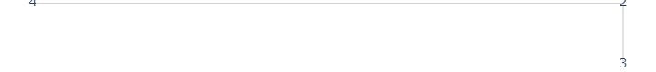
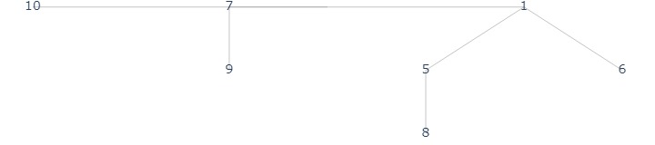
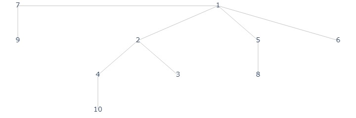
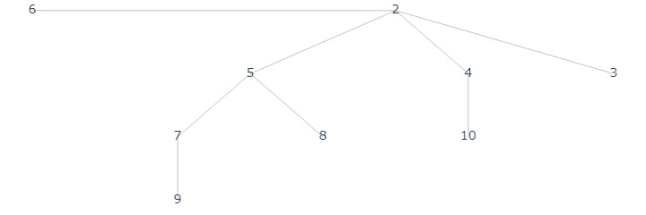

# [+] Priority Queue: Mergeable Heap

A mergeable heap is a heap with the support of operations `union`. 

Consider the max/min heap, if we want to merge two heaps of size $n, m$, it will take $O(n+m)$ using `build_heap`. However, there is another implementation which `max` takes $O(\lg n)$ while `union` takes $O(\lg(n+m))$. 

## Binomial Tree
A binomial tree is constructed from structural induction. 
- $B_0$: the base case with one node
- $B_k$: two copies of $B_{k-1}$, connecting the roots with an edge, and let the root of the one of the $B_{k-1}$ be the root of $B_k$. 

__Claim 1__ The number of $B_k$ is $n = 2^k$   

__Claim 2__ The height of $B_k$ is $h = k$  
_proof_. By induction, $h_0 = 0$, assume $h_{k-1} = k-1$, then note that $B_k$ add one more edge from root to the root of $B_{k-1}$ so that $h_k = k$.  

__Claim 3__ The root of $B_k$ has subtrees $B_0,..., B_{k-1}$.  
_proof_. By construction, the left most subtree of the root is $B_{k-1}$. Then, the rest is a $B_{k-1}$, which by induction hypothesis, has subtrees $B_0, ..., B_{k-2}$.

__Claim 4__ For level $k$ of a $h$ height binomial tree, the number of nodes at level $k$ is $h\choose k$.  
_proof_. Since a tree of height $h$ has subtrees $B_0, ..., B_{h-1}$. For each of the tree, the number of nodes at level $k-1$ is ${m-1\choose k-1}, m = k-1,...,h-1$. Summing them together we have that 

$$\sum_{m=k-1}^{h-1}\frac{(m-1)!}{(k-1)!(m-k)!} =\frac{h!}{(h-k)!k!}$$

## Binomial Forest
A binomial forest is a set of distinct size binomial trees. 

Since each decimal number has a unique binary representation, for $n$ nodes, we have a unique binomial forest $F_{n}$. 

For example, $13 = b'1101$, so that the binomial forest is $F_{13} =\{B_0, B_2, B_3\}$

__Claim 5__ Let $k$ be the number of binomial trees in the forest, $k = |F_n| \leq \lceil \lg (n + 1)\rceil$.   
_proof_. $k$ is smaller than the number of digits in binary representation.

## Mergeable Min Heap

### Object
A binomial forest $F_n$, for each tree in the forest, for each node in the tree, the key is greater than its children. 

### `union`
Let $H_1, H_2$ be two mergable heap of size $n_1, n_2$. `union` will merge trees with the same size, by simplying compare the root, where the smaller one becomes the new root.

#### Correctness
Merging trees is equivalent to bitwise add $n_1 + n_2$, thus the resulting forest is still a binomial forest. For each tree in the new forest. If it merges with some other trees, then the new root is smaller of equal to its original children, and by the comparison, is also smaller than or equal to its new child from the other tree. 

#### Runtime
Each tree-wise merge takes constant time, the number of tree merge equals the max bits in bit-wise add. Thus the time is $O(\lg(\max(n_1, n_2))) \in O(\lg(n_1 + n_2))$

### `min`, `extract_min`, `insert`
`min` will simply return the minimum of roots of all trees in the forest.  
Taking $O(\lg n)$ time since there are at most $\lg (n+1)$ trees. 

`extract_min` will remove the minimum root, by claim 3, that tree will be broken into a forest. Thus, merge the two new forest.  
Taking $O(\lg n)$ time since the two forests two merge is at most size $\lg(n)-1, \lg(n)$.

`insert` merge the forest with a new forst of $F_1 = \{B_1\}$. Taking $O(\lg n)$ time. 

## Implementation


???quote "Implementation code"
    
    ```python title="mergeable_heap.py"
    --8<-- "csc265/assets/mergeable_heap.py"
    ```

```python
from assets.mergeable_heap import MergableHeap
arr1 = [3, 2, 4]
mq1 =  MergableHeap(arr1, ascending=True)
mq1.plot("./assets/mq_1.jpg")
```

<figure markdown>
  {width="560"}
</figure>

```python
arr2 = [6, 1, 8, 5, 9, 7, 10]
mq2 = MergableHeap(arr2, ascending=True)
mq2.plot("./assets/mq_2.jpg")
```

<figure markdown>
  {width="560"}
</figure>

```python
mq1.union(mq2)
mq1.plot("./assets/mq_3.jpg")
```
<figure markdown>
  {width="560"}
</figure>

```python
print(mq1.pull())
#>> 1
mq1.plot("./assets/mq_4.jpg")
```

<figure markdown>
  {width="560"}
</figure>