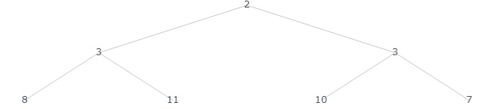
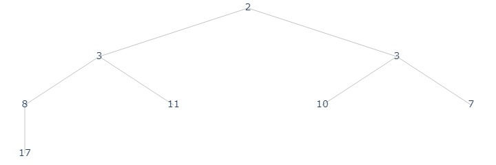
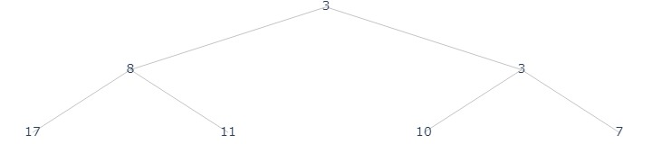
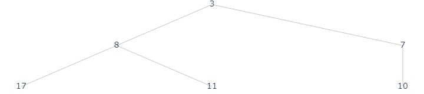

# Priority Queue: Max Heap

## Abstract Data Type
- Object: 
    - Set $S$ of keys (integers) and values
- Operations:
    - `peek()` return the element of $S$ with the highest priority
    - `pull()` return highest priority and removes it from $S$
    - `insert(key, value)` add `key, value` to $S$

## Data Structure: Max(Min) Heap
Max heap, as the data structure, is a implementament of priority queue. 
### Object: 
- A complete binary tree $T$ of size $n$ where the key of every node is at least the keys of its children.
- By "complete",  every level is full except possibly the last one where all nodes are fully to the left.
- Note that, since $T$ is complete, we can store it as an array instead of a tree object. 

__Claim 1__ The max level of a complete binary tree with $n$ nodes is $\lfloor\lg n\rfloor$

_proof_. Consider the number of nodes for a complete binary tree with height $h$

$$\sum_{i=0}^{h-1} 2^i + 1 \leq n \leq \sum_{i=0}^{h} 2^i$$

where the lower bound is the tree with 1 leaf at $h$ level, and upper bound will have $2^h$ leaves at $h$ level. 

Thus, $h = \lfloor\lg n\rfloor$

__Observation__ We can map a complete binary tree to an array via
- $\text{root} = 0$
- $\text{parent}(i) = \lfloor i / 2\rfloor$
- $\text{left}(i) = 2i + 1$
- $\text{right}(i) = 2i + 2$


### Operations
- `max()` return the root of the tree.
- `insert(x)` put $x$ in the leftmost position of the leaf level, then swap with its parent if it is smaller than its parent. 
- `extract_max()` remove the root, move the leftmost to the root. Swap with its larger child till it's large than its children. 


## Heapify
The `swap` operation can be considered as a structural induction `heapify(A, i)`

- precondition: left and right subtree of $A[i]$ are both heap. 
- postcondition: The tree rooted at $A[i]$ is a heap. 

```py title="max_heapify(A: heap, i: index)" linenums="1"
l = left(i)
r = right(i)
largest = i
if i has left child and A[l] > A[largest]:
    largest = l
if i has right child and A[r] > A[largest]:
    largest = r
if largest != i:
    swap(A[i], A[largest])
    max_heapify(A, largest)
```

### Correctness

Base case: 
- $H[i]$ is a leaf, then it is a heap. 

Induction Step:  

- If $A[i]$ does not violate max heap property, meaning it is larger than or equal to both children. Then none of the if conditions are satisfied and we are done. 
- If $A[i]$ is smaller than any of its children, than by `line 4-7`, `largest` will be set to the index of the larger child. By `line 8-10`, WLOG assume that `largest = r`. Then, after the swap
    - Left subtree is untouched, by precondition, it is a max heap. 
    - Right subtree is a max heap by `line 10` and induction hypothesis.
    - The new root, by `line 4-9`, is greater than or equal to its children.

### Runtime
Each time, a swap happens between a parent and child, in the worst case, we swap from root to a leaf, by Claim 1, resulting $T(n) \in O(h)$.

## Build Heap from Array

```py title="build_heap(A)" linenums="1"
n = len(A)
for i in [floor(n / 2): 0: -1]:
    max_heapify(A, i)
```

### Correctness
Consider the for loop, we want to prove the loop invariance that the tree rooted at $A[i]$ is a max heap. 

For $i = \lfloor n / 2\rfloor$. Note that $h = \lfloor \lg n\rfloor$, thus the node is in the second last level. It subtrees are either leaf or empty, hence by correctness of `max_heapify`, the loop invariance is met. 

For $i < \lfloor n / 2\rfloor$, by loop counter, since $\text{left}(i) = 2i + 1 > i, \text{right}(i) = 2i+2 > i$, both subtrees either empty or have already run `max_heapify`, thus, the loop invariance is met. 

### Runtime
__Claim__ $T(n)\in O(n)$
Consider the for loop, at each height $h$, there are at most $n/2^h$ nodes, and each `max_heapify` takes $O(h) = ch$ time. Therefore,

$$T(n) \leq \sum_{h=0}^{\lfloor \lg n\rfloor} \frac{n}{2^h} c h= cn \sum_{h=0}^{\lfloor \lg n\rfloor}\frac{h}{2^h}\leq \sum_{h=0}^{\infty}\frac{h}{2^h}$$

Note that by Maclaurin series

$$\sum_{h=0}^{\infty}\frac{h}{2^h} =  \sum_{h=1}^{\infty}[\left.\frac{d}{dx}(\frac{1}{x})^h\right\vert_{x=1/2}] = \left.\frac{d}{dx}(\frac{1}{1-x})\right\vert_{x=1/2} = \frac{1/2}{(1-1/2)^2} = 2$$

Therefore, we have that 

$$T(n) \leq 2cn \in O(n)$$


## Heap Sort

Given an array, return a sorted array using the heap

```py title="heap_sort(A)" linenums="1"
H = build_heap(A)
sorted = []
for i in [0:n:1]:
    sorted.append(extract_max(H))
return sorted
```

Correctness is trivial, since $H$ is a heap and we always extract the largest element. 

Runtime: `line 1` takes $O(n)$, the for loop in `line 3-4` takes $n \times O(h) \in O(n \lg n)$. Thus, $T(n) \in O(n\lg n)$. 

## Implementation

???quote "Implementation code"
    
    ```python title="priority_queue.py"
    --8<-- "csc265/assets/priority_queue.py"
    ```

    ```python title="heap.py"
    --8<-- "csc265/assets/heap.py"
    ```

```python
from assets.heap import Heap, heap_sort
```


```python
arr = [2, 11, 10, 8, 3, 3, 7]
# ascending = True => min heap
# ascending = False => max heap
# default max heap
h = Heap(arr, ascending=True)
h.plot("./assets/pq_0.jpg")
```

<figure markdown>
  {width="560"}
</figure>

```python
h.insert(17)
h.plot("./assets/pq_1.jpg")
```
<figure markdown>
  {width="560"}
</figure>

```python
print(f"{h.pull()}")
#>> 2

h.plot("./assets/pq_2.jpg")
```

<figure markdown>
  {width="560"}
</figure>

```python
print(f"> {h.pull()}")
#>> 3

h.plot("./assets/pq_3.jpg")
```

<figure markdown>
  {width="560"}
</figure>

```python
print(f"> {heap_sort(arr)}")
#>>  [17, 11, 10, 8, 7, 3]
```

## [+] Usage Example
Given a sorted array $A$ of distinct integers of length $n > 1$. Design a data structure that supports
- `perprocess(A)` initialize the data structure. This operation should run in $O(n)$
- `next(A)` return the next pair $(i,j), 1\leq i\leq j\leq n$ in non-decreasing order $A[j] - A[i]$. Each call should run in $O(\log n)$

We can assume that `preprocess` is called once, following at most $n\choose 2$ calls to `next`.

### Observations
__Lemma 1__ Let $(i_i, j_i)$ be the return value of the ith call to `next`. Then, $j_1 - i_1 = 1, j_2 - i_2 = 1$.  
_proof_. Since $A$ is sorted. If $j_1 - i-1 > 1$, then there exists $A[j_1 - 1] - A[i_1] < A[j_1] - A[i_1]$.  
Moreover, consider $(i_2, j_2)$, $A[j_2] - A[i_2 + 1] < A[j_2] - A[i_2]$.

__Lemma 2__ Let $\sigma = [(i_1, j_1),...,(i_N, j_N)]$ be the sequence of return values from $N = {n\choose 2}$ calls of `next`. Then for any $k$, either $j_k - i_k = 1$ or $(i_k, i_{k+1})$ and $(i_{k+1},j_k)$ appear before $(i_k,j_k)$ in $\sigma$. 

### Implementataion
```py title="preprocess(A)"
 1  L = [ ( A[i+1] - A[i], (i, i+1) ) for i in [0: n-1: 1] ]
 2  return build_min_heap(L)
```

```py title="next(A)"
 1  (i, j) = extract_min(A)
 2  if i > 0:
 3      insert(A[j] - A[i-1], (i-1, j))
 4  return (i, j)
```

### Analysis
Runtime analysis is trivial. 

For correctness, 

__Claim 1__ each pair $(i,j)$ inserted is distinct. 
_proof_. For pairs inserted in `preprocess` this is obvious. For any pair inserted in `next`, we must have that $j-i > 1$, considering `line 3`. Suppose that $(i,j)$ is the first pair that got inserted twice, then it must exists $(i, j-1)$ be extracted twice, meaning it is inserted before, contradiction. 

__Claim 2__ For each $(i_k, j_k)$, $A[j_k] - A[i_k]$ is the $k$th smallest.   
_proof_. For $k = 1$, by lemma 1 this is proven. Then, assume $k>1$ is the first step where $A[j_k] - A[i_k]$ is not minimal. Let $(i,j)$ be the pair that should be extracted at $k$th step, $(i,j)\neq (i_k, j_k), A[j]-A[i] < A[j_k] - A[i_k]$. Note that $j - i > 1$, otherwise it is inserted through `preprocess` and must be extracted. Then, for $j - i > 1$, then by lemma 2, $(i+1, j)$ must have been extracted. Therefore $(i,j)$ must have been inserted. By the property of heap, $(i,j)$ must be extracted at $k$th step. 
