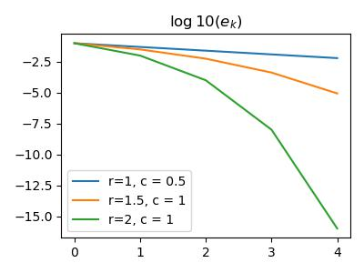

# Solve Non-linear equations


```python
import numpy as np
import matplotlib.pyplot as plt
import pandas as pd
```

## Example 
solve $f(x) = x^2 - 4\sin(x)= 0$, i.e. $x^2 = 4\sin x$


```python
plt.figure(figsize=(4, 3))
x = np.arange(-4, 4, 0.01)
sq = x ** 2
sin = 4 * np.sin(x)
plt.plot(x, sq, label=r"$x^2$")
plt.plot(x, sin, label=r"$4\sin(x)$")
plt.legend()
plt.tight_layout()
plt.savefig("assets/non_linear_equations_1.jpg")
```

<figure markdown>
  {width="480"}
</figure> 
    
Noting that $f(\pi/2) = (\pi/2)^2 - 4(1) < 0$ and $f(2) = 2^2 - 4\sin(2)>0$, by IVT, $\exists x\in(\pi/2, 2), f(x)=0$

## Solving non-linear  Equations
For linear functions, it's easy to determine the number of roots, while for non-linear equations, this is harder. 

## Bisection Method
For continuous functions, using IVT, we can determine the minimum number of roots. Then, using this fact, we define a recursive algorithm 

- find $a, b$ s.t. $f(a)f(b)\leq 0$
- take $m = (a+b)/2$, if $f(a)f(m)\leq 0$, then the root $x\in [a,m]$, otherwise $f(b)f(m)\leq 0, x\in[m,b]$


```python title="bisection method"
init a, b <= f(a)f(b) <= 0
while b - a > tolerance:
    m = (a + b) / 2
    if f(a)f(m) <= 0:
        a = m
    else:
        b = m
```

By nested interval theorem, we are guaranteed to find one solution. 

## Fixed Point Method
A point $x^*$ is a fixed point of a function $g$ if $x^*=g(x^*)$ 

### Contraction Mapping Theorem
A function $f:\mathbb R^n \rightarrow \mathbb R^n$ is a contraction if $\exists \gamma < 1, \|f(x)-f(y)\| < \gamma \|x-y\|$, then $\exists x^*, x^* = g(x^*)$, i.e. exists a fixed point. 

[proof (MAT337 Banach Contraction Principle](../../math/mat337/ODE.md)

Therefore, fixed point method gives the algorithm

```python title="fixed point method"
init x[0] from domain
x[1] = f(x[0])
i = 1
while abs( x[i+1] - x[i] ) >= tolerance:
    x[i+1] = f(x[i])
    i += 1
```

### Rate of Convergence 
Consider any iterative method for computing non-linear function solution. $x^*$ being the exact solution (fixed point in FPM), then define $e_k = x^* - x_k$ assuming $x_k\rightarrow x^*$.  
Suppose 

$$\lim_{k\rightarrow\infty} \frac{|e^{k+1}|}{|e_k|^r} = c, c\neq 0\Rightarrow |e_{k+1}|\approx c|e_k|^r$$

Then the rate of convergence is defined as $r$

- $r=1: c<1$ - linear convergence  
- $r>1$:  super linear convergence
- $r=2$:  quadratic convergence

### Example
Suppose we start with $e_0 = 0.1$


```python
k = np.arange(5)
e = np.zeros((3, 5))
e[:, 0] = 0.1

for i in range(1, 5):
    e[0, i] = e[0, i-1] ** 1 * 1/2
    e[1, i] = e[1, i-1] ** 1.5
    e[2, i] = e[2, i-1] ** 2
plt.figure(figsize=(4, 3))
plt.plot(k, np.log10(e[0]), label="r=1, c = 0.5");
plt.plot(k, np.log10(e[1]), label="r=1.5, c = 1");
plt.plot(k, np.log10(e[2]), label="r=2, c = 1");
plt.legend()
plt.title(r"$\log10(e_k)$")
plt.tight_layout()
plt.savefig("assets/non_linear_equations_2.jpg")
```

<figure markdown>
  {width="480"}
</figure> 

## Newton's Method 

Replacing the function $f(x)$ by its tangent line at the current point of approximation $x^{(k)}$, assuming the function is differentiable at $x^{(k)}$, i.e. 

$$y = f(x^{(k)}) + f'(x^{(k)})(x-x^{(k)})$$

Then approximate the root of $f(x)=0$, i.e. the point where the graph of $f(x)$ hits the $x$-axis, by the point where the graph of the tangent hits the $x$-axis. We are looking for the point $x$ s.t. $y = 0$. This will be the new approximation $x^{(k+1)}$ to the root of $f$. Thus

$$0 = f(x^{(k)}) + f'(x^{(k)})(x^{(k+1)}-x^{(k)})\Rightarrow x^{(k+1)} = x^{(k)}-\frac{f(x^{(k)})}{f'(x^{(k)})}$$

### Algorithm
```python title="Newton's Method"
init x[0]
for k in range(n):
    x[k] = x[k-1] - f(x[k-1]) / df(x[k-1])
    if abs(f(x[k])) < tolarence:
        return x[k]      
```
Note we don't use `while` loop because Newton's method does not always converge. However, it always converges if $f$ is twice differentiable and $x^{(0)}$ is chosen close enough to the root. Also, $f(x^{(k)}) / f'(x^{(k)})$ should not be $0$. 

###  Rate of Convergence
Note that Newton's Method can be seen as a fixed point method. 

Assume $f'(x^*)\neq 0, f(x^*) = 0$, let $g(x) = x - \frac{f(x)}{f'(x)}\Rightarrow \frac{d}{dx}g = 1 - \frac{f(x)f''(x)}{(f(x))^2}$.  
Because $g'(x^*)=0$ and $g''(x^*) \neq 0$ in most cases, $x_n\rightarrow x^*\Rightarrow \lim_{n\rightarrow\infty} \frac{x_{n+1}-x^*}{(xn-x^*)^2} = C\neq 0$ This is approximated as 

$$x_{n+1}-x^* \approx C(x_n-x^*)^2 = (c(x_n-x^*))^2$$

__Theorem__ If $f^{(3)}(x)$ exists and is continuous, $f(x^*) = 0, f'(x^*)\neq 0$, then Newton's method will converge quadratically to $x^*$ provided close start. 

_proof_. 

\begin{align*}
x_{n+1} - x^* &= g(x_n) - g(x^*)\\
&= g'(x^*)(x_n - x^*) + \frac1 2 g''(\xi_n)(x_n-x^*)^2 &\xi_n\in(x_n, x^*)\\
&= \frac1 2 g''(\xi_n)(x_n-x^*)^2 &g'(x^*) = 0
\end{align*}

Suppose $|x_0 - x^*| \leq \epsilon$ for some $\epsilon > 0$, let $a = \max_{\xi\in[x^*-\epsilon, x^*+\epsilon]} |f''(\xi)|/2$, we need to have $a\epsilon < 1$ (that's what __close enough__ mean in the claim).  

Then, 

$$|x_1 - x^*| \leq \frac{|g''(\xi_0)|}{2}|x_0 - x^*|^2 \leq a|x_0 - x^*|^2 \leq a\epsilon^2 = (a\epsilon)\epsilon < \epsilon$$

Therefore, by induction, all points through Newton's method will converge quadratically. 

Note that __close enough__ is a very important condition for Newton's method.  
Consider $f(x) = 1 + xe^{-x}$


```python
def f(x):
    return 1 + x * np.exp(-x)
def df(x):
    return (1 - x) * np.exp(-x)
def Newton(x):
    return x - f(x) / df(x)
```


```python
iter_ = 5
n1 = [0.2] 
n2 = [1.1]
for i in range(iter_):
    n1.append(Newton(n1[-1]))
    n2.append(Newton(n2[-1]))
pd.DataFrame({
    'n': np.arange(iter_ + 1),
    'start = ' + str(n1[0]): n1,
    'start = '+ str(n2[0]): n2
})

#>>   n  start = 0.2   start = 1.1
#>>   0     0.200000  1.100000e+00
#>>   1    -1.576753  4.214166e+01
#>>   2    -1.045035  4.870894e+16
#>>   3    -0.705991           inf
#>>   4    -0.581505           NaN
#>>   5    -0.567311           NaN
```


```python
x = np.arange(-2, 5, 0.01)
y = f(x)
plt.figure(figsize=(4, 3))
plt.plot(x, y)
n1 = np.array(n1)
plt.scatter(n1, f(n1))
plt.plot(n1, f(n1), ls=":")
plt.axhline(y=0, ls=":")
for i in range(iter_):
    plt.annotate(str(i), (n1[i], f(n1)[i]), size=14);
plt.xlim(-2, 1)
plt.tight_layout()
plt.savefig("assets/non_linear_equations_3.jpg")
```

<figure markdown>
  {width="480"}
</figure> 


## Secant Method

Note that when $f'(x) = 0$ and $f(x)\neq 0$, things get somewhat messy with Newton's method. Also, computing derivative is not convenient/possible in all cases.

Consider the approximation of $f'(x_n)$ by $\frac{f(x_n) - f(x_{n-1})}{x_n - x_{n-1}}$, then we have 

$$x_{n+1} = x_n - \frac{f(x_n)(x_n - x_{n-1})}{f(x_n) - f(x_{n-1})}= \frac{f(x_n)x_{n-1} - f(x_{n-1}x_n)}{f(x_n) - f(x_{n-1})}$$

Note that secant method will have the same issue as Newton's method for the convergence


```python
def secant(l, f):
    nomi = f(l[-1]) * (l[-1] - l[-2])
    denom = f(l[-1]) - f(l[-2])
    l.append(l[-1] - nomi / denom)
```


```python
l = [-1.5, 0.2]
for i in range(5):
    secant(l, f)
l = np.array(l)
plt.figure(figsize=(4, 3))
plt.plot(x, f(x))
plt.scatter(l, f(l))
plt.plot(l, f(l), ls=":")
plt.axhline(y=0, ls=":")
plt.xlim(-2, 1)
for i in range(7):
    plt.annotate(str(i), (l[i], f(l)[i]), size=14)
plt.tight_layout()
plt.savefig("assets/non_linear_equations_4.jpg")
```

<figure markdown>
  {width="480"}
</figure> 

It is proven that the rate of convergence is $r = \frac{1+\sqrt 5}{2}\approx 1.618$, so that it is slower than Newton's method. 
