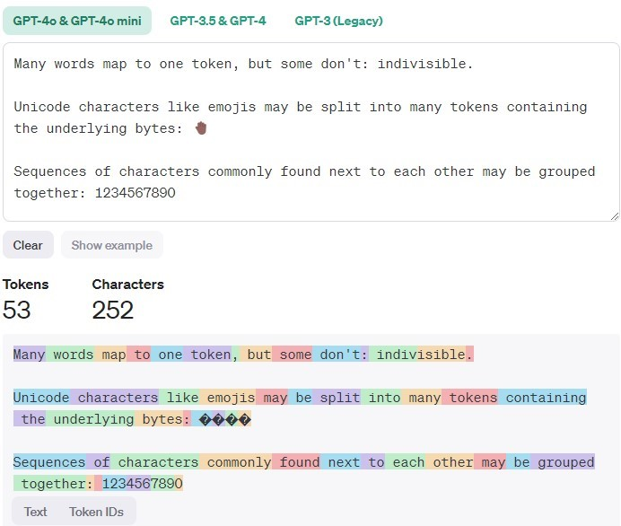
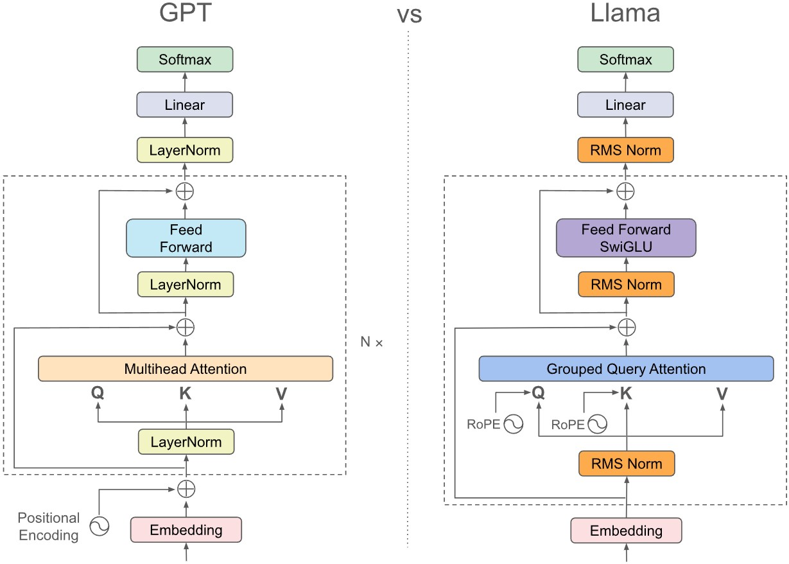

# LLM Basics

The note will focus on transformer-based large language models, their inference pass, and some implementation basics. The note mainly use LLaMA series [^llama2][^llama3] as a model example, and [`hunggingface/transformers`](https://huggingface.co/docs/transformers/index) as a reference for LLM framework implementation. 

[^llama2]: 
    [Llama 2: Open foundation and fine-tuned chat models](https://arxiv.org/abs/2307.09288)
    ```bibtex
    @article{llama2,
      title={Llama 2: Open foundation and fine-tuned chat models},
      author={Touvron, Hugo and Martin, Louis and Stone, Kevin and Albert, Peter and Almahairi, Amjad and Babaei, Yasmine and Bashlykov, Nikolay and Batra, Soumya and Bhargava, Prajjwal and Bhosale, Shruti and others},
      year={2023},
      eprint={2307.09288},
      archivePrefix={arXiv},
      primaryClass={cs.AI},
      url={https://arxiv.org/abs/2307.09288}, 
    }
    ```

[^llama3]:
    [The Llama 3 Herd of Models](https://arxiv.org/abs/2407.21783)
    ```bibtex
    @article{llama3,
      title={The Llama 3 Herd of Models}, 
      author={Abhimanyu Dubey and Abhinav Jauhri and Abhinav Pandey and Abhishek Kadian and Ahmad Al-Dahle and Aiesha Letman and Akhil Mathur and Alan Schelten and Amy Yang and Angela Fan and Anirudh Goyal and Anthony Hartshorn and Aobo Yang and Archi Mitra and Archie Sravankumar and Artem Korenev and Arthur Hinsvark and Arun Rao and Aston Zhang and Aurelien Rodriguez and Austen Gregerson and Ava Spataru and Baptiste Roziere and Bethany Biron and Binh Tang and Bobbie Chern and Charlotte Caucheteux and Chaya Nayak and Chloe Bi and Chris Marra and Chris McConnell and Christian Keller and Christophe Touret and Chunyang Wu and Corinne Wong and Cristian Canton Ferrer and Cyrus Nikolaidis and Damien Allonsius and Daniel Song and Danielle Pintz and Danny Livshits and David Esiobu and Dhruv Choudhary and Dhruv Mahajan and Diego Garcia-Olano and Diego Perino and Dieuwke Hupkes and Egor Lakomkin and Ehab AlBadawy and Elina Lobanova and Emily Dinan and Eric Michael Smith and Filip Radenovic and Frank Zhang and Gabriel Synnaeve and Gabrielle Lee and Georgia Lewis Anderson and Graeme Nail and Gregoire Mialon and Guan Pang and Guillem Cucurell and Hailey Nguyen and Hannah Korevaar and Hu Xu and Hugo Touvron and Iliyan Zarov and Imanol Arrieta Ibarra and Isabel Kloumann and Ishan Misra and Ivan Evtimov and Jade Copet and Jaewon Lee and Jan Geffert and Jana Vranes and Jason Park and Jay Mahadeokar and Jeet Shah and Jelmer van der Linde and Jennifer Billock and Jenny Hong and Jenya Lee and Jeremy Fu and Jianfeng Chi and Jianyu Huang and Jiawen Liu and Jie Wang and Jiecao Yu and Joanna Bitton and Joe Spisak and Jongsoo Park and Joseph Rocca and Joshua Johnstun and Joshua Saxe and Junteng Jia and Kalyan Vasuden Alwala and Kartikeya Upasani and Kate Plawiak and Ke Li and Kenneth Heafield and Kevin Stone and Khalid El-Arini and Krithika Iyer and Kshitiz Malik and Kuenley Chiu and Kunal Bhalla and Lauren Rantala-Yeary and Laurens van der Maaten and Lawrence Chen and Liang Tan and Liz Jenkins and Louis Martin and Lovish Madaan and Lubo Malo and Lukas Blecher and Lukas Landzaat and Luke de Oliveira and Madeline Muzzi and Mahesh Pasupuleti and Mannat Singh and Manohar Paluri and Marcin Kardas and Mathew Oldham and Mathieu Rita and Maya Pavlova and Melanie Kambadur and Mike Lewis and Min Si and Mitesh Kumar Singh and Mona Hassan and Naman Goyal and Narjes Torabi and Nikolay Bashlykov and Nikolay Bogoychev and Niladri Chatterji and Olivier Duchenne and Onur Çelebi and Patrick Alrassy and Pengchuan Zhang and Pengwei Li and Petar Vasic and Peter Weng and Prajjwal Bhargava and Pratik Dubal and Praveen Krishnan and Punit Singh Koura and Puxin Xu and Qing He and Qingxiao Dong and Ragavan Srinivasan and Raj Ganapathy and Ramon Calderer and Ricardo Silveira Cabral and Robert Stojnic and Roberta Raileanu and Rohit Girdhar and Rohit Patel and Romain Sauvestre and Ronnie Polidoro and Roshan Sumbaly and Ross Taylor and Ruan Silva and Rui Hou and Rui Wang and Saghar Hosseini and Sahana Chennabasappa and Sanjay Singh and Sean Bell and Seohyun Sonia Kim and Sergey Edunov and Shaoliang Nie and Sharan Narang and Sharath Raparthy and Sheng Shen and Shengye Wan and Shruti Bhosale and Shun Zhang and Simon Vandenhende and Soumya Batra and Spencer Whitman and Sten Sootla and Stephane Collot and Suchin Gururangan and Sydney Borodinsky and Tamar Herman and Tara Fowler and Tarek Sheasha and Thomas Georgiou and Thomas Scialom and Tobias Speckbacher and Todor Mihaylov and Tong Xiao and Ujjwal Karn and Vedanuj Goswami and Vibhor Gupta and Vignesh Ramanathan and Viktor Kerkez and Vincent Gonguet and Virginie Do and Vish Vogeti and Vladan Petrovic and Weiwei Chu and Wenhan Xiong and Wenyin Fu and Whitney Meers and Xavier Martinet and Xiaodong Wang and Xiaoqing Ellen Tan and Xinfeng Xie and Xuchao Jia and Xuewei Wang and Yaelle Goldschlag and Yashesh Gaur and Yasmine Babaei and Yi Wen and Yiwen Song and Yuchen Zhang and Yue Li and Yuning Mao and Zacharie Delpierre Coudert and Zheng Yan and Zhengxing Chen and Zoe Papakipos and Aaditya Singh and Aaron Grattafiori and Abha Jain and Adam Kelsey and Adam Shajnfeld and Adithya Gangidi and Adolfo Victoria and Ahuva Goldstand and Ajay Menon and Ajay Sharma and Alex Boesenberg and Alex Vaughan and Alexei Baevski and Allie Feinstein and Amanda Kallet and Amit Sangani and Anam Yunus and Andrei Lupu and Andres Alvarado and Andrew Caples and Andrew Gu and Andrew Ho and Andrew Poulton and Andrew Ryan and Ankit Ramchandani and Annie Franco and Aparajita Saraf and Arkabandhu Chowdhury and Ashley Gabriel and Ashwin Bharambe and Assaf Eisenman and Azadeh Yazdan and Beau James and Ben Maurer and Benjamin Leonhardi and Bernie Huang and Beth Loyd and Beto De Paola and Bhargavi Paranjape and Bing Liu and Bo Wu and Boyu Ni and Braden Hancock and Bram Wasti and Brandon Spence and Brani Stojkovic and Brian Gamido and Britt Montalvo and Carl Parker and Carly Burton and Catalina Mejia and Changhan Wang and Changkyu Kim and Chao Zhou and Chester Hu and Ching-Hsiang Chu and Chris Cai and Chris Tindal and Christoph Feichtenhofer and Damon Civin and Dana Beaty and Daniel Kreymer and Daniel Li and Danny Wyatt and David Adkins and David Xu and Davide Testuggine and Delia David and Devi Parikh and Diana Liskovich and Didem Foss and Dingkang Wang and Duc Le and Dustin Holland and Edward Dowling and Eissa Jamil and Elaine Montgomery and Eleonora Presani and Emily Hahn and Emily Wood and Erik Brinkman and Esteban Arcaute and Evan Dunbar and Evan Smothers and Fei Sun and Felix Kreuk and Feng Tian and Firat Ozgenel and Francesco Caggioni and Francisco Guzmán and Frank Kanayet and Frank Seide and Gabriela Medina Florez and Gabriella Schwarz and Gada Badeer and Georgia Swee and Gil Halpern and Govind Thattai and Grant Herman and Grigory Sizov and Guangyi and Zhang and Guna Lakshminarayanan and Hamid Shojanazeri and Han Zou and Hannah Wang and Hanwen Zha and Haroun Habeeb and Harrison Rudolph and Helen Suk and Henry Aspegren and Hunter Goldman and Ibrahim Damlaj and Igor Molybog and Igor Tufanov and Irina-Elena Veliche and Itai Gat and Jake Weissman and James Geboski and James Kohli and Japhet Asher and Jean-Baptiste Gaya and Jeff Marcus and Jeff Tang and Jennifer Chan and Jenny Zhen and Jeremy Reizenstein and Jeremy Teboul and Jessica Zhong and Jian Jin and Jingyi Yang and Joe Cummings and Jon Carvill and Jon Shepard and Jonathan McPhie and Jonathan Torres and Josh Ginsburg and Junjie Wang and Kai Wu and Kam Hou U and Karan Saxena and Karthik Prasad and Kartikay Khandelwal and Katayoun Zand and Kathy Matosich and Kaushik Veeraraghavan and Kelly Michelena and Keqian Li and Kun Huang and Kunal Chawla and Kushal Lakhotia and Kyle Huang and Lailin Chen and Lakshya Garg and Lavender A and Leandro Silva and Lee Bell and Lei Zhang and Liangpeng Guo and Licheng Yu and Liron Moshkovich and Luca Wehrstedt and Madian Khabsa and Manav Avalani and Manish Bhatt and Maria Tsimpoukelli and Martynas Mankus and Matan Hasson and Matthew Lennie and Matthias Reso and Maxim Groshev and Maxim Naumov and Maya Lathi and Meghan Keneally and Michael L. Seltzer and Michal Valko and Michelle Restrepo and Mihir Patel and Mik Vyatskov and Mikayel Samvelyan and Mike Clark and Mike Macey and Mike Wang and Miquel Jubert Hermoso and Mo Metanat and Mohammad Rastegari and Munish Bansal and Nandhini Santhanam and Natascha Parks and Natasha White and Navyata Bawa and Nayan Singhal and Nick Egebo and Nicolas Usunier and Nikolay Pavlovich Laptev and Ning Dong and Ning Zhang and Norman Cheng and Oleg Chernoguz and Olivia Hart and Omkar Salpekar and Ozlem Kalinli and Parkin Kent and Parth Parekh and Paul Saab and Pavan Balaji and Pedro Rittner and Philip Bontrager and Pierre Roux and Piotr Dollar and Polina Zvyagina and Prashant Ratanchandani and Pritish Yuvraj and Qian Liang and Rachad Alao and Rachel Rodriguez and Rafi Ayub and Raghotham Murthy and Raghu Nayani and Rahul Mitra and Raymond Li and Rebekkah Hogan and Robin Battey and Rocky Wang and Rohan Maheswari and Russ Howes and Ruty Rinott and Sai Jayesh Bondu and Samyak Datta and Sara Chugh and Sara Hunt and Sargun Dhillon and Sasha Sidorov and Satadru Pan and Saurabh Verma and Seiji Yamamoto and Sharadh Ramaswamy and Shaun Lindsay and Shaun Lindsay and Sheng Feng and Shenghao Lin and Shengxin Cindy Zha and Shiva Shankar and Shuqiang Zhang and Shuqiang Zhang and Sinong Wang and Sneha Agarwal and Soji Sajuyigbe and Soumith Chintala and Stephanie Max and Stephen Chen and Steve Kehoe and Steve Satterfield and Sudarshan Govindaprasad and Sumit Gupta and Sungmin Cho and Sunny Virk and Suraj Subramanian and Sy Choudhury and Sydney Goldman and Tal Remez and Tamar Glaser and Tamara Best and Thilo Kohler and Thomas Robinson and Tianhe Li and Tianjun Zhang and Tim Matthews and Timothy Chou and Tzook Shaked and Varun Vontimitta and Victoria Ajayi and Victoria Montanez and Vijai Mohan and Vinay Satish Kumar and Vishal Mangla and Vítor Albiero and Vlad Ionescu and Vlad Poenaru and Vlad Tiberiu Mihailescu and Vladimir Ivanov and Wei Li and Wenchen Wang and Wenwen Jiang and Wes Bouaziz and Will Constable and Xiaocheng Tang and Xiaofang Wang and Xiaojian Wu and Xiaolan Wang and Xide Xia and Xilun Wu and Xinbo Gao and Yanjun Chen and Ye Hu and Ye Jia and Ye Qi and Yenda Li and Yilin Zhang and Ying Zhang and Yossi Adi and Youngjin Nam and Yu and Wang and Yuchen Hao and Yundi Qian and Yuzi He and Zach Rait and Zachary DeVito and Zef Rosnbrick and Zhaoduo Wen and Zhenyu Yang and Zhiwei Zhao},
      year={2024},
      eprint={2407.21783},
      archivePrefix={arXiv},
      primaryClass={cs.AI},
      url={https://arxiv.org/abs/2407.21783}, 
    }
    ```

Additional resources: 

- [`huggingface/nlp-course`](https://huggingface.co/learn/nlp-course) 
- [GPT from scratch by Jay Mody](https://jaykmody.com/blog/gpt-from-scratch/#setup)

## Pipeline Components

As a high-level view, a LLM inference pipeline consists of 

- [__tokenizer__](#tokenizers): input natural language text stream, output tokens. 
- [__embedding__](#embedding): maps the tokens into a numerical format so that the model can consume. 
- [__model__](#decoder-only-transformers): the actual LLM model, which takes the embedding and outputs according to the model tasks. 
    - A typical transformer model has a `encoder` (plus `positional encoding`) to encode the input into feature vectors, a `decoder` that takes the features and other inputs to generate outputs.  
    - Primarily if we consider the text generation task, we only need a `decoder`. 
- __postprocessing__: Take the outputs from the model (often logits of embeddings), and format them back to text. 

## Tokenizers

In general, tokenizer split the characters into sequences of tokens. In also handles irregular or illegal input, do normalization (striping whitespace, remove accent chars, lowercasing, etc.).  

A simple view is to consider the token as one word, but not always true. Typically, the tokenizer only uses CPU, but not always true for some modern models. 

```py
from tokenizer import Tokenizer
tokenizer = Tokenizer.from_file("tokenizer.json")
output = tokenizer.encode("Hello, y'all! How are you 😁 ?")
print(output.tokens)
# ["Hello", ",", "y", "'", "all", "!", "How", "are", "you", "[UNK]", "?"]
print(output.ids)
# [27253, 16, 93, 11, 5097, 5, 7961, 5112, 6218, 0, 35]
```


Note that the tokenizer is often associated with the specific model. 

<figure markdown="span">
    
<figcaption><a href="https://platform.openai.com/tokenizer">OpenAI tokenizer</a></figcaption>
</figure>

## Embedding
The tokenizer generate a sequence of tokens (or token IDs), but the model cannot directly consume them as input. Using an [`embedding`](https://pytorch.org/docs/stable/generated/torch.nn.Embedding.html), which serve as a fixed size dictionary of all tokens. 

In general, we will also add a positional encoding to add an extra understanding of where the input is within the sentence. 

```py
# embedding is a lookup table of size (n_vocab, dim)
embeddings = Embedding(
    num_embedding=n_vocab, # number of vocab
    embedding_dim=embedding_dim # a configurable dim for embedding
)
# pos_encoder is a Encoding of size (max_seq_len, dim)
pos_encoder = PositionalEncoding(
    seq_len=max_seq_len, # configurable maximum sequence length
    dim=embedding_dim
)
# token_ids: Array[Int], shape (seq_len, )
# x: Array[Float], shape (seq_len, dim)
x = embeddings[token_ids] + pos_encoder[range(len(token_ids))]
```

## Decoder-only Transformers
We focus on the auto-regressive models, or the decoder-only transformer models.   



The embedding is passed through many Transformer blocks, and finally outputs the logits of the vocabulary to generate the next most likely word.

## Attention Module
Consider an intuitive example: we have a set of word keys $k_1, k_2, ..., k_n$ and each word $k_i$ is associated with some feature vector $v_i$, now we have a new word $q$ to query, and we'd like to compute the value vector $v_q = \sum_{i=1}^n a_i v_i$ with some __attention score__ $a_i$, and such $a_i$ represents how similar/relevant is the query to the $i$th word. 

Therefore, let $K\: (n_k\times d_k)$ be the stacked matrix of keys, $V\: (n_k\times d_v)$ be the stacked matrix of value vectors, and $Q: (n_q\times d_v)$ be the stack matrix of queries. We can derive the attention  to be 

$$A = \text{softmax}(\frac{QK^T}{\sqrt{d_k}}) V$$

(See [an intuitive explanation from Jay Mody](https://jaykmody.com/blog/attention-intuition/), and detailed derivation in _Attention is all You Need_[^vaswani2017attention])

[^vaswani2017attention]: 
  [Attention is all you need](https://arxiv.org/abs/1706.03762)
  ```
  @article{vaswani2017attention,
    title={Attention is all you need},
    author={Vaswani, A},
    journal={Advances in Neural Information Processing Systems},
    year={2017}
  }
  ```

### Self-attention
An interesting discovery is that $k$ and $v$ can come from the same source, and we gets __self attention__, i.e. input sequence attend to itself. which means `attention(q=x, k=x, v=x)`, which is just the similarity of all the words $A = \text{softmax}(XX^T/\sqrt{d_k}) X$ to each other in the sentence, and no trainable parameters to embed the global context. 

Therefore, we can introduce projections for the input $Q = W_Q X, K = W_K X, V=W_VX$ and bring it back to original dimension by $Y = W_{proj} A$, all the weight matrices are now trainable. In practice, we can stack $W_Q, W_K, W_V$ into one matrix to combine the multiplication for a better parallelism. 

### Multi-head (MHA)
To have a truly "large" language model, we want the projections to have more parameters. However, $QK^T$ part of the attention takes 

$$\text{FLOP} = n_Q\times d_K \times d_K \times n_K$$

Multi-head is introduced to reduce computation, in which we split the $d_K, d_V$ into $h$ "heads", i.e. smaller, separated features vectors. We compute attention on each and stack them back, so that the computation is 

$$h(n_q\times \frac{d_K}{h} \times\frac{d_K}{h} \times n_K) = \frac{1}{h}\text{FLOP}$$

In implementation, MHA with $N$ heads looks like $A_i = \text{softmax}(\frac{(W_Q^iQ)\cdot (W_K^i K)^T}{\sqrt{d_k}}) W_V^iV$, $MHA = W_O\cdot \text{concat}(A_1, A_2, ..., A_{N})$, where $W_O$ is the weights for output projection. 

###  Group Query (GQA) and Multi-query (MQA)

Instead of using multi-head on all of $Q,K,V$, MQA only use the full multi heads on $Q$. 

$$A_i = \text{softmax}(\frac{(W_Q^iQ)\cdot (W_K K)^T}{\sqrt{d_k}}) W_VV$$

Note that we only have one weight for $W_K$ and $W_V$, instead of $n$ weights. 

GQA uses the similar idea, instead of all $N$ heads of query share the same projected $K, V$, we have $N/d$ heads for $K,V$ and every $d$ Q-heads will share one KV head.   

$$A_i = \text{softmax}(\frac{(W_Q^iQ)\cdot (W_K^{\lfloor i/d \rfloor} K)^T}{\sqrt{d_k}}) W_V^{\lfloor i/d\rfloor}V$$

### Causal Masking
For a text generation model, all words should only see words before it. Otherwise, it will be biased towards the known answer. 

One natural way is to mask out the relevance in the context. Which means $0$ for all the keys after the current key. However, we need to pass a `softmax` and have $0$ in the output. We can do this by adding a negative-infinity matrix $M$ to $QK^T$. 


### KV Caching for Casual Inference

For text generation tasks with a transformer model, the inference is done as 

```py
prompt_tokens = tokenizer.encode(input_text)

for _ in range(n_next_tokens):
    new_token = model(prompt_tokens)
    prompt_tokens.append(new_token)

output_tokens = tokenizer.decode(prompt_tokens)
```

Because we always want to generate new tokens based on all previous context. However, in each iteration we only have 1 new token, we are always recomputing the prompt tokens. Considering the computation in `attention` module, the overhead is exponential to the `max_sequence_len`. 

However, casual inference masks out tokens after the current token. For each queried token, its attention $A, Q, K, V$ are only relevant to previous tokens. Therefore, for each iteration
- We only need to query the newly generated input.
- We reuse all previous $K,V$, concat with the new $k, v$ w.r.t input $x$. 

The inference becomes

```py
prompt_tokens = tokenizer.encode(input_text)

# context encoding phase
# K_cache, V_cache shape (len(prompt_tokens), ...)
new_token, K_cache, V_cache = model(
    prompt_tokens, K_cache=[], V_cache=[])
propmpt_tokens.append(new_token)

# token generation phase
for _ in range(n_next_tokens):
    # new_K_cache, new_V_cache, shape (1, ...)
    new_token, new_K_cache, new_V_cache = model(
        new_token, K_cache=K_cache, V_cache=V_cache)
    K_cache.append(new_K_cache)
    V_cache.append(new_V_cache)
    prompt_tokens.append(new_token)

output_tokens = tokenizer.decode(prompt_tokens)
```


### Putting all Together

```py
# forward part of Attention module from llama3
# https://github.com/meta-llama/llama3/blob/main/llama/model.py
def forward(
    self,
    x: torch.Tensor,
    start_pos: int,
    freqs_cis: torch.Tensor,
    mask: Optional[torch.Tensor],
):
    bsz, seqlen, _ = x.shape
    
    # projections
    xq, xk, xv = self.wq(x), self.wk(x), self.wv(x)

    xq = xq.view(bsz, seqlen, self.n_local_heads, self.head_dim)
    xk = xk.view(bsz, seqlen, self.n_local_kv_heads, self.head_dim)
    xv = xv.view(bsz, seqlen, self.n_local_kv_heads, self.head_dim)

    # llama3's rotary positional encoding
    # refer to the original paper for detail
    xq, xk = apply_rotary_emb(xq, xk, freqs_cis=freqs_cis)

    # KV caching
    self.cache_k = self.cache_k.to(xq)
    self.cache_v = self.cache_v.to(xq)

    self.cache_k[:bsz, start_pos : start_pos + seqlen] = xk
    self.cache_v[:bsz, start_pos : start_pos + seqlen] = xv

    keys = self.cache_k[:bsz, : start_pos + seqlen]
    values = self.cache_v[:bsz, : start_pos + seqlen]

    # Multi-head

    # repeat k/v heads if n_kv_heads < n_heads
    keys = repeat_kv(
        keys, self.n_rep
    )  # (bs, cache_len + seqlen, n_local_heads, head_dim)
    values = repeat_kv(
        values, self.n_rep
    )  # (bs, cache_len + seqlen, n_local_heads, head_dim)

    xq = xq.transpose(1, 2)  # (bs, n_local_heads, seqlen, head_dim)
    keys = keys.transpose(1, 2)  
    # (bs, n_local_heads, cache_len + seqlen, head_dim)
    values = values.transpose(1, 2)  
    # (bs, n_local_heads, cache_len + seqlen, head_dim)

    # self-attention
    scores = torch.matmul(xq, keys.transpose(2, 3)) / math.sqrt(self.head_dim)
    if mask is not None:
        scores = scores + mask  # (bs, n_local_heads, seqlen, cache_len + seqlen)
    scores = F.softmax(scores.float(), dim=-1).type_as(xq)
    output = torch.matmul(scores, values)  # (bs, n_local_heads, seqlen, head_dim)
    output = output.transpose(1, 2).contiguous().view(bsz, seqlen, -1)

    # projection back
    return self.wo(output)
```

## Feed forward Network
Simple fully connected linear layers to expand and contract the embedding dimension, so that we have more trainable weights for the context. For LLaMA3 the design is a bit different to have more efficiency. 

```py
# https://github.com/meta-llama/llama3/blob/main/llama/model.py
class FeedForward(nn.Module):
    def __init__(
        self,
        dim: int,
        hidden_dim: int,
        multiple_of: int,
        ffn_dim_multiplier: Optional[float],
    ):
        super().__init__()
        hidden_dim = int(2 * hidden_dim / 3)
        # custom dim factor multiplier
        if ffn_dim_multiplier is not None:
            hidden_dim = int(ffn_dim_multiplier * hidden_dim)
        hidden_dim = multiple_of * ((hidden_dim + multiple_of - 1) // multiple_of)

        self.w1 = ColumnParallelLinear(
            dim, hidden_dim, bias=False, gather_output=False, init_method=lambda x: x
        )
        self.w2 = RowParallelLinear(
            hidden_dim, dim, bias=False, input_is_parallel=True, init_method=lambda x: x
        )
        self.w3 = ColumnParallelLinear(
            dim, hidden_dim, bias=False, gather_output=False, init_method=lambda x: x
        )

    def forward(self, x):
        return self.w2(F.silu(self.w1(x)) * self.w3(x))
```

## Inference Acceleration and Performance Evaluation

[All About Transformer Inference - How to Scale Your Model with TPU](https://jax-ml.github.io/scaling-book/inference/)

During inference, we are optimizing for time to first token (TTFT) and tokens per second (TPS). Without changing the actual computations, we want fully use the hardware, i.e. better model FLOPS utilization (MFU) and model bandwidth utilization (MBU) __at the same time__. 

On a typical hardware (CPU/GPU/TPU), we have a memory hierarchy, where data needs to be loaded from the large-sized memory (often HBM) to the much smaller cache/register (SBUF) for computation. The data movement can be seen as executed by DMA engines, and can be overlapped with computations. Therefore, the theoretical performance is `max(data_movement_time, computation_time)`. This is called the [roofline model](https://jax-ml.github.io/scaling-book/roofline/). 


### Q, K, V projection
Q, K, V projection $[Q_p, K_p, V_p] = [W_Q\cdot Q, W_K\cdot K, W_V\cdot V]$ where 

- $Q,K,V: (1, H, S)$, $S$ is sequence length, $H$ is hidden dimension size
- $W_Q, W_K, W_V: (N_{heads}, I, H)$, $N_{heads}$ is number of heads, $I$ is intermediate dimension size. 
- $Q_p, K_p, V_p: (N_{heads}, I, S)$ are the projected multi-head values

So total flop is $3N_{heads} \times 2IHS = 6N_{heads}IHS$, data movement is $N_{bytes}\times(HS+N_{heads}IH+BF)$, where $N_{bytes}$ depends on dtype.

### Flash Attention 

[Flash Attention](https://github.com/Dao-AILab/flash-attention)[^dao2022flashattention] is a widely-used method for optimizing attention computations. We will only talk about forward pass here.

[^dao2022flashattention]:
  [FlashAttention: Fast and Memory-Efficient Exact Attention with IO-Awareness](https://arxiv.org/abs/2205.14135)
  ```bibtex
  @inproceedings{dao2022flashattention,
    title={Flash{A}ttention: Fast and Memory-Efficient Exact Attention with {IO}-Awareness},
    author={Dao, Tri and Fu, Daniel Y. and Ermon, Stefano and Rudra, Atri and R{\'e}, Christopher},
    booktitle={Advances in Neural Information Processing Systems (NeurIPS)},
    year={2022}
  }
  ```

In the attention computation, we are doing two large matmul, one division (which can be pre-applied) and one softmax. In which we have to write the result back to HBM for each operation. A natural way to improve is to use the fused operations, i.e. re-order/design the computations so that we do not write intermediate results back to HBM. Fusing matmuls is easy: assuming SBUF can fit at least 3 hidden vectors, we partition $QKV$ by the sequence dim. If we ignore the softmax part, we have two matmuls and fuse the computation of $S_P$ tokens:  $[(S_P , I) \times (I, S_P)]\times (S_P, I) = (S_P, S_P)\times (S_P, I) = (S_P, I)$

Now, consider the softmax, for numerical stability we have to use standard normalized softmax

$$m = \max(\mathbf x), \text{softmax}(\mathbf x) = \frac{\exp(\mathbf x-m)}{\sum_1^n \exp(x_i-m)}$$

If we partition $\mathbf{x}$ into $[\mathbf{x}_1, \mathbf{x}_2]$, then $m_1 = \max(\mathbf{x}_1), m_2 = \max(\mathbf{x}_2), m = \max(m_1, m_2)$, then

$$\text{softmax}(\mathbf x) = \frac{[\exp(\mathbf x_1 - m), \exp(\mathbf x_2 - m)]}{\sum \exp(\mathbf x_1 - m) + \sum \exp(\mathbf x_2 - m)}$$

Also observe that

$$\exp(\mathbf x_1 - m)= \exp(\mathbf x_1 - m_1 + m_1 - m) = \exp(\mathbf x_1 - m_1)\exp(m_1 - m)$$

$$\sum \exp(\mathbf x_1 - m) = \sum  \exp(\mathbf x_1 - m_1)\exp(m_1 - m) = \exp(m_1 - m)\sum \exp(\mathbf x_1 - m_1)$$

Which means that for each partition, we only need to keep $\exp(\mathbf x_1 - m_1), m_1$ and the denominator $l_1 := \exp(\mathbf x_1 - m_1)$. Also, since $m_1, l_1$ are scalar multiplication, we would postbone the reduction after the matmuls. 