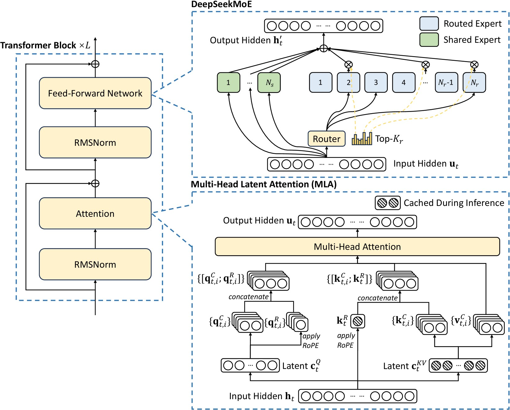

# Mixture of Experts Inference

[Mixtral of Experts](https://arxiv.org/abs/2401.04088) [^mixtral]  
[DeepSeek V3 Technical Report](https://arxiv.org/abs/2412.19437)[^deepseekv3]  
[MoE Explained by HuggingFace](https://huggingface.co/blog/moe)


[^mixtral]:
  [Mixtral of experts](https://arxiv.org/abs/2401.04088)
  ```bibtex
  @article{mixtral,
    title={Mixtral of experts},
    author={Jiang, Albert Q and Sablayrolles, Alexandre and Roux, Antoine and Mensch, Arthur and Savary, Blanche and Bamford, Chris and Chaplot, Devendra Singh and Casas, Diego de las and Hanna, Emma Bou and Bressand, Florian and others},
    journal={arXiv preprint arXiv:2401.04088},
    year={2024}
  }
  ```
[^deepseekv3]:
  [DeepSeek-V3 Technical Report](https://arxiv.org/abs/2412.19437)
  ```bibtex
  @misc{deepseekv3,
    title={DeepSeek-V3 Technical Report}, 
    author={DeepSeek-AI and Aixin Liu and Bei Feng and Bing Xue and Bingxuan Wang and Bochao Wu and Chengda Lu and Chenggang Zhao and Chengqi Deng and Chenyu Zhang and Chong Ruan and Damai Dai and Daya Guo and Dejian Yang and Deli Chen and Dongjie Ji and Erhang Li and Fangyun Lin and Fucong Dai and Fuli Luo and Guangbo Hao and Guanting Chen and Guowei Li and H. Zhang and Han Bao and Hanwei Xu and Haocheng Wang and Haowei Zhang and Honghui Ding and Huajian Xin and Huazuo Gao and Hui Li and Hui Qu and J. L. Cai and Jian Liang and Jianzhong Guo and Jiaqi Ni and Jiashi Li and Jiawei Wang and Jin Chen and Jingchang Chen and Jingyang Yuan and Junjie Qiu and Junlong Li and Junxiao Song and Kai Dong and Kai Hu and Kaige Gao and Kang Guan and Kexin Huang and Kuai Yu and Lean Wang and Lecong Zhang and Lei Xu and Leyi Xia and Liang Zhao and Litong Wang and Liyue Zhang and Meng Li and Miaojun Wang and Mingchuan Zhang and Minghua Zhang and Minghui Tang and Mingming Li and Ning Tian and Panpan Huang and Peiyi Wang and Peng Zhang and Qiancheng Wang and Qihao Zhu and Qinyu Chen and Qiushi Du and R. J. Chen and R. L. Jin and Ruiqi Ge and Ruisong Zhang and Ruizhe Pan and Runji Wang and Runxin Xu and Ruoyu Zhang and Ruyi Chen and S. S. Li and Shanghao Lu and Shangyan Zhou and Shanhuang Chen and Shaoqing Wu and Shengfeng Ye and Shengfeng Ye and Shirong Ma and Shiyu Wang and Shuang Zhou and Shuiping Yu and Shunfeng Zhou and Shuting Pan and T. Wang and Tao Yun and Tian Pei and Tianyu Sun and W. L. Xiao and Wangding Zeng and Wanjia Zhao and Wei An and Wen Liu and Wenfeng Liang and Wenjun Gao and Wenqin Yu and Wentao Zhang and X. Q. Li and Xiangyue Jin and Xianzu Wang and Xiao Bi and Xiaodong Liu and Xiaohan Wang and Xiaojin Shen and Xiaokang Chen and Xiaokang Zhang and Xiaosha Chen and Xiaotao Nie and Xiaowen Sun and Xiaoxiang Wang and Xin Cheng and Xin Liu and Xin Xie and Xingchao Liu and Xingkai Yu and Xinnan Song and Xinxia Shan and Xinyi Zhou and Xinyu Yang and Xinyuan Li and Xuecheng Su and Xuheng Lin and Y. K. Li and Y. Q. Wang and Y. X. Wei and Y. X. Zhu and Yang Zhang and Yanhong Xu and Yanhong Xu and Yanping Huang and Yao Li and Yao Zhao and Yaofeng Sun and Yaohui Li and Yaohui Wang and Yi Yu and Yi Zheng and Yichao Zhang and Yifan Shi and Yiliang Xiong and Ying He and Ying Tang and Yishi Piao and Yisong Wang and Yixuan Tan and Yiyang Ma and Yiyuan Liu and Yongqiang Guo and Yu Wu and Yuan Ou and Yuchen Zhu and Yuduan Wang and Yue Gong and Yuheng Zou and Yujia He and Yukun Zha and Yunfan Xiong and Yunxian Ma and Yuting Yan and Yuxiang Luo and Yuxiang You and Yuxuan Liu and Yuyang Zhou and Z. F. Wu and Z. Z. Ren and Zehui Ren and Zhangli Sha and Zhe Fu and Zhean Xu and Zhen Huang and Zhen Zhang and Zhenda Xie and Zhengyan Zhang and Zhewen Hao and Zhibin Gou and Zhicheng Ma and Zhigang Yan and Zhihong Shao and Zhipeng Xu and Zhiyu Wu and Zhongyu Zhang and Zhuoshu Li and Zihui Gu and Zijia Zhu and Zijun Liu and Zilin Li and Ziwei Xie and Ziyang Song and Ziyi Gao and Zizheng Pan},
    year={2025},
    eprint={2412.19437},
    archivePrefix={arXiv},
    primaryClass={cs.CL},
    url={https://arxiv.org/abs/2412.19437}, 
  }
  ```

## Overview
MoE layer is a replacement for the FFN (dense MLP) layer in LLMs. Compared to one dense feed forward layer, MoE gives 

- Better scalability on number of parameters
- Much faster pre-training
- Much faster inference compared to a model with the same number of parameters



MoE layer replaces the dense linear layers with a weighted sum of experts. Where each `expert` is a small FFN, and the weights is provided by the `router` layer. Intuitively, instead of having one big "genius", MoE layer uses several experts and a router to decide which expert will answer. 

## Mixtral
Mixtral[^mixtral] is one of the earliest MoE model. The router network is defined as 

$$G(x) = \text{softmax}(\text{topK}(x\cdot W_g))$$

the router is a linear layer, with topK to force it only have K experts, and softmax activation to make the weight normalized. 

Each expert is just a FFN layer, Mixtral uses SwiGLU from Llama2. 

```py3
def forward(self, inputs: torch.Tensor) -> torch.Tensor:
    # inputs: (seq_len, hidden_size)

    gate_logits = self.gate(inputs)
    # gate_logits: (seq_len, )
    weights, selected_experts = torch.topk(gate_logits, self.k)
    # selected_experts: (seq_len, k)
    weights = F.softmax(weights, dim=1, dtype=torch.float).to(inputs.dtype)
    # weights: (seq_len, n_experts)
    results = torch.zeros_like(inputs)
    for i, expert in enumerate(self.experts):
        batch_idx, nth_expert = torch.where(selected_experts == i)
        results[batch_idx] += weights[batch_idx, nth_expert, None] * expert(inputs[batch_idx])
    # results: (seq_len, hidden_size)
    return results
```

Mathematically, MoE layer is considered as a "sparse" FFN. If we concatenate all experts, it will be dense linear layers with $(H, I\times n)$ parameters. For each token feature vector, we mask out $(n-k)/n$ rows or columns, where the masked rows are chosen by the router. Therefore, compared to dense models with the same number of parameters, the MoE will only take $k/n$ computations plus some routing overhead (which is small compared to MLP matmuls). 

### Case: Mixtral8x7B
Mixtral8x7B (32 decoder layers) model parameters vs Llama2 70B (80 decoder layers)

|     | Mixtral shape | n_params | Llama2 70B shape | n_params |
| --- | ---           | --- |  --- | --- |
| attn K proj | (4096, 1024) | 4M | (8192, 1024) | 8M |
| attn Q proj |  (4096, 4096) | 16M | (8192, 8192) | 64M |
| attn V proj |  (4096, 4096) | 16M | (8192, 8192) | 64M |
| attn out proj |  (4096, 4096) | 16M | (8192, 8192) | 64M |
| attn normalization | (4096, ) | 4k | (8192, ) | 8k |
| FFN router |  (4096, 8) | 32k | - | -  |
| FFN gate proj |(4096, 14336, 8) | 448M<br>(112M active) | (8192, 28672) | 224M | 
| FFN up proj | (4096, 14336, 8) | 448M<br>(112M active) | (8192, 28672) | 224M | 
| FFN down proj |  (14336, 4096, 8) | 448M<br>(112M active) | (28672, 8192) | 224M | 
| FFN normalization |  (4096, ) | 4k | (8192, ) | 8k |
| total | | $32 \times 1.4 \approx 42$B<br>$32 \times 0.388 \approx 12$B activated | | $80\times 0.872\approx 54$B

Note that Mixtral has similar number of parameters. However, Mixtral only uses $2/8$ of the weights, hence the FFN computations are far smaller. 

## Load Balancing
We have the intuition that each expert model is an expert of some areas of knowledge. However, this is not true. To make the model scalable and efficient, we want a more balanced workload (number of tokens) among the experts. For training, this can be done through auxiliary loss and expert capacity (expert drops tokens if the assigned tokens exceeds its capacity). 
