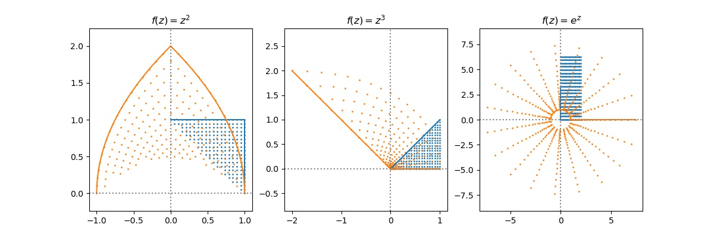

# Conformal Map and Mobius Transformation

For some function $f:\mathbb C\rightarrow \mathbb C$, $f$ is __conformal at__ $z_0$  if for any differentiable curves $\gamma_1$ and $\gamma_2$ s.t. pass through some point $z_0$. We have that the angle between $\gamma_1$ and $\gamma_2$ at $z_0$ is the same as $f(\gamma_1)$ and $f(\gamma_2)$ at $z_0$.

Equivalently, a complex function $f$ is __conformal__ IFF $f$ is analytic with non-zero derivative.

Definition of conformal on $\infty$
- $f(\infty)$ is __conformal at__ $\infty$ if $g(z) = f(1/z)$ is conformal at 0.
- If $f(z_0) = \infty$, then $f$ is __conformal at__ $z_0$ if $f(z_0)^{-1}$ is conformal at $z_0$. 
- Combine the two above, if $f(\infty) = \infty$, then $f$ is conformal at $\infty$ if $\frac{1}{f(1/z)}$ is conformal at $0$. 


??? quote "Source code"
    ```py 
    --8<-- "mat334/scripts/conformal.py"
    ```


    

    


### Theorem 1

If f(z) is analytic at $z_0$ and $z_0$ is a zero of order $n$, then $f(z)$ magnifies the angle between curves by a factor of $n$. 

### Theorem 2. Open Mapping's Theorem
Let $f: D\rightarrow \mathbb C$ be analytic with non-zero derivative and $D$ is a domain. Then $f(D)$ is a domain.  

__Theorem__ Let $D$ be a simply connected domain whose boundary is parameterized by a differentiable curve $C$. Let $f$ be analytic on $D$ and $C$. If $f$ is injective on $C$ with non-zero derivative. Then it is injective on $D$ and $f(C)$ is the boundary of $f(D)$.

## Riemann Mapping's Theorem

__Theorem (Riemann Mapping Theorem)__ If $D\in\mathbb C, D\neq \mathbb C$ is a simply connected domain, then there exists a bijective, invertible, analytic conformal map $f:D\rightarrow B_1(0)$

Note that by Riemann Mapping Theorem, we can deform any simply connected domain to the unit circle, and then deform into another simply connected domain.

### Example 1
$D = \{z: Im(z) > 0, |z| > 1\}, H = \{z: Im(z) > 0\}, f(z) = z+ \frac{1}{z}$. Show that $f(D)=H$ and $f$ is bijective and conformal.

First, check that $f$ sends the boundary of $D$ to $\mathbb R$.
 - $\forall a < -1 , f(a) < -1 - 1 = -2, f^{-1}(x) = -\sqrt{x^2/4 - 1} + x/2$
 - $\forall a > 1, f(a)  > 1 + 1 > 2, f^{-1}(x) = \sqrt{x^2/4 - 1} + x/2$
 - $\forall |a| > 1\land Im(a) > 0. c(t) = e^{it}, f(e^{it}) = e^{it}+e^{-it} = 2\cos(t) \in [-2, 2], f^{-1}(z) = \cos^{-1}(z)$

All of them are bijective in their given domain. 

Finally, note that for any $z = x+iy\in D$. $f(x+iy) = x+\frac{1}{x} + i(y+\frac{1}{y})$, we have shown the case on the reals, only consider the imagine part, since $y =Im(z) > 0, y + \frac{1}{y} > 0$. Hence $f(z) \in H$

## Mobius Transformations
$f(z)$ is a __Mobius transformation__ if $f(z) = \frac{az+b}{cz+d}, a,b,c,d\in\mathbb C$ and $ad-bc\neq 0$.

__Example__ linear map $f(z) = az+b$ with $a\neq 0$ are Mobius transformation since $az+b = \frac{az+b}{0z+1}, a\cdot 1 - b \cdot 0 = a\neq 0$

__Example__ When $c\neq 0$

$$f(\infty) := \lim_{z\rightarrow \infty} f(z) = \lim_{z\rightarrow \infty}\frac{az+b}{cz+d} = \lim_{z\rightarrow \infty}\frac{a + bz^{-1} }{c+dz^{-1} } = \frac{a}{c}$$

When $c= 0$

$$f(\infty) = \lim_{z\rightarrow \infty}\frac{az+b}{d} = \infty$$

When $c=0$, $f(z)$ has no pole in $\mathbb C$.  
When $c\neq 0$, consider $z_0 = -d/c$, the denom is $0$, hence $f$ has a pole at $-d/c$. Define $f(-d/c) = \infty$. 

Now, with the infinity points being defined, we can extend $f$ to the Riemann sphere $f: \bar{\mathbb C}\rightarrow \bar{\mathbb C}$ and $f$ then is analytic on $\bar{\mathbb C}$. 

### Properties of Mobius Transformations

(We will assume $c\neq 0$, otherwise Mobius transformations falls into a linear map and trivially have the properties list below). 

#### Conformal
Mobius Transformations are conformal.

_proof_. We need to consider $f(\frac{-d}{c}) = \infty$ and $f(\infty)$ and all other points. 

- First, consider "all other points", since $ad-bc\neq 0$ and $cz+d\neq 0$
    
$$f'(z) = \frac{ad-bc}{(cz+d)^2} \neq 0$$

- $z_0 = -d/c$, then consider $g(z) = f(z)^{-1} = (\frac{az+b}{cz+d})^{-1} = \frac{cz+d}{az+b}$ is still a Mobius Transformation. And it's "special point" is $-b/a$, since $ad\neq bc$, $-b/a\neq -d/c$ and hence $f$ is conformal at $-d/c$. 
- $z_0 = \infty$, then consider $g(z) = f(1/z) = \frac{az^{-1} + b}{cz^{-1} + d} = \frac{bz+a}{dz+c}$ is still a Mobius Transformation, and $da-cb\neq 0, -c/d\neq 0$ meaning that $g(z)$ is conformal at 0, hence $f$ conformal at $\infty$ 

#### Finite composition of linear maps and inversion
Mobius Transformations is a finite composition of linear maps and inversion

_proof_. Note that

$$f(z) = \frac{az+b}{dz+d} = \frac{a}{c} + \frac{bd-ad}{c}(cz+d)^{-1}$$

#### Closed under composition
Mobius transformation is closed under composition

_proof_. Let $f_1(z) = \frac{a_1z+b_1}{c_1z+d_1}, f_2(z) = \frac{a_2z+b_2}{c_2z+d_2}$. Let $g = f_1\circ f_2$.

\begin{align*}
g(z) &= \frac{a_1(\frac{a_2z+b_2}{c_2z+d_2}) + b_1}{c_1(\frac{a_2z+b_2}{c_2z+d_2}) + d_1}\\
&=  \frac{a_1(a_2z+b_2) + b_1(c_2z+d_2)}{c_1(a_2z+b_2) + d_1(c_2z+d_2)}\\
&= \frac{(a_1a_2+b_1c_2)z + (a_1b_2 + b_1d_2)}{(c_1a_2+d_1c_2)z + (c_1b_2+d_1d_2)}
\end{align*}

Also, note that if we let $g = \frac{az+b}{cz+d}$, the $a,b,c,d$ can be obtained by

$$\begin{bmatrix}a&b\\c&d\end{bmatrix} = \begin{bmatrix}a_1&b_1\\c_1&d_1\end{bmatrix} \begin{bmatrix}a_2&b_2\\c_2&d_2\end{bmatrix}$$

#### Invertible
Mobius transformation is invertible.   
_proof_. Using the closure of composition, let $g = f^{-1} \circ f, g(z) = \frac{1z+0}{0z+1}, f(z) = \frac{az+b}{cz+d}$, 

$$\begin{bmatrix}1&0\\0&1\end{bmatrix} = \begin{bmatrix}a&b\\c&d\end{bmatrix} \begin{bmatrix}a'&b'\\c'&d'\end{bmatrix}$$

Hence the coefs for $f^{-1}$ is simply the inverse of coef matrix of $f$. i.e.

$$ \begin{bmatrix}a&b\\c&d\end{bmatrix}^{-1} =  \frac{1}{ad-bc}\begin{bmatrix}d&-b\\-c&a\end{bmatrix}$$

Since $ad-bc\neq 0$, also note that we can drop the $\frac{1}{ad-bc}$ part as it will be applied on both numurator and denominator, so that 

$$f^{-1}(z) = \frac{dz-b}{-cz+a}$$

### Cross Ratios

__Theorem__ Let $z_1,z_2,z_3,z_4 \in \mathbb C$ be distinct. $f$ is a Mobius transformation. Then 

$$\frac{(z_1-z_4)(z_3-z_2)}{(z_1-z_2)(z_3-z_4)} = \frac{(f(z_1)-f(z_4))(f(z_3)-f(z_2))}{(f(z_1)-f(z_2))(f(z_3)-f(z_4))}$$ 

_proof_. omitted. simply expand the equation

We define the ratio $\frac{(z_1-z_4)(z_3-z_2)}{(z_1-z_2)(z_3-z_4)}$ as __cross ratio__.

If any of the points is $\infty$ (say $z_3$), then we write 

$$\lim_{z_3\rightarrow\infty} \frac{(z_1-z_4)(z_3-z_2)}{(z_1-z_2)(z_3-z_4)} = \lim_{z_3\rightarrow\infty}\frac{(z_1-z_4)(1-\frac{z_2}{z_3})}{(z_1-z_2)(1-\frac{z_4}{z_3})} = \frac{z_1-z_4}{z_1-z_2}$$

Cross ratios can be used to find the Mobius transoformation. 

#### Example 1.
Let $z_1 = 0, z_2 = 1, z_3 = -1$ maps to $w_1 = 0, w_2 = 1, w_3 = i$. Find $f$ be a Mobius transformation s.t. $f(z_i) = w_i$. 

Set $z_4 = z, w_4 = 4$, using the cross ratio formula, we have 

\begin{align*}
\frac{(0-z)(-1-1)}{(0-1)(-1-z)} &= \frac{(0-w)(i-1)}{(0-1)(i-w)}\\
\frac{2z}{1+z} &= \frac{w(i-1)}{i-w}\\
w(i-1) + wz(i-1) &= 2iz - 2zw\\
w(z(i+1) + i-1) &= 2iz\\
f(z) = w &= \frac{(2i)z}{2(1+i)+i-1}
\end{align*}

### Preservation of angles and generalized circles
Note that Mobius transformations is conformal, we will show that lines and circles will be transformed to lines and circles. Also, note that Mobius transformation is a finite combination of linear maps and inversion. Hence we will show that lines and circles are preversed under inversion (linear map is trivial). 

__Theorem__ lines are preserved under inversion.  
_proof_. First, we need to find equations for lines and circles under $\mathbb C$.  
For a 2D real line $ax+by+c = 0$, write $z= x+iy$ so that $x = \frac{z+\bar z}{2}, y = \frac{z- \bar z}{2i}$. Then the equation becomes 

$$a(\frac{z+\bar z}{2}) + b(\frac{z-\bar z}{2i}) + c =(\frac{a}{2} + \frac{b}{2i})z + (\frac{a}{2} - \frac{b}{2i})\bar z + c = Bz + \bar B\bar z + c =0$$

set $B = \frac{a}{2} + \frac{b}{2i}$

For circles centered at $z_0$ with radius $r$, write 

$$r^2 = (z - z_0)(z+z_0) = z\bar z - z \bar z_0 - \bar z z_0 + z_0 \bar z_0$$

if we write $B = -z_0, C = z_0\bar z_0 - r^2$, 

$$z\bar z +B\bar z  +\bar B z  + C = 0$$

A circle only offs the line by $z\bar z$

Actucally, consider the inversion, note that $z^{-1} = \frac{\bar z}{z\bar z}, \overline{z^{-1} } = \frac{z}{z\bar z}$, we have the transformed equations be

$$B\bar z + \bar B z + C z\bar z = 0$$

$$1 + \bar B\bar z + Bz + C z\bar z = 0$$

Therefor
 - If $C = 0$, inversion maps lines and circles to lines. 
 - If $C\neq 0$, inversion maps lines and circles to circles. 

#### Example 1
Let $f(z) = \frac{z-i}{z+i}$. Find the image of the line $y=x$ under $f$. 

Since a line can only be mapped to a line or a circle, it suffices to check 3 points. 
We check that 

 - $f(0) = \frac{-i}{i} = -1$
 - $f(\infty) = \lim_{z\rightarrow\infty}\frac{z-i}{z+i} =  \lim_{z\rightarrow\infty}\frac{1-i/z}{1+i/z} = 1$
 - $f(1+i) = \frac{1+i-i}{1+i+i} = \frac{1}{2i+1}$

Obviously the 3 points aren't on a line, hence they form a circle. and we can find the circle via regular circle equations with 3 equations and 3 unknowns. 
