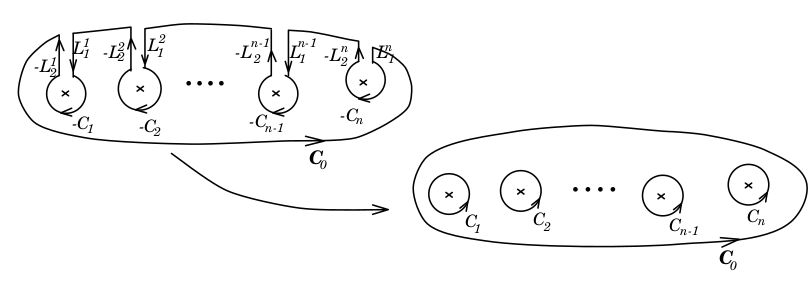

# Cauchy's Theorem

## Cauchy's Theorem

__Theorem__ Let $f:D\rightarrow \mathbb C$ be analytic on simply connected domain $D$. For any Jordon contour $C\subset D$, $\oint_C f(z)dz = 0$  

_proof (simpler ver.). We will prove the statement with the assumption that $f'$ continuous on $D$,_  

Remark that Greens theorem states that for real functions $f:\mathbb R^2 \rightarrow\mathbb R^2, f(x, y) = \begin{pmatrix}u(x,y\\v(x,y)\end{pmatrix}$ and a simple closed contour $C$,  
If the partial derivatives $u_x, u_y, v_x, v_y$ are continuous on the region $R = C\cup C_{int}$, then

$$\oint_C (udx + vdy) = \iint_{R}(v_x - u_y)dxdy$$

Then, consider its connection to $f = u+iv$ on the same region. 

\begin{align*}
\oint_C f(z)dz &= \oint_C u(x,y) + i(x,y) (dx+idy)\\
&=\oint_C udx -vdy + i\oint_C udy + vdx\\
&= \iint_R (-v_x - u_y)dxdy + \iint_R (u_x-v_y)dxdy &\text{Green} \\
&= \iint_R (u_y - u_y) dxdy + \iint_R (u_x-u_x)dxdy&\text{CR}\\
&= 0
\end{align*}

## Deformation of Curves
Note that for any two endpoints $z_0, z_1 \in D$, $D$ is simply connected. Then, arbitrarily pick two curves $C_1, C_2$ traverse from $z_0$ to $z_1$, then $C_1, \neg C_2$ will form a simple closed curve, so that $\oint_{C_1\cup\neg C_2} = 0\implies \oint_{C_1} = \oint_{C_2}$

__Example__ Define a branch of $\log$ as $D = \{re^{i\theta} : r > 0, \theta \in (-\pi, \pi)\}$. Therefore, we can define its anti-derivative as $z^{-1}$ on this branch by 

$$L(z_1) = \int_1^{z_1}z^{-1}dz = \log(r) + i\theta - \int_1^1 z^{-1} = \log(r) + i\theta $$

### Theorem 1

For $f:D\rightarrow \mathbb C$ continuous. If $\forall C\subset D$ be simple closed contours $\oint_C f(z)dz = 0$, then $\exists F:D\rightarrow\mathbb C$ s.t. $F$ is analytic and $F' = f$. 

_proof. We will assume $D$ is convex, otherwise, we need to construct path with multiple line segments within a union of convex regions and it will be unnecessarily messy._ 

Fix some point $z_0\in D$, define $F(z_1) := \int_{z_0}^{z_1} f(z)dz$. Note that we can define the integral on any curve from $z_0$ to $z_1$, but here we'll specifically choose the line segment with the assumption that $D$ is convex, so that the path is always within $D$. 

Fix arbitrarily small $h$, Note that $z_0\rightarrow z_1+h\rightarrow z_1\rightarrow z_0$ encloses a region within $D$ so that 

$$F(z_1+h)  - F(z_1) = \int_{z_0}^{z_1+h}f(z)dz - \int_{z_0}^{z_1}f(z)dz = \int_{z_1}^{z_1+h}f(z)dz$$

Therefore, we can write

\begin{align*}
\lim_{h\rightarrow 0}\frac{F(z_1+h) - F(z_1)}h &= \lim_{h\rightarrow 0} \big(h^{-1}\int_{z_1}^{z_1+h}f(z)dz - h^{-1}\int_{z_1}^{z_1+h}f(z_1)dz + f(z_1)\big)\\
&= \lim_{h\rightarrow 0} \big(h^{-1}\int_{z_1}^{z_1+h}(f(z) - f(z_1))dz\big) + f(z_1)
\end{align*}

Then, since $f$ is continuous on $D$, for arbitrarily small $\epsilon > 0$, we can take $\delta > 0$ so that for any $z \in B_\delta(z_1)$, $|f(z)-f(z_1)|\leq \epsilon$. 
Therefore, by ML inequality

$$h^{-1}\int_{z_1}^{z_1+h}(f(z)-f(z_1))dz \leq h^{-1}h\epsilon = \epsilon$$

By the definition of limit

$$\lim_{h\rightarrow 0} h^{-1}\int_{z_1}^{z_1+h}(f(z)-f(z_1))dz = 0$$

So that we have 

$$F'(z_1) = \lim_{h\rightarrow 0}\frac{F(z_1+h) - F(z_1)}h = 0 + f(z_1) = f(z_1)$$

### Corollary (An easier statement of CT)
For $f:D\rightarrow\mathbb C$ continuous and $F:D\rightarrow \mathbb C$ analytic. If $\forall z\in D. F'(z) = f(z)$ and $C\subset D$ is a Jordan Contour. Then $\oint_C f(z)dz = 0$

## Deformation of Contours
Consider $f:D\rightarrow \mathbb C$ is analytic everywhere except for a points $z_0, z_1, ...$ and $D$ is simply connected. For a Jordan Contour $C$ such that points $z_0, z_1,... \in C_{int}$. We can construct Jordan curves $C_0, C_1,...$ that encloses $z_0, z_1,...$, respectively so that 

$$\oint_C f(z)dz = \sum_{i=0}\oint_{C_i}f(z)dz$$

_proof._ For each $C_i$, take line segments $L_i^1, L_i^2$ connecting $C_i, C$ and start and end points of $L_i^1, L_i^2$ be arbitrarily close. Then, we construct path

$$\tilde C = C +\sum_{i=0}-C_i + L_i^1 - L_i^2 = C -\sum_{i=0}C_i$$

Note that $\tilde C$ does not enclose any of $z_o, z_1,...$ so that by Cauchy's Theorem, $\oint_{\tilde C} = 0$, so that $\oint_C = \sum \oint_{C_i}$

