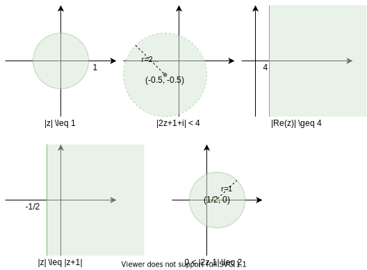
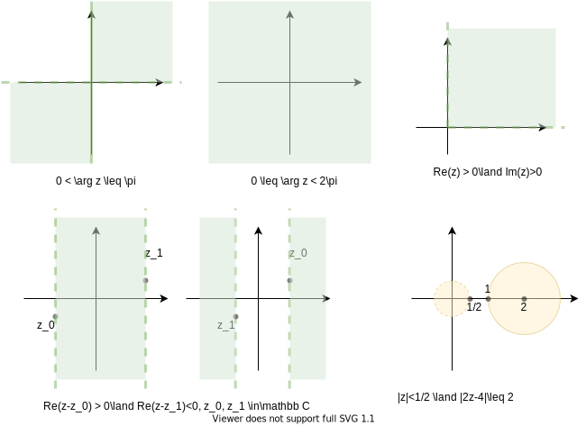

# Elementary Functions

## Topology of Complex Space

Note that with the definition as $a+bi$, the complex space can be seen as a $\mathbb R^2$ space, and have all topology definitions defined as reals. 

### Example 1
- $|z|\leq 1$ not open, closed, bounded, compact  
- $|2z+1+i| < 4$ open, not closed, bounded  
- $Re(z) \geq 4$ not open, closed, unbounded  
- $|z| \leq |z + 1|$ not open, closed, unbounded  
- $0 < |2z-1|\leq 2$ not open, not closed, bounded



### Example 2
determine connectedness and the closure   
$0 < \arg z \leq \pi$ not connected, $\bar S = \{z=x+iy: x=0\lor y =0\} = \{z = re^{i\theta}:\theta = 0 + 2n\pi\lor \theta = \pi + 2n\pi\}$    

$0 \leq \arg z < 2\pi$ connected, $\bar S = \emptyset$  

$Re(z) >0\land Im(z) > 0$ connected, $\bar S = \{z=x+iy: (x=0\land y \geq 0)\lor (y=0\land x\geq 0)\} = \{z=re^{i\theta}: r \geq 0\land (\theta=0\lor\theta = \pi)\}$  

$Re(z-z_0) > 0\land Re(z-z_1) < 0, z_0,z_1 \in \mathbb C$. If $Re(z_0) \leq Re(z_1)$, then connected, otherwise unconnected.$\bar S = \{z:Re(z) = Re(z_0)\lor Re(z) = Re(z_1)\}$

$|z| < 1/2 \land |2z-4| < 2$ note this is $\emptyset$, hence connected and closure is $\emptyset$



## Elementary Functions
A __function of the complex variable__ is some function that maps to a subset of $\mathbb C$. 

Define __polynomials__ of degree $n$ as $P_n(z) = \sum^n_0 a_iz^i$.  
Define __rational__ as a ratio of two polynomials, given the quotient is not $0$.  
Generally, a complex function can be written as $f(z) = u(x, y) + iv(x, y)$, i.e. the real part and the imaginary part.  

### Example 1

For the transformation $w=z+1/z=u+iv$, show that $\forall z\in\mathbb C. (Im(z) > 0\land |z| > 1)\Rightarrow \exists v > 0$.  
_proof_. 

$$w = z + z^{-1} = z + \frac{\bar z}{|z|^2}=x+iy + \frac{x-iy}{x^2+y^2}$$

so we have $u = x + \frac{x}{x^2+y^2}, v = y - \frac{y}{x^2+y^2}$, since $x^2 + y^2 > 1, y > 0$, $v>0$

### Exponential functions
Define the sum of exponent as

$$e^z = e^{x+iy} = e^xe^{iy} = e^x(\cos y + i\sin y)$$

Noting that this equation plus trigonometric identities imply that 

$$e^{z_1+z_2} = e^{z_1}e^{z_2}, (e^z)^n = e^{nz}, n\in\mathbb N^+$$

$$|e^z| = |e^x||\cos y + i\sin y| = e^x\sqrt{\cos^2 y + \sin^2 y} = e^x$$

$$\overline{e^z} = e^x(\cos y - i\sin y) \ e^{\bar z} = e^{x-iy}$$

### Trigonometric functions
Define the trigonometric functions on complex numbers as 

$$\sin z = \frac{e^{iz} - e^{-iz}}{2i}, \cos z = \frac{e^{iz} + e^{-iz}}{2}$$

Then, other trigonometric functions are taken from this definition. 

Define the hyperbolic functions as 

$$\sinh z = \frac{e^{z} - e^{-z}}{2}, \cosh z = \frac{e^{z} + e^{-z}}{2}$$

The usual trigonometric identities hold on these definitions

It's worth noting that 

$$\sinh(iz) = i\sin z , \sin(iz) = i\sinh z$$ 

$$\cosh(iz) = \cos z , \cos(iz) = \cosh z$$

### Example 2
Prove angle sum identities using complex numbers.
_proof_ For $a,b\in\mathbb R$, 

\begin{align*}
\sin a \cos b + \cos a \sin b &= \frac{e^{ia} - e^{-ia}}{2i} \frac{e^{ib} + e^{-ib}}{2}+ \frac{e^{ib} - e^{-ib}}{2i} \frac{e^{ia} + e^{-ia}}{2}\\
&= \frac{1}{4i}\big(2e^{ia}e^{ib} - 2e^{-ia}e^{-ib} \big)\\
&= \frac{e^{i(a+b)} - e^{-i(a+b)}}{2i}\\
&= \sin(a+b)\\
\cos a\cos b - \sin a \sin b &= \frac{e^{ia} + e^{-ia}}{2}\frac{e^{ib} + e^{-ib}}{2} - \frac{e^{ia} - e^{-ia}}{2i}\frac{e^{ib} - e^{-ib}}{2i}\\
&= \frac{(e^{ia} + e^{-ia})(e^{ib} + e^{-ib})}{4} + \frac{(e^{ia} - e^{-ia})(e^{ib} - e^{-ib})}{4}\\
&= \frac{e^{i(a+b)} + e^{-i(a+b)}}2\\
&= \cos(a+b)
\end{align*}

## Power Series
Define a __power series__ of $f(z)$ about the point $z=z_0$ as 

$$f(z) = \sum_{0}^\infty a_i(z-z_0)^i$$

Ratio test (motivated by reals) also holds on complex numbers even though we won't prove it here:
If $\lim_\infty \lvert \frac{a_{n+1}}{a_n}\rvert |z - z_0| < 1$, then the power series converges, and the __radius of convergence__ is 

$$R = \lim_\infty\lvert \frac{a_{n}}{a_{n+1}}\rvert$$

$R=\infty$, then the series converges for all finite $z$, $R = 0$, then the series converges only for $z=z_0$. 

Some common power series representations:  

\begin{align*}
e^z &= \sum \frac{z^k}{k!}\\
\sin z &= \sum (-1)^k \frac{z^{2k+1}}{(2k+1)!}\\
\cos z &= \sum (-1)^k \frac{z^{2k}}{(2k)!}\\
\sinh z &= \sum\frac{z^{2k+1}}{(2k+1)!}\\
\cosh z &= \sum\frac{z^{2k}}{(2k)!}\end{align*}

We will prove $e^z = \sum \frac{z^j}{j!}$ from Euler's formula and series expansion from reals

\begin{align*}
e^z &= e^x(\cos y + i\sin y)\\
    &= \sum\frac{x^n}{n!}(\sum(-1)^n\frac{y^{2n+1}}{(2n+1)!} + \sum(-1)^n\frac{iy^{2n}}{(2n)!})\\
    &= \sum\frac{x^m}{m!}\cdot \sum i^n\frac{y^n}{n!}\\
    &= \sum_{k=0}^\infty \sum_{m=0}^{k}\frac{x^m(iy)^{k-m}}{m!(k-m)!} &\text{diagonal sum}\\
    &= \sum_{k=0}^\infty \frac{1}{k^!}\sum_{m=0}^{k}k!\frac{x^m(iy)^{k-m}}{m!(k-m)!}\\
    &= \sum_{k=0}^\infty \frac{(x+iy)^k}{k^!}\\
    &= \sum \frac{z^k}{k!}
\end{align*}

Using the series above, we can then derive for $\sin z$ as 

\begin{align*}
\sin z &= \frac{1}{2i}(e^{iz} - e^{-iz})\\
&= \frac1{2i}\big(\sum\frac{(iz)^n}{n!} - \sum\frac{(-iz)^n}{n!}\big)\\
&= \frac{1}{2i} \sum\frac{2(iz)^{2k+1}}{(2k+1)!}\\
&= \sum\frac{(i^2)^kz^{2k+1}}{(2k+1)!}\\
&= \sum\frac{(-1)^kz^{2k+1}}{(2k+1)!} \\
\cos z &= \frac{1}{2}(e^{iz} + e^{-iz})\\
&= \frac1{2}\big(\sum\frac{(iz)^n}{n!} + \sum\frac{(-iz)^n}{n!}\big)\\
&= \frac{1}{2} \sum\frac{2(i^2)^kz^{2k}}{(2k)!}\\
&= \sum\frac{(-1)^kz^{2k}}{(2k)!}\\
\end{align*}

## Stereographic Projection

Consider a unit sphere sitting on top of the complex plane with the south pole
of the sphere located at the origin of the z plane. Connect the point $z$ in the plane with the north pole using a
straight line. This line intersects the sphere at the point $P$. In this way each
point $z= x +i y$ on the complex plane corresponds uniquely to a point $P$ on the
surface of the sphere. This construction is called __stereographic projection__. The extended complex plane is sometimes referred as the __compactified (closed)__ complex plane. 


```plotly
{"file_path": "mat334/assets/stere_proj.json"}
```


Consider the 3 points $N = (0, 0, 2)$ is the north pole of the ball, $P=(X,Y,Z)$ be the points on the sphere, and $C = (x, y, 0)$ be on the complex plane. Since they are on the same line, we have 

$$P-N = s(C-N)$$

and note that $P$ is on the sphere so that $X^2 + Y^2 + (Z-1)^2 = 1$.  
Now we have 4 unknowns $X,Y,Z,s$ and 4 equations, and it solves to be 

$$s = \frac{4}{|z|^2 + 4}, X = \frac{4x}{|z|^2 + 4}, Y = \frac{4y}{|z|^2 + 4}, Z= \frac{2|z|^2}{|z|^2 + 4}$$

Similarly, if we have $X,Y,Z$, we can solve to have

$$s = \frac{2-Z}2, x = \frac{2X}{2-Z}, y = \frac{2Y}{2-Z}$$

Note that $P=(0, 0, 0)$ maps to $z=0$ and $\lim_{|z|\rightarrow\infty}(X = \frac{4x}{|z|^2 + 4}, Y = \frac{4y}{|z|^2 + 4}, Z= \frac{2|z|^2}{|z|^2 + 4}) = (0, 0, 2)$ (all $z$ with $|z|=\infty$ maps to the north pole). Any bounded region on the complex plane can be projected on the sphere, and any region, excluding the north pole, can be mapped to the complex plane. 

__Example__ Consider the line $Re z = x = 0$, the projected line on the sphere is 

$$X = 0, Y = \frac{4y}{y^2 + 4}, Z = \frac{2y^2}{y^2+4}$$


```plotly
{"file_path": "mat334/assets/stere_proj_2.json"}
```

